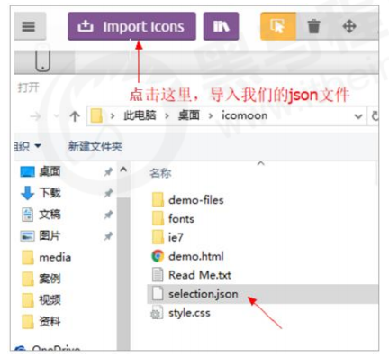

# CSS

## 1 选择器权重


## 2 浮动（float）

**为什么需要浮动？**

总结： 有很多的布局效果，标准流没有办法完成，此时就可以利用浮动完成布局。 因为浮动可以改变元素标签默认的排列方式。

浮动最典型的应用：可以让多个块级元素一行内排列显示。

**网页布局第一准则：==多个块级元素纵向排列找标准流，多个块级元素横向排列找浮动==。**

浮动可以实现下属内容：


什么是浮动：

**float** 属性用于创建浮动框，将其移动到一边，直到左边缘或右边缘触及包含块或另一个浮动框的边缘


浮动的特性：

1. 浮动元素会脱离标准流(脱标)（**浮动的盒子不再保留原先的位置**）
2. 浮动的元素会一行内显示并且元素顶部对齐
3. 浮动的元素会具有行内块元素的特性

为了约束浮动元素位置, 网页布局一般采取的策略是：先用标准流的父元素排列上下位置, 之后内部子元素采取浮动排列左右位置，符合网页布局第一准侧。


注意事项：

1.  浮动和标准流的父盒子搭配（先用标准流的父元素排列上下位置, 之后内部子元素采取浮动排列左右位置）
2.  一个元素浮动了，理论上其余的兄弟元素也要浮动。（一个盒子里面有多个子盒子，如果其中一个盒子浮动了，那么其他兄弟也应该浮动，以防止引起问题。**浮动的盒子只会影响浮动盒子后面的标准流,不会影响前面的标准流。**）

## 3 清除浮动（clear）

**为什么需要清除浮动？**

由于父级盒子很多情况下，不方便给高度，但是子盒子浮动又不占有位置，最后父级盒子高度为 0 时，就会

影响下面的标准流盒子。由于浮动元素不再占用原文档流的位置，所以它会对后面的元素排版产生影响


清除浮动的本质：

-   清除浮动的本质是清除浮动元素造成的影响
-   如果父盒子本身有高度，则不需要清除浮动
-   **清除浮动之后，父级就会根据浮动的子盒子自动检测高度。父级有了高度，就不会影响下面的标准流了**


清除浮动方法：

1. 额外标签法也称为隔墙法，是 W3C 推荐的做法

    

2. **父级添加 overflow 属性**

    

3. **父级添加 after 属性**

    

    ```css
    .clearfix:after {
        content: "";
        display: block;
        height: 0;
        clear: both;
        visibility: hidden;
    }
    .clearfix {
        /* IE6、7 专有 */
        *zoom: 1;
    }
    ```

4. **父级添加双伪元素**


```css
.clearfix:before,
.clearfix:after {
    content: "";
    display: table;
}
.clearfix:after {
    clear: both;
}
.clearfix {
    *zoom: 1;
}
```

总结：


## 4 书写顺序

css 属性书写顺序：


## 5 定位

为什么需要定位：

1. 浮动可以让多个块级盒子一行没有缝隙排列显示，**经常用于横向排列盒子**
2. 定位则是而可以让盒子自由的在某个盒子内移动位置或者固定屏幕中某个位置，并且可以压住其他盒子

**定位的组成：**

定位：将盒子定在某一个位置，所以定位也是在摆放盒子，按照定位的方式移动盒子。

定位 = 定位模式 + 边偏移

定位模式 用于指定一个元素在文档中的定位方式，边偏移则决定了该元素的最终位置。

**定位模式：**

定位模式决定了元素的定位方式，它通过 css 的**position**属性来设置，其值可以分为四个：


**边偏移：**

边偏移就是定位的盒子移动到最终位置，有 top、bottom、left 和 right 4 个属性。（注：这 4 个属性只有定位才可以使用）


### 5.1 静态定位 static（了解）

静态定位是元素的默认定位方式，无定位的意思。

**语法：**

```css
选择器 {
    position: static;
}
```

注：

-   静态定位按照标准流特性摆放位置，它没有边偏移
-   静态定位在布局时很少用到

### 5.2 相对定位 relative（重要）

**相对定位**是元素在移动位置的时候，是相对于它**原来的位置**来说的。

**语法：**

```css
选择器 {
    position: relative;
}
```

**相对定位的特点：**

1. 它是相对于自己原来的位置来移动的（**移动位置的时候参照点是自己原来的位置**）。
2. 原来的标准流的位置继续占有，后面的盒子仍然以标准流的方式对待它。（**不脱标，继续保留原来的位置**）。

因此，相对定位并没有脱标，它最典型的应用是给绝对定位当父级的。


### 5.3 绝对定位 absolue（重要）

**绝对定位**是元素在移动位置的时候，是相对于它的**祖先元素**来说的。

**语法：**

```css
选择器 {
    position: absolute;
}
```

**绝对定位的特点：**

1. 如果**没有祖先元素**或者**祖先元素没有定位**，则以浏览器为准定位（Document 文档）。
2. 如果祖先元素有定位（相对、绝对、固定定位），则以**最近一级的有定位祖先元素**为参考点移动位置。
3. 绝对定位**不再占有原先的位置**。（脱标）


**子绝父相：**

子绝父相的解释：**子级是绝对定位的话，父级要用相对定位**。

1. 子级绝对定位，不会占有位置，可以放到父盒子里面的任何一个地方，不会影响其他的兄弟盒子。
2. 父盒子需要加定位限制子盒子在父盒子内显示。
3. 父盒子布局时，需要占有位置，因此父亲只能是相对定位。

总结：因为父级需要占有位置，因此是相对定位，子盒子不需要占有位置，则是绝对定位

### 5.4 固定定位 fixed（重要）

固定定位是元素固定于浏览器可视区的位置。主要使用场景：可以在浏览器页面滚动时元素的位置不会改变。

**语法：**

```css
选择器 {
    position: fixed;
}
```

**固定定位的特点：**（务必记住）

1. 以浏览器的**可视窗口**（能够看到的范围大小）为参照点移动元素。
    - 跟父元素没有任何关系
    - 不随滚动条滚动
2. 固定定位**不在占有原先的位置**。

固定定位也是脱标的，其实固定定位也可以看作是一种特殊的绝对定位。


==固定定位小技巧：**固定在版心右侧位置**==

小算法：

1. 让固定定位的盒子 left:50%，走到浏览器可视区（也可以看作版心）的一半位置。
2. 让固定定位的盒子 margin-left:版心宽度的一般距离。多走版心宽度的一半位置就可以让固定定位的盒子贴着版心右侧对齐了。

```html
<!DOCTYPE html>
<html lang="en">
    <head>
        <meta charset="UTF-8" />
        <meta name="viewport" content="width=device-width, initial-scale=1.0" />
        <title>Document</title>
        <style>
            .w {
                width: 800px;
                height: 1400px;
                background-color: pink;
                margin: 0 auto;
            }
            .fixed {
                position: fixed;
                /* 1、走浏览器宽度的一半 */
                left: 50%;
                /* 2、利用margin 走版心盒子宽度的一般距离 */
                margin-left: 405px;
                width: 50px;
                height: 150px;
                background-color: skyblue;
            }
        </style>
    </head>
    <body>
        <div class="fixed"></div>
        <div class="w">版心盒子 800像素</div>
    </body>
</html>
```


### 5.5 粘性定位 sticky（了解）

粘性定位可以被认为是相对定位和固定定位的混合。 Sticky 粘性的

**语法：**

```css
选择器 {
    position: sticky;
    top: 10px;
}
```

**粘性定位的特点：**

1. 以浏览器的可视窗口为参照点移动元素（固定定位特点）
2. 粘性定位占有原先的位置（相对定位特点）
3. **必须**添加 top、left、right、bottom 其中一个才有效

跟页面滚动搭配使用。兼容性较差，IE 不支持。

### 5.6 总结


### 5.7 定位叠放次序 z-index

在使用定位布局时，可能出现盒子重叠的情况。此时，可以使用**z-index**来控制合资的前后次序（z 轴）

**语法：**

```css
选择器 {
    z-index: 1;
}
```

-   数值可以是正整数、负整数或 0，默认是 auto，数值越大，盒子越靠上
-   如果属性值相同，则按照书写顺序，后来居上
-   数字后面**不能加单位**
-   只有定位的盒子**才有**z-index 属性

### 5.8 绝对定位的盒子居中算法

加了绝对定位的盒子不能通过 margin:0 auto 水平居中，但是可以通过**以下计算方法实现水平和垂直居中**：

1. left: 50%;：让盒子的左侧移动到父级元素的水平中心位置。
2. margin-left: -100px;：让盒子向左移动自身宽度的一半。（可以用 translateX(-50%)来代替这句代码）

### 5.9 定位的特殊性

绝对定位和固定定位也和浮动类似：

1. 行内元素添加绝对或者固定定位，可以直接设置高度和宽度。
2. 块级元素添加绝对或者固定定位，如果不给宽度或者高度，默认大小是内容的大小

### 5.10 脱标的盒子不会触发外边距塌陷

浮动元素、绝对定位(固定定位）元素的都不会触发外边距合并的问题

### 5.11 **绝对定位（固定定位）会完全压住盒子**

浮动元素不同，**只会压住它下面标准流的盒子**，但是不会压住下面标准流盒子里面的文字（图片）

但是**绝对定位（固定定位） 会压住下面标准流所有的内容**。

浮动之所以不会压住文字，因为浮动产生的目的最初是为了做文字环绕效果的。 文字会围绕浮动元素


## 6 网页布局总结

通过盒子模型，清楚知道大部分 html 标签是一个盒子。

通过 CSS 浮动、定位 可以让每个盒子排列成为网页。

一个完整的网页，是标准流、浮动、定位一起完成布局的，每个都有自己的专门用法。

1. 标准流
    - 可以让盒子上下排列或者左右排列，**垂直的块级盒子显示就用标准流布局**。
2. 浮动
    - 可以让多个块级元素一行显示或者左右对齐盒子，**多个块级盒子水平显示就用浮动布局**。
3. 定位
    - 定位最大的特点是有层叠的概念，就是可以让多个盒子前后叠压来显示。**如果元素自由在某个盒子内移动就用定位布局**。

## 7 元素的显示与隐藏

类似网站广告，当我们点击关闭就不见了，但是我们重新刷新页面，会重新出现！

本质：**让一个元素在页面中隐藏或者显示出来**。

1. display 显示隐藏
2. visibility 显示隐藏
3. overflow 溢出显示隐藏

### 7.1 display 属性（★）

display 属性用于设置一个元素应如何显示。

-   display: none ；隐藏对象
-   display：block ；除了转换为块级元素之外，同时还有显示元素的意思

**display 隐藏元素后（隐藏了并非删除），不再占有原来的位置。**

应用及其广泛，搭配 JS 可以做很多的网页特效。

### 7.2 visibility 可见性

visibility 属性用于指定一个元素应可见还是隐藏。

-   visibility：visible ; 元素可视

-   visibility：hidden; 元素隐藏

**visibility 隐藏元素后，继续占有原来的位置**。

如果隐藏元素想要原来位置， 就用 visibility：hidden

如果隐藏元素不想要原来位置， 就用 display：none (用处更多 重点）

### 7.3 overflow 溢出

overflow 属性指定了如果内容溢出一个元素的框（超过其指定高度及宽度） 时，会发生什么。


一般情况下，我们都不想让溢出的内容显示出来，因为溢出的部分会影响布局。

但是如果有定位的盒子， 请慎用 overflow:hidden 因为它会隐藏多余的部分。

## 8 精灵图

使用精灵图核心：

1. 精灵技术主要针对于背景图片使用。就是把多个小背景图片整合到一张大图片中。
2. 这个大图片也称为 sprites 精灵图 或者 雪碧图
3. 移动背景图片位置， 此时可以**使用 background-position** 。
4. 移动的距离就是这个目标图片的 x 和 y 坐标。注意网页中的坐标有所不同
5. 因为一般情况下都是往上往左移动，所以**数值是负值**。
6. 使用精灵图的时候需要精确测量，每个小背景图片的大小和位置。

精灵图如下所示：


精灵图的缺点：

1. 图片文件还是比较大的
2. 图片本身放大和缩小会失真
3. 一旦图片制作完毕想要更换非常复杂

此时，有一种技术的出现很好的解决了以上问题，就是字体图标 iconfont。

## 9 字体图标

字体图标可以为前端工程师提供一种方便高效的图标使用方式，展示的是图标，本质属于字体。

-   轻量级：一个图标字体要比一系列的图像要小。一旦字体加载了，图标就会马上渲染出来，减少了服务器请求
-   灵活性：本质其实是文字，可以很随意的改变颜色、产生阴影、透明效果、旋转等
-   兼容性：几乎支持所有的浏览器，请放心使用

注意： 字体图标不能替代精灵技术，只是对工作中图标部分技术的提升和优化。

**总结：**

1. 如果遇到一些结构和样式比较简单的小图标，就用字体图标。
2. 如果遇到一些结构和样式复杂一点的小图片，就用精灵图。

字体图标下载网址：

-   **icomoon 字库** http://icomoon.io
-   **阿里 iconfont 字库** http://www.iconfont.cn/

下载完毕之后，注意原先的文件不要删，后面会用。

使用步骤：

1. 把下载包里面的 fonts 文件夹放入页面根目录下

    

2. 在 CSS 样式中全局声明字体： 简单理解把这些字体文件通过 css 引入到我们页面中。一定注意字体文件路径的问题。

    ```
    @font-face {
                    font-family: "icomoon";
                    src: url("../fonts/icomoon.eot?7kkyc2");
                    src: url("../fonts/icomoon.eot?7kkyc2#iefix")
                            format("embedded-opentype"),
                        url("../fonts/icomoon.ttf?7kkyc2") format("truetype"),
                        url("../fonts/icomoon.woff?7kkyc2") format("woff"),
                        url("../fonts/icomoon.svg?7kkyc2#icomoon") format("svg");
                    font-weight: normal;
                    font-style: normal;
                    font-display: block;
                }
    ```

3. html 标签内添加小图标。

 

4. 给标签定义字体。

 

**字体图标追加：**

如果工作中，原来的字体图标不够用了，我们需要添加新的字体图标到原来的字体文件中。

把压缩包里面的 selection.json 从新上传，然后选中自己想要新的图标，从新下载压缩包，并替换原来的文件即可。



## 10 CSS 三角制作

网页中常见一些三角形，使用 CSS 直接画出来就可以，不必做成图片或者字体图标。

一个 div 没有宽度和高度，只设置边框，那么每个边的都表示一个三角形，需要哪个方向的三角形，只需要将其他三个方向的边框颜色设置为透明即可，如下图所示：


注：line-height:0; 和 font-size:0;可以不用写，只是为了照顾低版本浏览器的兼容性问题。

## 11 CSS 用户界面样式

### 11.1 鼠标样式 cursor

语法：

```css
li {
    cursor: pointer; /* cursor控制鼠标样式 */
}
```

设置或检索在对象上移动的鼠标指针采用何种系统预定义的光标形状。

常见属性如下表：


### 11.2 轮廓线 outline

给表单添加 outline: 0; 或者 outline: none; 样式之后，就可以去掉默认的蓝色边框。

语法：

```css
input {
    outline: none;
}
```

### 11.3 防止拖拽文本域 resize

实际开发中，文本域右下角是不可以拖拽的。

语法：

```css
textarea {
    resize: none; /*防止拖拽文本域*/
    /*也可以区域文本域的轮廓线*/
    outline: none;
}
```

## 12 vertical-align 属性应用

CSS 的 vertical-align 属性使用场景： 经常用于设置图片或者表单(行内块元素）和文字垂直对齐。

官方解释： 用于设置一个元素的垂直对齐方式，但是它==**只针对于行内元素或者行内块元素**==有效。

语法：

```css
选择器 {
    vertical-align: baseline | top | middle | bottom;
}
```

常见属性有：


四个属性分别表示：


### 12.1 图片、表单和文字对齐

图片、表单都属于行内块元素，默认的 vertical-align 是基线对齐。


此时可以给图片、表单这些行内块元素的**vertical-align 属性设置为 middle**就可以让文字和图片垂直居中对齐了。

### 12.2 解决图片底部默认空白缝隙问题

bug：图片底侧会有一个空白缝隙，原因是行内块元素会和文字的基线对齐。

主要解决方法有两种：

1. 给图片添加 **vertical-align:middle | top| bottom** 等。 （提倡使用的）
2. 把图片转换为块级元素 **display: block**;

## 13 溢出的文字省略号显示

单行文本溢出显示省略号：


多行文本溢出显示省略号：


**单行文本溢出显示省略号--必须满足 3 个条件：**

```css
/*1. 先强制一行内显示文本*/
 white-space: nowrap; （ 默认 normal 自动换行）
 /*2. 超出的部分隐藏*/
 overflow: hidden;
 /*3. 文字用省略号替代超出的部分*/
 text-overflow: ellipsis;
```

**多行文本溢出显示省略号：**

多行文本溢出显示省略号，有较大兼容性问题， 适合于 webKit 浏览器或移动端（移动端大部分是 webkit 内核）

```css
overflow: hidden;
text-overflow: ellipsis;
/* 弹性伸缩盒子模型显示 */
display: -webkit-box;
/* 限制在一个块元素显示的文本的行数 */
-webkit-line-clamp: 2;
/* 设置或检索伸缩盒对象的子元素的排列方式 */
-webkit-box-orient: vertical;
```

更推荐让后台人员来做这个效果，因为后台人员可以设置显示多少个字，操作更简单。

## 14 布局技巧

**margin 负值的运用**

例如：


实现下图效果：


1. 让每个盒子 margin 往左侧移动 -1px 正好压住相邻盒子边框（不会出现边框叠加 1+1=2 的情况）
2. 鼠标经过某个盒子的时候，提高当前盒子的层级即可（如果没有有定位，则加相对定位（保留位置），如果有定位，则加 z-index 提高当前 li 边框的优先级）


###

## 15 CSS 初始化

京东 CSS 初始化代码如下：

```css
/* 把我们所有标签的内外边距清零 */
* {
    margin: 0;
    padding: 0;
}
/* em 和 i 斜体的文字不倾斜 */
em,
i {
    font-style: normal;
}
/* 去掉li 的小圆点 */
li {
    list-style: none;
}

img {
    /* border 0 照顾低版本浏览器 如果 图片外面包含了链接会有边框的问题 */
    border: 0;
    /* 取消图片底侧有空白缝隙的问题 */
    vertical-align: middle;
}

button {
    /* 当我们鼠标经过button 按钮的时候，鼠标变成小手 */
    cursor: pointer;
}

a {
    color: #666;
    text-decoration: none;
}

a:hover {
    color: #c81623;
}

button,
input {
    /* "\5B8B\4F53" 就是宋体的意思 这样浏览器兼容性比较好 */
    font-family: Microsoft YaHei, Heiti SC, tahoma, arial, Hiragino Sans GB, "\5B8B\4F53",
        sans-serif;
}

body {
    /* CSS3 抗锯齿形 让文字显示的更加清晰 */
    -webkit-font-smoothing: antialiased;
    background-color: #fff;
    font: 12px/1.5 Microsoft YaHei, Heiti SC, tahoma, arial, Hiragino Sans GB, "\5B8B\4F53",
        sans-serif;
    color: #666;
}

.hide,
.none {
    display: none;
}
/* 清除浮动 */
.clearfix:after {
    visibility: hidden;
    clear: both;
    display: block;
    content: ".";
    height: 0;
}

.clearfix {
    *zoom: 1;
}
```

## 16 新增选择器

新增了选择器，可以更加便捷，更加自由的选择目标元素。

1. 属性选择器
2. 结构伪类选择器
3. 伪元素选择器

**注：类选择器、属性选择器、伪类选择器，权重为 10**

### 16.1 属性选择器

属性选择器可以根据元素特定属性的来选择元素。 这样就可以不用借助于类或者 id 选择器。


**重点记住第 2 个**（E 是标签名称）

### 16.2 结构伪类选择器

结构伪类选择器主要根据文档结构来选择器元素， 常用于根据父级选择器里面的子元素


**nth-child（n）** 选择某个父元素的一个或多个特定的子元素（重点）

-   n 可以是数字，关键字和公式
-   n 如果是数字，就是选择第 n 个子元素， 里面数字从 1 开始…
-   n 可以是关键字：even 偶数，odd 奇数
-   n 可以是公式：常见的公式如下 ( 如果 n 是公式，则从 0 开始计算，但是第 0 个元素或者超出了元素的个数会被忽略 )


区别：

1. nth-child 对父元素里面所有孩子排序选择（序号是固定的） 先找到第 n 个孩子，然后看看是否和 E 匹配
2. nth-of-type 对父元素里面指定子元素进行排序选择。 先去匹配 E ，然后再根据 E 找第 n 个孩子

**小结：**

-   结构伪类选择器一般用于选择父级里面的第几个孩子
-   nth-child 对父元素里面所有孩子排序选择（序号是固定的） 先找到第 n 个孩子，然后看看是否和 E 匹配
-   nth-of-type 对父元素里面指定子元素进行排序选择。 先去匹配 E ，然后再根据 E 找第 n 个孩子
-   关于 nth-child（n） 我们要知道 n 是从 0 开始计算的，要记住常用的公式
-   如果是无序列表，我们肯定用 nth-child 更多
-   类选择器、属性选择器、伪类选择器，权重为 10

### 16.3 伪元素选择器（重点）

伪元素选择器可以帮助我们利用 CSS 创建新标签元素，而不需要 HTML 标签，从而简化 HTML 结构。


before 是放在前面，after 是放在后面


**注意：**

-   before 和 after 创建一个元素，但是属于行内元素
-   新创建的这个元素在文档树中是找不到的，所以我们称为伪元素，伪元素是它的孩子
-   语法： element::before {}
-   before 和 after **必须有 content 属性**，可以为空
-   before 在父元素内容的前面创建元素，after 在父元素内容的后面插入元素
-   伪元素选择器和标签选择器一样，权重为 1（div::before 权重是 2， div 权重是 1，::before 权重是 1）

## 17 盒子模型

CSS3 中可以通过 box-sizing 来指定盒模型，有 2 个值：即可指定为 content-box、border-box，这样我们

计算盒子大小的方式就发生了改变。

可以分成两种情况：

1. box-sizing: content-box 盒子大小为 width + padding + border （以前默认的）
2. box-sizing: border-box 盒子大小为 width

如果盒子模型改为了 box-sizing: border-box ， 那 padding 和 border 就不会撑大盒子了（前提 padding

和 border 不会超过 width 宽度）

## 18 其他特性（了解）

### 18.1 图片变模糊

**CSS3 滤镜 filter：**filter CSS 属性将模糊或颜色偏移等图形效果应用于元素。

```css
filter: 函数(); 例如： filter: blur(5px); blur模糊处理 数值越大越模糊
```


### 18.2 计算盒子宽度 width: calc 函数

**CSS3 calc 函数：**calc() 此 CSS 函数让你在声明 CSS 属性值时执行一些计算。

```css
width: calc(100%-80px);
```

括号里面可以使用 + - \* / 来进行计算。

## 19 过渡（重点）

过渡（transition)是 CSS3 中具有颠覆性的特征之一，我们可以在不使用 Flash 动画或

JavaScript 的情况下，当元素从一种样式变换为另一种样式时为元素添加效果。

过渡动画： 是从一个状态 渐渐的过渡到另外一个状态

可以让我们页面更好看，更动感十足，虽然 低版本浏览器不支持（ie9 以下版本） 但是不会影响页面布局。

现在经常和 :hover 一起 搭配使用。

语法：

```css
transition: 要过渡的属性 花费时间 运动曲线 何时开始;
```

1. **属性** ： 想要变化的 css 属性， 宽度高度 背景颜色 内外边距都可以 。如果想要所有的属性都变化过渡， **写一个 all 就可以。**
2. **花费时间：** 单位是 秒（必须写单位） 比如 0.5s
3. **运动曲线：** 默认是 ease （可以省略）
4. **何时开始 ：**单位是 秒（必须写单位）可以设置延迟触发时间 默认是 0s （可以省略）


**注：**如果想写多个属性，利用都好（,）分割，也可以将属性设置为 all。

## 20 2D 转换

### 20.1 移动 translate

2D 移动是 2D 转换里面的一种功能，可以改变元素在页面中的位置，类似**定位。**

**语法：**

```css
transform:translate(x,y);

或者分开写

transform:translateX(x);
transform:translateY(y);
```

**重点：**

-   定义 2D 转换中的移动，沿着 X 和 Y 轴移动元素
-   translate 最大的优点：不会影响到其他元素的位置
-   translate 中的百分比单位是相对于自身元素的 translate:(50%,50%)；里面的参数是%，移动的距离是盒子自身的宽度或者高度来对比的
-   对行内标签没有效果

### 20.2 旋转 rotate

2D 旋转指的是让元素在 2 维平面内顺时针旋转或者逆时针旋转。

**语法：**

```css
transform: rotate(度数);
```

**重点：**

-   rotate 里面跟度数， 单位是 deg 比如 rotate(45deg)
-   角度为正时，顺时针，负时，为逆时针
-   默认旋转的中心点是元素的中心点

### 20.3 转换中心点 transform-origin

可以设置元素转换的中心点

**语法：**

```css
transform-origin: x y;
```

**重点：**

-   注意后面的参数 x 和 y 用空格隔开
-   x y 默认转换的中心点是元素的中心点 (50% 50%)
-   还可以给 x y 设置 像素 或者 方位名词 （top bottom left right center）

### 20.4 缩放 scale

缩放，顾名思义，可以放大和缩小。 只要给元素添加上了这个属性就能控制它放大还是缩小。

**语法：**

```css
transform: scale(x, y);
```

**注意：**

-   注意其中的 x 和 y 用逗号分隔
-   transform:scale(1,1) ：宽和高都放大一倍，相对于没有放大
-   transform:scale(2,2) ：宽和高都放大了 2 倍
-   transform:scale(2) ：只写一个参数，第二个参数则和第一个参数一样，相当于 scale(2,2)
-   transform:scale(0.5,0.5)：缩小
-   sacle 缩放最大的优势：可以设置转换中心点缩放，默认以中心点缩放的，而且不影响其他盒子

### 20.6 转换综合写法

**注意：**

1. 同时使用多个转换，其格式为：transform: translate() rotate() scale() ...等，
2. 其顺序会影转换的效果。（先旋转会改变坐标轴方向）
3. **当我们同时有位移和其他属性的时候，记得要将位移放到最前**

## 21 动画

制作动画分为两步：

1. 先定义动画

    ```css
    @keyframes 动画名称 {
        0% {
            width: 100px;
        }
        100% {
            width: 200px;
        }
    }
    ```

2. 元素使用（调用）动画

    ```css
    div {
        width: 200px;
        height: 200px;
        background-color: aqua;
        margin: 100px auto;
        /* 调用动画 */
        animation-name: 动画名称;
        /* 持续时间 */
        animation-duration: 持续时间;
    }
    ```

**动画序列**

-   0% 是动画的开始，100% 是动画的完成。这样的规则就是动画序列。
-   在 @keyframes 中规定某项 CSS 样式，就能创建由当前样式逐渐改为新样式的动画效果。
-   动画是使元素从一种样式逐渐变化为另一种样式的效果。您可以改变任意多的样式任意多的次数。
-   请用百分比来规定变化发生的时间，或用关键词 "from" 和 "to"，等同于 0% 和 100%。

**动画常见属性：**


**动画简写：**

animation：动画名称 持续时间 运动曲线 何时开始 播放次数 是否反方向 动画起始或者结束的状态;

```css
animation: myfirst 5s linear 2s infinite alternate;
```

**速度曲线细节：**

animation-timing-function：规定动画的速度曲线，默认是“ease”


注：steps 就是分几步来完成动画效果，有了 steps 就不要再写 ease 或者 linear 了

**注意事项：**

-   前两个属性（动画名称、持续时间）一定要写

-   简写属性里面不包含 animation-play-state
-   暂停动画：animation-play-state: puased; 经常和鼠标经过等其他配合使用
-   想要动画走回来 ，而不是直接跳回来：animation-direction ： alternate
-   盒子动画结束后，停在结束位置： animation-fill-mode ： forwards

## 22 3D 转换

三维坐标系其实就是指立体空间，立体空间是由 3 个轴共同组成的。

-   x 轴：水平向右 注意： x 右边是正值，左边是负值
-   y 轴：垂直向下 注意： y 下面是正值，上面是负值
-   z 轴：垂直屏幕 注意： 往外面是正值，往里面是负值

### 22.1 3D 位移 translate3d

3D 移动在 2D 移动的基础上多加了一个可以移动的方向，就是 z 轴方向。

-   translform:translateX(100px)：仅仅是在 x 轴上移动
-   translform:translateY(100px)：仅仅是在 Y 轴上移动
-   translform:translateZ(100px)：仅仅是在 Z 轴上移动（注意：translateZ 一般用 px 单位）
-   transform:translate3d(x,y,z)：其中 x、y、z 分别指要移动的轴的方向的距离

因为 z 轴是垂直屏幕，由里指向外面，所以默认是看不到元素在 z 轴的方向上移动

### 22.2 3D 透视 perspective

在 2D 平面产生近大远小视觉立体，但是只是效果二维的

-   如果想要在网页产生 3D 效果需要透视（理解成 3D 物体投影在 2D 平面内）。
-   模拟人类的视觉位置，可认为安排一只眼睛去看
-   透视我们也称为视距：视距就是人的眼睛到屏幕的距离
-   距离视觉点越近的在电脑平面成像越大，越远成像越小
-   透视的单位是像素


**透视写在被观察元素的父盒子上面的**

**d**：就是视距，视距就是一个距离人的眼睛到屏幕的距离。

**z**：就是 z 轴，物体距离屏幕的距离，z 轴越大（正值） 我们看到的物体就越大。

### 22.3 3D 旋转 rotate3d

3D 旋转指可以让元素在三维平面内沿着 x 轴，y 轴，z 轴或者自定义轴进行旋转。

**语法**

```css
transform:rotateX(45deg)：沿着x轴正方向旋转 45度

transform:rotateY(45deg) ：沿着y轴正方向旋转 45deg

transform:rotateZ(45deg) ：沿着Z轴正方向旋转 45deg

transform:rotate3d(x,y,z,deg)： 沿着自定义轴旋转 deg为角度（了解即可） (x,y,z可以是任意值)
```


### 22.4 3D 呈现 transform-style

-   控制子元素是否开启三维立体环境。
-   transform-style: flat 子元素不开启 3d 立体空间 默认的
-   transform-style: preserve-3d; 子元素开启立体空间
-   代码写给父级，但是影响的是子盒子
-   这个属性很重要，后面必用


# 23 移动端

## 23.1 视口

**视口（viewport）**就是浏览器显示页面内容的屏幕区域。 视口可以分为布局视口、视觉视口和理想视口

**布局视口 layout viewport：**

-   一般移动设备的浏览器都默认设置了一个布局视口，用于解决早期的 PC 端页面在手机上显示的问题。
-   iOS, Android 基本都将这个视口分辨率设置为 980px，所以 PC 上的网页大多都能在手机上呈现，只不过元

素看上去很小，一般默认可以通过手动缩放网页。


**视觉视口 visual viewport：**

-   字面意思，它是用户正在看到的网站的区域。**注意：是网站的区域。**
-   我们可以通过缩放去操作视觉视口，但不会影响布局视口，布局视口仍保持原来的宽度。


**理想视口 ideal viewport：**

-   为了使网站在移动端有最理想的浏览和阅读宽度而设定
-   理想视口，对设备来讲，是最理想的视口尺寸
-   需要手动添写 meta 视口标签通知浏览器操作
-   meta 视口标签的主要目的：布局视口的宽度应该与理想视口的宽度一致，简单理解就是设备有多宽，我们布局的视口就多宽

**视口标签：**

```css
<meta name="viewport" content="width=device-width, user-scalable=no,
initial-scale=1.0, maximum-scale=1.0, minimum-scale=1.0">
```


**标准的 viewport 设置：**

-   视口宽度和设备保持一致
-   视口的默认缩放比例 1.0
-   不允许用户自行缩放
-   最大允许的缩放比例 1.0
-   最小允许的缩放比例 1.0

## 23.2 二倍图

**物理像素&物理像素比**

-   PC 端 和 早前的手机屏幕 / 普通手机屏幕: 1CSS 像素 = 1 物理像素的
-   Retina（视网膜屏幕）是一种显示技术，可以将把更多的物理像素点压缩至一块屏幕里，从而达到更高的分辨率，并提高屏幕显示的细腻程度。


**多倍图：**

-   对于一张 50px \* 50px 的图片,在手机 Retina 屏中打开，按照刚才的物理像素比会放大倍数，这样会造成图片模糊
-   在标准的 viewport 设置中，使用倍图来提高图片质量，解决在高清设备中的模糊问题
-   通常使用二倍图， 因为 iPhone 6\7\8 的影响,但是现在还存在 3 倍图 4 倍图的情况，这个看实际开发公司需求
-   背景图片 注意缩放问题

```css
/* 需要一个50*50像素（css像素）的图片，直接放到iPhone8里面会放大2倍，变成100*100就会模糊 */
img {
    /*原始图片100*100px*/
    width: 50px;
    height: 50px;
}

/* 解决方法: */
/* 放一个100*100的图片，然后手动的把这个图片缩小为50*50（css像素）*/
/* 准备的图片 比 实际需要的大小 大2倍，这就是2倍图 */
.box {
    /*原始图片100*100px*/
    background-size: 50px 50px;
}
```

## 23.3 背景缩放 background-size

background-size 属性规定背景图像的尺寸

语法：

```css
background-size: 背景图片宽度 背景图片高度;
```

-   单位： 长度|百分比|cover|contain;
-   cover 把背景图像扩展至足够大，以使背景图像完全覆盖背景区域。
-   contain 把图像图像扩展至最大尺寸，以使其宽度和高度完全适应内容区域

## 23.4 流式布局（百分比布局）

-   流式布局，就是百分比布局，也称非固定像素布局。
-   通过盒子的宽度设置成百分比来根据屏幕的**宽度**来进行伸缩，不受固定像素的限制，内容向两侧填充。
-   流式布局方式是移动 web 开发使用的比较常见的布局方式。


-   max-width 最大宽度 （max-height 最大高度）
-   min-width 最小宽度 （min-height 最小高度）

## 23.5 flex 布局

概述：


### 23.5.1 布局原理

flex 是 flexible Box 的缩写，意为"弹性布局"，用来为盒状模型提供最大的灵活性，任何一个容器都可以

指定为 flex 布局。

-   当我们为父盒子设为 flex 布局以后，子元素的 float、clear 和 vertical-align 属性将失效。
-   伸缩布局 = 弹性布局 = 伸缩盒布局 = 弹性盒布局 =flex 布局

采用 Flex 布局的元素，称为 Flex 容器（flex container），简称"容器"。它的所有子元素自动成为容器成员，称为 Flex 项目（flex item），简称"项目"。


**总结 flex 布局原理：**

就是通过给父盒子添加 flex 属性，来控制子盒子的位置和排列方式

### 23.5.2 布局父项常见属性

**常见父项属性：**（以下由 6 个属性是对父元素设置的）

-   flex-direction：设置主轴的方向
-   justify-content：设置主轴上的子元素排列方式
-   flex-wrap：设置子元素是否换行
-   align-content：设置侧轴上的子元素的排列方式（多行）
-   align-items：设置侧轴上的子元素排列方式（单行）
-   flex-flow：复合属性，相当于同时设置了 flex-direction 和 flex-wrap

#### flex-direction 设置主轴的方向 ★

**主轴与侧轴**

在 flex 布局中，是分为主轴和侧轴两个方向，同样的叫法有 ： 行和列、x 轴和 y 轴

-   默认主轴方向就是 x 轴方向，水平向右

-   默认侧轴方向就是 y 轴方向，水平向下


**属性值**

flex-direction 属性决定主轴的方向（即项目的排列方向）

注意： 主轴和侧轴是会变化的，就看 flex-direction 设置谁为主轴，剩下的就是侧轴。而我们的子元素是跟着主轴来排列的


#### justify-content 设置主轴上的子元素排列方式 ★

justify-content 属性定义了项目在主轴上的对齐方式

**注意： 使用这个属性之前一定要确定好主轴是哪个**


#### flex-wrap 设置子元素是否换行 ★

默认情况下，项目都排在一条线（又称”轴线”）上。flex-wrap 属性定义，flex 布局中默认是不换行的。


#### align-items 设置侧轴上的子元素排列方式（单行 ）★

该属性是控制子项在侧轴（默认是 y 轴）上的排列方式 在子项为单项（单行）的时候使用


#### align-content 设置侧轴上的子元素的排列方式（多行）

设置子项在侧轴上的排列方式 并且只能用于子项出现 换行 的情况（多行），在单行下是没有效果的。


补充：**align-content 和 align-items 区别**

-   align-items 适用于单行情况下， 只有上对齐、下对齐、居中和 拉伸

-   align-content 适应于换行（多行）的情况下（单行情况下无效）， 可以设置 上对齐、 下对齐、居中、拉伸以及平均分配剩余空间等属性值。

-   总结就是单行找 align-items 多行找 align-content


#### flex-flow

flex-flow 属性是 flex-direction 和 flex-wrap 属性的复合属性

```css
flex-flow: row wrap;
```

-   flex-direction：设置主轴的方向

-   justify-content：设置主轴上的子元素排列方式

-   flex-wrap：设置子元素是否换行

-   align-content：设置侧轴上的子元素的排列方式（多行）

-   align-items：设置侧轴上的子元素排列方式（单行）

-   flex-flow：复合属性，相当于同时设置了 flex-direction 和 flex-wrap

### 23.5.3 布局子项常见属性

#### flex 属性 ★

flex 属性定义子项目分配剩余空间，用 flex 来表示占多少份数

```css
.item {
    flex: <number>; /* default 0 */
}
```

==注：里面可以使用整数也可以使用百分数，相对于父级来说==

#### align-self 控制子项自己在侧轴上的排列方式

align-self 属性允许单个项目有与其他项目不一样的对齐方式，可覆盖 align-items 属性。

默认值为 auto，表示继承父元素的 align-items 属性，如果没有父元素，则等同于 stretch。

```css
span:nth-child(2) {
    /* 设置自己在侧轴上的排列方式 */
    align-self: flex-end;
}
```

#### order 属性定义项目的排列顺序

数值越小，排列越靠前，默认为 0。

注意：和 z-index 不一样。

```css
.item {
    order: <number>;
}
```

## 23.6 rem 适配布局

### 23.6.1 rem 基础

**rem 单位**

rem (root em)是一个相对单位，类似于 em，em 是父元素字体大小。

不同的是 rem 的基准是相对于 html 元素的字体大小。

比如，根元素（html）设置 font-size=12px; 非根元素设置 width:2rem; 则换成 px 表示就是 24px。

rem 的优势：父元素文字大小可能不一致， 但是整个页面只有一个 html，可以很好来控制整个页面的元素大小。

```css
/* 根html 为 12px */
html {
    font-size: 12px;
}
/* 此时 div 的字体大小就是 24px */
div {
    font-size: 2rem;
}
```

### 23.6.2 媒体查询

**什么是媒体查询：**

媒体查询（**Media Query**）是 CSS3 新语法。

使用 @media 查询，可以针对不同的媒体类型定义不同的样式

-   @media 可以针对不同的屏幕尺寸设置不同的样式
-   当你重置浏览器大小的过程中，页面也会根据浏览器的宽度和高度重新渲染页面
-   目前针对很多苹果手机、Android 手机，平板等设备都用得到多媒体查询

**语法规范：**

```css
@media mediatype and|not|only (media feature) {
 CSS-Code;
}
```

-   用 @media 开头 注意@符号
-   mediatype 媒体类型
-   关键字 and not only
-   media feature 媒体特性 必须有小括号包含

**mediatype 查询类型**

将不同的终端设备划分成不同的类型，称为媒体类型


**关键字**

关键字将媒体类型或多个媒体特性连接到一起做为媒体查询的条件。

-   and：可以将多个媒体特性连接到一起，相当于“且”的意思。
-   not：排除某个媒体类型，相当于“非”的意思，可以省略。
-   only：指定某个特定的媒体类型，可以省略。

    **媒体特性**

每种媒体类型都具体各自不同的特性，根据不同媒体类型的媒体特性设置不同的展示风格。我们暂且了解三个。注意他们要加小括号包含


使用示例

```css
@media screen and (max-width: 800px) {
    boday {
        background-color: pink;
    }
}
// 当屏幕尺寸宽度小于800px时，将背景色改为pink
```

页面背景颜色变色案例：

```html
<!DOCTYPE html>
<html lang="en">
    <head>
        <meta charset="UTF-8" />
        <meta name="viewport" content="width=device-width, initial-scale=1.0" />
        <title>Document</title>
        <style>
            /* 媒体查询一般按照从大到小或者  从小到大的顺序来 */
            /* 小于540px 页面的背景颜色变为蓝色 */
            @media screen and (max-width: 539px) {
                body {
                    background-color: blue;
                }
            }
            /* 540~970  页面背景颜色变为绿色 */
            @media screen and (min-width: 540px) and (max-width: 969px) {
                body {
                    background-color: green;
                }
            }
            /* 大于等于970 页面背景颜色变为红色 */
            @media screen and (min-width: 970px) {
                body {
                    background-color: red;
                }
            }
        </style>
    </head>
    <body></body>
</html>
```

### 23.6.3 引入资源（理解）

当样式比较繁多的时候，我们可以针对不同的媒体使用不同 stylesheets（样式表）。

原理，就是直接在 link 中判断设备的尺寸，然后引用不同的 css 文件。

**语法规范**

```CSS
<link rel="stylesheet" media="mediatype and|not|only (media feature)" href="mystylesheet.css">
```

**示例**

```css
<link rel="stylesheet" href="styleA.css" media="screen and (min-width: 400px)">
```

### 23.6.4 Less 基础

Less 中文网址： http://lesscss.cn/

**css 的弊端**

-   CSS 是一门非程序式语言，没有变量、函数、SCOPE（作用域）等概念。

-   CSS 需要书写大量看似没有逻辑的代码，CSS 冗余度是比较高的。

-   不方便维护及扩展，不利于复用。

-   CSS 没有很好的计算能力

-   非前端开发工程师来讲，往往会因为缺少 CSS 编写经验而很难写出组织良好且易于维护的 CSS 代码项目。

**Less 介绍**

Less （Leaner Style Sheets 的缩写） 是一门 CSS 扩展语言，也成为 CSS 预处理器。

做为 CSS 的一种形式的扩展，它并没有减少 CSS 的功能，而是在现有的 CSS 语法上，为 CSS 加入程序式语言的特性。

它在 CSS 的语法基础之上，引入了变量，Mixin（混入），运算以及函数等功能，大大简化了 CSS 的编写，并且降低了 CSS 的维护成本，就像它的名称所说的那样，Less 可以让我们用更少的代码做更多的事情。

常见的 CSS 预处理器：Sass、Less、Stylus

**一句话：Less 是一门 CSS 预处理语言，它扩展了 CSS 的动态特性。**

**Less 编译**

本质上，Less 包含一套自定义的语法及一个解析器，用户根据这些语法定义自己的样式规则，这些规则

最终会通过解析器，编译生成对应的 CSS 文件。

所以，我们需要把我们的 less 文件，编译生成为 css 文件，这样我们的 html 页面才能使用。

**Less 变量**

变量是指没有固定的值，可以改变的。因为我们 CSS 中的一些颜色和数值等经常使用。

```less
@变量名: 值;
```

**2. 变量使用规范**

```less
//直接使用

body {
    color: @color;
}

a:hover {
    color: @color;
}
```

Less 嵌套

我们经常用到选择器的嵌套

```css
#header .logo {
    width: 300px;
}
```

Less 嵌套写法

```less
#header {
    .logo {
        width: 300px;
    }
}
```

如果遇见 （交集|伪类|伪元素选择器）

-   内层选择器的前面没有 & 符号，则它被解析为父选择器的后代；

-   如果有 & 符号，它就被解析为父元素自身或父元素的伪类。

```css
a:hover {
    color: red;
}
```

Less 嵌套写法

```less
a {
    &:hover {
        color: red;
    }
}
```

**Less 运算** ★

任何数字、颜色或者变量都可以参与运算。就是 Less 提供了加（+）、减（-）、乘（\*）、除（/）算术运算。

```less
/*Less 里面写*/
@witdh: 10px + 5;
div {
    border: @witdh solid red;
}
/*生成的css*/
div {
    border: 15px solid red;
}
/*Less 甚至还可以这样 */
width: (@width + 5) * 2;
```

**注意：**

-   乘号（\*）和除号（/）的写法

-   运算符中间左右有个空格隔开 1px + 5
-   对于两个不同的单位的值之间的运算，运算结果的值取==第一个值的单位==
-   如果两个值之间只有一个值有单位，则运算结果就取该单位

**导入文件：**

```less
@import "less文件名称";
```

## 24 响应式布局

**响应式开发原理**

使用媒体查询针对不同宽度的设备进行布局和样式的设置，从而适配不同设备的目的。


**响应式布局容器**

==响应式需要一个父级做为布局容器，来配合子级元素来实现变化效果。==

原理就是在不同屏幕下，通过媒体查询来改变这个布局容器的大小，再改变里面子元素的排列方式和大小，从而实现不同屏幕下，看到不同的页面布局和样式变化。

**平时我们的响应式尺寸划分：**

-   超小屏幕（手机，小于 768px）：设置宽度为 100%

-   小屏幕（平板，大于等于 768px）：设置宽度为 750px

-   中等屏幕（桌面显示器，大于等于 992px）：宽度设置为 970px

-   大屏幕（大桌面显示器，大于等于 1200px）：宽度设置为 1170px

## 25 vw/vh

将视口分化为 100 份。rem 是相对于文字大小（划分为 10 份），而 vw、vh 是相对于视口大小

-   相对单位
-   相对视口的尺寸计算结果
-   vw：viewport width
-   1vw = 1/100 视口宽度
-   vh：viewport height
-   vh = 1/100 视口高度

-   vw 单位尺寸

    1. 确定设计稿对应的 vw 尺寸 （1/100 视口宽度）查看设计稿宽度 → 确定参考设备宽度 (视口宽度) → 确定 vw 尺寸 （1/100 视口宽度）

    2. vw 单位的尺寸 = px 单位数值 / ( 1/100 视口宽度 )

-   vh 单位尺寸

    1. 确定设计稿对应的 vh 尺寸 （1/100 视口高度）查看设计稿宽度 → 确定参考设备高度 (视口高度) → 确定 vh 尺寸 （1/100 视口高度）

    2. vh 单位的尺寸 = px 单位数值 / ( 1/100 视口高度 )
    3. **一般很少用**


