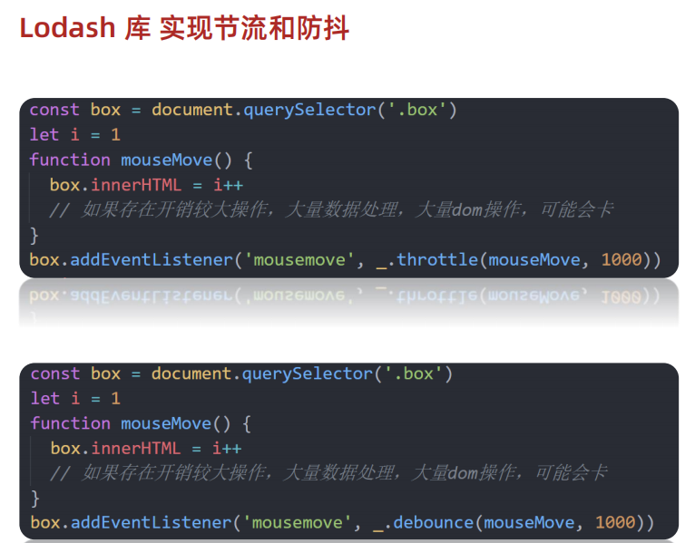

# JavaScript

## 1 变量

> 理解变量是计算机存储数据的“容器”，掌握变量的声明方式

补充：

-   ==const 声明的值不能更改，而且 const 声明变量的时候需要里面进行初始化==

-   ==但是对于引用数据类型，const 声明的变量，里面存的不是 值，不是值，不是值，是 地址（地址没有改变）==
-   

-   

变量是计算机中用来存储数据的“容器”，它可以让计算机变得有记忆，通俗的理解变量就是使用【某个符号】来代表【某个具体的数值】（数据）

```html
<script>
    // x 符号代表了 5 这个数值
    x = 5;
    // y 符号代表了 6 这个数值
    y = 6;

    //举例： 在 JavaScript 中使用变量可以将某个数据（数值）记录下来！

    // 将用户输入的内容保存在 num 这个变量（容器）中
    num = prompt("请输入一数字!");

    // 通过 num 变量（容器）将用户输入的内容输出出来
    alert(num);
    document.write(num);
</script>
```

### 1.1 声明

声明(定义)变量有两部分构成：声明关键字、变量名（标识）

```html
<!DOCTYPE html>
<html lang="en">
    <head>
        <meta charset="UTF-8" />
        <title>JavaScript 基础 - 声明和赋值</title>
    </head>
    <body>
        <script>
            // let 变量名
            // 声明(定义)变量有两部分构成：声明关键字、变量名（标识）
            // let 即关键字，所谓关键字是系统提供的专门用来声明（定义）变量的词语
            // age 即变量的名称，也叫标识符
            let age;
        </script>
    </body>
</html>
```

关键字是 JavaScript 中内置的一些英文词汇（单词或缩写），它们代表某些特定的含义，如 `let` 的含义是声明变量的，看到 `let` 后就可想到这行代码的意思是在声明变量，如 `let age;`

`let` 和 `var` 都是 JavaScript 中的声明变量的关键字，推荐使用 `let` 声明变量！！！

### 1.2 赋值

声明（定义）变量相当于创造了一个空的“容器”，通过赋值向这个容器中添加数据。

```html
<!DOCTYPE html>
<html lang="en">
    <head>
        <meta charset="UTF-8" />
        <title>JavaScript 基础 - 声明和赋值</title>
    </head>
    <body>
        <script>
            // 声明(定义)变量有两部分构成：声明关键字、变量名（标识）
            // let 即关键字，所谓关键字是系统提供的专门用来声明（定义）变量的词语
            // age 即变量的名称，也叫标识符
            let age;
            // 赋值，将 18 这个数据存入了 age 这个“容器”中
            age = 18;
            // 这样 age 的值就成了 18
            document.write(age);

            // 也可以声明和赋值同时进行
            let str = "hello world!";
            alert(str);
        </script>
    </body>
</html>
```

### 1.3 关键字

JavaScript 使用专门的关键字 `let` 和 `var` 来声明（定义）变量，在使用时需要注意一些细节：

以下是使用 `let` 时的注意事项：

1. 允许声明和赋值同时进行
2. 不允许重复声明
3. 允许同时声明多个变量并赋值
4. JavaScript 中内置的一些关键字不能被当做变量名

以下是使用 `var` 时的注意事项：

2. 允许声明和赋值同时进行
3. 允许重复声明
4. 允许同时声明多个变量并赋值

大部分情况使用 `let` 和 `var` 区别不大，但是 `let` 相较 `var` 更严谨，因此推荐使用 `let`，后期会更进一步介绍二者间的区别。

### 1.4 变量名命名规则

关于变量的名称（标识符）有一系列的规则需要遵守：

1. 只能是字母、数字、下划线、$，且不能能数字开头
2. 字母区分大小写，如 Age 和 age 是不同的变量
3. JavaScript 内部已占用于单词（关键字或保留字）不允许使用
4. 尽量保证变量具有一定的语义，见字知义

注：所谓关键字是指 JavaScript 内部使用的词语，如 `let` 和`var`，保留字是指 JavaScript 内部目前没有使用的词语，但是将来可能会使用词语。

```html
<!DOCTYPE html>
<html lang="en">
    <head>
        <meta charset="UTF-8" />
        <title>JavaScript 基础 - 变量名命名规则</title>
    </head>
    <body>
        <script>
            let age = 18; // 正确
            let age1 = 18; // 正确
            let _age = 18; // 正确

            // let 1age = 18; // 错误，不可以数字开头
            let $age = 18; // 正确
            let Age = 24; // 正确，它与小写的 age 是不同的变量
            // let let = 18; // 错误，let 是关键字
            let int = 123; // 不推荐，int 是保留字
        </script>
    </body>
</html>
```

## 2 常量

概念：使用 const 声明的变量称为“常量”。

使用场景：当某个变量永远不会改变的时候，就可以使用 const 来声明，而不是 let。

命名规范：和变量一致

```javascript
const PI = 3.14;
```

> 注意： 常量不允许重新赋值,声明的时候必须赋值（初始化）

## 3 数据类型

> 计算机世界中的万事成物都是数据。

计算机程序可以处理大量的数据，为了方便数据的管理，将数据分成了不同的类型：

注：通过 typeof 关键字检测数据类型

```html
<!DOCTYPE html>
<html lang="en">
    <head>
        <meta charset="UTF-8" />
        <title>JavaScript 基础 - 数据类型</title>
    </head>
    <body>
        <script>
            // 检测 1 是什么类型数据，结果为 number
            document.write(typeof 1);
        </script>
    </body>
</html>
```

### 3.1 数值类型

即我们数学中学习到的数字，可以是整数、小数、正数、负数

```html
<!DOCTYPE html>
<html lang="en">
    <head>
        <meta charset="UTF-8" />
        <title>JavaScript 基础 - 数据类型</title>
    </head>
    <body>
        <script>
            let score = 100; // 正整数
            let price = 12.345; // 小数
            let temperature = -40; // 负数

            document.write(typeof score); // 结果为 number
            document.write(typeof price); // 结果为 number
            document.write(typeof temperature); // 结果为 number
        </script>
    </body>
</html>
```

JavaScript 中的数值类型与数学中的数字是一样的，分为正数、负数、小数等。

### 3.2 字符串类型

通过单引号（ `''`） 、双引号（ `""`）或反引号包裹的数据都叫字符串，单引号和双引号没有本质上的区别，推荐使用单引号。

注意事项：

1. 无论单引号或是双引号必须成对使用
2. 单引号/双引号可以互相嵌套，但是不以自已嵌套自已
3. 必要时可以使用转义符 `\`，输出单引号或双引号

```html
<!DOCTYPE html>
<html lang="en">
    <head>
        <meta charset="UTF-8" />
        <title>JavaScript 基础 - 数据类型</title>
    </head>
    <body>
        <script>
            let user_name = "小明"; // 使用单引号
            let gender = "男"; // 使用双引号
            let str = "123"; // 看上去是数字，但是用引号包裹了就成了字符串了
            let str1 = ""; // 这种情况叫空字符串

            documeent.write(typeof user_name); // 结果为 string
            documeent.write(typeof gender); // 结果为 string
            documeent.write(typeof str); // 结果为 string
        </script>
    </body>
</html>
```

### 3.3 布尔类型

表示肯定或否定时在计算机中对应的是布尔类型数据，它有两个固定的值 `true` 和 `false`，表示肯定的数据用 `true`，表示否定的数据用 `false`。

```html
<!DOCTYPE html>
<html lang="en">
    <head>
        <meta charset="UTF-8" />
        <title>JavaScript 基础 - 数据类型</title>
    </head>
    <body>
        <script>
            //  pink老师帅不帅？回答 是 或 否
            let isCool = true; // 是的，摔死了！
            isCool = false; // 不，套马杆的汉子！

            document.write(typeof isCool); // 结果为 boolean
        </script>
    </body>
</html>
```

### 3.4 undefined

未定义是比较特殊的类型，只有一个值 undefined，只声明变量，不赋值的情况下，变量的默认值为 undefined，一般很少【直接】为某个变量赋值为 undefined。

```html
<!DOCTYPE html>
<html lang="en">
    <head>
        <meta charset="UTF-8" />
        <title>JavaScript 基础 - 数据类型</title>
    </head>
    <body>
        <script>
            // 只声明了变量，并末赋值
            let tmp;
            document.write(typeof tmp); // 结果为 undefined
        </script>
    </body>
</html>
```

**注：JavaScript 中变量的值决定了变量的数据类型。**

## 4 类型转换

> 理解弱类型语言的特征，掌握显式类型转换的方法

在 JavaScript 中数据被分成了不同的类型，如数值、字符串、布尔值、undefined，在实际编程的过程中，不同数据类型之间存在着转换的关系。

### 4.1 隐式转换

某些运算符被执行时，系统内部自动将数据类型进行转换，这种转换称为隐式转换。

```html
<!DOCTYPE html>
<html lang="en">
    <head>
        <meta charset="UTF-8" />
        <title>JavaScript 基础 - 隐式转换</title>
    </head>
    <body>
        <script>
            let num = 13; // 数值
            let num2 = "2"; // 字符串

            // 结果为 132
            // 原因是将数值 num 转换成了字符串，相当于 '13'
            // 然后 + 将两个字符串拼接到了一起
            console.log(num + num2);

            // 结果为 11
            // 原因是将字符串 num2 转换成了数值，相当于 2
            // 然后数值 13 减去 数值 2
            console.log(num - num2);

            let a = prompt("请输入一个数字");
            let b = prompt("请再输入一个数字");

            alert(a + b);
        </script>
    </body>
</html>
```

注：数据类型的隐式转换是 JavaScript 的特征，后续学习中还会遇到，目前先需要理解什么是隐式转换。

补充介绍模板字符串的拼接的使用

**隐式转换：**

1. 有字符串的加法 ”“+1，结果是"1"
2.

**注：**+数字字符串也可以隐士转为 Number 类型

```js
let str = "123";
let num1 = +str; // 可以隐式的将数字字符串转为Number类型
let num2 = Number(str); // 显示的将数字字符串转为Number类型
// 两种类型转换方式是等价的
```

### 4.2 显式转换

编写程序时过度依靠系统内部的隐式转换是不严禁的，因为隐式转换规律并不清晰，大多是靠经验总结的规律。为了避免因隐式转换带来的问题，通常根逻辑需要对数据进行显示转换。

**Number**

通过 `Number` 显示转换成数值类型，当转换失败时结果为 `NaN`（Not a Number）即不是一个数字。

```html
<!DOCTYPE html>
<html lang="en">
    <head>
        <meta charset="UTF-8" />
        <title>JavaScript 基础 - 隐式转换</title>
    </head>
    <body>
        <script>
            let t = "12";
            let f = 8;

            // 显式将字符串 12 转换成数值 12
            t = Number(t);

            // 检测转换后的类型
            // console.log(typeof t);
            console.log(t + f); // 结果为 20

            // 并不是所有的值都可以被转成数值类型
            let str = "hello";
            // 将 hello 转成数值是不现实的，当无法转换成
            // 数值时，得到的结果为 NaN （Not a Number）
            console.log(Number(str));
        </script>
    </body>
</html>
```

**parseInt**

parseInt 将字符串转为整数类型，但是**只截取整数部分**，必须数字开头

语法：

```js
// 格式：
parseInt(字符串);

console.log(parseInt("12px")); // 结果为12
console.log(parseInt("12.34px")); // 结果为12
console.log(parseInt("18.94px")); // 结果为18
console.log(parseInt("abc19px ")); // 结果为NaN
```

**parseFloat**

parseFloat 将字符串转为浮点数类型，但是**只截取符合浮点数的部分**

语法：

```js
// 格式：
parseFloat(字符串);

console.log(parseInt("12.34px")); // 结果为12.34
console.log(parseInt("18.94px")); // 结果为18.94
console.log(parseInt("abc19.55px")); // 结果为NaN
```

==**注意：**‘’（空字符串）、0、undefined、null、false、NaN 转换为布尔值后都是 false，其余都是 true==

## 5 运算符

### 5.1 算术运算符

数字是用来计算的，比如：乘法 \* 、除法 / 、加法 + 、减法 - 等等，所以经常和算术运算符一起。

算术运算符：也叫数学运算符，主要包括加、减、乘、除、取余（求模）等

| 运算符 | 作用                                                 |
| ------ | ---------------------------------------------------- |
| +      | 求和                                                 |
| -      | 求差                                                 |
| \*     | 求积                                                 |
| /      | 求商                                                 |
| **%**  | 取模（取余数），开发中经常用于作为某个数字是否被整除 |

> 注意：在计算失败时，显示的结果是 NaN （not a number）

```javascript
// 算术运算符
console.log(1 + (2 * 3) / 2); //  4
let num = 10;
console.log(num + 10); // 20
console.log(num + num); // 20

// 1. 取模(取余数)  使用场景：  用来判断某个数是否能够被整除
console.log(4 % 2); //  0
console.log(6 % 3); //  0
console.log(5 % 3); //  2
console.log(3 % 5); //  3

// 2. 注意事项 : 如果我们计算失败，则返回的结果是 NaN (not a number)
console.log("pink老师" - 2);
console.log("pink老师" * 2);
console.log("pink老师" + 2); // pink老师2
```

### 5.2 赋值运算符

赋值运算符：对变量进行赋值的运算符

= 将等号右边的值赋予给左边, 要求左边必须是一个容器

| 运算符 | 作用     |
| ------ | -------- |
| +=     | 加法赋值 |
| -+     | 减法赋值 |
| \*=    | 乘法赋值 |
| /=     | 除法赋值 |
| %=     | 取余赋值 |

```javascript
<script>
    let num = 1 // num = num + 1 // 采取赋值运算符 // num += 1 num += 3
    console.log(num)
</script>
```

### 5.3 自增/自减运算符

| 符号 | 作用 | 说明                        |
| ---- | ---- | --------------------------- |
| ++   | 自增 | 变量自身的值加 1，例如: x++ |
| --   | 自减 | 变量自身的值减 1，例如: x-- |

1. ++在前和++在后在单独使用时二者并没有差别，而且一般开发中我们都是独立使用
2. ++在后（后缀式）我们会使用更多

> 注意：
>
> 1. 只有变量能够使用自增和自减运算符
> 2. ++、-- 可以在变量前面也可以在变量后面，比如: x++ 或者 ++x

```javascript
<script>
    // let num = 10 // num = num + 1 // num += 1 // // 1. 前置自增 // let i = 1
    // ++i // console.log(i) // let i = 1 // console.log(++i + 1) // 2. 后置自增
    // let i = 1 // i++ // console.log(i) // let i = 1 // console.log(i++ + 1)
    // 了解 let i = 1 console.log(i++ + ++i + i)
</script>
```

### 5.4 比较运算符

使用场景：比较两个数据大小、是否相等，根据比较结果返回一个布尔值（true / false）

| 运算符 | 作用                                   |
| ------ | -------------------------------------- |
| >      | 左边是否大于右边                       |
| <      | 左边是否小于右边                       |
| >=     | 左边是否大于或等于右边                 |
| <=     | 左边是否小于或等于右边                 |
| ===    | 左右两边是否`类型`和`值`都相等（重点） |
| ==     | 左右两边`值`是否相等                   |
| !=     | 左右值不相等                           |
| !==    | 左右两边是否不全等                     |

```javascript
<script>
  console.log(3 > 5)
  console.log(3 >= 3)
  console.log(2 == 2)
  // 比较运算符有隐式转换 把'2' 转换为 2  双等号 只判断值
  console.log(2 == '2')  // true
  // console.log(undefined === null)
  // === 全等 判断 值 和 数据类型都一样才行
  // 以后判断是否相等 请用 ===
  console.log(2 === '2')
  console.log(NaN === NaN) // NaN 不等于任何人，包括他自己
  console.log(2 !== '2')  // true
  console.log(2 != '2') // false
  console.log('-------------------------')
  console.log('a' < 'b') // true
  console.log('aa' < 'ab') // true
  console.log('aa' < 'aac') // true
  console.log('-------------------------')
</script>
```

### 5.5 逻辑运算符

使用场景：可以把多个布尔值放到一起运算，最终返回一个布尔值

| 符号 | 名称   | 日常读法 | 特点                        | 口诀           |
| ---- | ------ | -------- | --------------------------- | -------------- |
| &&   | 逻辑与 | 并且     | 符号两边有一个假的结果为假  | 一假则假       |
| \|\| | 逻辑或 | 或者     | 符号两边有一个真的结果为真  | 一真则真       |
| !    | 逻辑非 | 取反     | true 变 false false 变 true | 真变假，假变真 |

| A     | B     | A && B | A \|\| B | !A    |
| ----- | ----- | ------ | -------- | ----- |
| false | false | false  | false    | true  |
| false | true  | false  | true     | true  |
| true  | false | false  | true     | false |
| true  | true  | true   | true     | false |

```javascript
<script>
    // 逻辑与 一假则假
    console.log(true && true)
    console.log(false && true)
    console.log(3 < 5 && 3 > 2)
    console.log(3 < 5 && 3 < 2)
    console.log('-----------------')
    // 逻辑或 一真则真
    console.log(true || true)
    console.log(false || true)
    console.log(false || false)
    console.log('-----------------')
    // 逻辑非  取反
    console.log(!true)
    console.log(!false)

    console.log('-----------------')

    let num = 6
    console.log(num > 5 && num < 10)
    console.log('-----------------')
  </script>
```

### 5.6 运算符优先级


> 逻辑运算符优先级： ！> && > ||

### 5.7 剩余运算符

常用于函数参数中，使用...

### 5.8 展开运算符

展开运算符...可以展开数组

举例

```js
const arr = [1, 2, 3];
console.log(Math.max(...arr)); // Math.max()不能传入数组
```

## 6 语句

### 6.1 表达式和语句


### 6.2 分支语句

分支语句可以根据条件判定真假，来选择性的执行想要的代码

分支语句包含：

1. if 分支语句（重点）
2. 三元运算符
3. switch 语句

#### if 分支语句

语法：

```javascript
if (条件表达式) {
    // 满足条件要执行的语句
}
```

小括号内的条件结果是布尔值，为 true 时，进入大括号里执行代码；为 false，则不执行大括号里面代码

小括号内的结果若不是布尔类型时，会发生类型转换为布尔值，类似 Boolean()

如果大括号只有一个语句，大括号可以省略，但是，俺们不提倡这么做~

```javascript
<script>
    // 单分支语句
    // if (false) {
    //   console.log('执行语句')
    // }
    // if (3 > 5) {
    //   console.log('执行语句')
    // }
    // if (2 === '2') {
    //   console.log('执行语句')
    // }
    //  1. 除了0 所有的数字都为真
    //   if (0) {
    //     console.log('执行语句')
    //   }
    // 2.除了 '' 所有的字符串都为真 true
    // if ('pink老师') {
    //   console.log('执行语句')
    // }
    // if ('') {
    //   console.log('执行语句')
    // }
    // // if ('') console.log('执行语句')

    // 1. 用户输入
    let score = +prompt('请输入成绩')
    // 2. 进行判断输出
    if (score >= 700) {
      alert('恭喜考入黑马程序员')
    }
    console.log('-----------------')

  </script>
```

#### if 双分支语句

如果有两个条件的时候，可以使用 if else 双分支语句

```javascript
if (条件表达式) {
    // 满足条件要执行的语句
} else {
    // 不满足条件要执行的语句
}
```

例如：

```javascript
<script>
    // 1. 用户输入 let uname = prompt('请输入用户名:') let pwd =
    prompt('请输入密码:') // 2. 判断输出 if (uname === 'pink' && pwd ===
    '123456') {alert("恭喜登录成功")} else {alert("用户名或者密码错误")}
</script>
```

#### if 多分支语句

使用场景： 适合于有多个条件的时候

```javascript
<script>
    // 1. 用户输入 let score = +prompt('请输入成绩：') // 2. 判断输出 if (score
    >= 90) {alert("成绩优秀，宝贝，你是我的骄傲")} else if (score >= 70){" "}
    {alert("成绩良好，宝贝，你要加油哦~~")} else if (score >= 60){" "}
    {alert("成绩及格，宝贝，你很危险~")} else{" "}
    {alert("成绩不及格，宝贝，我不想和你说话，我只想用鞭子和你说话~")}
</script>
```

#### 三元运算符（三元表达式）

**使用场景**： 一些简单的双分支，可以使用 三元运算符（三元表达式），写起来比 if else 双分支 更简单

**符号**：? 与 : 配合使用

语法：

```javascript
条件 ? 表达式1 ： 表达式2
```

例如：

```javascript
// 三元运算符（三元表达式）
// 1. 语法格式
// 条件 ? 表达式1 : 表达式2

// 2. 执行过程
// 2.1 如果条件为真，则执行表达式1
// 2.2 如果条件为假，则执行表达式2

// 3. 验证
// 5 > 3 ? '真的' : '假的'
console.log(5 < 3 ? "真的" : "假的");

// let age = 18
// age = age + 1
//  age++

// 1. 用户输入
let num = prompt("请您输入一个数字:");
// 2. 判断输出- 小于10才补0
// num = num < 10 ? 0 + num : num
num = num >= 10 ? num : 0 + num;
alert(num);
```

#### switch 语句（了解）

使用场景： 适合于有多个条件的时候，也属于分支语句，大部分情况下和 if 多分支语句 功能相同

注意：

1. switch case 语句一般用于等值判断, if 适合于区间判断
2. switchcase 一般需要配合 break 关键字使用 没有 break 会造成 case 穿透
3. if 多分支语句开发要比 switch 更重要，使用也更多

例如：

```javascript
// switch分支语句
// 1. 语法
// switch (表达式) {
//   case 值1:
//     代码1
//     break

//   case 值2:
//     代码2
//     break
//   ...
//   default:
//     代码n
// }

<script>
  switch (2) {
    case 1:
    console.log('您选择的是1')
    break  // 退出switch
    case 2:
    console.log('您选择的是2')
    break  // 退出switch
    case 3:
    console.log('您选择的是3')
    break  // 退出switch
    default:
    console.log('没有符合条件的')
  }
</script>
```

#### 断点调试

**作用：**学习时可以帮助更好的理解代码运行，工作时可以更快找到 bug

浏览器打开调试界面

1. 按 F12 打开开发者工具
2. 点到源代码一栏 （ sources ）
3. 选择代码文件

**断点：**在某句代码上加的标记就叫断点，当程序执行到这句有标记的代码时会暂停下来

### 6.3 循环语句

使用场景：重复执行 指定的一段代码，比如我们想要输出 10 次 '我学的很棒'

学习路径：

1.while 循环

2.for 循环（重点）

#### while 循环

while : 在…. 期间， 所以 while 循环 就是在满足条件期间，重复执行某些代码。

**语法：**

```javascript
while (条件表达式) {
    // 循环体
}
```

例如：

```javascript
// while循环: 重复执行代码

// 1. 需求: 利用循环重复打印3次 '月薪过万不是梦，毕业时候见英雄'
let i = 1;
while (i <= 3) {
    document.write("月薪过万不是梦，毕业时候见英雄~<br>");
    i++; // 这里千万不要忘了变量自增否则造成死循环
}
```

循环三要素：

1.初始值 （经常用变量）

2.终止条件

3.变量的变化量

例如：

```javascript
<script>
  // // 1. 变量的起始值
  // let i = 1
  // // 2. 终止条件
  // while (i <= 3) {
  //   document.write('我要循环三次 <br>')
  //   // 3. 变量的变化量
  //   i++
  // }
  // 1. 变量的起始值
  let end = +prompt('请输入次数:')
let i = 1
// 2. 终止条件
while (i <= end) {
  document.write('我要循环三次 <br>')
  // 3. 变量的变化量
  i++
}

</script>
```

#### 中止循环

`break` 中止整个循环，一般用于结果已经得到, 后续的循环不需要的时候可以使用（提高效率）

`continue` 中止本次循环，一般用于排除或者跳过某一个选项的时候

```javascript
<script>
    // let i = 1
    // while (i <= 5) {
    //   console.log(i)
    //   if (i === 3) {
    //     break  // 退出循环
    //   }
    //   i++

    // }


    let i = 1
    while (i <= 5) {
      if (i === 3) {
        i++
        continue
      }
      console.log(i)
      i++

    }
  </script>
```

#### 无限循环

1.while(true) 来构造“无限”循环，需要使用 break 退出循环。（常用）

2.for(;;) 也可以来构造“无限”循环，同样需要使用 break 退出循环。

```javascript
// 无限循环
// 需求： 页面会一直弹窗询问你爱我吗？
// (1). 如果用户输入的是 '爱'，则退出弹窗
// (2). 否则一直弹窗询问

// 1. while(true) 无限循环
// while (true) {
//   let love = prompt('你爱我吗?')
//   if (love === '爱') {
//     break
//   }
// }

// 2. for(;;) 无限循环
for (;;) {
    let love = prompt("你爱我吗?");
    if (love === "爱") {
        break;
    }
}
```

## 7 for 语句

> 掌握 for 循环语句，让程序具备重复执行能力

`for` 是 JavaScript 提供的另一种循环控制的话句，它和 `while` 只是语法上存在差异。

### 6.4 for 语句的基本使用

1. 实现循环的 3 要素

```html
<script>
    // 1. 语法格式
    // for(起始值; 终止条件; 变化量) {
    //   // 要重复执行的代码
    // }

    // 2. 示例：在网页中输入标题标签
    // 起始值为 1
    // 变化量 i++
    // 终止条件 i <= 6
    for (let i = 1; i <= 6; i++) {
        document.write(`<h${i}>循环控制，即重复执行<h${i}>`);
    }
</script>
```

2. 变化量和死循环，`for` 循环和 `while` 一样，如果不合理设置增量和终止条件，便会产生死循环。

3. 跳出和终止循环

```html
<script>
    // 1. continue
    for (let i = 1; i <= 5; i++) {
        if (i === 3) {
            continue; // 结束本次循环，继续下一次循环
        }
        console.log(i);
    }
    // 2. break
    for (let i = 1; i <= 5; i++) {
        if (i === 3) {
            break; // 退出结束整个循环
        }
        console.log(i);
    }
</script>
```

结论：

-   `JavaScript` 提供了多种语句来实现循环控制，但无论使用哪种语句都离不开循环的 3 个特征，即起始值、变化量、终止条件，做为初学者应着重体会这 3 个特征，不必过多纠结三种语句的区别。
-   起始值、变化量、终止条件，由开发者根据逻辑需要进行设计，规避死循环的发生。
-   当如果明确了循环的次数的时候推荐使用`for`循环,当不明确循环的次数的时候推荐使用`while`循环

> 注意：`for` 的语法结构更简洁，故 `for` 循环的使用频次会更多。

### 6.5 循环嵌套

利用循环的知识来对比一个简单的天文知识，我们知道地球在自转的同时也在围绕太阳公转，如果把自转和公转都看成是循环的话，就相当于是循环中又嵌套了另一个循环。


实际上 JavaScript 中任何一种循环语句都支持循环的嵌套，如下代码所示：


```html
// 1. 外面的循环 记录第n天 for (let i = 1; i < 4; i++) {
document.write(`第${i}天 <br />`) // 2. 里层的循环记录 几个单词 for (let j = 1;
j < 6; j++) { document.write(`记住第${j}个单词<br />`) } }
```

记住，外层循环循环一次，里层循环循环全部

#### 倒三角

```javascript
// 外层打印几行
for (let i = 1; i <= 5; i++) {
    // 里层打印几个星星
    for (let j = 1; j <= i; j++) {
        document.write("★");
    }
    document.write("<br>");
}
```


#### 九九乘法表

样式 css

```css
span {
    display: inline-block;
    width: 100px;
    padding: 5px 10px;
    border: 1px solid pink;
    margin: 2px;
    border-radius: 5px;
    box-shadow: 2px 2px 2px rgba(255, 192, 203, 0.4);
    background-color: rgba(255, 192, 203, 0.1);
    text-align: center;
    color: hotpink;
}
```

javascript

```javascript
// 外层打印几行
for (let i = 1; i <= 9; i++) {
    // 里层打印几个星星
    for (let j = 1; j <= i; j++) {
        // 只需要吧 ★ 换成  1 x 1 = 1
        document.write(`
		<div> ${j} x ${i} = ${j * i} </div>
     `);
    }
    document.write("<br>");
}
```


## 8 数组

> 知道什么是数组及其应用的场景，掌握数组声明及访问的语法。

### 8.1 数组的基本使用

#### 定义数组和数组单元

```js
// 数组定义
// 格式1:
let 变量名 = new Array(元素列表); // 元素列表不一定非得是同一种类型
let arr = new Array(1, 2, 3);

// 格式2
let 变量名 = [元素列表];
let arr = [1, 2, 3];

// 数组访问
arr[索引] = 值;
arr[0] = 1;
```

通过 `[]` 定义数组，数据中可以存放真正的数据，如小明、小刚、小红等这些都是数组中的数据，我们这些数据称为数组单元，数组单元之间使用英文逗号分隔。

数组中可以存放**任意类型**的数据，例如字符串，数字，布尔值等。

**注意事项：**

1. 采用方式 1 即上述方式定义数组，**注意：**如果只给**1 个 number 类型的值**，那么此时数值表示数组长度，数组中的数据都是 empty
2. 采用方式 1 即上述方式定义数组，**注意：**如果只给**1 个 number 类型的值**，那么此时数值表示数组长度，**但要求不能给小数**，数组长度不能是小数
3. 采用方式 1 即上述方式定义数组，**注意：**如果只给**1 个非 number 类型的值**，那么此时数值表示数组的元素
4. js 中的数组长度是可变的

#### 访问数组和数组索引

使用数组存放数据并不是最终目的，关键是能够随时的访问到数组中的数据（单元）。其实 JavaScript 为数组中的每一个数据单元都编了号，通过数据单元在数组中的编号便可以轻松访问到数组中的数据单元了。

我们将数据单元在数组中的编号称为索引值，也有人称其为下标。

索引值实际是按着数据单元在数组中的位置依次排列的，注意是从` 0` 开始的，如下图所示：


观察上图可以数据单元【小明】对应的索引值为【0】，数据单元【小红】对应的索引值为【2】

```html
<script>
    let classes = ["小明", "小刚", "小红", "小丽", "小米"];

    // 1. 访问数组，语法格式为：变量名[索引值]
    document.write(classes[0]); // 结果为：小明
    document.write(classes[1]); // 结果为：小刚
    document.write(classes[4]); // 结果为：小米

    // 2. 通过索引值还可以为数组单重新赋值
    document.write(classes[3]); // 结果为：小丽
    // 重新为索引值为 3 的单元赋值
    classes[3] = "小小丽";
    document.wirte(classes[3]); // 结果为： 小小丽
</script>
```

#### 数据单元值类型

数组做为数据的集合，它的单元值可以是任意数据类型

```html
<script>
    // 6. 数组单值类型可以是任意数据类型

    // a) 数组单元值的类型为字符类型
    let list = ["HTML", "CSS", "JavaScript"];
    // b) 数组单元值的类型为数值类型
    let scores = [78, 84, 70, 62, 75];
    // c) 混合多种类型
    let mixin = [true, 1, false, "hello"];
</script>
```

#### 数组长度属性

获取数组长度的语法：

```js
let arr = [1, 2, 3, 4, 5];
let length = arr.length;
```

重申一次，数组在 JavaScript 中并不是新的数据类型，它属于对象类型。

```html
<script>
    // 定义一个数组
    let arr = ["html", "css", "javascript"];
    // 数组对应着一个 length 属性，它的含义是获取数组的长度
    console.log(arr.length); // 3
</script>
```

### 8.2 操作数组

数组做为对象数据类型，不但有 `length` 属性可以使用，还提供了许多方法：

1. push 动态向数组的**尾部**添加一个单元，并**返回数组的长度**

    ```js
    // 语法格式如下：
    let len = arr.push("Nodejs"); // 返回值为数组的长度
    ```

2. unshift 动态向数组**头部**添加一个单元，并**返回数组的长度**

    ```javascript
    // 语法格式如下：
    let len = arr.unshift("Nodejs"); // 返回值为数组的长度
    ```

3. pop 删除**最后一个**单元，并**返回该元素（删除的元素）的值**

    ```js
    // 语法格式如下：
    let str = arr.pop(); // 返回值为删除元素的值
    ```

4. shift 删除**第一个**单元，并**返回该元素（删除的元素）的值**

    ```js
    // 语法格式如下：
    let len = arr.shift(); // 返回值为删除元素的值
    ```

5. splice 动态删除任意单元，并**返回删除的元素的值的数组**

    ```js
    // 语法格式如下：
    let deleteArr = arr.splice(起始位置, 删除几个元素);
    ```

使用以上 4 个方法时，都是直接在原数组上进行操作，即成功调任何一个方法，原数组都跟着发生相应的改变。并且在添加或删除单元时 `length` 并不会发生错乱。

```html
<script>
    // 定义一个数组
    let arr = ["html", "css", "javascript"];

    // 1. push 动态向数组的尾部添加一个单元
    arr.push("Nodejs");
    console.log(arr);
    arr.push("Vue");

    // 2. unshit 动态向数组头部添加一个单元
    arr.unshift("VS Code");
    console.log(arr);

    // 3. splice 动态删除任意单元
    arr.splice(2, 1); // 从索引值为2的位置开始删除1个单元
    console.log(arr);

    // 4. pop 删除最后一个单元
    arr.pop();
    console.log(arr);

    // 5. shift 删除第一个单元
    arr.shift();
    console.log(arr);
</script>
```

数组排序：

```js
let nums = [5, 4, 1, 3, 2];
for (let i = 0; i < nums.length - 1; i++) {
    for (let j = 0; j < nums.length - i - 1; j++) {
        if (nums[j] > nums[j + 1]) {
            let temp = nums[j];
            nums[j] = nums[j + 1];
            nums[j + 1] = temp;
        }
    }
}
console.log("冒泡排序法：");
console.log(nums);
console.log("从小到大排序：");
console.log(nums.sort());
console.log("从大到小排序：");
console.log(
    nums.sort(function (a, b) {
        return b - a;
    })
);
```

**for 循环：**普通 for 循环和 Java 中的语法一致，差异在于变量名，JS 中使用 let，而增强 for 则与 java 中的存在些许区别，java 中的增强 for 中间是冒号（：），而 JS 中的增强 for 中间是 of。

数组遍历：

```javascript
// 使用方式1创建数组：采用Array方式
let arr = new Array(1, 2, 3, 4, "hui");

// 遍历数组
// 使用增强for循环
for (let x of arr) {
    console.log(x);
}
```


### 8.3 forEach 方法

-   forEach() 方法用于调用数组的每个元素，并将元素传递给回调函数

-   主要使用场景：遍历数据的每个元素

-   语法：

    ```js
    数组.forEach(function (当前数组元素, 当前元素索引号) {
        // 函数体
    });
    // 注：没有返回值
    ```

-   举例：

    ```js
    const arr = ["red", "green", "blue"];
    arr.forEach(function (item, index) {
        console.log(item);
        console.log(index);
    });
    ```

注意：

1. forEach 主要是遍历数组
2. 参数中 当前数组元素是必须要写的，索引号可选
3. 不需要写 return，没有返回值

### 8.4 map 方法

使用场景：map 可以遍历数组处理数据，并且返回**新的数组**

```js
const arr = ["red", "blue", "green"];
const newArr = arr.map(function (item, index) {
    console.log(item);
    console.log(index);
    return item + "颜色";
});
console.log(newArr); // 结果为['red颜色', 'blue颜色', 'green颜色']
```

注：有返回值，返回值为一个数组

### 8.5 join 方法

作用：join()方法用于把数组中的所有元素**转换为一个字符串**

```js
const arr = ["red", "blue", "green"];

// 小括号为空则逗号分割
console.log(arr.join()); // 结果为：red,blue,green

// 小括号是空字符串，则元素之间没有分隔符
console.log(arr.join("")); // 结果为：redbluegreen
console.log(arr.join("|")); // 结果为：red|blue|green
```

### 8.6 reduce 方法

作用：累计器，返回累计处理的结果，经常用于求和等

基本语法：

```js
arr.reduce(function () {}, 起始值);

arr.reduce(function (上一次值, 当前值) {}, 初始值);

// 举例：没有初始值
const arr = [1, 2, 3, 4];
const total = arr.reduce(function (prev, current) {
    return prev + current;
});
console.log(total); // 结果为10

// 举例：有初始值
const arr = [1, 2, 3, 4];
const total = arr.reduce(function (prev, current) {
    return prev + current;
}, 10);
console.log(total); // 结果为20

// 箭头函数的写法
const total = arr.reduce((prev, current) => prev + current, 10);
```

参数：

1. 如果有起始值，则把初始值累加到里面

## 9 函数

> 理解函数的封装特性，掌握函数的语法规则

### 9.1 声明和调用

函数可以把具有相同或相似逻辑的代码“包裹”起来，通过函数调用执行这些被“包裹”的代码逻辑，这么做的优势是有利于精简代码方便复用。

#### 声明（定义）与调用

声明（定义）一个完整函数包括关键字、函数名、形式参数、函数体、返回值 5 个部分


**语法：**

```js
// 格式1：
// 定义函数
function 函数名(参数名, 参数名, ...){
    函数体
}

// 函数调用(无返回值)
函数名(实参, 实参)
// 函数调用(有返回值)
let 变量名=函数名(实参,实参)


// 格式2：
/**
* js中的函数：匿名函数，就是没有名字的函数
* 定义格式
* let 函数名 = function(参数列表){
* 函数体
* }
*/
// 将匿名函数赋值给一个对象
let add = function (x, y) {
	console.log(x + "---" + y);
	return x + y;
	};

// 调用函数
let sum = add(1, 2);
console.log(sum);
```

### 9.2 arguments 的使用

当不确定有多少个参数传递的时候，可以用 arguments 来获取。在 JavaScript 中，arguments 实际上

它是当前函数的一个内置对象。所有函数都内置了一个 arguments 对象，arguments 对象中存储了传递的

所有实参。

**arguments 展示形式是一个伪数组**，因此可以进行遍历。伪数组具有以下特点：

-   具有 length 属性
-   按索引方式储存数据
-   不具有数组的 push , pop 等方法

使用案例：**利用函数求任意个数的最大值**

```js
function maxValue() {
    let max = arguments[0];
    for (let i = 0; i < arguments.length; i++) {
        if (max < arguments[i]) {
            max = arguments[i];
        }
    }
    return max;
}
console.log(maxValue(2, 4, 5, 9));
console.log(maxValue(12, 4, 9));
```

### 9.3 参数

通过向函数传递参数，可以让函数更加灵活多变，参数可以理解成是一个变量。

声明（定义）一个功能为打招呼的函数

-   传入数据列表
-   声明这个函数需要传入几个数据
-   多个数据用逗号隔开

```js
// 声明（定义）一个功能为打招呼的函数
// function sayHi() {
//   console.log('嗨~')
// }
// 调用函数
// sayHi()

// 这个函数似乎没有什么价值，除非能够向不同的人打招呼
// 这就需要借助参数来实现了
function sayHi(name) {
    // 参数 name 可以被理解成是一个变量
    console.log(name);
    console.log("嗨~" + name);
}
// 调用 sayHi 函数，括号中多了 '小明'
// 这时相当于为参数 name 赋值了
sayHi("小明"); // 结果为 小明

// 再次调用 sayHi 函数，括号中多了 '小红'
// 这时相当于为参数 name 赋值了
sayHi("小红"); // 结果为 小红
```

总结：

1. 声明（定义）函数时的形参没有数量限制，当有多个形参时使用 `,` 分隔
2. 调用函数传递的实参要与形参的顺序一致

#### 形参和实参

形参：声明函数时写在函数名右边小括号里的叫形参（形式上的参数）

实参：调用函数时写在函数名右边小括号里的叫实参（实际上的参数）

形参可以理解为是在这个函数内声明的变量（比如 num1 = 10）实参可以理解为是给这个变量赋值

开发中尽量保持形参和实参个数一致

```html
<!DOCTYPE html>
<html lang="en">
    <head>
        <meta charset="UTF-8" />
        <title>JavaScript 基础 - 函数参数</title>
    </head>
    <body>
        <script>
            // 声明（定义）一个计算任意两数字和的函数
            // 形参 x 和 y 分别表示任意两个数字，它们是两个变量
            function count(x, y) {
                console.log(x + y);
            }
            // 调用函数，传入两个具体的数字做为实参
            // 此时 10 赋值给了形参 x
            // 此时 5  赋值给了形参 y
            count(10, 5); // 结果为 15
        </script>
    </body>
</html>
```

### 9.4 返回值

函数的本质是封装（包裹），函数体内的逻辑执行完毕后，函数外部如何获得函数内部的执行结果呢？要想获得函数内部逻辑的执行结果，需要通过 `return` 这个关键字，将内部执行结果传递到函数外部，这个被传递到外部的结果就是返回值。

```html
<!DOCTYPE html>
<html lang="en">
    <head>
        <meta charset="UTF-8" />
        <title>JavaScript 基础 - 函数返回值</title>
    </head>
    <body>
        <script>
            // 定义求和函数
            function count(a, b) {
                let s = a + b;
                // s 即为 a + b 的结果
                // 通过 return 将 s 传递到外部
                return s;
            }

            // 调用函数，如果一个函数有返回值
            // 那么可将这个返回值赋值给外部的任意变量
            let total = count(5, 12);
        </script>
    </body>
</html>
```

总结：

1. 在函数体中使用 return 关键字能将内部的执行结果交给函数外部使用
2. 函数内部只能出现 1 次 return，并且 return 下一行代码不会再被执行，所以 return 后面的数据不要换行写
3. return 会立即结束当前函数
4. 函数可以没有 return，这种情况默认返回值为 undefined

### 9.5 作用域

通常来说，一段程序代码中所用到的名字并不总是有效和可用的，而限定这个名字的可用性的代码范围就是这个名字的作用域。

作用域的使用提高了程序逻辑的局部性，增强了程序的可靠性，减少了名字冲突。

#### 全局作用域

作用于所有代码执行的环境(整个 script 标签内部)或者一个独立的 js 文件

处于全局作用域内的变量，称为全局变量

#### 局部作用域

作用于函数内的代码环境，就是局部作用域。 因为跟函数有关系，所以也称为函数作用域。

处于局部作用域内的变量称为局部变量

> 如果函数内部，变量没有声明，直接赋值，也当全局变量看，但是强烈不推荐
>
> 但是有一种情况，函数内部的形参可以看做是局部变量。

### 9.6 匿名函数

函数可以分为具名函数和匿名函数

匿名函数：没有名字的函数,无法直接使用。

#### 函数表达式

```javascript
// 声明
let fn = function () {
    console.log("函数表达式");
};
// 调用
fn();
```

#### 立即执行函数

```javascript
// 写法1：
(function () {
    xxx;
})();
// 写法2：
(function () {
    xxxx;
})();
```

> 无需调用，立即执行，其实本质已经调用了
>
> 多个立即执行函数之间用分号隔开
>
> 立即执行函数作用：创建了一个独立的作用域，防止变量污染（防止命名冲突）
>
> 也可以传递参数
>
> ```js
> (function (a, b) {
>     console.log(a + b);
> })(1, 2);
> // 结果为3
> ```

​ 在能够访问到的情况下 先局部 局部没有在找全局

**注意事项 1：**

-   匿名函数还可以作为另一个函数的参数传递
-   js 中**没有函数重载**概念，如果存在函数名一样的函数，后出现的函数就会覆盖之前的函数名
-   js 中调用无参函数可以传递实参，调用有参函数可以不传递实参，数据没有丢失会放到 js 的一个内置数组对象中 arguments

**逻辑中断：**


**注：**

1. ES6 之前，不能直接为函数的参数指定默认值，只能采用变通的方法，例如采用上述变通的方法

    ```js
    // 例如：
    function log(x, y) {
        y = y || "world";
        console.log(x, y);
    }
    log("hello"); //hello world
    log("hello", "china"); //hello china
    log("hello", ""); //hello world
    ```

2. ES6 允许为函数的参数设置默认值，即直接写在参数定义的后面。

    ```js
    // 例如：
    function log(x, y = "World") {
        console.log(x, y);
    }

    log("Hello"); // Hello World
    log("Hello", "China"); // Hello China
    log("Hello", ""); // Hello
    ```

3. ES6 允许默认的表达式可以是一个函数

    ```js
    function getVal(val) {
        return val + 5;
    }
    function add2(a, b = getVal(5)) {
        return a + b;
    }
    console.log(add2(10));
    ```

### 9.7函数提升

函数提升与变量提升比较类似，是指函数在声明之前即可被调用。

```html
<script>
    // 调用函数
    foo();
    // 声明函数
    function foo() {
        console.log("声明之前即被调用...");
    }

    // 不存在提升现象
    bar(); // 错误
    var bar = function () {
        console.log("函数表达式不存在提升现象...");
    };
</script>
```

总结：

1. 函数提升能够使函数的声明调用更灵活
2. 函数表达式不存在提升的现象
3. 函数提升出现在相同作用域当中

### 9.8 函数参数

函数参数的使用细节，能够提升函数应用的灵活度。

#### 默认值

```html
<script>
    // 设置参数默认值
    function sayHi(name = "小明", age = 18) {
        document.write(`<p>大家好，我叫${name}，我今年${age}岁了。</p>`);
    }
    // 调用函数
    sayHi();
    sayHi("小红");
    sayHi("小刚", 21);
</script>
```

总结：

1. 声明函数时为形参赋值即为参数的默认值
2. 如果参数未自定义默认值时，参数的默认值为 `undefined`
3. 调用函数时没有传入对应实参时，参数的默认值被当做实参传入

#### 动态参数

`arguments` 是函数内部内置的伪数组变量，它包含了调用函数时传入的所有实参。

```html
<script>
    // 求生函数，计算所有参数的和
    function sum() {
        // console.log(arguments)
        let s = 0;
        for (let i = 0; i < arguments.length; i++) {
            s += arguments[i];
        }
        console.log(s);
    }
    // 调用求和函数
    sum(5, 10); // 两个参数
    sum(1, 2, 4); // 两个参数
</script>
```

总结：

1. `arguments` 是一个伪数组
2. `arguments` 的作用是动态获取函数的实参

#### 剩余参数

```html
<script>
    function config(baseURL, ...other) {
        console.log(baseURL); // 得到 'http://baidu.com'
        console.log(other); // other  得到 ['get', 'json']
    }
    // 调用函数
    config("http://baidu.com", "get", "json");
</script>
```

总结：

1. `...` 是语法符号，置于最末函数形参之前，用于获取多余的实参
2. 借助 `...` 获取的剩余实参，是个真数组

### 9.9 箭头函数

箭头函数是一种声明函数的简洁语法，它与普通函数并无本质的区别，差异性更多体现在语法格式上。

```html
<body>
    <script>
        // const fn = function () {
        //   console.log(123)
        // }
        // 1. 箭头函数 基本语法
        // const fn = () => {
        //   console.log(123)
        // }
        // fn()
        // const fn = (x) => {
        //   console.log(x)
        // }
        // fn(1)
        // 2. 只有一个形参的时候，可以省略小括号
        // const fn = x => {
        //   console.log(x)
        // }
        // fn(1)
        // // 3. 只有一行代码的时候，我们可以省略大括号
        // const fn = x => console.log(x)
        // fn(1)
        // 4. 只有一行代码的时候，可以省略return
        // const fn = x => x + x
        // console.log(fn(1))
        // 5. 箭头函数可以直接返回一个对象
        // const fn = (uname) => ({ uname: uname })
        // console.log(fn('刘德华'))
    </script>
</body>
```

总结：

1. 箭头函数属于表达式函数，因此不存在函数提升
2. 箭头函数只有一个参数时可以省略圆括号 `()`
3. 箭头函数函数体只有一行代码时可以省略花括号 `{}`，并自动做为返回值被返回

#### 箭头函数参数

箭头函数中没有 `arguments`，只能使用 `...` 动态获取实参

```html
<body>
    <script>
        // 1. 利用箭头函数来求和
        const getSum = (...arr) => {
            let sum = 0;
            for (let i = 0; i < arr.length; i++) {
                sum += arr[i];
            }
            return sum;
        };
        const result = getSum(2, 3, 4);
        console.log(result); // 9
    </script>
</body>
```

#### 箭头函数 this

**箭头函数不会创建自己的 this，它只会从自己的作用域链的上一层沿用 this。**

```html
<script>
    // 以前this的指向：  谁调用的这个函数，this 就指向谁
    // console.log(this)  // window
    // // 普通函数
    // function fn() {
    //   console.log(this)  // window
    // }
    // window.fn()
    // // 对象方法里面的this
    // const obj = {
    //   name: 'andy',
    //   sayHi: function () {
    //     console.log(this)  // obj
    //   }
    // }
    // obj.sayHi()

    // 2. 箭头函数的this  是上一层作用域的this 指向
    // const fn = () => {
    //   console.log(this)  // window
    // }
    // fn()
    // 对象方法箭头函数 this
    // const obj = {
    //   uname: 'pink老师',
    //   sayHi: () => {
    //     console.log(this)  // this 指向谁？ window
    //   }
    // }
    // obj.sayHi()

    const obj = {
        uname: "pink老师",
        sayHi: function () {
            console.log(this); // obj
            let i = 10;
            const count = () => {
                console.log(this); // obj
            };
            count();
        },
    };
    obj.sayHi();
</script>
```

## 10 对象

> 对象是 JavaScript 数据类型的一种，之前已经学习了数值类型、字符串类型、布尔类型、undefined。对象数据类型可以被理解成是一种数据集合。它由**属性**和**方法**两部分构成。

### 10.1 语法

声明一个对象类型的变量与之前声明一个数值或字符串类型的变量没有本质上的区别。

```js
// 声明对象类型变量，使用一对花括号
// user 便是一个对象了，目前它是一个空对象
let user = {};
```

### 10.2 创建对象的三种方式

-   利用字面量创建对象

    **使用对象字面量创建对象：**

    ```
    就是花括号 { } 里面包含了表达这个具体事物（对象）的属性和方法；{ } 里面采取键值对的形式表示
    ```

    -   键：相当于属性名

    -   值：相当于属性值，可以是任意类型的值（数字类型、字符串类型、布尔类型，函数类型等）

        代码如下：

        ```js
        let star = {
            name: "pink",
            age: 18,
            sex: "男",
            sayHi: function () {
                alert("大家好啊~");
            },
        };
        ```

        上述代码中 star 即是创建的对象。

-   利用 new Object 创建对象

    -   创建空对象

        ```js
        let andy = new Obect();
        ```

        通过内置构造函数 Object 创建对象，此时 andy 变量已经保存了创建出来的空对象

    -   给空对象添加属性和方法

        -   通过对象操作属性和方法的方式，来为对象增加属性和方法，示例代码如下：

            ```js
            andy.name = "pink";
            andy.age = 18;
            andy.sex = "男";
            andy.sayHi = function () {
                alert("大家好啊~");
            };
            ```

    -   注意：

        -   Object() ：第一个字母大写
        -   new Object() ：需要 new 关键字
        -   使用的格式：对象.属性 = 值;

-   利用构造函数创建对象

    -   构造函数

        -   构造函数：是一种特殊的函数，主要用来初始化对象，即为对象成员变量赋初始值，它总与 new 运算符一起使用。我们可以把对象中一些公共的属性和方法抽取出来，然后封装到这个函数里面。

        -   构造函数的封装格式：

            ```js
            function 构造函数名(形参1, 形参2, 形参3) {
                this.属性名1 = 参数1;
                this.属性名2 = 参数2;
                this.属性名3 = 参数3;
                this.方法名 = 函数体;
            }
            ```

        -   构造函数的调用格式

            以上代码中，obj 即接收到构造函数创建出来的对象。

        -   注意事项

            1. 构造函数约定**首字母大写**。
            2. 函数内的属性和方法前面需要添加 **this** ，表示当前对象的属性和方法。
            3. 构造函数中**不需要** **return** **返回结果**。
            4. 当我们创建对象的时候，**必须用** **new** **来调用构造函数**。

        -   其他

            构造函数，如 Stars()，抽象了对象的公共部分，封装到了函数里面，它泛指某一大类（class）

            创建对象，如 new Stars()，特指某一个，通过 new 关键字创建对象的过程我们也称为对象实例

-   new 关键字的作用

    1. 在构造函数代码开始执行之前，创建一个空对象；
    2. 修改 this 的指向，把 this 指向创建出来的空对象；
    3. 执行函数的代码
    4. 在函数完成之后，返回 this---即创建出来的对象

-   补充：将对象（包括数组对象，数组对象也可以转为字符串）转为字符串 JSON.stringify()

    ```js
    // 将对象（包括数组对象，数组对象也可以转为字符串）转为字符串
    let obj = {
        title: "js快学完了",
        done: false,
    };
    let str = JSON.stringify(obj);
    ```

-   补充：将字符串转为对象格式 JSON.parse()

    ```js
    let obj = JSON.parse(str);
    ```

### 10.3 属性和访问

数据描述性的信息称为属性，如人的姓名、身高、年龄、性别等，一般是名词性的。

1. 属性都是成 对出现的，包括属性名和值，它们之间使用英文 `:` 分隔
2. 多个属性之间使用英文 `,` 分隔
3. 属性就是依附在对象上的变量
4. 属性名可以使用 `""` 或 `''`，一般情况下省略，除非名称遇到特殊符号如空格、中横线等

```js
// 通过对象描述一个人的数据信息
// person 是一个对象，它包含了一个属性 name
// 属性都是成对出现的，属性名 和 值，它们之间使用英文 : 分隔
let person = {
    name: "小明", // 描述人的姓名
    age: 18, // 描述人的年龄
    stature: 185, // 描述人的身高
    gender: "男", // 描述人的性别
};
```

声明对象，并添加了若干属性后，可以使用 `.` 或 `[]` 获得对象中属性对应的值，称之为属性访问。

```js
// 通过对象描述一个人的数据信息
// person 是一个对象，它包含了一个属性 name
// 属性都是成对出现的，属性名 和 值，它们之间使用英文 : 分隔

// 访问人的名字
console.log(person.name); // 结果为 小明
// 访问人性别
console.log(person.gender); // 结果为 男
// 访问人的身高
console.log(person["stature"]); // 结果为 185
// 或者
console.log(person.stature); // 结果同为 185
```

扩展：也可以动态为对象添加属性，动态添加与直接定义是一样的，只是语法上更灵活。

```js
// 声明一个空的对象（没有任何属性）
let user = {};
// 动态追加属性
user.name = "小明";
user["age"] = 18;

// 动态添加与直接定义是一样的，只是语法上更灵活
```

删除属性

```js
let user = {
    username: "hui",
};
delete user.username;
```

### 10.4 方法和调用

数据行为性的信息称为方法，如跑步、唱歌等，一般是动词性的，其本质是函数。

1. 方法是由方法名和函数两部分构成，它们之间使用 : 分隔
2. 多个属性之间使用英文 `,` 分隔
3. 方法是依附在对象中的函数
4. 方法名可以使用 `""` 或 `''`，一般情况下省略，除非名称遇到特殊符号如空格、中横线等

```js
// 方法是依附在对象上的函数
let person = {
    name: "小红",
    age: 18,
    // 方法是由方法名和函数两部分构成，它们之间使用 : 分隔
    singing: function () {
        console.log("两只老虎，两只老虎，跑的快，跑的快...");
    },
    run: function () {
        console.log("我跑的非常快...");
    },
};
```

声明对象，并添加了若干方法后，可以使用 `.` 或 `[]` 调用对象中函数，我称之为方法调用。

```js
// 方法是依附在对象上的函数
let person = {
    name: "小红",
    age: 18,
    // 方法是由方法名和函数两部分构成，它们之间使用 : 分隔
    singing: function () {
        console.log("两只老虎，两只老虎，跑的快，跑的快...");
    },
    run: function () {
        console.log("我跑的非常快...");
    },
};

// 调用对象中 singing 方法
person.singing();
// 调用对象中的 run 方法
person.run();
```

扩展：也可以动态为对象添加方法，动态添加与直接定义是一样的，只是语法上更灵活。

```js
    // 声明一个空的对象（没有任何属性，也没有任何方法）
	let user = {}
    // 动态追加属性
    user.name = '小明'
    user.['age'] = 18

    // 动态添加方法
    user.move = function () {
      console.log('移动一点距离...')
    }

```

**注：无论是属性或是方法，同一个对象中出现名称一样的，后面的会覆盖前面的。**

### 10.5 null

null 也是 JavaScript 中数据类型的一种，通常只用它来表示不存在的对象。使用 typeof 检测类型它的类型时，结果为 `object`。

如果有个变量以后要存储为对象，暂时没想好放啥，这个时候就给 null

### 10.6 遍历对象

```javascript
// 遍历对象
let obj = {
    uname: "pink",
};
for (let k in obj) {
    // k 属性名  字符串  带引号    obj.'uname'     k ===  'uname'
    // obj[k]  属性值    obj['uname']   obj[k]
    console.log(obj[k]);
}
```

==for in 不提倡遍历数组， 因为 k 是 字符串==

**补充：**

在 JavaScript 中，`for...in` 和 `for...of` 是两种不同的循环结构，它们用于遍历对象或数组，但用途和行为有所不同。

1. **`for...in` 循环**：

    - `for...in` 循环用于**`遍历对象`**的属性（包括可枚举的自有属性和原型链上的属性）。
    - 它返回的是属性名（字符串），而不是属性值。
    - 它可以用来遍历数组，但不建议这么做，因为数组的索引也是字符串，所以 `for...in` 会遍历数组的所有可枚举属性，包括原型链上的属性。

    示例：

    javascript

    ```javascript
    const obj = { a: 1, b: 2 };
    for (const key in obj) {
        if (obj.hasOwnProperty(key)) {
            // 检查属性是否为对象自身的属性
            console.log(key, obj[key]);
        }
    }
    ```

2. **`for...of` 循环**：

    - `for...of` 循环用于**`遍历可迭代对象`**（如数组、字符串、类数组对象等）的值。
    - 它返回的是每个元素的值。
    - 它不能直接用于对象，除非对象是可迭代的（例如通过实现 `[Symbol.iterator]` 方法）。

    示例：

    javascript

    ```javascript
    const arr = [3, 5, 7];
    for (const value of arr) {
        console.log(value);
    }
    ```

**区别**：

-   `for...in` 用于遍历对象的键。
-   `for...of` 用于遍历可迭代对象的值。
-   `for...in` 可能会遍历到对象原型链上的属性，而 `for...of` 不会。
-   `for...of` 可以直接用于数组，而 `for...in` 用于数组时需要额外的检查来确保属性是对象自身的。

## 11 内置对象

回想一下我们曾经使用过的 `console.log`，`console`其实就是 JavaScript 中内置的对象，该对象中存在一个方法叫 `log`，然后调用 `log` 这个方法，即 `console.log()`。

除了 `console` 对象外，JavaScritp 还有其它的内置的对象

### 11.1 Math 对象

`Math` 是 JavaScript 中内置的对象，称为数学对象，这个对象下即包含了属性，也包含了许多的方法。

#### 属性

-   Math.PI，获取圆周率

```javascript
// 圆周率
console.log(Math.PI);
```

#### 方法

-   Math.random，生成 0 到 1 间的随机数

```javascript
// 0 ~ 1 之间的随机数, 包含 0 不包含 1，左闭右开
Math.random();
```

-   Math.ceil，数字向上取整

```javascript
// 舍弃小数部分，整数部分加1
Math.ceil(3.4);
```

-   Math.floor，数字向下取整

```javascript
// 舍弃小数部分，整数部分不变
Math.floor(4.68);
```

-   Math.round，四舍五入取整

```javascript
// 取整，四舍五入原则
Math.round(5.46539);
Math.round(4.849);
```

-   Math.max，在一组数中找出最大的

```javascript
// 找出最大值
Math.max(10, 21, 7, 24, 13);
```

-   Math.min，在一组数中找出最小的

```javascript
// 找出最小值
Math.min(24, 18, 6, 19, 21);
```

-   Math.pow，幂方法

```javascript
// 求某个数的多少次方
Math.pow(4, 2); // 求 4 的 2 次方
Math.pow(2, 3); // 求 2 的 3 次方
```

-   Math.sqrt，平方根

```javascript
// 求某数的平方根
Math.sqrt(16);
```

数学对象提供了比较多的方法，这里不要求强记，通过演示数学对象的使用，加深对对象的理解。

-   生成 0-10 的随机整数

    ```js
    Math.floor(Math.random() * (10 + 1));
    ```

-   生成 5-10 的随机整数

    ```js
    Math.floor(Math.random() * (5 + 1)) + 5;
    ```

-   生成 N-M 之间的随机整数

    ```js
    Math.floor(Math.random() * (M - N + 1)) + N;
    ```

### 11.2 日期对象

#### Date()方法的使用

获取当前时间必须要实例化

```js
let now = new Date();
console.log(now);
```

Date()构造函数的参数

如果括号里面有时间，就返回参数里面的时间。例如日期格式字符串为‘2019-5-1’，可以写成 new Date('2019-5-1') 或者 new Date('2019/5/1')

-   如果 Date()不写参数，就返回当前时间
-   如果 Date()里面写参数，就返回括号里面输入的时间

#### 日期格式化

想要 2019-8-8 8:8:8 格式的日期，要怎么办？

需要求获取日期指定的部分，所以要手动的得到这种格式。


#### 获取日期的总的毫秒形式（时间戳）

Date 对象是基于 1970 年 1 月 1 日（世界标准时间）起的毫秒数

我们经常利用总的毫秒数来计算时间，因为它更精确

```js
// 实例化Date对象
let now = new Date();

// 1. 用于获取对象的原始值
console.log(date.valueOf());
console.log(date.getTime());

// 2. 简单写可以这么做
let now = +new Date();

// 3. HTML5中提供的方法，有兼容性问题
let now = Date.now();
```

将秒数转为天、时、分、秒的公式，转换公式如下：

-   d = parseInt(总秒数/ 60/60 /24); // 计算天数
-   h = parseInt(总秒数/ 60/60 %24) // 计算小时
-   m = parseInt(总秒数 /60 %60 ); // 计算分数
-   s = parseInt(总秒数%60); // 计算当前秒数

### 11.3 获取当前日期时间

获取 2024/10/23 20:11:09 格式的日期时间，只需要调用 toLocaleString()方法

```js
const date = new Date();
console.log(date.toLocaleString());
```

### 11.4 数组对象

#### 创建

创建数组对象的两种方式：

-   字面量方式
-   new Array()

#### 检测是否为数组

检测一个变量是否为数组的两个方法：

-   instanceof 运算符，可以判断一个对象是否属于某种类型
-   Array.isArray() 用于判断一个对象是否为数组，isArray() 时 HTML5 中提供的方法

```js
let arr = [1, 23];
let obj = {};
console.log(arr instanceof Array); // true
console.log(obj instanceof Array); // false
console.log(Array.isArray(arr)); // true
console.log(Array.isArray(obj)); // false
```

#### 增删改查


#### 数组排序


```js
let arr = [1, 64, 9, 6];
arr.sort(function (a, b) {
    return b - a; // 降a序
    // return a - b; // 升序
});
console.log(arr);
```

#### 数组索引方法


#### 数组转为字符串


**注：**join 方法如果不给分隔符，默认是使用`逗号`分隔

### 11.5 字符串对象

#### 基本包装类型

为了方便操作基本数据类型，JavaScript 还提供了三个特殊的引用类型：String、Number 和 Boolean。

**基本包装类型**就是把简单数据类型包装成为复杂数据类型，这样基本数据类型就有了属性和方法。

```js
let str = "andy";
console.log(str.length);

// 按道理基本数据类型是没有属性和方法的，而对象才有属性和方法，但上面代码却可以执行，这是因为 js 会把基本数据类型包装为复杂数据类型，其执行过程如下 ：

// 1. 生成临时变量，把简单类型包装为复杂数据类型
let temp = new String("andy");
// 2. 赋值给我们声明的字符变量
str = temp;
// 3. 销毁临时变量
temp = null;
```

#### 字符串的不可变

指的是里面的值不可变，虽然看上去可以改变内容，**但其实是地址变了，内存中新开辟了一个内存空间。**

```js
let str = "abc";
str = "hello";
// 当重新给 str 赋值的时候，常量'abc'不会被修改，依然在内存中
// 重新给字符串赋值，会重新在内存中开辟空间，这个特点就是字符串的不可变
// 由于字符串的不可变，在大量拼接字符串的时候会有效率问题
let str = "";
for (let i = 0; i < 100000; i++) {
    str += i;
}
console.log(str); // 这个结果需要花费大量时间来显示，因为需要不断的开辟新的空间
```

#### 根据字符返回位置

字符串所有的方法，都不会修改字符串本身(字符串是不可变的)，操作完成会返回一个新的字符串。


#### 根据位置返回字符（重点）


#### 字符串操作方法（重点）


#### replace()方法

replace() 方法用于在字符串中用一些字符替换另一些字符。其使用格式如下：

```js
let str = 'abc';
str.replace(被替换的字符串，要替换位的字符串)
```

注：`replace()` 方法会**返回一个新的字符串，原始字符串不会被修改**，并且只会替换符合条件的**第一个**字符。

#### split()方法

split()方法用于切分字符串，它可以将字符串切分为数组。在切分完毕之后，返回的是一个`新数组`。

例如下面代码：

```js
let str = "a,b,c,d";
console.log(str.split(",")); // 返回的是一个数组 [a, b, c, d]

let str1 = "red&pink&blue";
console.log(str.split("&")); // 返回的是一个数组 [red, pink, blue]
```

#### 大小写转换问题

-   toUpperCase() : 转换为大写，`toUpperCase()` 方法将字符串中的所有小写字母转换为大写字母，并返回新的字符串。原始字符串不会被修改。

    ```js
    let str = "Hello, World!";
    let upperStr = str.toUpperCase();
    console.log(upperStr); // "HELLO, WORLD!"
    ```

-   toLowerCase() : 转换为小写，`toLowerCase()` 方法将字符串中的所有大写字母转换为小写字母，并返回新的字符串。原始字符串同样不会被修改。

    ```js
    let str = "Hello, World!";
    let lowerStr = str.toLowerCase();
    console.log(lowerStr); // "hello, world!"
    ```

## 12 闭包

概念：一个函数对周围状态的引用捆绑在一起，内层函数中访问到其他外层函数的作用域

简单理解：**闭包 = 内层函数 + 外层函数的变量**

作用：封闭数据，提供操作，外部也可以访问函数内部的变量

例如：

```js
function outer() {
    const a = 1;
    // 内层函数 f()
    function f() {
        console.log(a); // 用到了外层函数的变量（捆绑到了一起）
    }
    f();
}

outer();
```

下面这个例子就**不属于闭包**，内部函数没有用到外部函数的变量

```js
function outer() {
    const a = 1;
    // 内层函数 f()
    function f() {
        console.log(11); // 没有用到了外层函数的变量
    }
    f();
}

outer();
```

常见的闭包的形式，外部可以访问使用 函数内部的变量

```js
function outer() {
    let i = 1;
    function fn() {
        console.log(i);
    }
    return fn;
}
const fun = outer();
fun();
```

**为什么不能直接 `return i`**

1. **作用域限制**：当你在 `outer` 函数中直接 `return i` 时，`i` 的值会被返回，但它不会被保留在 `outer` 函数的作用域中。`outer` 函数执行完毕后，`i` 变量会被销毁，无法再访问。
2. **闭包的特性**：通过返回 `fn` 函数，你实际上创建了一个闭包。这个闭包保留了对 `outer` 函数作用域的引用，因此即使 `outer` 函数已经执行完毕，`fn` 函数仍然可以访问 `i` 的值。这是闭包的核心特性。

**闭包可能引起的问题：可能存在内存泄漏问题**

## 13 变量提升

变量提升是 JavaScript 中比较奇怪的现象，它允许在变量声明之前即被访问（仅存在于 var 声明变量）

注意：

1. 变量在未声明即被访问会包语法错误
2. 变量在 var 声明之前即被访问，变量的值为 undefined
3. let/const 声明的变量不存在变量提升
4. 变量提升出现在**相同作用域**当中（当前作用域）
5. 实际开发中推荐先声明再访问变量

函数声明必须先声明和赋值，后调用，负责报错

## 14 正则表达式

正则表达式在 JavaScript 中的使用场景：

-   例如验证表单：用户名表单只能输入英文字母、数字或者下划线， 昵称输入框中可以输入中文(**匹配**)，比如用户名: /^[a-z0-9_-]{3,16}$/

-   过滤掉页面内容中的一些敏感词(**替换**)，或从字符串中获取我们想要的特定部分(**提取**)等 。

**（1）语法：**

1. 定义规则
2. 根据规则去查找：找到则返回

①**定义正则表达式语法**

```js
const 变量名 = /表达式/;

// 比如：
const reg = /前端/;
```

其中：/ / 是正则表达式字面量

**② 判断是否有符合规则的字符串：**

```js
// 语法
reg.test(被检测的字符串); // 包含 返回true ，否则返回false
// 比如：
const str = "IT培训，前端开发培训";
const reg = /前端/;
// 检测方法
console.log(reg.test(str)); // true
```

如果正则表达式与指定的字符串匹配 ，返回 true，否则 false

**③ 检索（查找）符合规则的字符串：**

```js
// 语法：
reg.exec(被检测字符串);

// 比如：
const str = "IT培训，前端开发培训";
// 定义正则表达式，检测规则
const reg = /前端/;
// 检测方法
console.log(reg.exec(str)); // 返回的是数组
```

如果匹配成功，exec() 方法返回一个数组，否则返回 null

**（2）元字符**

为了方便记忆和学习，我们对众多的元字符进行了分类：

-   边界符（表示位置，开头和结尾，必须用什么开头，用什么结尾），正则表达式中的边界符（位置符）用来提示字符所处的位置，主要有两个字符

    

    如果 ^ 和 $ 在一起，表示必须是精确匹配，必须一模一样才为 true

-   量词 （表示重复次数），量词用来 设定某个模式出现的次数

    

    ==注意： 逗号左右两侧千万不要出现空格==

-   字符类 （比如 \d 表示 0~9）

    1. [ ] 匹配字符集合：字符串只要包含其中的**任意一个字符**，都返回 true，使用连字符 - 表示一个范围；[ ] 里面加上 ^ 取反符号比如：

        ```js
        console.log(/[abc]/.test("andy"))  // true
        console.log(/[abc]/.test("baby"))  // true
        console.log(/[abc]/.test("cry"))  // true
        console.log(/[abc]/.test("die"))  // false

        // 使用连字符 - 表示一个范围
        console.log(/[a-z]/.test("p"))  // true

        比如：
        [a-z] 表示 a 到 z 26个英文字母都可以
        [a-zA-Z] 表示大小写都可以
        [0-9] 表示 0~9 的数字都可以

        比如：
        [^a-z] 匹配除了小写字母以外的字符
        ！！！注意要写到中括号里面
        ```

    2. . 匹配除换行符之外的任何单个字符

    3. 预定义：指的是 某些常见模式的简写方式。

        

        ```js
        日期格式：^\d{4}-\d{1,2}-\d{1,2}
        ```

**（3）修饰符**

修饰符约束正则执行的某些细节行为，如是否区分大小写、是否支持多行匹配等

语法：

```js
/表达式/修饰符
```

-   i 是单词 ignore 的缩写，正则匹配时字母不区分大小写

-   g 是单词 global 的缩写，匹配所有满足正则表达式的结果

**替换 replace**

语法：

```js
字符串.replace(/正则表达式/, "替换的文本");

// 举例
const str = "java是一门编程语言，学完JAVA工资很高";
const re = str.replace(/java/i, "前端"); // 结果为：前端是一门编程语言，学完JAVA工资很高

// 使用修饰符 g
const re = str.replace(/java/gi, "前端"); // 结果为：前端是一门编程语言，学完前端工资很高
// 注：ig和gi都可以
```

**注：正常情况下只能替换第一处符合规则的字符，可以使用 g 来替换全部；可以使用|或运算符**

## 15 作用域

> 了解作用域对程序执行的影响及作用域链的查找机制，使用闭包函数创建隔离作用域避免全局变量污染。

作用域（scope）规定了变量能够被访问的“范围”，离开了这个“范围”变量便不能被访问，作用域分为全局作用域和局部作用域。

### 15.1 局部作用域

局部作用域分为函数作用域和块作用域。

#### 函数作用域

在函数内部声明的变量只能在函数内部被访问，外部无法直接访问。

```html
<script>
    // 声明 counter 函数
    function counter(x, y) {
        // 函数内部声明的变量
        const s = x + y;
        console.log(s); // 18
    }
    // 设用 counter 函数
    counter(10, 8);
    // 访问变量 s
    console.log(s); // 报错
</script>
```

总结：

1. 函数内部声明的变量，在函数外部无法被访问
2. 函数的参数也是函数内部的局部变量
3. 不同函数内部声明的变量无法互相访问
4. 函数执行完毕后，函数内部的变量实际被清空了

#### 块作用域

在 JavaScript 中使用 `{}` 包裹的代码称为代码块，代码块内部声明的变量外部将【有可能】无法被访问。

```html
<script>
    {
        // age 只能在该代码块中被访问
        let age = 18;
        console.log(age); // 正常
    }

    // 超出了 age 的作用域
    console.log(age); // 报错

    let flag = true;
    if (flag) {
        // str 只能在该代码块中被访问
        let str = "hello world!";
        console.log(str); // 正常
    }

    // 超出了 age 的作用域
    console.log(str); // 报错

    for (let t = 1; t <= 6; t++) {
        // t 只能在该代码块中被访问
        console.log(t); // 正常
    }

    // 超出了 t 的作用域
    console.log(t); // 报错
</script>
```

JavaScript 中除了变量外还有常量，常量与变量本质的区别是【常量必须要有值且不允许被重新赋值】，常量值为对象时其属性和方法允许重新赋值。

```html
<script>
    // 必须要有值
    const version = "1.0.0";

    // 不能重新赋值
    // version = '1.0.1';

    // 常量值为对象类型
    const user = {
        name: "小明",
        age: 18,
    };

    // 不能重新赋值
    user = {};

    // 属性和方法允许被修改
    user.name = "小小明";
    user.gender = "男";
</script>
```

总结：

1. `let` 声明的变量会产生块作用域，`var` 不会产生块作用域
2. `const` 声明的常量也会产生块作用域
3. 不同代码块之间的变量无法互相访问
4. 推荐使用 `let` 或 `const`

注：开发中 `let` 和 `const` 经常不加区分的使用，如果担心某个值会不小被修改时，则只能使用 `const` 声明成常量。

### 15.2 全局作用域

`<script>` 标签和 `.js` 文件的【最外层】就是所谓的全局作用域，在此声明的变量在函数内部也可以被访问。

```html
<script>
    // 此处是全局

    function sayHi() {
        // 此处为局部
    }

    // 此处为全局
</script>
```

全局作用域中声明的变量，任何其它作用域都可以被访问，如下代码所示：

```html
<script>
    // 全局变量 name
    const name = "小明";

    // 函数作用域中访问全局
    function sayHi() {
        // 此处为局部
        console.log("你好" + name);
    }

    // 全局变量 flag 和 x
    const flag = true;
    let x = 10;

    // 块作用域中访问全局
    if (flag) {
        let y = 5;
        console.log(x + y); // x 是全局的
    }
</script>
```

总结：

1. 为 `window` 对象动态添加的属性默认也是全局的，不推荐！
2. 函数中未使用任何关键字声明的变量为全局变量，不推荐！！！
3. 尽可能少的声明全局变量，防止全局变量被污染

JavaScript 中的作用域是程序被执行时的底层机制，了解这一机制有助于规范代码书写习惯，避免因作用域导致的语法错误。

### 15.3 作用域链

在解释什么是作用域链前先来看一段代码：

```html
<script>
    // 全局作用域
    let a = 1;
    let b = 2;
    // 局部作用域
    function f() {
        let c;
        // 局部作用域
        function g() {
            let d = "yo";
        }
    }
</script>
```

函数内部允许创建新的函数，`f` 函数内部创建的新函数 `g`，会产生新的函数作用域，由此可知作用域产生了嵌套的关系。

如下图所示，父子关系的作用域关联在一起形成了链状的结构，作用域链的名字也由此而来。

作用域链本质上是底层的变量查找机制，在函数被执行时，会优先查找当前函数作用域中查找变量，如果当前作用域查找不到则会依次逐级查找父级作用域直到全局作用域，如下代码所示：

```html
<script>
    // 全局作用域
    let a = 1;
    let b = 2;

    // 局部作用域
    function f() {
        let c;
        // let a = 10;
        console.log(a); // 1 或 10
        console.log(d); // 报错

        // 局部作用域
        function g() {
            let d = "yo";
            // let b = 20;
            console.log(b); // 2 或 20
        }

        // 调用 g 函数
        g();
    }

    console.log(c); // 报错
    console.log(d); // 报错

    f();
</script>
```

总结：

1. 嵌套关系的作用域串联起来形成了作用域链
2. 相同作用域链中按着**从小到大的规则查找变量**
3. 子作用域能够访问父作用域，父级作用域无法访问子级作用域

## 16 解构赋值

> 知道解构的语法及分类，使用解构简洁语法快速为变量赋值。

解构赋值是一种快速为变量赋值的简洁语法，本质上仍然是为变量赋值，分为数组解构、对象解构两大类型。

### 16.1 数组解构

数组解构是将数组的单元值快速批量赋值给一系列变量的简洁语法，如下代码所示：

```html
<script>
    // 普通的数组
    let arr = [1, 2, 3];
    // 批量声明变量 a b c
    // 同时将数组单元值 1 2 3 依次赋值给变量 a b c
    let [a, b, c] = arr;
    console.log(a); // 1
    console.log(b); // 2
    console.log(c); // 3
</script>
```

总结：

1. 赋值运算符 `=` 左侧的 `[]` 用于批量声明变量，右侧数组的单元值将被赋值给左侧的变量
2. 变量的顺序对应数组单元值的位置依次进行赋值操作
3. 变量的数量大于单元值数量时，多余的变量将被赋值为 `undefined`
4. 变量的数量小于单元值数量时，可以通过 `...` 获取剩余单元值，但只能置于最末位
5. 允许初始化变量的默认值，且只有单元值为 `undefined` 时默认值才会生效

注：支持多维解构赋值，比较复杂后续有应用需求时再进一步分析

### 16.2 对象解构

对象解构是将对象属性和方法快速批量赋值给一系列变量的简洁语法，如下代码所示：

```html
<script>
    // 普通对象
    const user = {
        name: "小明",
        age: 18,
    };
    // 批量声明变量 name age
    // 同时将数组单元值 小明  18 依次赋值给变量 name  age
    const { name, age } = user;

    console.log(name); // 小明
    console.log(age); // 18
</script>
```

总结：

1. 赋值运算符 `=` 左侧的 `{}` 用于批量声明变量，右侧对象的属性值将被赋值给左侧的变量
2. 对象属性的值将被赋值给与属性名相同的变量
3. 对象中找不到与变量名一致的属性时变量值为 `undefined`
4. 允许初始化变量的默认值，属性不存在或单元值为 `undefined` 时默认值才会生效

注：支持多维解构赋值

```html
<body>
    <script>
        // 1. 这是后台传递过来的数据
        const msg = {
            code: 200,
            msg: "获取新闻列表成功",
            data: [
                {
                    id: 1,
                    title: "5G商用自己，三大运用商收入下降",
                    count: 58,
                },
                {
                    id: 2,
                    title: "国际媒体头条速览",
                    count: 56,
                },
                {
                    id: 3,
                    title: "乌克兰和俄罗斯持续冲突",
                    count: 1669,
                },
            ],
        };

        // 需求1： 请将以上msg对象  采用对象解构的方式 只选出  data 方面后面使用渲染页面
        // const { data } = msg
        // console.log(data)
        // 需求2： 上面msg是后台传递过来的数据，我们需要把data选出当做参数传递给 函数
        // const { data } = msg
        // msg 虽然很多属性，但是我们利用解构只要 data值
        function render({ data }) {
            // const { data } = arr
            // 我们只要 data 数据
            // 内部处理
            console.log(data);
        }
        render(msg);

        // 需求3， 为了防止msg里面的data名字混淆，要求渲染函数里面的数据名改为 myData
        function render({ data: myData }) {
            // 要求将 获取过来的 data数据 更名为 myData
            // 内部处理
            console.log(myData);
        }
        render(msg);
    </script>
</body>
```

## 17 深入对象

> 了解面向对象的基础概念，能够利用构造函数创建对象。

### 17.1 构造函数

构造函数是专门用于创建对象的函数，如果一个函数使用 `new` 关键字调用，那么这个函数就是构造函数。

```html
<script>
    // 定义函数
    function foo() {
        console.log("通过 new 也能调用函数...");
    }
    // 调用函数
    new foo();
</script>
```

总结：

2. 使用 `new` 关键字调用函数的行为被称为实例化
3. 实例化构造函数时没有参数时可以省略 `()`
4. 构造函数的返回值即为新创建的对象
5. 构造函数内部的 `return` 返回的值无效！

注：实践中为了从视觉上区分构造函数和普通函数，习惯将构造函数的首字母大写。

### 17.2 实例成员

通过构造函数创建的对象称为实例对象，实例对象中的属性和方法称为实例成员。

```html
<script>
    // 构造函数
    function Person() {
        // 构造函数内部的 this 就是实例对象
        // 实例对象中动态添加属性
        this.name = "小明";
        // 实例对象动态添加方法
        this.sayHi = function () {
            console.log("大家好~");
        };
    }
    // 实例化，p1 是实例对象
    // p1 实际就是 构造函数内部的 this
    const p1 = new Person();
    console.log(p1);
    console.log(p1.name); // 访问实例属性
    p1.sayHi(); // 调用实例方法
</script>
```

总结：

1. 构造函数内部 `this` 实际上就是实例对象，为其动态添加的属性和方法即为实例成员
2. 为构造函数传入参数，动态创建结构相同但值不同的对象

注：构造函数创建的实例对象彼此独立互不影响。

### 17.3 静态成员

在 JavaScript 中底层函数本质上也是对象类型，因此允许直接为函数动态添加属性或方法，构造函数的属性和方法被称为静态成员。

```html
<script>
    // 构造函数
    function Person(name, age) {
        // 省略实例成员
    }
    // 静态属性
    Person.eyes = 2;
    Person.arms = 2;
    // 静态方法
    Person.walk = function () {
        console.log("^_^人都会走路...");
        // this 指向 Person
        console.log(this.eyes);
    };
</script>
```

总结：

1. 静态成员指的是添加到构造函数本身的属性和方法
2. 一般公共特征的属性或方法静态成员设置为静态成员
3. 静态成员方法中的 `this` 指向构造函数本身

## 18 内置构造函数

> 掌握各引用类型和包装类型对象属性和方法的使用。

在 JavaScript 中**最主要**的数据类型有 6 种，分别是字符串、数值、布尔、undefined、null 和 对象，常见的对象类型数据包括数组和普通对象。其中字符串、数值、布尔、undefined、null 也被称为简单类型或基础类型，对象也被称为引用类型。

在 JavaScript 内置了一些构造函数，绝大部的数据处理都是基于这些构造函数实现的，JavaScript 基础阶段学习的 `Date` 就是内置的构造函数。

```html
<script>
    // 实例化
    let date = new Date();

    // date 即为实例对象
    console.log(date);
</script>
```

甚至字符串、数值、布尔、数组、普通对象也都有专门的构造函数，用于创建对应类型的数据。

### 18.1 Object

`Object` 是内置的构造函数，用于创建普通对象。

```html
<script>
    // 通过构造函数创建普通对象
    const user = new Object({ name: "小明", age: 15 });

    // 这种方式声明的变量称为【字面量】
    let student = { name: "杜子腾", age: 21 };

    // 对象语法简写
    let name = "小红";
    let people = {
        // 相当于 name: name
        name,
        // 相当于 walk: function () {}
        walk() {
            console.log("人都要走路...");
        },
    };

    console.log(student.constructor);
    console.log(user.constructor);
    console.log(student instanceof Object);
</script>
```

。

总结：

1. 推荐使用字面量方式声明对象，而不是 `Object` 构造函数
2. `Object.assign` 静态方法创建新的对象
3. `Object.keys` 静态方法获取对象中所有属性
4. `Object.values` 表态方法获取对象中所有属性值

**Object.assign()方法使用**

在 JavaScript 中，`Object.assign()` 方法用于将所有可枚举属性的值从一个或多个源对象复制到目标对象。它将返回目标对象。

语法：

javascript

```javascript
Object.assign(target, ...sources);
```

参数：

-   `target`：目标对象，即要复制到的对象。
-   `sources`：源对象，即要从中复制属性的对象。可以有任意数量。

返回值：

目标对象（`target`）。

描述：

-   如果目标对象中存在源对象的相同属性，则源对象的属性值会覆盖目标对象的属性值。
-   如果源对象中存在相同的属性，则后面的源对象的属性会覆盖前面源对象的属性。
-   `Object.assign()` 方法只复制源对象自身的可枚举属性，不包括其原型链上的属性。
-   如果源对象为 `null` 或 `undefined`，则不会复制任何属性。
-   如果源对象是数组，则会将数组中的元素作为单独的属性复制到目标对象中。
-   如果源对象是 `null`，则目标对象会被清空。

示例：

javascript

```javascript
// 创建一个目标对象
let target = { a: 1, b: 2 };

// 创建源对象
let source1 = { b: 3, c: 4 };
let source2 = { a: 5, e: 6 };

// 使用Object.assign()方法
Object.assign(target, source1, source2);

// 打印结果
console.log(target); // { a: 5, b: 3, c: 4, e: 6 }
```

在这个例子中，`target` 对象首先被 `source1` 对象的属性覆盖，然后被 `source2` 对象的属性覆盖。最终，`target` 对象包含了所有源对象的属性。

`Object.assign()` 方法也可以用于合并多个对象：

javascript

```javascript
let obj = Object.assign({}, obj1, obj2, obj3);
```

这行代码创建了一个新的空对象，并将 `obj1`、`obj2` 和 `obj3` 的所有可枚举属性复制到这个新对象中。

请注意，`Object.assign()` 方法不会处理属性描述符，枚举顺序，或属性的原型链。如果需要更复杂的对象合并逻辑，可能需要使用更高级的库，如 Lodash 的 `_.merge()` 方法。

### 18.2 Array

`Array` 是内置的构造函数，用于创建数组。

```html
<script>
    // 构造函数创建数组
    let arr = new Array(5, 7, 8);

    // 字面量方式创建数组
    let list = ["html", "css", "javascript"];
</script>
```

数组赋值后，无论修改哪个变量另一个对象的数据值也会相当发生改变。

总结：

1. 推荐使用字面量方式声明数组，而不是 `Array` 构造函数

2. 实例方法 `forEach` 用于遍历数组，替代 `for` 循环 (重点)

3. 实例方法 `filter` 过滤数组单元值，生成新数组(重点)

4. 实例方法 `map` 迭代原数组，生成新数组(重点)

5. 实例方法 `join` 数组元素拼接为字符串，返回字符串(重点)

6. 实例方法 `find` 查找元素， 返回符合测试条件的第一个数组元素值，如果没有符合条件的则返回 undefined(重点)

 实例方法`every` 检测数组所有元素是否都符合指定条件，如果**所有元素**都通过检测返回 true，否则返回 false(重点)

8. 实例方法`some` 检测数组中的元素是否满足指定条件 **如果数组中有**元素满足条件返回 true，否则返回 false

9. 实例方法 `concat` 合并两个数组，返回生成新数组

10. 实例方法 `sort` 对原数组单元值排序

11. 实例方法 `splice` 删除或替换原数组单元

12. 实例方法 `reverse` 反转数组

13. 实例方法 `findIndex` 查找元素的索引值

### 18.3 包装类型

在 JavaScript 中的字符串、数值、布尔具有对象的使用特征，如具有属性和方法，如下代码举例：

```html
<script>
    // 字符串类型
    const str = "hello world!";
    // 统计字符的长度（字符数量）
    console.log(str.length);

    // 数值类型
    const price = 12.345;
    // 保留两位小数
    price.toFixed(2); // 12.34
</script>
```

之所以具有对象特征的原因是字符串、数值、布尔类型数据是 JavaScript 底层使用 Object 构造函数“包装”来的，被称为包装类型。

#### String

`String` 是内置的构造函数，用于创建字符串。

```html
<script>
    // 使用构造函数创建字符串
    let str = new String("hello world!");

    // 字面量创建字符串
    let str2 = "你好，世界！";

    // 检测是否属于同一个构造函数
    console.log(str.constructor === str2.constructor); // true
    console.log(str instanceof String); // false
</script>
```

总结：

1. 实例属性 `length` 用来获取字符串的度长(重点)
2. 实例方法 `split('分隔符')` 用来将字符串拆分成数组(重点)
3. 实例方法 `substring（需要截取的第一个字符的索引[,结束的索引号]）` 用于字符串截取(重点)
4. 实例方法 `startsWith(检测字符串[, 检测位置索引号])` 检测是否以某字符开头(重点)
5. 实例方法 `includes(搜索的字符串[, 检测位置索引号])` 判断一个字符串是否包含在另一个字符串中，根据情况返回 true 或 false(重点)
6. 实例方法 `toUpperCase` 用于将字母转换成大写
 实例方法 `toLowerCase` 用于将就转换成小写
8. 实例方法 `indexOf` 检测是否包含某字符
9. 实例方法 `endsWith` 检测是否以某字符结尾
10. 实例方法 `replace` 用于替换字符串，支持正则匹配
11. 实例方法 `match` 用于查找字符串，支持正则匹配

注：String 也可以当做普通函数使用，这时它的作用是强制转换成字符串数据类型。

#### Number

`Number` 是内置的构造函数，用于创建数值。

```html
<script>
    // 使用构造函数创建数值
    let x = new Number("10");
    let y = new Number(5);

    // 字面量创建数值
    let z = 20;
</script>
```

总结：

1. 推荐使用字面量方式声明数值，而不是 `Number` 构造函数
2. 实例方法 `toFixed` 用于设置保留小数位的长度

## 19 原型对象

构造函数通过原型分配的函数是所有对象所 共享的。

-   JavaScript 规定，每一个构造函数都有一个 prototype 属性，指向另一个对象，所以我们也称为原型对象
-   这个对象可以挂载函数，对象实例化不会多次创建原型上函数，节约内存
-   我们可以把那些不变的方法，直接定义在 prototype 对象上，这样所有对象的实例就可以共享这些方法。
-   构造函数和原型对象中的 this 都指向 实例化的对象

```html
<script>
    function Person() {}

    // 每个函数都有 prototype 属性
    console.log(Person.prototype);
</script>
```

了解了 JavaScript 中构造函数与原型对象的关系后，再来看原型对象具体的作用，如下代码所示：

```html
<script>
    function Person() {
        // 此处未定义任何方法
    }

    // 为构造函数的原型对象添加方法
    Person.prototype.sayHi = function () {
        console.log("Hi~");
    };

    // 实例化
    let p1 = new Person();
    p1.sayHi(); // 输出结果为 Hi~
</script>
```

构造函数 `Person` 中未定义任何方法，这时实例对象调用了原型对象中的方法 `sayHi`，接下来改动一下代码：

```html
<script>
    function Person() {
        // 此处定义同名方法 sayHi
        this.sayHi = function () {
            console.log("嗨!");
        };
    }

    // 为构造函数的原型对象添加方法
    Person.prototype.sayHi = function () {
        console.log("Hi~");
    };

    let p1 = new Person();
    p1.sayHi(); // 输出结果为 嗨!
</script>
```

构造函数 `Person` 中定义与原型对象中相同名称的方法，这时实例对象调用则是构造函中的方法 `sayHi`。

通过以上两个简单示例不难发现 JavaScript 中对象的工作机制：**当访问对象的属性或方法时，先在当前实例对象是查找，然后再去原型对象查找，并且原型对象被所有实例共享。**

```html
<script>
    function Person() {
        // 此处定义同名方法 sayHi
        this.sayHi = function () {
            console.log("嗨!" + this.name);
        };
    }

    // 为构造函数的原型对象添加方法
    Person.prototype.sayHi = function () {
        console.log("Hi~" + this.name);
    };
    // 在构造函数的原型对象上添加属性
    Person.prototype.name = "小明";

    let p1 = new Person();
    p1.sayHi(); // 输出结果为 嗨!

    let p2 = new Person();
    p2.sayHi();
</script>
```

总结：**结合构造函数原型的特征，实际开发重往往会将封装的功能函数添加到原型对象中。**

### constructor 属性

在哪里？ 每个原型对象里面都有个 constructor 属性（constructor 构造函数）

作用：该属性指向该原型对象的构造函数， 简单理解，就是指向我的爸爸，我是有爸爸的孩子

**使用场景：**

如果有多个对象的方法，我们可以给原型对象采取对象形式赋值.

但是这样就会覆盖构造函数原型对象原来的内容，这样修改后的原型对象 constructor 就不再指向当前构造函数了

此时，我们可以在修改后的原型对象中，添加一个 constructor 指向原来的构造函数。

### 19.1 对象原型

对象都会有一个属性 **proto** 指向构造函数的 prototype 原型对象，之所以我们对象可以使用构造函数 prototype

原型对象的属性和方法，就是因为对象有 **proto** 原型的存在。

注意：

-   **proto** 是 JS 非标准属性
-   [[prototype]]和**proto**意义相同
-   用来表明当前实例对象指向哪个原型对象 prototype
-   **proto**对象原型里面也有一个 constructor 属性，指向创建该实例对象的构造函数


### 19.2 原型继承

继承是面向对象编程的另一个特征，通过继承进一步提升代码封装的程度，JavaScript 中大多是借助原型对象实现继承

的特性。

龙生龙、凤生凤、老鼠的儿子会打洞描述的正是继承的含义。

```html
<body>
    <script>
        // 继续抽取   公共的部分放到原型上
        // const Person1 = {
        //   eyes: 2,
        //   head: 1
        // }
        // const Person2 = {
        //   eyes: 2,
        //   head: 1
        // }
        // 构造函数  new 出来的对象 结构一样，但是对象不一样
        function Person() {
            this.eyes = 2;
            this.head = 1;
        }
        // console.log(new Person)
        // 女人  构造函数   继承  想要 继承 Person
        function Woman() {}
        // Woman 通过原型来继承 Person
        // 父构造函数（父类）   子构造函数（子类）
        // 子类的原型 =  new 父类
        Woman.prototype = new Person(); // {eyes: 2, head: 1}
        // 指回原来的构造函数
        Woman.prototype.constructor = Woman;

        // 给女人添加一个方法  生孩子
        Woman.prototype.baby = function () {
            console.log("宝贝");
        };
        const red = new Woman();
        console.log(red);
        // console.log(Woman.prototype)
        // 男人 构造函数  继承  想要 继承 Person
        function Man() {}
        // 通过 原型继承 Person
        Man.prototype = new Person();
        Man.prototype.constructor = Man;
        const pink = new Man();
        console.log(pink);
    </script>
</body>
```

### 19.3 原型链

基于原型对象的继承使得不同构造函数的原型对象关联在一起，并且这种关联的关系是一种链状的结构，我们将原型对

象的链状结构关系称为原型链


-   只要是对象，就有\_ *proto\_ *对象原型指向原型对象
-   只要是原型对象，就有 constructor 指向创造该原型对象的构造函数

```html
<body>
    <script>
        // function Objetc() {}
        console.log(Object.prototype);
        console.log(Object.prototype.__proto__);

        function Person() {}
        const ldh = new Person();
        // console.log(ldh.__proto__ === Person.prototype)
        // console.log(Person.prototype.__proto__ === Object.prototype)
        console.log(ldh instanceof Person);
        console.log(ldh instanceof Object);
        console.log(ldh instanceof Array);
        console.log([1, 2, 3] instanceof Array);
        console.log(Array instanceof Object);
    </script>
</body>
```

① 当访问一个对象的属性（包括方法）时，首先查找这个对象自身有没有该属性。

② 如果没有就查找它的原型（也就是 **proto**指向的 prototype 原型对象）

③ 如果还没有就查找原型对象的原型（Object 的原型对象）

④ 依此类推一直找到 Object 为止（null）

⑤ **proto**对象原型的意义就在于为对象成员查找机制提供一个方向，或者说一条路线

⑥ 可以使用 instanceof 运算符用于检测构造函数的 prototype 属性是否出现在某个实例对象的原型链上


## 20 深浅拷贝

### 20.1 浅拷贝

首先浅拷贝和深拷贝只针对引用类型

浅拷贝：拷贝的是地址

常见方法：

1. 拷贝对象：Object.assgin() / 展开运算符 {...obj} 拷贝对象
2. 拷贝数组：Array.prototype.concat() 或者 [...arr]

> 如果是简单数据类型拷贝值，引用数据类型拷贝的是地址 (简单理解： 如果是单层对象，没问题，如果有多层就有问题)

1. 直接赋值和浅拷贝有什么区别？

    - 直接赋值的方法，只要是对象，都会相互影响，因为是直接拷贝对象栈里面的地址

    - 浅拷贝如果是一层对象，不相互影响，如果出现多层对象拷贝还会相互影响

2. 浅拷贝怎么理解？

    - 拷贝对象之后，里面的属性值是简单数据类型直接拷贝值

    - 如果属性值是引用数据类型则拷贝的是地址

### 20.2 深拷贝

首先浅拷贝和深拷贝只针对引用类型

深拷贝：拷贝的是对象，不是地址

常见方法：

1. 通过递归实现深拷贝
2. lodash/cloneDeep
3. 通过 JSON.stringify()实现

#### 递归实现深拷贝

函数递归：

如果一个函数在内部可以调用其本身，那么这个函数就是递归函数

-   简单理解:函数内部自己调用自己, 这个函数就是递归函数
-   递归函数的作用和循环效果类似
-   由于递归很容易发生“栈溢出”错误（stack overflow），所以必须要加退出条件 return

```html
<body>
    <script>
        const obj = {
            uname: "pink",
            age: 18,
            hobby: ["乒乓球", "足球"],
            family: {
                baby: "小pink",
            },
        };
        const o = {};
        // 拷贝函数
        function deepCopy(newObj, oldObj) {
            debugger;
            for (let k in oldObj) {
                // 处理数组的问题  一定先写数组 在写 对象 不能颠倒
                if (oldObj[k] instanceof Array) {
                    newObj[k] = [];
                    //  newObj[k] 接收 []  hobby
                    //  oldObj[k]   ['乒乓球', '足球']
                    deepCopy(newObj[k], oldObj[k]);
                } else if (oldObj[k] instanceof Object) {
                    newObj[k] = {};
                    deepCopy(newObj[k], oldObj[k]);
                } else {
                    //  k  属性名 uname age    oldObj[k]  属性值  18
                    // newObj[k]  === o.uname  给新对象添加属性
                    newObj[k] = oldObj[k];
                }
            }
        }
        deepCopy(o, obj); // 函数调用  两个参数 o 新对象  obj 旧对象
        console.log(o);
        o.age = 20;
        o.hobby[0] = "篮球";
        o.family.baby = "老pink";
        console.log(obj);
        console.log([1, 23] instanceof Object);
        // 复习
        // const obj = {
        //   uname: 'pink',
        //   age: 18,
        //   hobby: ['乒乓球', '足球']
        // }
        // function deepCopy({ }, oldObj) {
        //   // k 属性名  oldObj[k] 属性值
        //   for (let k in oldObj) {
        //     // 处理数组的问题   k 变量
        //     newObj[k] = oldObj[k]
        //     // o.uname = 'pink'
        //     // newObj.k  = 'pink'
        //   }
        // }
    </script>
</body>
```

#### js 库 lodash 里面 cloneDeep 内部实现了深拷贝

```html
<body>
    <!-- 先引用 -->
    <script src="./lodash.min.js"></script>
    <script>
        const obj = {
            uname: "pink",
            age: 18,
            hobby: ["乒乓球", "足球"],
            family: {
                baby: "小pink",
            },
        };
        const o = _.cloneDeep(obj);
        console.log(o);
        o.family.baby = "老pink";
        console.log(obj);
    </script>
</body>
```

#### JSON 序列化

```html
<body>
    <script>
        const obj = {
            uname: "pink",
            age: 18,
            hobby: ["乒乓球", "足球"],
            family: {
                baby: "小pink",
            },
        };
        // 把对象转换为 JSON 字符串
        // console.log(JSON.stringify(obj))
        const o = JSON.parse(JSON.stringify(obj));
        console.log(o);
        o.family.baby = "123";
        console.log(obj);
    </script>
</body>
```

-   JSON.stringify() 把对象转为 JSON 字符串
-   JSON.parse() 将 JSON 字符串转为对象

## 21 异常处理

> 了解 JavaScript 中程序异常处理的方法，提升代码运行的健壮性。

### 21.1 throw

异常处理是指预估代码执行过程中可能发生的错误，然后最大程度的避免错误的发生导致整个程序无法继续运行

总结：

1. throw 抛出异常信息，程序也会终止执行
2. throw 后面跟的是错误提示信息
3. Error 对象配合 throw 使用，能够设置更详细的错误信息

```html
<script>
    function counter(x, y) {
        if (!x || !y) {
            // throw '参数不能为空!';
            throw new Error("参数不能为空!");
        }

        return x + y;
    }

    counter();
</script>
```

总结：

1. `throw` 抛出异常信息，程序也会终止执行
2. `throw` 后面跟的是错误提示信息
3. `Error` 对象配合 `throw` 使用，能够设置更详细的错误信息

### 21.2 try ... catch

```html
<script>
    function foo() {
        try {
            // 查找 DOM 节点
            const p = document.querySelector(".p");
            p.style.color = "red";
        } catch (error) {
            // try 代码段中执行有错误时，会执行 catch 代码段
            // 查看错误信息
            console.log(error.message);
            // 终止代码继续执行
            return;
        } finally {
            alert("执行");
        }
        console.log("如果出现错误，我的语句不会执行");
    }
    foo();
</script>
```

总结：

1. `try...catch` 用于捕获错误信息
2. 将预估可能发生错误的代码写在 `try` 代码段中
3. 如果 `try` 代码段中出现错误后，会执行 `catch` 代码段，并截获到错误信息

### 21.3 debugger

相当于断点调试

## 22 处理 this

> 了解函数中 this 在不同场景下的默认值，知道动态指定函数 this 值的方法。

`this` 是 JavaScript 最具“魅惑”的知识点，不同的应用场合 `this` 的取值可能会有意想不到的结果，在此我们对以往学习过的关于【 `this` 默认的取值】情况进行归纳和总结。

### 22.1 普通函数

**普通函数**的调用方式决定了 `this` 的值，即【谁调用 `this` 的值指向谁】，如下代码所示：

```html
<script>
    // 普通函数
    function sayHi() {
        console.log(this);
    }
    // 函数表达式
    const sayHello = function () {
        console.log(this);
    };
    // 函数的调用方式决定了 this 的值
    sayHi(); // window
    window.sayHi();

    // 普通对象
    const user = {
        name: "小明",
        walk: function () {
            console.log(this);
        },
    };
    // 动态为 user 添加方法
    user.sayHi = sayHi;
    uesr.sayHello = sayHello;
    // 函数调用方式，决定了 this 的值
    user.sayHi();
    user.sayHello();
</script>
```

注： 普通函数没有明确调用者时 `this` 值为 `window`，严格模式下没有调用者时 `this` 的值为 `undefined`。

不适用：

1. 构造函数
2. 圆形函数
3. 字面量对象中哈桑农户
4. dom 事件函数

实适用：

-   需要使用上层 this 的地方

### 22.2 箭头函数

**箭头函数**中的 `this` 与普通函数完全不同，也不受调用方式的影响，事实上箭头函数中并不存在 `this` ！箭头函数中访问的 `this` 不过是箭头函数所在作用域的 `this` 变量。

```html
<script>
    console.log(this); // 此处为 window
    // 箭头函数
    const sayHi = function () {
        console.log(this); // 该箭头函数中的 this 为函数声明环境中 this 一致
    };
    // 普通对象
    const user = {
        name: "小明",
        // 该箭头函数中的 this 为函数声明环境中 this 一致
        walk: () => {
            console.log(this);
        },

        sleep: function () {
            let str = "hello";
            console.log(this);
            let fn = () => {
                console.log(str);
                console.log(this); // 该箭头函数中的 this 与 sleep 中的 this 一致
            };
            // 调用箭头函数
            fn();
        },
    };

    // 动态添加方法
    user.sayHi = sayHi;

    // 函数调用
    user.sayHi();
    user.sleep();
    user.walk();
</script>
```

在开发中【使用箭头函数前需要考虑函数中 `this` 的值】，**事件回调函数**使用箭头函数时，`this` 为全局的 `window`，因此 DOM 事件回调函数不推荐使用箭头函数，如下代码所示：

```html
<script>
    // DOM 节点
    const btn = document.querySelector(".btn");
    // 箭头函数 此时 this 指向了 window
    btn.addEventListener("click", () => {
        console.log(this);
    });
    // 普通函数 此时 this 指向了 DOM 对象
    btn.addEventListener("click", function () {
        console.log(this);
    });
</script>
```

同样由于箭头函数 `this` 的原因，**基于原型的面向对象也不推荐采用箭头函数**，如下代码所示：

```html
<script>
    function Person() {}
    // 原型对像上添加了箭头函数
    Person.prototype.walk = () => {
        console.log("人都要走路...");
        console.log(this); // window
    };
    const p1 = new Person();
    p1.walk();
</script>
```

### 22.3 改变 this 指向

以上归纳了普通函数和箭头函数中关于 `this` 默认值的情形，不仅如此 JavaScript 中还允许指定函数中 `this` 的指向，有 3 个方法可以动态指定普通函数中 `this` 的指向：

#### call

使用 `call` 方法调用函数，同时指定函数中 `this` 的值，使用方法如下代码所示：

```html
<script>
    // 普通函数
    function sayHi() {
        console.log(this);
    }

    let user = {
        name: "小明",
        age: 18,
    };

    let student = {
        name: "小红",
        age: 16,
    };

    // 调用函数并指定 this 的值
    sayHi.call(user); // this 值为 user
    sayHi.call(student); // this 值为 student

    // 求和函数
    function counter(x, y) {
        return x + y;
    }

    // 调用 counter 函数，并传入参数
    let result = counter.call(null, 5, 10);
    console.log(result);
</script>
```

总结：

1. `call` 方法能够在调用函数的同时指定 `this` 的值
2. 使用 `call` 方法调用函数时，第 1 个参数为 `this` 指定的值
3. `call` 方法的其余参数会依次自动传入函数做为函数的参数

#### apply

使用 `call` 方法**调用函数**，同时指定函数中 `this` 的值，使用方法如下代码所示：

```html
<script>
    // 普通函数
    function sayHi() {
        console.log(this);
    }

    let user = {
        name: "小明",
        age: 18,
    };

    let student = {
        name: "小红",
        age: 16,
    };

    // 调用函数并指定 this 的值
    sayHi.apply(user); // this 值为 user
    sayHi.apply(student); // this 值为 student

    // 求和函数
    function counter(x, y) {
        return x + y;
    }
    // 调用 counter 函数，并传入参数
    let result = counter.apply(null, [5, 10]);
    console.log(result);

    // 求数组最大最小值
    const arr = [100, 44, 77];
    const max = Math.max.apply(Math, arr); // 也可以不指向，第一个参数值可以为null
    const min = Math.min.apply(Math, arr);
</script>
```

总结：

1. `apply` 方法能够在调用函数的同时指定 `this` 的值
2. 使用 `apply` 方法调用函数时，第 1 个参数为 `this` 指定的值
3. `apply` 方法第 2 个参数为**数组**，数组的单元值依次自动传入函数做为函数的参数

call 和 apply 的区别是：

-   都是调用函数，都能改变 this 指向
-   参数不一样，apply 传递的必须是数组

#### bind

语法：

```js
fun.bind(thisArg,arg1,arg2,...)
```

-   thisArg 在 fun 函数运行时指定的 this 值
-   arg1，arg2 传递的其他参数
-   **返回由指定的 this 值和初始化参数改造的原函数拷贝（新函数），返回值是函数**
-   因此当只想改变 this 指向，并且不想调用这个函数的时候，可以使用 bind，比如改变定时器内部的 this 指向

`bind` 方法并**不会调用函数**，而是创建一个指定了 `this` 值的新函数，使用方法如下代码所示：

```html
<script>
    // 普通函数
    function sayHi() {
        console.log(this);
    }
    let user = {
        name: "小明",
        age: 18,
    };
    // 调用 bind 指定 this 的值
    let sayHello = sayHi.bind(user);
    // 调用使用 bind 创建的新函数
    sayHello();
</script>
```

注：`bind` 方法创建新的函数，与原函数的唯一的变化是改变了 `this` 的值。

call apply bind 总结

-   **相同点:**

    -   都可以改变函数内部的 this 指向.

-   **区别点:**

    -   call 和 apply 会调用函数, 并且改变函数内部 this 指向.
    -   call 和 apply 传递的参数不一样, call 传递参数 aru1, aru2..形式 apply 必须数组形式[arg]
    -   bind 不会调用函数, 可以改变函数内部 this 指向.

-   **主要应用场景:**
    -   call 调用函数并且可以传递参数
    -   apply 经常跟数组有关系. 比如借助于数学对象实现数组最大值最小值
    -   bind 不调用函数,但是还想改变 this 指向. 比如改变定时器内部的 this 指向

## 23 防抖节流

1. 防抖（debounce）
   所谓防抖，就是指触发事件后在 n 秒内函数只能执行一次，如果在 n 秒内又触发了事件，则会重新计算函数执行时间

    ```js
    // 封装防抖函数
    // 核心是利用setTimeout定时器来实现
    // 1.声明定时器变量
    // 2.每次鼠标移动（事件触发）的时候都要先判断是否有定时器，如果有先清楚以前的定时器
    // 3.如果没有定时器，则开启定时器，存入到定时器变量
    // 4.定时器里面写函数调用
    function debounce(fn, t) {
        let timer;
        // return 返回一个匿名函数  因为debounce(mouseMove,500)是带括号的，如果不返回函数 就会直接指向里面的内容
        return function () {
            if (timer) {
                clearTimeout(timer);
            }
            timer = setTimeout(function () {
                fn(); // 加小括号调用fn函数
            }, t);

            // debounce(mouseMove, 500) = function(){}  // 后者是返回的匿名函数
        };
    }
    ```

2. 节流（throttle）
   所谓节流，就是指连续触发事件但是在 n 秒中只执行一次函数（时间到到了才能执行下一个，比如做核酸）

    ```js
    // 利用lodash库实现节流
    // 语法：_.throttle(fun, 时间)
    // box.addEventListener("mousemove",_.throttle(mouseMove,3000))

    // 封装防抖函数
    // 核心是利用setTimeout定时器来实现
    // 1.声明定时器变量
    // 2.每次鼠标移动（事件触发）的时候都要先判断是否有定时器，如果有则不开启新的定时器
    // 3.如果没有定时器，则开启定时器，存入到定时器变量
    // 3.1定时器里面写函数调用
    // 3.2定时器里面要把定时器清空
    function debounce(fn, t) {
        let timer = null;
        // return 返回一个匿名函数  因为debounce(mouseMove,500)是带括号的，如果不返回函数 就会直接指向里面的内容
        return function () {
            if (!timer) {
                timer = setTimeout(function () {
                    fn(); // 加小括号调用fn函数
                    // 清空定时器
                    timer = null; // 在定时器里面无法使用clear清除定时器
                }, t);
            }
        };
    }
    ```




