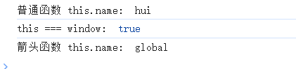

# 手撕代码

:::info
该板块包含复习和面试中的手撕代码
:::

## 1 深拷贝

（1）使用递归实现

写法 1：

```javascript
function deepCopy(obj) {
    // 对于 数组、对象和null typeof的结果都是"object"
    if (!obj || typeof obj !== "object") return;

    // 根据类型初始化数组或者对象
    let newObj = Array.isArray(obj) ? [] : {};

    for (let key in obj) {
        if (obj.hasOwnProperty(key)) {
            // 对于 数组、对象和null typeof的结果都是"object"
            newObj[key] =
                typeof obj[key] === "object" ? deepCopy(obj[key]) : obj[key];
        }
    }
    return newObj;
}

let obj = {
    a: "1",
    b: [1, 2, [3, 4]],
    c: {
        c1: "c1",
        c2: "c2",
        c3: [10, 20],
    },
};

console.log(deepCopy(obj));
```

写法 2：

```javascript
function deepClone(obj, hash = new WeakMap()) {
    if (obj === null) return null; // null是特殊的对象
    if (obj instanceof Date) return new Date(obj);
    if (obj instanceof RegExp) return new RegExp(obj);
    if (typeof obj !== "object") return obj; // 非对象直接返回
    // 处理循环引用
    if (hash.has(obj)) return hash.get(obj);

    let cloneObj = new obj.constructor(); // 创建新对象
    hash.get(obj, cloneObj); // 将原对象和新对象存入哈希表

    for (let key in obj) {
        if (obj.hasOwnProperty(key)) {
            cloneObj[key] = deepClone(obj[key], hash); // 递归拷贝
        }
    }
    return cloneObj;
}

let obj = {
    a: "1",
    b: [1, 2, [3, 4]],
    c: {
        c1: "c1",
        c2: "c2",
        c3: [10, 20],
    },
};
console.log(deepClone(obj));
const obj1 = { a: 1, b: { c: 2 }, d: new Date() };
const obj2 = deepClone(obj1);
console.log(obj2); // { a: 1, b: { c: 2 }, d: Date }
obj2.a = 10;
console.log(obj1.a); // 1
console.log(obj2.a); // 10
obj2.b.c = 20;
console.log(obj1.b.c); // 2
console.log(obj2.b.c); // 20
```

（2） JSON.stringify()

`JSON.parse(JSON.stringify(obj))`是目前比较常用的深拷贝方法之一，它的原理就是利用`JSON.stringify`将 js 对象序列化（JSON 字符串），再使用`JSON.parse`来反序列化(还原)js 对象。

这个方法可以**简单粗暴的实现深拷贝**，<big><mark>**但是还存在问题**</mark></big>，拷贝的对象中如果有函数，`undefined`，`symbol`，当使用过 `JSON.stringify()`进行处理之后，都会消失。
:::info
当时面试官就问了使用这个方法会有什么弊端，当时就没有能够答上来！！
:::

```javascript
let obj = {
    a: "1",
    b: [1, 2, [3, 4]],
    c: {
        c1: "c1",
        c2: "c2",
        c3: [10, 20],
    },
};
let newObj = JSON.parse(JSON.stringify(obj));
console.log(newObj);
```

## 2 实现 useState 函数

当时看到简历中主要是使用 react，就问了一句用过 hook 函数吗，我说用过，就让我手写一个`myUseState`函数

当时我想的就是获取一下新传入的值，然后修改一下 initialValue 的值，然后并返回，但是一直重新初始化，一直返回初始的值，面试官老师就提醒我不能在内部存储变量，应该在函数外部存储变量，当时脑子也是卡住了，死活没想出来！！
结束之后，面试官老师告诉我应该在函数外面定义一个数组和索引来保存状态。

```javascript
let state = [];
let index = 0;
const myUseState = (initialValue) => {
    // 需要编写的代码
    const currentIndex = index;
    if (state[currentIndex] === undefined) {
        state[currentIndex] = initialValue;
    }
    // 使用了闭包
    function setVal(newValue) {
        state[currentIndex] = newValue; // 更新状态
        index = 0;
    }
    index++; // 移动到下一个状态
    return [state[currentIndex], setVal];
};

// 给好的代码
const Comp = () => {
    const [a, setA] = myUseState(1);
    const [b, setB] = myUseState(2);
    console.log(a, b);
    setA(a + 1);
    setB(b + 1);
};

Comp(); // 输出1 和 2
Comp(); // 输出2 和 3
```

## 3 手写 lodash 中的 get 函数

描述：根据对象和索引路径获取对应的值

面试官老师问我有没有用过 lodash 这个库，我当时回答没有，然后就让手写一个`get`函数，第一个参数是 Obj，第二个参数是对象对应的索引路径。

面试官老师给出的测试案例：

```javascript
var object = {
    a: [
        {
            b: {
                c: 3,
            },
        },
    ],
};
get(object, "a[0].b.c"); // => 3
get(object, ["a", "0", "b", "c"]); // => 3
get(object, "a.b.c", "default"); // => default
```

:::info
当时只考虑了第一种情况，没有考虑第二种测试和第三种测试
:::

下面是面试过程中的错误代码：

```javascript
function get(obj, path) {
    if (!path) return;
    let arr = path.split(".");
    for (let i = 0; i < arr.length; i++) {
        if (arr[i].includes("[")) {
            // 面试中写成了index
            let index = arr[i].indexOf("[");
            // 这里有问题
            obj = obj[index - 1][index + 1];
        } else {
            obj = obj[arr[i]];
        }
    }
    console.log(obj[arr.length - 1]);
}
```

修正之后的代码：

```javascript
function get(obj, path) {
    if (!obj) return;
    let current = obj; // 使用临时变量保存当前访问对象
    let arr = path.split(".");
    for (let i = 0; i < arr.length; i++) {
        if (arr[i].includes("[")) {
            if (!current) return; // 安全保护
            // 面试中写成了index
            let index = arr[i].indexOf("[");
            const prop = arr[i].slice(0, index);
            const idx = arr[i].slice(index + 1, -1);

            current = current[prop]; // 先获取数组
            current = current[idx]; // 再获取数组元素
        } else {
            current = current[arr[i]];
        }
    }
    console.log(current); // 直接输出最终值
    return current;
}
```

后面再去详细看一下 lodash 中 get 函数的具体实现吧。

## 4 js 函数的 this 指向问题

_当时一紧张，连这个问题都回答错误（完全想错了）了，当时还复习了这个问题_

```javascript
var name = "global";

let OBJ = {
    name: "coderhui",
    // 当使用 OBJ.a() 这种方式调用时，this 指向调用它的对象 OBJ
    a: function () {
        console.log(this.name);
    },
    // 浏览器环境下 this指向window
    b: () => {
        console.log(this.name);
    },
};

// 输出的是hui
OBJ.a();
// 非严格模式输出的是 global
// 严格模式输出的是undefined
OBJ.b();
```

node 环境输出结果：


浏览器环境输出结果：


:::info
<big>非严格模式输出的是 `global`，严格模式输出的是 `undefined`
在浏览器中输出的就是 `global`，在 node 默认情况下输出的是 `undefined`</big>。
:::

## 5 手写 instanceof 方法

`instanceof` 运算符用于判断构造函数的 `prototype` 属性是否出现在对象的原型链中的任何位置。

实现步骤：

1. 首先获取类型的原型
2. 然后获得对象的原型
3. 然后一直循环判断对象的原型是否等于类型的原型，直到对象原型为 `null>`，因为原型链最终为 `null`

具体实现：

```javascript
/**
 * @param constructor 构造函数
 * @param instance 实例对象
 * @returns Boolean
 */
function myInstanceof(constructor, instance) {
    // 获取实例对象的原型
    let proto = Object.getPrototypeOf(instance);
    // 循环遍历原型链
    while (proto) {
        // 检查构造函数的prototype是否与实例对象的原型相等
        if (proto === constructor.prototype) {
            return true;
        }
        // 继续遍历原型链
        proto = Object.getPrototypeOf(proto);
    }
    // 如果遍历完没有找到，就返回false
    return false;
}
```

## 6 new 操作符的实现原理

new 操作符的执行过程：

1. 首先创建一个空对象
2. 设置原型，将对象的原型设置为构造函数的 `prototype` 对象。
3. 让函数的 `this` 指向这个这个对象，执行构造函数的代码（为这个新对象添加属性）
4. 判断函数的返回值类型：
    - 如果是值类型，返回创建的对象；（忽略原有返回的值）
    - 如果是引用类型，就返回这个引用类型的对象。（`new` 操作就无效了）

```javascript
function create(constructor, ...args) {
    if (typeof constructor !== "function") {
        return console.error("type error");
    }
    // 1.创建空对象
    let newObj = {};

    // 2.设置原型：将空对象的原型指向构造函数的prototype对象
    Object.setPrototypeOf(newObj, constructor.prototype);

    // 3.修改this指向，并执行构造函数
    let result = constructor.apply(newObj, args); // apply接受一个数组，并能自动展开

    // 4.判断返回值类型：如果是值类型，返回创建的对象（忽略返回的值），如果是引用类型，就返回这个引用类型。
    return result instanceof Object ? result : newObj;
}

function Person(name, age) {
    this.name = name;
    this.age = age;
}

let stu1 = create(Person, "hui", 18);
console.log("手写new操作符：", stu1);

let stu2 = new Person("shine", 20);
console.log("使用new操作符：", stu2);
```

## 7 实现 call、apply 及 bind 函数

**（1）call 函数的实现步骤**

-   判断调用对象是否为函数，即使是定义在函数的原型上的，但是可能出现使用 `call` 等方式调用的情况。
-   判断传入上下文对象是否存在，如果不存在，则设置为 window 。
-   处理传入的参数，截取第一个参数后的所有参数。
-   将函数作为上下文对象的一个属性。
-   使用上下文对象来调用这个方法，并保存返回结果。
-   删除刚才新增的属性。
-   返回结果

```javascript
Function.prototype.myCall = function (context) {
    // 1.判断调用对象是否是函数
    if (typeof this !== "function") {
        return console.error("type error");
    }

    // 2.判断context是否传入，如果为传入就设置为window
    context = context || window;

    // 3.获取参数
    // 注：这里要使用arguments 而不能使用args，args需要显示声明
    let args = [...arguments].slice(1); // 排除第一个参数this
    let result = null;

    // 4.将调用函数设为对象的方法
    context.fn = this; // 谁调用myApply this就指向谁

    // 5.使用上下文对象来调用这个方法，并保存返回的结果
    result = context.fn(...args);

    // 6.删除刚才新增的属性
    delete context.fn;

    // 7.返回结果
    return result;
};

function sayAge() {
    console.log(this.age);
    console.log(this);
}

const person = { age: 18 };
sayAge(); // 输出undefined 和 window
sayAge.myCall(person); // 输出 18 和 persopn
```

**（2）apply 函数的实现步骤**

-   判断调用对象是否为函数，即使是定义在函数的原型上的，但是可能出现使用 `call` 等方式调用的情况。
-   判断传入上下文对象是否存在，如果不存在，则设置为 window 。
-   将函数作为上下文对象的一个属性。
-   判断参数值是否传入
-   使用上下文对象来调用这个方法，并保存返回结果。
-   删除刚才新增的属性
-   返回结果

```javascript
Function.prototype.myApply = function (context) {
    // 判断调用对象是否是函数
    if (typeof this !== "function") {
        throw new TypeError("Error");
    }

    let result = null;
    // 判断context是否存在，如果未传入则为window
    context = context || window;
    // 将函数设为对象的方法
    context.fn = this; // 谁调用myApply this就指向谁

    // 调用方法
    if (arguments[1]) {
        result = context.fn(...arguments[1]); // 传入的就是一个数组
    } else {
        result = context.fn();
    }

    // 将属性删除
    delete context.fn;
    return result;
};
```

**（3）bind 函数的实现步骤**

-   判断调用对象是否为函数，即使是定义在函数的原型上的，但是可能出现使用 `call` 等方式调用的情况。
-   保存当前函数的引用，获取其余传入参数值。
-   创建一个函数返回
-   函数内部使用 apply 来绑定函数调用，需要判断函数作为构造函数的情况，这个时候需要传入当前函数的 this 给 apply 调用，其余情况都传入指定的上下文对象。

```javascript
Function.prototype.myBind = function (context) {
    // 判断调用对象是否为函数，即使是定义在原型上的，但是可能出现使用call等方式调用的情况
    if (typeof this !== "function") {
        throw new TypeError("Error");
    }

    // 获取参数
    let args = [...arguments].slice(1);
    let fn = this;

    return function Fn() {
        // 根据调用方式，传入不同的绑定值
        /**
         * ​​如果 Fn 被当作构造函数调用（new Fn()）​​，则 this 指向新创建的对象（忽略绑定的 context）。
         * 如果普通调用（如 Fn()）​​，则 this 指向绑定的 context。
         * 将 myBind 时传入的参数（args）和 Fn 调用时传入的参数（arguments）合并
         */
        return fn.apply(
            this instanceof Fn ? this : context,
            args.concat(...arguments)
        );
    };
};
```

## 8 防抖和节流的实现

### 8.1 防抖（Debounce）

**核心思想：确保在一段指定时间内，不论触发了多少次事件，只有一次能够执行。（避免事件重复触发）**

```javascript
function debounce(func, wait) {
    let timer = null;
    return function () {
        // 谁调用这个函数this就指向谁
        const context = this;
        const args = arguments; // 可能为事件参数e

        // 如果此时存在定时器的话，则取消之前的定时器重新记时
        if (timer) {
            clearTimeout(timer);
            timer = null;
        }

        // 设置定时器，使事件间隔指定事件后执行
        timer = setTimeout(() => {
            func.apply(context, args);
        }, wait);
    };
}
```

### 8.2 节流（Throttle）

**核心思想：确保函数在指定的时间间隔内最多只执行一次，不管事件触发了多少次。**

```javascript
function throttle(func, limit) {
    let curTime = Date.now();

    return function () {
        const context = this;
        const args = arguments;
        const nowTime = Date.now();

        // 如果两次时间间隔超过了指定时间，则执行函数。
        if (nowTime - curTime >= limit) {
            curTime = Date.now();
            return func.apply(context, args);
        }
    };
}
```

## 9 手写 Promise.all 方法

**核心思路：**

1. 接收一个 Promise 实例的数组或具有 Iterator 接口的对象作为参数
2. 这个方法返回一个新的 promise 对象，
3. 遍历传入的参数，用 Promise.resolve()将参数"包一层"，使其变成一个 promise 对象
4. 参数所有回调成功才是成功，返回值数组与参数顺序一致
5. 参数数组其中一个失败，则触发失败状态，第一个触发失败的 Promise 错误信息作为 Promise.all 的错误信息。

```javascript
/**
 * @param {*} promises Promise实例的数组
 * @returns 返回一个Promise对象
 */
function promiseAll(promises) {
    // 返回值是一个Promise对象
    return new Promise((resolve, reject) => {
        // 判断传入的promises是否是一个数组
        if (!Array.isArray(promises)) {
            throw new TypeError(`argument must be a array`);
        }
        // 记录成功解决的数量
        let resolvedCounter = 0;
        // 传入的数组长度
        let promiseNum = promises.length;
        let resolvedResult = new Array(promiseNum); // 使用固定长度数组更规范

        // 处理空数组的情况
        if (promiseNum === 0) {
            resolve(resolvedResult);
            return;
        }

        for (let i = 0; i < promiseNum; i++) {
            Promise.resolve(promises[i]).then(
                (value) => {
                    resolvedCounter++;
                    resolvedResult[i] = value;
                    // 全部都是reslove的状态
                    if (resolvedCounter === promiseNum) {
                        return resolve(resolvedResult);
                    }
                },
                (error) => {
                    return reject(error);
                }
            );
        }
    });
}

// test
let p1 = new Promise(function (resolve, reject) {
    setTimeout(function () {
        resolve(1);
    }, 1000);
});
let p2 = new Promise(function (resolve, reject) {
    setTimeout(function () {
        resolve(2);
    }, 2000);
});
let p3 = new Promise(function (resolve, reject) {
    setTimeout(function () {
        resolve(3);
    }, 3000);
});

promiseAll([p1, p2, p3]).then(
    (res) => {
        console.log(res);
    },
    (error) => {
        console.log(error);
    }
);
```

## 10 实现数组的扁平化

（1） 使用递归实现

通过循环递归的方式，一项一项地去遍历，如果每一项还是一个数组，那么就继续往下遍历：

```javascript
function flatten(arr) {
    let result = [];

    for (let i = 0; i < arr.length; i++) {
        if (Array.isArray(arr[i])) {
            result = result.concat(flatten(arr[i]));
        } else {
            result.push(arr[i]);
        }
    }
    return result;
}

let arr = [1, [2, [3, 4, 5]]];
console.log(flatten(arr)); // [ 1, 2, 3, 4, 5 ]
```

（2） reduce 函数迭代

```javascript
function flatten(arr) {
    return arr.reduce((prev, next) => {
        return prev.concat(Array.isArray(next) ? flatten(next) : next);
    }, []);
}

let arr = [1, [2, [3, 4, 5]]];
console.log(flatten(arr)); // [ 1, 2, 3, 4, 5 ]
```

（3） 扩展运算符实现
采用了扩展运算符和 some 的方法，两者共同使用，达到数组扁平化的目的：

```javascript
let arr = [1, [2, [3, 4]]];
function flatten(arr) {
    while (arr.some((item) => Array.isArray(item))) {
        arr = [].concat(...arr);
    }
    return arr;
}

let arr = [1, [2, [3, 4, 5]]];
console.log(flatten(arr)); // [ 1, 2, 3, 4, 5 ]
```

:::info
比如`[].concat([2,3])`，结果是`[2,3]`，concat 会展开`[2,3]`变为`2, 3`加入到`[]`中。
:::

（4） split 和 toString
可以通过 split 和 toString 两个方法来共同实现数组扁平化，由于数组会默认带一个 toString 的方法，所以可以把数组直接转换成逗号分隔的字符串，然后再用 split 方法把字符串重新转换为数组，如下面的代码所示：

```javascript
function flatten(arr) {
    return arr.toString().split(",");
}

let arr = [1, [2, [3, 4, 5]]];
console.log(flatten(arr)); // [ '1', '2', '3', '4', '5' ]
```

:::info
注：如果是数字类型会变为字符串类型。
:::

（5） ES6 中的 flat
可以直接调用 ES6 中的 flat 方法来实现数组扁平化。flat 方法的语法：arr.flat([depth])
其中 depth 是 flat 的参数，depth 是可以传递数组的展开深度（默认不填、数值是 1），即展开一层数组。如果层数不确定，参数可以传进 Infinity，代表不论多少层都要展开：

```javascript
let arr = [1, [2, [3, 4]]];
function flatten(arr) {
    return arr.flat(Infinity);
}

let arr = [1, [2, [3, 4, 5]]];
console.log(flatten(arr)); //  [1, 2, 3, 4，5]
```

（6）正则和 JSON 方法
使用 JSON.stringify 的方法先转换为字符串，然后通过正则表达式过滤掉字符串中的数组的方括号，最后再利用 JSON.parse 把它转换成数组：

```javascript
function flatten(arr) {
    let str = JSON.stringify(arr);
    str = str.replace(/(\[|\])/g, "");
    str = "[" + str + "]";
    return JSON.parse(str);
}

let arr = [1, [2, [3, 4, 5]]];
console.log(flatten(arr)); //  [1, 2, 3, 4，5]
```

## 11 实现数组去重

（1）使用 ES6 中的 Set 实现：

```javascript
const array = [1, 2, 3, 5, 1, 5, 9, 1, 2, 8];

let newArray = Array.from(new Set(array));

console.log(newArray); // [ 1, 2, 3, 5, 9, 8 ]
```

（2）使用对象 map 存储不重复的数字：

```javascript
function uniqueArray(array) {
    let map = {};
    let res = [];

    for (let i = 0; i < array.length; i++) {
        if (!map.hasOwnProperty([array[i]])) {
            map[array[i]] = 1;
            res.push(array[i]);
        }
    }
    return res;
}

const array = [1, 2, 3, 5, 1, 5, 9, 1, 2, 8];
console.log(uniqueArray(array)); // [ 1, 2, 3, 5, 9, 8 ]
```

## 12 实现数组的乱序输出

```javascript
let arr = [1, 2, 3, 4, 5, 6, 7, 8, 9, 10];

for (let i = 0; i < arr.length; i++) {
    let random = Math.random() * (arr.length - i) + i;
    console.log(random);

    const randomIndex = Math.floor(random);
    [arr[i], arr[randomIndex]] = [arr[randomIndex], arr[i]];
}
console.log(arr);
```

## 13 实现非负大整数相加

主要思路如下：

-   首先用字符串的方式来保存大数，这样数字在数学表示上就不会发生变化
-   初始化 res，temp 来保存中间的计算结果，并将两个字符串转化为数组，以便进行每一位的加法运算
-   将两个数组的对应的位进行相加，两个数相加的结果可能大于 10，所以可能要仅为，对 10 进行取余操作，将结果保存在当前位
-   判断当前位是否大于 9，也就是是否会进位，若是则将 temp 赋值为 true，因为在加法运算中，true 会自动隐式转化为 1，以便于下一次相加
-   重复上述操作，直至计算结束

```javascript
function sumBigNumber(a, b) {
    let res = "";
    let temp = 0;

    a = (a + "").split("");
    b = (b + "").split("");

    while (a.length || b.length || temp) {
        // ~x 相当于 x = -(x+1)
        // ~~x可以转为整数，如果是undefined则是0
        temp += ~~a.pop() + ~~b.pop();

        // 字符串拼接
        res = (temp % 10) + res;

        temp = temp > 9 ? 1 : 0;
    }
    // 替换掉多余的0  比如"0234"
    return res.replace(/^0+/, "") || "0"; // 处理全零情况
}
let a = 199;
let b = 234;
console.log(sumBigNumber(a, b));
```

## 14 手写订阅-发布模式

```javascript
class EventHub {
    constructor() {
        // 1.定义事件容器，用来装时间数组
        this.events = {};
    }

    /**
     * 订阅事件
     * @param {*} type 事件类型
     * @param {*} callback 事件的回调函数
     */
    subscribe(type, callback) {
        // 创建时间容器
        if (!this.events[type]) {
            this.events[type] = [];
        }

        // 存入事件
        this.events[type].push(callback);

        // 返回取消订阅的函数
        return () => this.unsubscribe(type, callback);
    }

    /**
     * 发布事件
     * @param {*} type 事件类型
     * @param {*} data 传递给订阅者的数据
     */
    publish(type, data) {
        if (!this.events[type]) {
            throw new Error("该事件未订阅");
        }

        // 发布事件
        this.events[type].forEach((callback) => {
            callback(data);
        });
    }

    /**
     * 取消订阅事件
     * @param {*} type 事件类型
     * @param {*} callback 回调函数
     */
    unsubscribe(type, callback) {
        if (!this.events[type]) {
            throw new Error("事件无效");
        }

        if (!callback) {
            // 移除事件
            delete this.events[type];
        } else {
            const index = this.events[type].filter((fn) => fn !== callback);
            if (index === -1) {
                throw new Error("无该绑定事件");
            }
            // 移除事件
            this.events[type].splice(index, 1);
            if (this.events[type].length === 0) {
                delete this.events[type];
                console.log("取消订阅成功");
            }
        }
    }
}

const eventHub = new EventHub();
let callback = (data) => {
    console.log("订阅者收到了错误信息 ——", data);
};
// 订阅事件
const unsubscribe = eventHub.subscribe("error", callback);

eventHub.publish("error", "资源加载错误");

unsubscribe();
```
