# Jenkins 自动化部署

## 1 安装 Jenkins 并访问

### 1.1 安装 java 环境

Jenkins 需要 java 的运行环境，首先需要安装 java：

```shell
sudo apt update
sudo apt install openjdk-17-jdk
```

验证安装：

```shell
java -version
# 应显示类似：openjdk version "17.x.x"
```

如果遇到 SSL 证书问题，可重新安装证书：（可选）

```shell
sudo apt-get install --reinstall ca-certificates
```

### 1.2 添加 Jenkins 官方仓库

方法 1：传统 apt-key 方式

```shell
wget -q -O - https://pkg.jenkins.io/debian/jenkins-ci.org.key | sudo apt-key add -
```

方法 2：推荐的安全方式（Debian 11+/Ubuntu 20.04+）

```shell
# 先获取公钥
curl -fsSL https://pkg.jenkins.io/debian-stable/jenkins.io.key | sudo tee /usr/share/keyrings/jenkins-keyring.asc > /dev/null

# 再配置软件源
echo "deb [signed-by=/usr/share/keyrings/jenkins-keyring.asc] https://pkg.jenkins.io/debian-stable binary/" | sudo tee /etc/apt/sources.list.d/jenkins.list > /dev/null
```

### 1.3 安装 Jenkins

```shell
sudo apt update  # 更新软件源缓存，让系统识别新添加的Jenkins源
sudo apt install jenkins  # 安装Jenkins
```

### 1.4 开放 8080 端口

首先查看防火墙状态：

```shell
sudo ufw status
```

开放 8080 端口（默认端口）：

```shell
sudo ufw allow 8080
sudo ufw reload
```

### 1.5 访问 Jenkins

1. 在浏览器访问：`http://<服务器IP>:8080`
2. 获取初始管理员密码：

```shell
# 首次进入使用下述命令查看密码：
sudo cat /var/lib/jenkins/secrets/initialAdminPassword
```

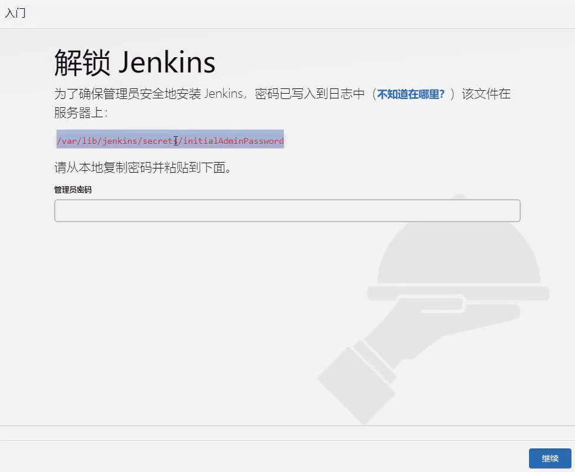

### 1.6 安装推荐的插件

先安装推荐的插件，后续再补充。

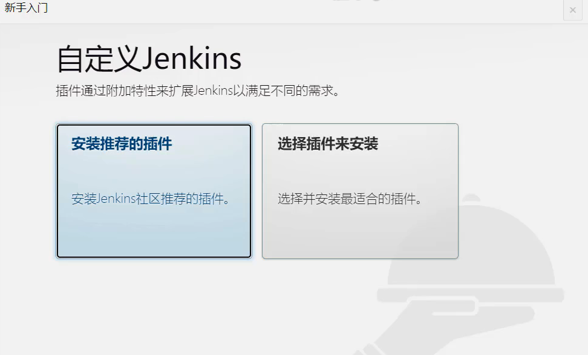

### 1.7 创建管理员用户

安装完插件之后就会提示创建第一个管理用户，我这里的管理员用户名为：`coderhui`

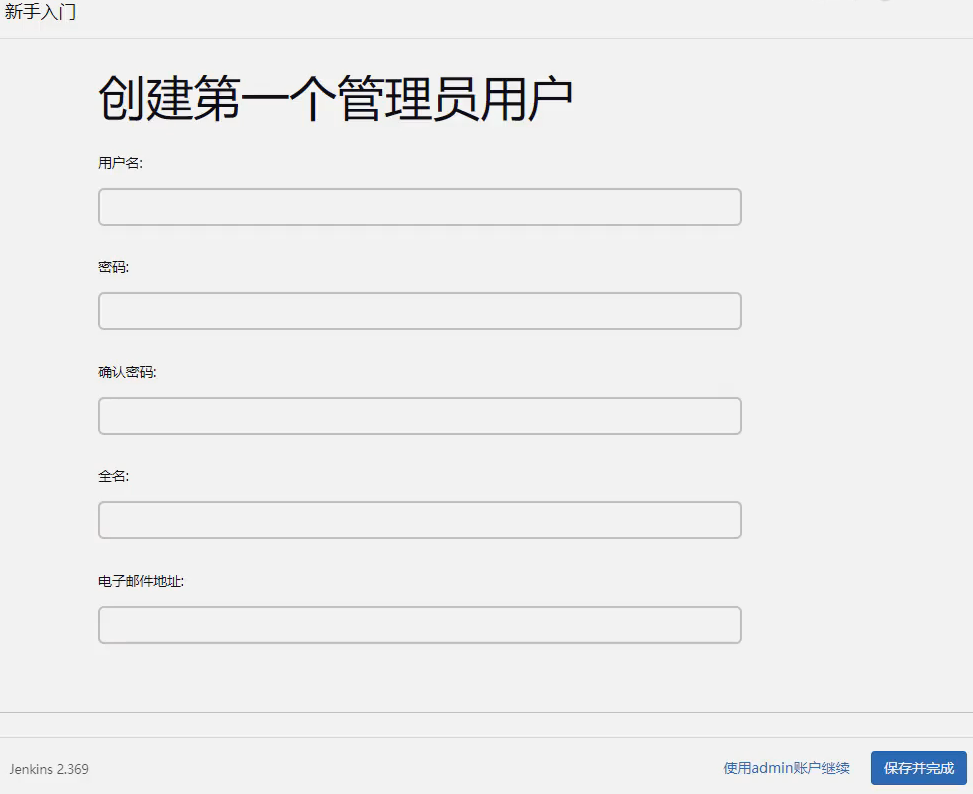

接下来就会进入到 Jenkins 主页，如下图所示：

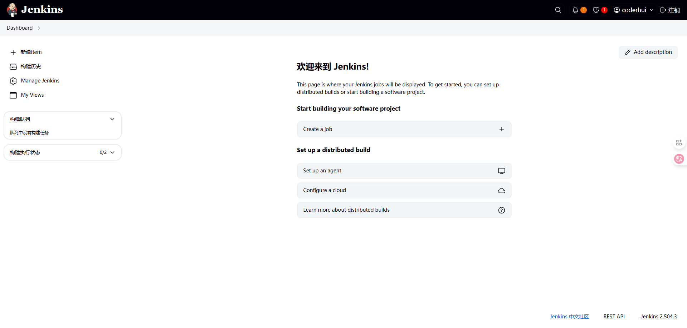

## 2 安装 git

在服务器中执行下述命令安装 git：

```shell
sudo apt-get install git
```

验证 git 是否安装成功：

```shell
git --version
# 应该输出 git version 2.43.0 类似的
```

## 3 安装插件

在主页左侧菜单栏选择“系统管理”，然后找到“插件管理”

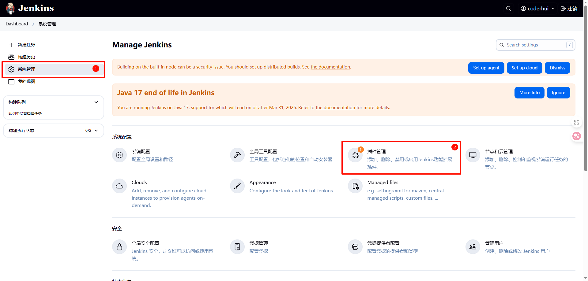

搜索 `nodejs`：

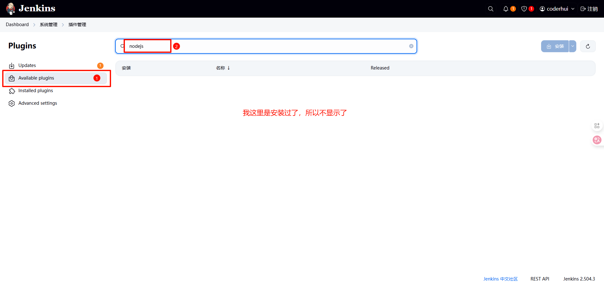

搜索 `Publish Over SSH`：

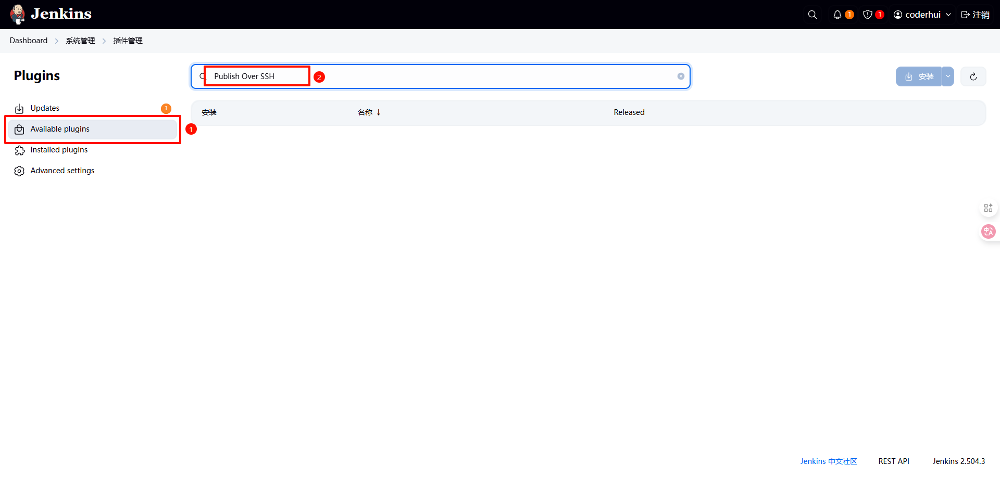

查看已经安装好的插件：

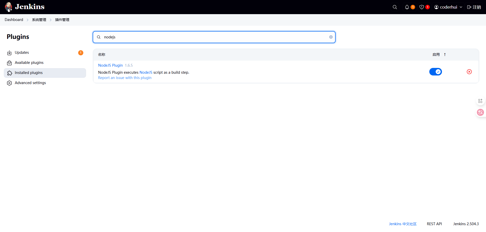

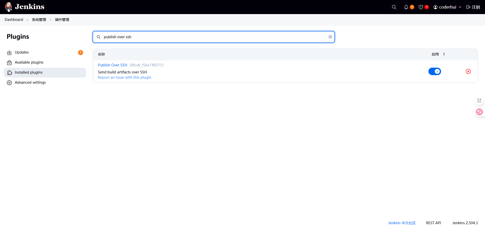

回到系统管理页面：

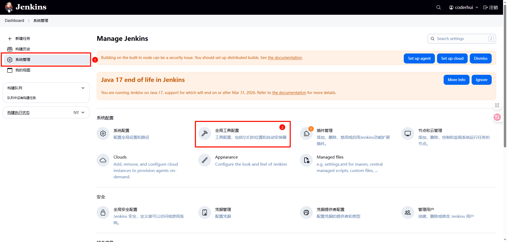

选择 nodejs 的版本进行安装即可：

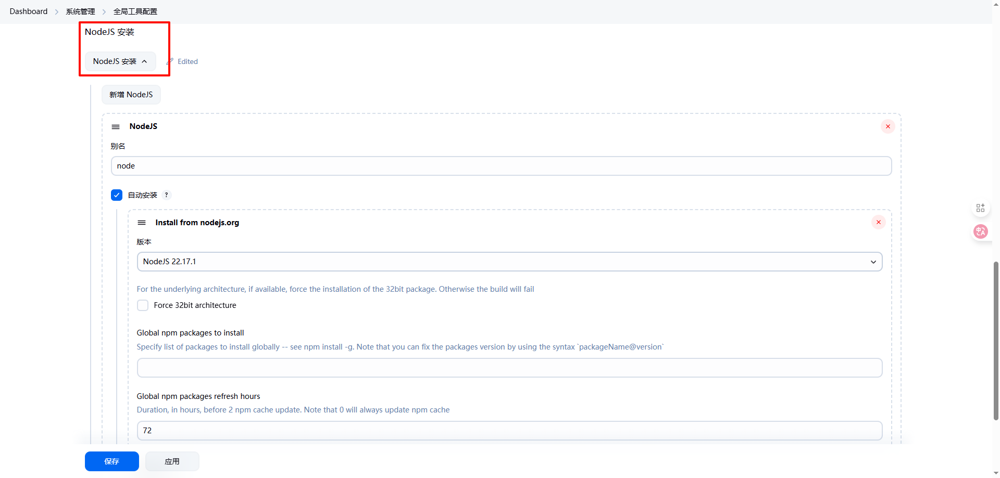

## 4 服务器生成 SSH 密钥对

在服务器中执行下述命令：

```bash
ssh-keygen -t rsa
```

按提示回车即可，默认生成在：

```bash
~/.ssh/id_rsa         ← 私钥（保密）
~/.ssh/id_rsa.pub     ← 公钥（可公开）
```

查看公钥：

```bash
cat ~/.ssh/id_rsa.pub
```

如下图所示：

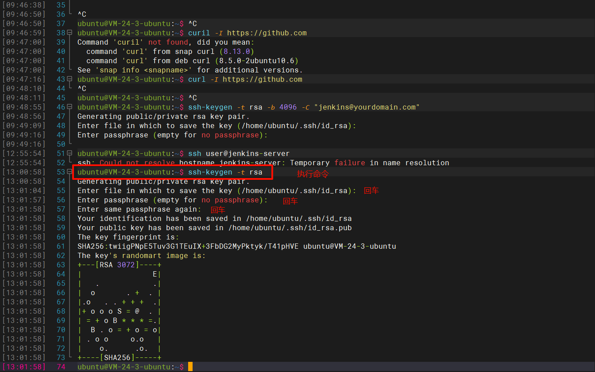

## 5 GitHub 配置 SSH key

1. 打开 github 网站
2. 点击右上角头像 → Settings
3. 选择左侧菜单 **SSH and GPG keys**
4. 点击 **New SSH key**

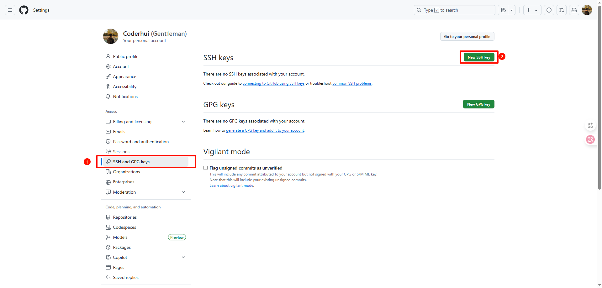

5. 填写标题如 `jenkins-server`（任意），粘贴刚才的 `id_rsa.pub` 内容

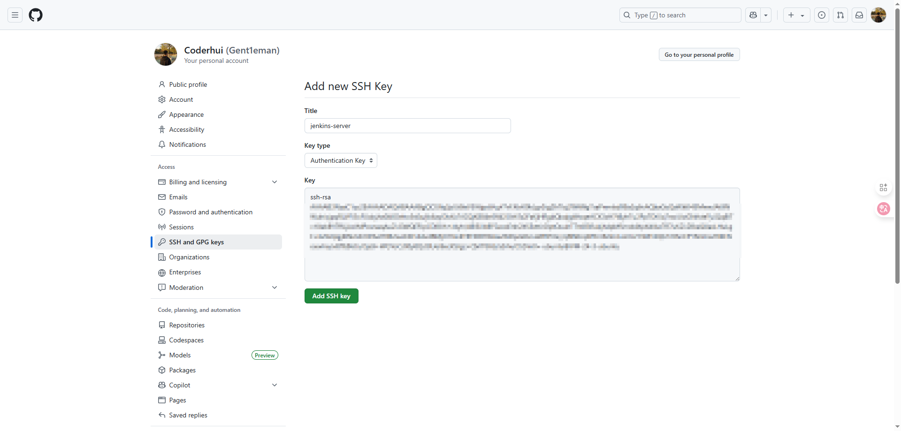

6. 保存

## 6 Jenkins 创建 item 并配置

### 6.1 创建 item

创建 job 或者 item，这里的 job 和 item 是同一个意思，功能也是一样的，我这里就选择`新建 Item`，然后 item type 的类型选择 `Freestyle project`；接下来就可以进行配置了。

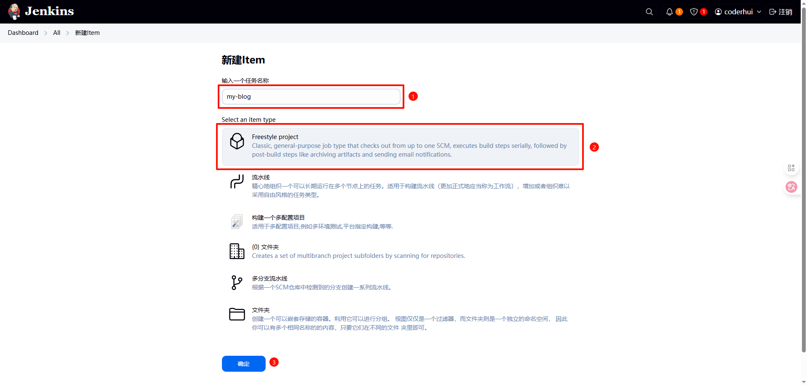

### 6.2 配置 item

1. 首先配置 “general”：


2. 配置 “源码管理”：

这里要使用 SSH 的方式访问 github 仓库，使用 https 会出问题，下面的凭证也使用 SSH，这点击“添加”就可以添加凭证

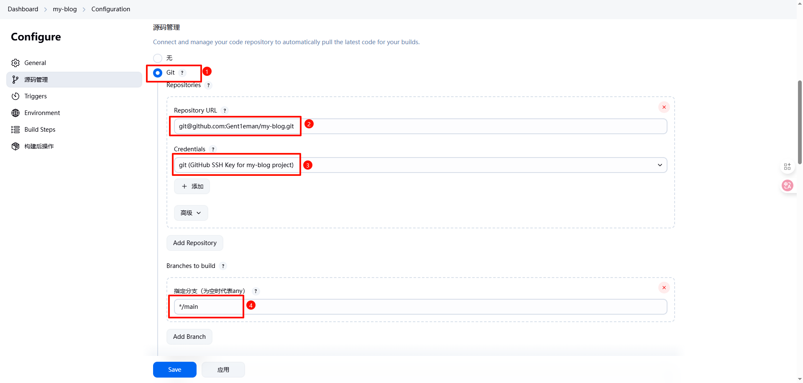

添加凭证如下图所示：


这里是私钥，图中是错误的  
在服务器中输入下述命令获得：

```bash
cat ~/.ssh/id_rsa
```

3. 配置 Triggers

我这里选择的是当 github 发生特定事件（如 push 代码，提交 PR 等）才会构建。

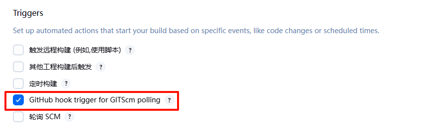

4. 配置 Environment

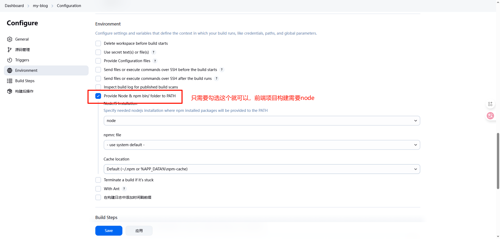

5. 配置 Build Steps

shell 命令：

```shell
pwd # 查看当前路径

node -v
npm -v

echo "🔧 Step 1: 安装依赖"
npm install

echo "🚀 Step 2: 构建项目"
npm run build

echo "📦 Step 3: 打包构建结果（Jenkins 插件将自动上传）"
tar -zcvf dist.tar.gz docs/.vitepress/dist/

echo "✅ 本地构建完成，准备上传（由 Publish Over SSH 插件执行）"
ls
```

这里其实基本上已经可以了，可以先执行一下`立即构建`，验证一下是否有问题。

### 6.3 添加 SSH server

然后在系统管理 -> 系统配置中找到 `Publish over SSH` 点击新增，再点击高级，然后选中 `Use password authentication, or use a different key`。

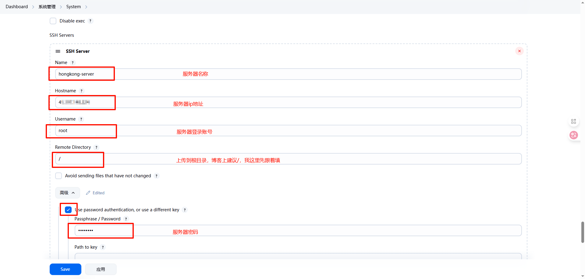

完成后可点击右下角 `Test Confirguration` 进行测试。


### 6.4 配置 item 中的构建后操作

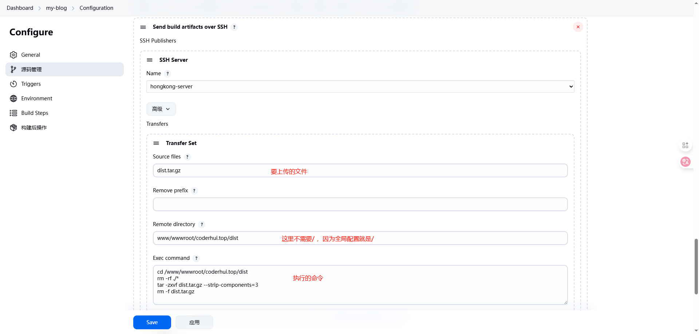

:::info
参考连接：
作者：65 岁退休 Coder  
链接：https://juejin.cn/post/7102360505313918983
:::
