# Vue3 源码解析

## 1 前置知识

### 1.1 Object.defineProperty

`Object.defineProperty()` 用于在对象上定义一个新属性，或者修改现有属性的特性。它接受三个参数：

1. **对象**：要在其上定义或修改属性的对象。
2. **属性名**：要定义或修改的属性名。
3. **描述符**：属性的特性，定义为一个对象，包含属性的各种配置，如可写性、可枚举性、可配置性等。

```javascript
const obj = {};

// 定义一个新属性
Object.defineProperty(obj, "name", {
    value: "Alice",
    get, // 读取时内部调用的函数
    set, // 写入时内部调用的函数
    writable: true, // 是否可以修改
    enumerable: true, // 是否可枚举
    configurable: true, // 是否可删除或修改特性
});

console.log(obj.name); // 输出 'Alice'

// 修改属性值
obj.name = "Bob";
console.log(obj.name); // 输出 'Bob'
```

**常见的属性特性：**

-   `value`：属性值。
-   `get`：读取时内部调用的函数
-   `set`：写入时内部调用的函数
-   `writable`：如果为 `false`，则该属性的值不能修改。
-   `enumerable`：如果为 `false`，则该属性不会出现在 `for...in` 或 `Object.keys()` 中。
-   `configurable`：如果为 `false`，则不能删除该属性，也不能再修改属性特性。

**案例：**

```javascript
// vue2响应式原理

// 定义一个商品
let quantity = 2;
let product = {
    price: 10,
    quantity: quantity,
};

// 总价格
let total = 0;

// 计算总价格的函数
let effect = () => {
    total = product.price * product.quantity;
};

// 第一次打印
effect();
console.log(`第一次总价格：${total}`);

// quantity属性具备了响应性
Object.defineProperty(product, "quantity", {
    set(newVal) {
        console.log("setter");
        quantity = newVal;
        // 触发effect
        effect();
    },
    get() {
        console.log("getter");
        return quantity;
    },
});

product.quantity = 15;
console.log(`第二次总价格：${total}`);
```

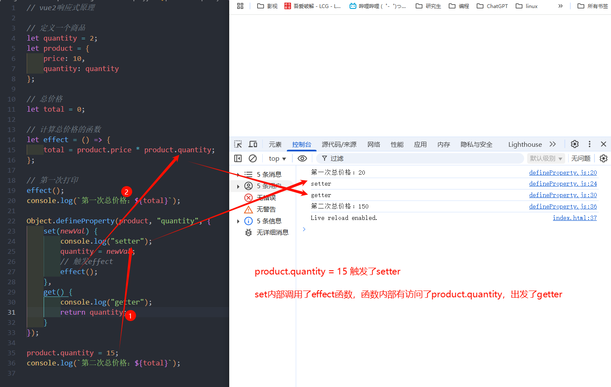

**Vue2 中实现响应式的 弊端：**

1. `Object.defineProperty` 只可以监听 **指定对象的指定属性的\*\*** \*\*`getter` 和 `setter`。
2. 被监听了 `getter` 和 `setter` 的属性，就被叫做**该属性具备了响应性。**
3. 由于 JavaScript 的限制，没有办法监听到**指定对象新增了一个属性**，所以新增的属性就没有办法通过 `Object.defineProperty` 来监听 `getter` 和 `setter`，所以**新增的属性就失去了响应性**。

### 1.2 Proxy

`Proxy` 是 JavaScript 中的一种功能强大的特性，它可以用来定义一个对象的行为，拦截对该对象的访问操作。你可以通过 `Proxy` 对象拦截和定制对目标对象的读写、函数调用、属性访问等行为。

**语法：**

`Proxy` 构造函数接收两个参数：

1. **目标对象**（target）：要代理的对象。
2. **处理器对象**（handler）：包含各种操作的拦截方法，如 `get`、`set`、`deleteProperty` 等。

**常见的拦截方法：**

-   `get(target, prop)`：拦截属性的读取。
-   `set(target, prop, value)`：拦截属性的赋值。
-   `has(target, prop)`：拦截 `in` 操作符。
-   `deleteProperty(target, prop)`：拦截 `delete` 操作符。
-   `apply(target, thisArg, argumentsList)`：拦截函数调用。
-   `construct(target, argumentsList)`：拦截对象实例化。

**案例：**

```javascript
let product = {
    price: 10,
    quantity: 2,
};
// new Proxy接受两个参数（被代理对象，handler对象）
// 生成 proxy 代理对象实例，该实例拥有《被代理对象的所有属性》，并且可以监听setter和getter
// 此时product被称为《被代理对象》，proxyProduct被称为《代理对象》
const proxyProduct = new Proxy(product, {
    // 监听proxyProduct的set方法，在proxyProduct.xx = xx 时被触发
    // 接受4个参数：被代理对象target，指定的属性名key，新值newVal，最初被调用的对象receiver
    // 返回值为一个boolean类型，true表示属性设置成功
    set(target, key, newVal, receiver) {
        console.log(target, key, newVal, receiver);
        // 为target赋新值
        target[key] = newVal;
        // 触发effect重新计算
        effect();
        return true;
    },
    // 监听proxyProduct的get方法发，在proxyProduct.xx时，辈出啊
    // 接收3个参数：被代理对象target，指定的属性名key，最初被调用的对象receiver
    // 返回值为proxyProduct.xx的结果
    get(target, key, receiver) {
        console.log(target, key, receiver);
        return target[key];
    },
});

// 总价格
let total = 0;
let effect = () => {
    total = proxyProduct.price * proxyProduct.quantity;
};

// 第一次打印
effect();
console.log(`第1次总价格：${total}`);
proxyProduct.quantity = 5;
console.log(`第2次总价格：${total}`);
```

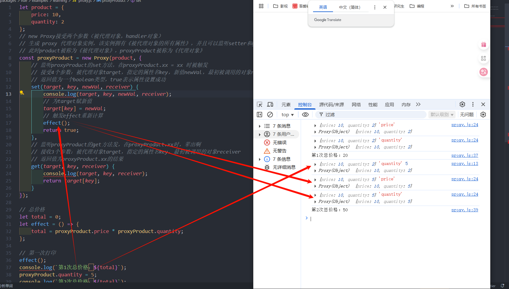

Proxy 的优势：

**Proxy 的优势：**

1. **可拦截整个对象**，无需逐个定义属性，`Proxy` 一次性拦截整个对象的所有操作，包括读取、写入、删除、判断、函数调用等。
2. **支持新增属性的拦截**，即使属性是后添加的，也能被 `get`、`set` 等拦截器捕捉，适合动态数据场景。

总结：

**总结：**

1. Proxy
    1. `Proxy` 将代理一个对象（被代理对象），得到一个新的对象（代理对象），同时拥有被代理对象中的所有属性。
    2. 当想要修改对象的指定属性时，应该使用代理对象进行修改。
    3. **代理对象**的任何一个属性都可以触发 handler（可理解为代理规则） 的 `getter` 和 `setter`。
2. Object.defineProperty
    1. `Object.defineProperty` 为**指定对象的指定属性**设置**属性描述符**。
    2. 当想要修改对象的指定属性时，可以使用原来对象进行修改。
    3. 通过属性描述符，只有**被监听**的指定属性，才可以触发 `getter` 和 `setter`。

### 1.3 Reflect

1. `Reflect.get(target, property[, receiver])`

```javascript
const obj = { name: "Alice" };
console.log(Reflect.get(obj, "name")); // 输出 'Alice'
```

2. `Reflect.set(target, property, value[, receiver])`返回 `true`表示属性设置成功，`false`表示失败

```javascript
Reflect.set(obj, "name", "Bob");
console.log(obj.name); // 输出 'Bob'
// 等同于
obj.name = "Bob";
```

3. `Reflect.has(target, property)`

```javascript
console.log(Reflect.has(obj, "name")); // true，相当于 'name' in obj
```

4. `Reflect.deleteProperty(target, property)`

```javascript
Reflect.deleteProperty(obj, "name");
console.log(obj.name); // undefined
```

5. `Reflect.ownKeys(target)`

```javascript
const user = { name: "Alice", [Symbol("id")]: 123 };
console.log(Reflect.ownKeys(user)); // 输出 ['name', Symbol(id)]
```

---

**在 Proxy 中配合使用 Reflect（推荐做法）：**

```javascript
const target = { name: "Alice" };

const proxy = new Proxy(target, {
    get(target, prop, receiver) {
        console.log(`正在读取 ${prop}`);
        return Reflect.get(target, prop, receiver); // 推荐：保持原始行为 !!!
    },
    set(target, prop, value, receiver) {
        console.log(`正在设置 ${prop} = ${value}`);
        return Reflect.set(target, prop, value, receiver); // 推荐 !!!
    },
});

proxy.name; // 输出：正在读取 name → 'Alice'
proxy.age = 20; // 输出：正在设置 age = 20
```

**总结：**

当我们期望监听代理对象的 getter 和 setter 时，**不应该使用 target[key]**，因为他在某些时刻时不可靠的（缺少了监听）。而**应该使用 Reflect**，借助他的 get 和 set 发方法发方法，使用 receiver（proxy 实例）作为 this，已达到期望的结果。

| **Reflect 方法**           | **相当于**                                        | **用途说明**            |
| -------------------------- | ------------------------------------------------- | ----------------------- |
| `Reflect.get()`            | `obj[prop]`                                       | 读取属性                |
| `Reflect.set()`            | `obj[prop] = val`                                 | 设置属性                |
| `Reflect.has()`            | `'prop' in obj`                                   | 判断属性是否存在        |
| `Reflect.deleteProperty()` | `delete obj[prop]`                                | 删除属性                |
| `Reflect.ownKeys()`        | `bject.keys()` + `Object.getOwnPropertySymbols()` | 获取所有键（含 Symbol） |

### 1.4 WeakMap

概念：

-   **弱引用**：不会影响垃圾回收机制。即：WeakMap 的 key **不再存在任何引用时**，会被直接回收。
-   **强引用**：会影响垃圾回收机制。存在强引用的对象**永远不会被回收**。

案例：

-   使用 Map：

```javascript
let obj = {
    name: "hui",
};
const map = new Map();
map.set(obj, "value");
obj = null;
console.log(map);
```

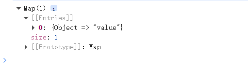

-   使用 WeakMap：

```javascript
let obj = {
    name: "hui",
};
const map = new Map();
map.set(obj, "value");
obj = null;
console.log(map);
```

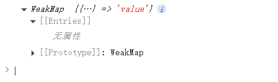

此时 WeakMap 中不存在任何的值，即：obj 不存在其他引用时，WeakMap 不会阻止垃圾回收，基于 obj 的而引用将会被清除。这就证明了 WeapMap 的弱引用性。

总结：由以上可知，对于 WeakMap 而言，它存在两个比较严重的特性：

1. key 必须是对象
2. key 是弱引用的

## 2 响应式系统

### 2.1 reactive

测试案例

```javascript
const { reactive, effect } = Vue;

// 1. 创建响应式对象
const obj = reactive({
    name: "hui",
});

// 2. effect执行过程
effect(() => {
    document.querySelector("#app").innerHTML = `<h1>${obj.name}</h1>`;
});

setTimeout(() => {
    obj.name = "幼儿园国王";
});
```

---

#### <font style="color:#FBDE28;">2.1.1 创建响应式对象</font>

当使用 reactive 创建响应式对象时，底层首先调用的是 `reactive()`，而 `reactive()` 函数内部调用的是 `createReactiveObject()` 函数。

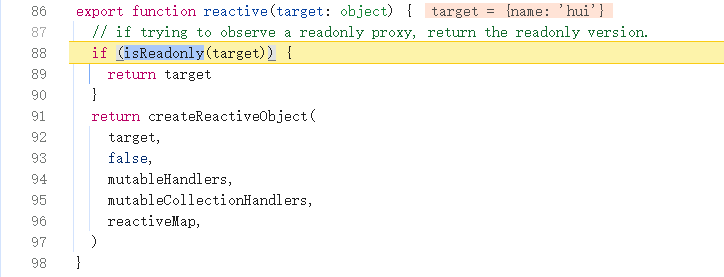

`reactive` 函数的源码比较简单，首先判断是否是一个只读的代理，如果是就直接返回，否则调用 `createReactiveObject` 函数。

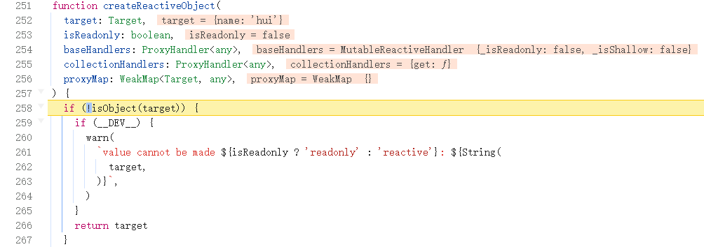

`createReactiveObject` 函数源码：

```typescript
function createReactiveObject(
    target: Target,
    isReadonly: boolean,
    baseHandlers: ProxyHandler<any>,
    collectionHandlers: ProxyHandler<any>,
    proxyMap: WeakMap<Target, any>
) {
    // * 判断是否是对象类型，不是对象类型发出警告，直接返回
    if (!isObject(target)) {
        if (__DEV__) {
            warn(
                `value cannot be made ${
                    isReadonly ? "readonly" : "reactive"
                }: ${String(target)}`
            );
        }
        return target;
    }
    // target is already a Proxy, return it.
    // exception: calling readonly() on a reactive object
    // * 如果已经是proxy，直接return回去
    if (
        target[ReactiveFlags.RAW] &&
        !(isReadonly && target[ReactiveFlags.IS_REACTIVE])
    ) {
        return target;
    }
    // target already has corresponding Proxy
    // * proxyMap已经存在了target对象的proxy对象，那么就直接返回
    const existingProxy = proxyMap.get(target);
    if (existingProxy) {
        return existingProxy;
    }
    // only specific value types can be observed.
    const targetType = getTargetType(target);
    // * 类型无效也直接返回
    if (targetType === TargetType.INVALID) {
        return target;
    }
    // * 创建target对象对应的Proxy对象，并且传入baseHandlers（就是get、set等）
    // * 什么是Collection？ Map、Set、WeakMap、WeakSet
    const proxy = new Proxy(
        target,
        targetType === TargetType.COLLECTION ? collectionHandlers : baseHandlers
    );
    // * 将target和proxy在proxyMap中存储一份
    proxyMap.set(target, proxy);
    return proxy;
}
```

`createReactiveObject` 函数内部首先判断以下几种情况：

-   判断是否是对象类型，不是对象类型发出警告，直接返回
-   判断是不是已经是 `proxy`，是 `proxy` 就直接返回（避免嵌套代理）
-   判断 `proxyMap` 是不是已经有了 `target`，有了就直接返回（确保对同一个 `target` 不会重复代理）
-   ......

以上几种情况判断完之后就会创建 `Proxy` 代理，并将 `target` 和 `proxy` 在 `proxyMap` 中存储一份。

在创建 `Proxy` 代理时，判断是否是集合类型，这里就先忽略吧，碰到了再分析。

那么就说一下 `baseHandlers` 吧，`baseHanlers` 是在调用 `createReactiveObject` 函数时传入的 `mutableHandlers`（集合那个就先忽略吧），实际上还是 new 了一个 `MutableReactiveHandler` 实例。

```typescript
export const mutableHandlers: ProxyHandler<object> =
    /*#__PURE__*/ new MutableReactiveHandler();
```

`MutableReactiveHandler` 类：这个代码里挺多的，这里就直接放个框架吧，从图中可以看出来，缺少了一个 `get 函数`，不难发现，`MutableReactiveHandler` 继承了 `BaseReactiveHandler` 类，那 `get 函数`就是在这个类中了。

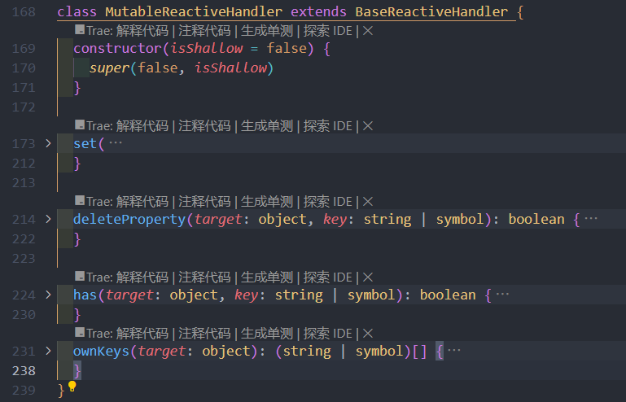

`BaseReactiveHandler` 类：

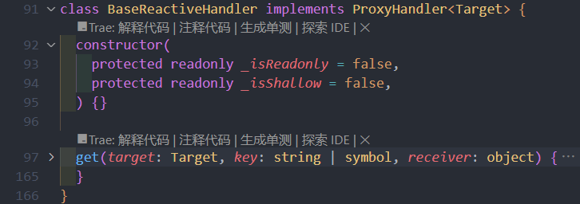

触发 `get` 和 `set` 操作见下一步骤，到这里创建响应式对象这一步骤已经结束啦！

创建 reactive 响应式对象的的过程如下图所示：

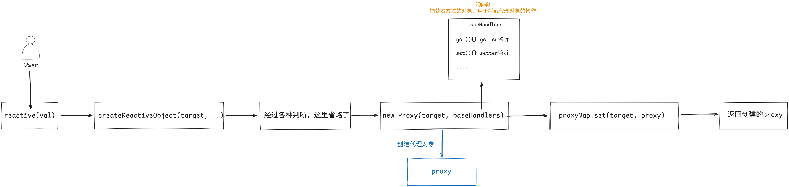

---

#### <font style="color:#FBDE28;">2.1.2 执行 effect 函数过程</font>

补充：这个手动调用的 effect 函数相当于：

1. 组件的响应式渲染：Vue 组件模板的渲染本质上是一个被 effect 包裹的副作用函数，当依赖的响应式数据变化时，会重新执行渲染。例如：`<div>{{ count }}</div>`**等同于**`effect(() => { renderTemplate(component) })`
2. computed 计算属性：计算属性的实现基于 effect，它会跟踪依赖并在依赖变化时重新计算值。例如：`computed(() => count.value * 2)`**等同于**`effect(() => { doubled.value = count.value * 2 })`
3. watch 监听器：watch 的内部使用 effect 来监听响应式数据的变化并执行回调。例如：`watch(count, (newVal) => { console.log('Count changed:', newVal); })`**等同于**`effect(() => { track(count); triggerCallbackOnChange(count) })`

:::

首先会触发内部的 `effect` 函数，（前面省略了一点）创建一个新的 `ReactiveEffect` 实例 `_effect`，并传入副作用函数 `fn`，以及调度器 `scheduler`，传入函数、空操作函数和调度器，如果传入了选项 `options`，就将其添加到 `_effect `实例上，如果没有传入选项或者没有设置 `lazy` 为 true，就立即执行副作用函数。（剩余的就等会用到再说吧！）

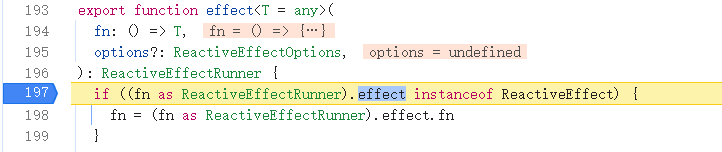

`effect` 函数源码：

```typescript
/**
 * 注册给定的函数以跟踪响应式更新。
 * 给定的函数会立即执行一次。每当在该函数中访问的任何响应式属性更新时，函数都会再次运行。
 *
 * @param fn - 用于跟踪响应式更新的函数
 * @param options - 用于控制副作用行为的选项。
 * @returns 一个运行器，可用于在创建后控制副作用。
 */
export function effect<T = any>(
    fn: () => T,
    options?: ReactiveEffectOptions
): ReactiveEffectRunner {
    // * 检查传入的 fn 是否已经是一个 ReactiveEffect的副作用函数了，如果是，则提取其内部的原始函数
    if ((fn as ReactiveEffectRunner).effect instanceof ReactiveEffect) {
        fn = (fn as ReactiveEffectRunner).effect.fn;
    }
    // * 调用一次effect函数，会根据传入的fn，创建一个新的ReactiveEffect对象：_effect
    // * 根据 fn -> _effect对象
    // * fn会变成_effect对象的fn属性
    // * _effect对象内部的scheduler就是
    // * （） => {
    // *    if(_effect.dirty){
    // *        _effect.run()
    // *    }
    // * }
    // * 那么就意味着，当内部执行scheduler的时候，它会回头调用_effect的run，而run方法内部，会调用fn
    // * 如何执行：那么之后如果想要重新执行fn函数，只需要执行scheduler就可以了

    // * 创建一个新的 ReactiveEffect 实例，传入函数、空操作函数和调度器
    const _effect = new ReactiveEffect(fn, NOOP, () => {
        // * 若副作用函数标记为脏数据，则重新运行该副作用函数
        if (_effect.dirty) {
            _effect.run();
        }
    });

    // * 如果传入了选项对象，则将选项合并到 _effect 实例上
    if (options) {
        extend(_effect, options);
        // * 若选项中指定了作用域，则记录副作用函数的作用域
        if (options.scope) recordEffectScope(_effect, options.scope);
    }

    // * 如果没有传入选项，或者选项中没有设置 lazy 为 true，则立即运行副作用函数
    if (!options || !options.lazy) {
        _effect.run();
    }

    // * 创建一个绑定到 _effect.run 方法的运行器，并将其转换为 ReactiveEffectRunner 类型
    const runner = _effect.run.bind(_effect) as ReactiveEffectRunner;
    // * 将创建的 ReactiveEffect 实例挂载到运行器的 effect 属性上
    runner.effect = _effect;
    // * 返回运行器
    return runner;
}
```

接下来进入到 `_effect` 实例的 `run` 方法（`ReactiveEffect` 类的 `run` 方法），这个脏状态对计算属性尤为重要，这里就先不说了，如果 `active` 为 false，就直接执行 `fn()` 不需要进行依赖收集，运行了 `this._runnings` 就会进行`++`操作，表示正在运行，在执行真正 `effect` 函数之前，会将上一次清除掉，然后执行 `fn()`，最后清除掉不需要的依赖，运行完之后 `this._runnings` 进行`--`操作（默认值为 0）。

实际上的副作用函数执行过程就是：（这个调度是在创建 `_effect` 实例时传入的）

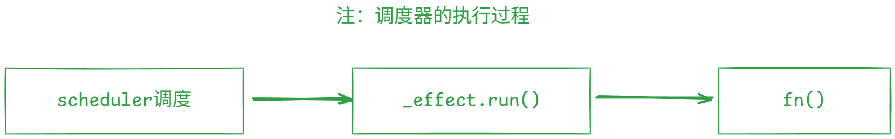

fn 函数与 \_effect 的关系如下图所示：

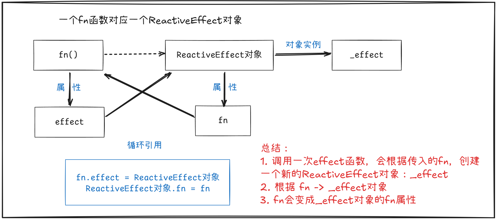

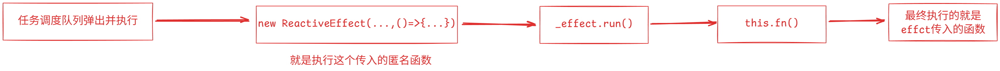

`ReactiveEffect` 类的 `run` 方法源码：（注：删除了非重点代码）

```typescript
// * 这是ReactiveEffect的run方法
run() {
    // * computed：运行过一次就变成不是脏值了（不再是脏状态）
    // * 这对于 computed尤为重要，，因为它们的值只在依赖发生时才需要重新计算
    this._dirtyLevel = DirtyLevels.NotDirty;
    // * 不是active的（active=false），直接执行即可，不需要做依赖收集
    if (!this.active) {
        return this.fn();
    }
    // 省略了代码.....................
    try {
        shouldTrack = true;
        // * 这里是将当前的reactiveEffect赋值给了activeEffect
        // * 所以全局的activeEffect就有值了，那么我们收集以来的时候就可以使用activeEffect了
        activeEffect = this; // ! 当前fn对应的reactiveEffect
        // * 记录是否在运行，运行完会--
        this._runnings++;
        // * 在执行真正的effect函数之前，先将上一次清除掉
        // * 为什么？ 因为如果我们使用v-if/else以来的是不同的数据，获取某些数据在执行后就被移除了
        preCleanupEffect(this);
        // * 执行过程会重新收集依赖
        return this.fn();
    } finally {
        // * 如果后续还有多余的不再使用的依赖，那么直接清除掉
        // * 第一次的依赖：{name,age,height,address}
        // * 第二次的依赖：{name,age}，那么height/address就需要清除掉
        postCleanupEffect(this);
        this._runnings--;
        // * 执行完操作后再赋值给activeEffect
        activeEffect = lastEffect;
        shouldTrack = lastShouldTrack;
    }
}
```

目前的执行流程如下图所示：

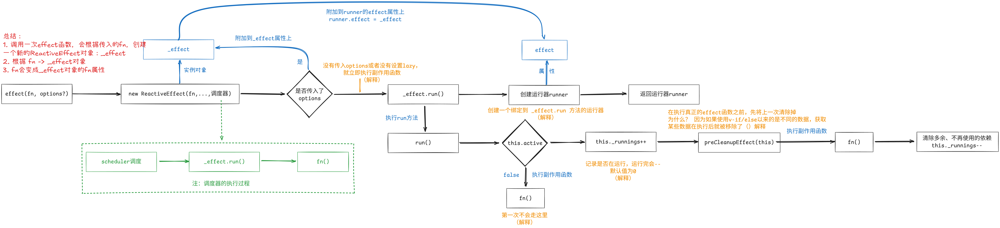

接下来，执行 `fn` 函数（也就是调用 `effect` 传入的函数），`obj.name`就要触发 `get` 行为了。首先判断是否是响应式对象、只读、浅层代理等，然后判断是不是数组类型；**从原生对象上获取结果（res="hui"），如果不是只读属性，那么就调用 **`track`** 函数进行跟踪依赖**。再进行判断是不是浅层代理、ref、对象等，最后返回结果，这个函数里面还是挺简单的。

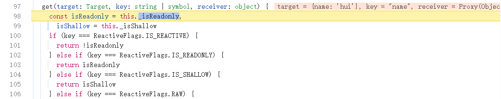

`get` 函数源码：

```typescript
get(target: Target, key: string | symbol, receiver: object) {
    const isReadonly = this._isReadonly,
        isShallow = this._isShallow;
    // * 判断key是否是响应式对象、只读、浅层响应等
    // ........
    // * 判断是否是数组类型
    // ........
    // * 直接从原生对象上获取结果，获取target对象上的key属性
   const res = Reflect.get(target, key, receiver);
   // * 如果是Symbol并且时builtInSymbols（内建符号），或者其他不可跟踪的key，那么直接返回，不收集依赖
   if (isSymbol(key) ? builtInSymbols.has(key) : isNonTrackableKeys(key)) {
       return res;
   }
   // * 不是只读属性
   if (!isReadonly) {
       // * 调用track跟踪依赖
       track(target, TrackOpTypes.GET, key);
   }
   // * 如果是isShallow，那么不进行深层代理
   if (isShallow) {
       return res;
   }
   // * 是ref，并且key是一个数字，那么返回res或者res.value
   if (isRef(res)) {
       // ref unwrapping - skip unwrap for Array + integer key.
       return targetIsArray && isIntegerKey(key) ? res : res.value;
   }
   if (isObject(res)) {
       // Convert returned value into a proxy as well. we do the isObject check
       // here to avoid invalid value warning. Also need to lazy access readonly
       // and reactive here to avoid circular dependency.
       return isReadonly ? readonly(res) : reactive(res);
   }
   return res;

```

（**重点**）接下来就进入到了 `track` 函数，函数功能（收集依赖，构建一一对应的关系）主要是构建 `targetMap`、`depsMap`、`depMap`，最后调用 `trackEffect` 函数。这里的 `activeEffect` 是全局对象，是通过 `_effect` 赋值给它的，`_effect == acitveEffect == fn`。

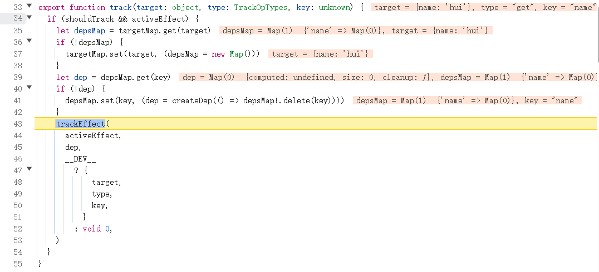

`track` 函数源码：

```typescript
export function track(target: object, type: TrackOpTypes, key: unknown) {
    // * 需要跟踪依赖，并且activeEffect是有值的（activeEffect是当前的的ReactiveEffect对象实例）
    if (shouldTrack && activeEffect) {
        // * 根据target对象取出对应的depsMap
        let depsMap = targetMap.get(target);
        // * 如果为空，那么就会创建一个新的Map，并且设置到targetMap中
        if (!depsMap) {
            targetMap.set(target, (depsMap = new Map()));
        }
        // * 根据key去获取对应的依赖，dep的本质是另外一个Map对象
        let dep = depsMap.get(key);
        // * 没有对应的依赖，那么就会添加依赖
        if (!dep) {
            // * 这里有一个细节 dep = createDep(()=>depsMap!.delete(key))
            // * 并且传入了一个清理函数，某一个key不再需要依赖响应时，调用它的clean方法就可以了
            depsMap.set(key, (dep = createDep(() => depsMap!.delete(key))));
        }
        // * 将activeEffect添加到dep中
        trackEffect(
            activeEffect,
            dep,
            __DEV__
                ? {
                      target,
                      type,
                      key,
                  }
                : void 0
        );
    }
}
```

`targetMap`、`depsMap`、`depMap`关系如下图所示：

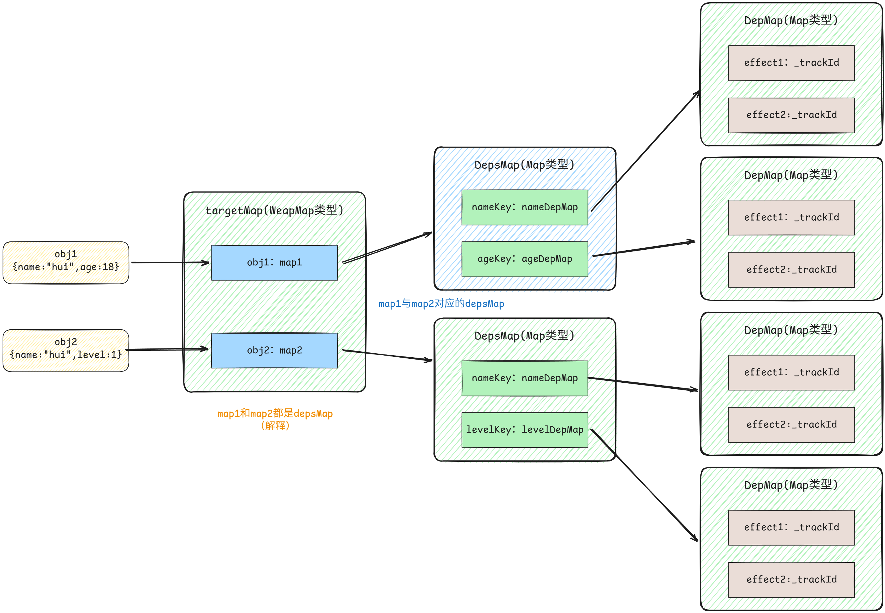

接下来就进入到了 `trackEffect` 函数了，主要就是建立起 `effect` 与 `_trackId` 的一一对应的关系，`effect` 的 `dep`是一个数组，因为可能会有多个不同的依赖。

-   `Map`（Dep）的作用：属性 → Effect 的映射
-   `effect.deps`的作用：Effect → 属性的反向记录

单向记录的缺陷：如果仅用 `Map`（属性 → `effect`），当 `effect`的依赖关系变化时（如条件分支改变），无法高效清理不再依赖的属性，可能导致内存泄漏或冗余更新。

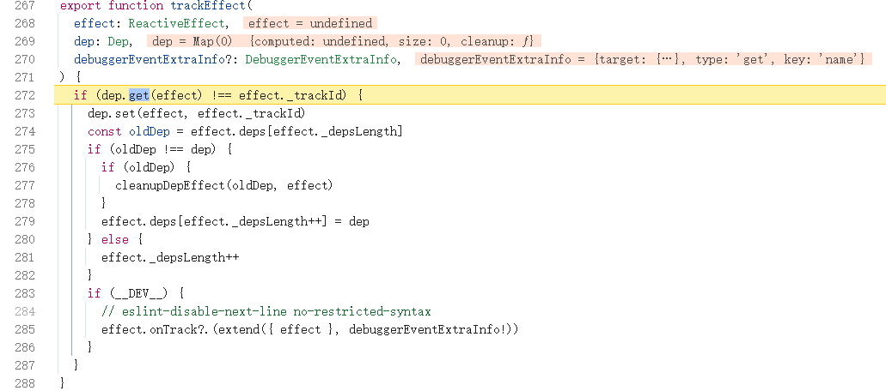

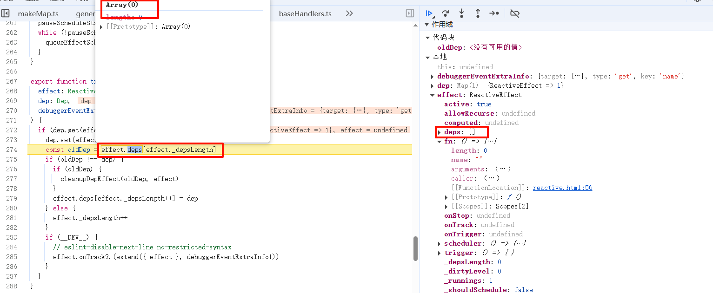

`trackEffect` 函数源码：

```typescript
export function trackEffect(
    // * 当前活跃的effect
    effect: ReactiveEffect,
    // * 当前的依赖项集合，类型为 Dep   dep:{_effect: trackId}
    dep: Dep,
    // * 调试事件的额外信息，可选参数，类型为 DebuggerEventExtraInfo
    debuggerEventExtraInfo?: DebuggerEventExtraInfo
) {
    // * 检查依赖项中记录的副作用函数的跟踪 ID 是否与当前副作用函数的跟踪 ID（_trackId） 不一致
    // * 如果相等说明已经收集了，比如{{message}}，{{message}}多次使用的插值语法的情况
    if (dep.get(effect) !== effect._trackId) {
        // * 将effect添加到dep中，并且给依赖项的effect设置_trackId
        dep.set(effect, effect._trackId);
        // * 获取当前依赖项数组的最后一个dep（这是上一次fn函数在执行时收集的dep）
        const oldDep = effect.deps[effect._depsLength];
        // * 如果数组最后一个dep不是当前dep，说明dep的依赖发生了变化
        // * 删除旧的dep，添加新的dep {name:"hui",nickname:"幼儿园国王"}
        // * 根据情况判断到底时展示name或者nickname其中之一，那么切换时，就需要切换dep
        if (oldDep !== dep) {
            if (oldDep) {
                // * 清除旧的依赖关系
                cleanupDepEffect(oldDep, effect);
            }
            // * 将当前依赖项添加到副作用函数的 deps 数组中，并将 _depsLength 加 1

            effect.deps[effect._depsLength++] = dep;
            // * 如果旧依赖项与当前依赖项相同，仅将 _depsLength 加 1
            effect._depsLength++;
        }
        // * 开发环境下，触发副作用函数的 onTrack 回调

        if (__DEV__) {
            // eslint-disable-next-line no-restricted-syntax
            effect.onTrack?.(extend({ effect }, debuggerEventExtraInfo!));
        }
    }
}
```

到目前位置，`effect` 函数的执行逻辑已经结束啦！！！还是挺复杂的。

`effect` 函数的执行流程图如下所示：


#### <font style="color:#FBDE28;">2.1.3 set 执行过程</font>

---

接下来就是紧张刺激的 `set` 执行过程了！计时器到期之后就会执行，`obj.name = "幼儿园国王"`，触发 `set` 行为。首先从 `target` 获取旧值，然后经过一系列判断（这里先省略了），通过 `Reflect.set()` 设置新值，设置成功就是返回 true，否则就是 false，再判断是否是新添加属性还是修改已有属性的值，调用 `trigger()` 。

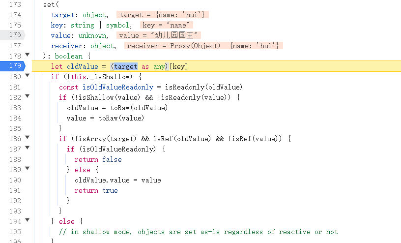

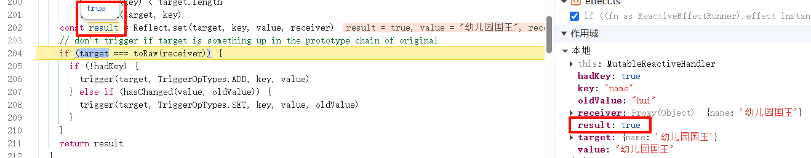

`set` 函数源码：（删除了部分代码，只关注核心）

```typescript
set(target: object, key: string | symbol, value: unknown, receiver: object): boolean {
    // * 先从target中获取旧值（为了后续判断新值和就只是否发生了变化，还有ref、只读属性的特殊情况）
    let oldValue = (target as any)[key];
    // * 判断是否是浅层响应

    // ...........(省略了浅层判断)

    // * 判断key是否已经在target中了
    const hadKey = isArray(target) && isIntegerKey(key) ? Number(key) < target.length : hasOwn(target, key);
    // * 通过Reflect.set设置新的值
    const result = Reflect.set(target, key, value, receiver);
    // don't trigger if target is something up in the prototype chain of original
    // * 如果目标对象是receiver的原始对象，那么才会进行更新
    if (target === toRaw(receiver)) {
        if (!hadKey) {
            // * 新增属性，触发ADD
            trigger(target, TriggerOpTypes.ADD, key, value);
        } else if (hasChanged(value, oldValue)) {
            // * 修改属性值，触发SET
            trigger(target, TriggerOpTypes.SET, key, value, oldValue);
        }
    }
    return result;
}
```

接下来就要进入到 `trigger` 函数了，首先就是获取 `target` 对应的 `depsMap`，不存在就直接返回，然后初始化一个 `deps` 列表（可能会有多个依赖），存放每一个要执行的 `dep`， 然后经过各种判断（这里不是重点，省略了），最后遍历 `deps` 列表，调用 `triggerEffects` 触发每一个 `dep`，这里的 `dep` 是一个 Map 类型。

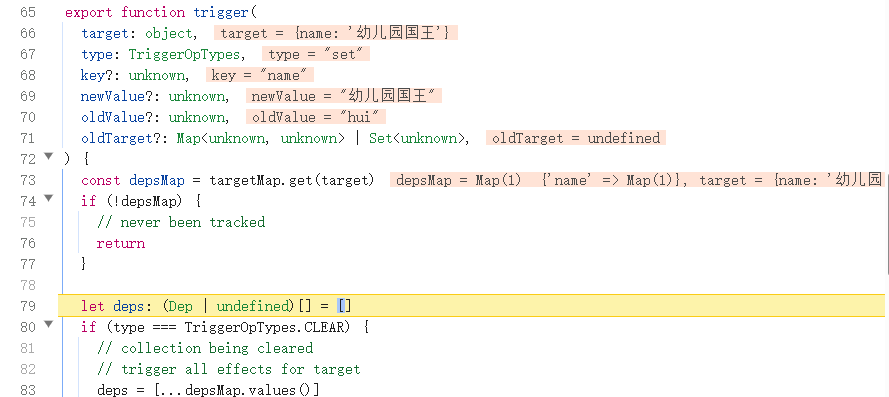

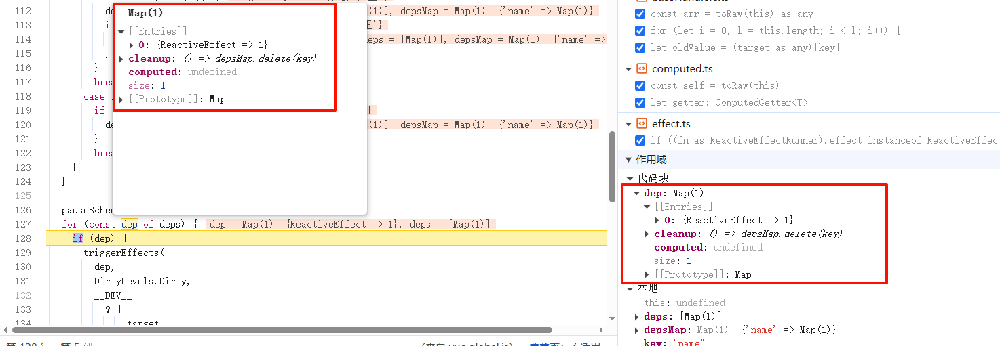

`trigger` 函数源码：

```typescript
export function trigger(
    target: object,
    type: TriggerOpTypes,
    key?: unknown,
    newValue?: unknown,
    oldValue?: unknown,
    oldTarget?: Map<unknown, unknown> | Set<unknown>
) {
    // * 获取target对应的depsMap
    const depsMap = targetMap.get(target);
    if (!depsMap) {
        // never been tracked
        // * 没有获取到直接返回
        return;
    }

    // * 初始化一个列表，用来存放需要执行的dep（有可能不是一个依赖）
    let deps: (Dep | undefined)[] = [];

    // ..........(省略了)

    // * 暂停调度
    pauseScheduling();
    // * 遍历deps，触发每个依赖的更新效果
    for (const dep of deps) {
        if (dep) {
            triggerEffects(
                dep,
                DirtyLevels.Dirty,
                __DEV__
                    ? {
                          target,
                          type,
                          key,
                          newValue,
                          oldValue,
                          oldTarget,
                      }
                    : void 0
            );
        }
    }
    // * 恢复调度
    resetScheduling();
}
```

接下来进入到了 `triggerEffects` 函数内部了，遍历 `depMap` 中的所有 `key` ，因为 `key` 对应的才是 `effect`，将其添加到任务调度队列中，遍历完之后执行恢复调度，最后从队列中弹出并执行，这里执行的函数其实就是创建 `_effect` 实例时传入的函数（流程图中有标注），然后进入到 `run` 方法，在 `run` 方法中执行 `this.fn()`，紧接着触发 `get` 行为，获取到结果值，触发页面更新，后续的逻辑和 `get` 行为一样，这里就不再阐述了。

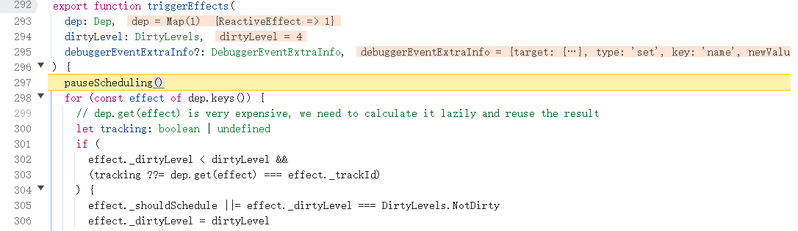

`triggerEffect` 函数源码：

```typescript
export function triggerEffects(
    dep: Dep,
    dirtyLevel: DirtyLevels,
    debuggerEventExtraInfo?: DebuggerEventExtraInfo
) {
    // * 暂停调度，防止在触发副作用函数时进行不必要的调度操作
    pauseScheduling();
    // * 遍历所有的keys，因为keys就是effect，执行它们
    for (const effect of dep.keys()) {
        // * dep.get(effect) 操作开销较大，因此延迟计算并复用结果
        let tracking: boolean | undefined;
        // * 检查副作用函数的脏数据级别是否小于传入的脏数据级别，并且确认跟踪状态
        if (
            effect._dirtyLevel < dirtyLevel &&
            (tracking ??= dep.get(effect) === effect._trackId)
        ) {
            // * 如果副作用函数的脏数据级别为 NotDirty，则标记需要调度
            effect._shouldSchedule ||=
                effect._dirtyLevel === DirtyLevels.NotDirty;
            // * 更新副作用函数的脏数据级别
            effect._dirtyLevel = dirtyLevel;
        }
        // * 检查是否需要调度，并且确认跟踪状态
        if (
            effect._shouldSchedule &&
            (tracking ??= dep.get(effect) === effect._trackId)
        ) {
            // * 开发环境下，触发副作用函数的 onTrigger 回调
            if (__DEV__) {
                // eslint-disable-next-line no-restricted-syntax
                effect.onTrigger?.(extend({ effect }, debuggerEventExtraInfo));
            }
            // * 触发副作用函数的自定义触发逻辑

            effect.trigger();
            // * 检查副作用函数是否不在运行中，或者允许递归调用，并且脏数据级别不是 MaybeDirty_ComputedSideEffect
            if (
                (!effect._runnings || effect.allowRecurse) &&
                effect._dirtyLevel !== DirtyLevels.MaybeDirty_ComputedSideEffect
            ) {
                // * 标记为不需要调度
                effect._shouldSchedule = false;
                // * 如果副作用函数有调度器，将调度器添加到队列中
                if (effect.scheduler) {
                    // * 将effect.scheduler添加到队列中
                    queueEffectSchedulers.push(effect.scheduler);
                }
            }
        }
    }
    // * 恢复调度，执行队列中的调度器
    resetScheduling();
}
```

`key` 才是 `effect`：

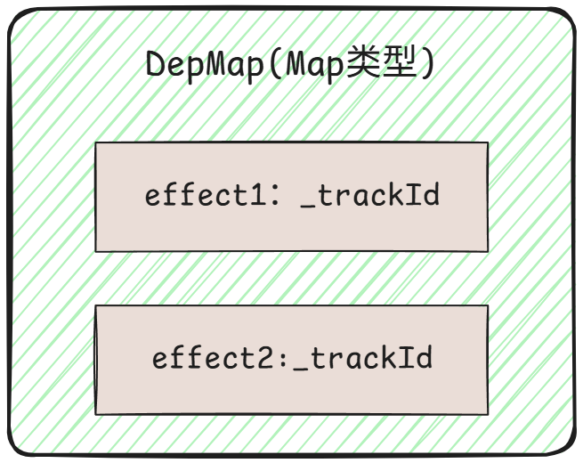

简单可以概括为一下流程：


`set` 行为的完整执行流程如下图所示：


### 2.2 ref

测试案例：

```javascript
const { ref, effect } = Vue;

const counter = ref(0);

effect(() => {
    document.querySelector("#app").innerHTML = counter.value;
});

setTimeout(() => {
    counter.value = 10;
}, 200);
```

---

#### <font style="color:#FBDE28;">2.2.1 创建 ref 响应式的过程</font>

当使用 ref 创建响应式对象时，底层首先调用的是 `ref()`，而 `ref()` 函数内部调用的是 `createRef()` 函数。

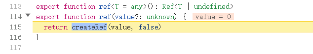

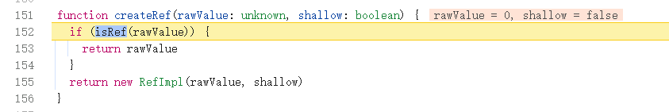

`ref` 函数源码为：

```typescript
export function ref(value?: unknown) {
    // * 本质上是去调用createRef，并且第二个参数shallow（浅的）设置为false
    return createRef(value, false);
}
```

`createRef` 函数源码为：

```typescript
function createRef(rawValue: unknown, shallow: boolean) {
    // * 判断传入是否已经是ref，如果是就直接返回
    if (isRef(rawValue)) {
        return rawValue;
    }
    // * 如果不是ref，就会创建一个RefImpl的对象
    return new RefImpl(rawValue, shallow);
}
```

在 `createRef` 函数内部，首先判断是否已经为 `ref` 了，如果已经是 `ref` 就直接返回了，没必要重复做 `ref` 操作（反而会浪费性能）；如果不是 `ref`，那么就会创建一个 `RefImpl` 的实例。

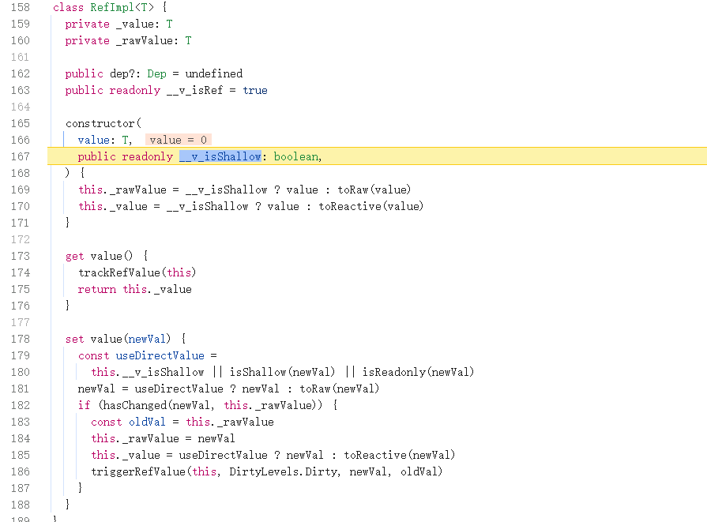

`RefImpl` 类的源码为：

```typescript
class RefImpl<T> {
    private _value: T;
    private _rawValue: T;
    // * 用于存储依赖的副作用函数，是一个Map类型
    public dep?: Dep = undefined;
    public readonly __v_isRef = true;

    constructor(value: T, public readonly __v_isShallow: boolean) {
        // * 保留原始value值在_rawValue
        this._rawValue = __v_isShallow ? value : toRaw(value);
        // * 如果value是一个对象，那么会调用toReactive，所以本质上ref（对象）实际上调用的还是reactive(对象)
        this._value = __v_isShallow ? value : toReactive(value);
    }

    // * 访问value值
    get value() {
        // * 使用这个ref的value时，就收集依赖
        trackRefValue(this);
        return this._value;
    }

    // * 设置value值
    set value(newVal) {
        // * 判断是否需要对新值进一步处理
        const useDirectValue =
            this.__v_isShallow || isShallow(newVal) || isReadonly(newVal);
        newVal = useDirectValue ? newVal : toRaw(newVal);
        // * 查看新值和旧值没有发生改变，有改变才会触发依赖（性能优化）
        if (hasChanged(newVal, this._rawValue)) {
            // * 原来的值保存到oldVal
            const oldVal = this._rawValue;
            // * _rawValue属性保存新值
            this._rawValue = newVal;
            // * 判断是否需要转化为响应式对象
            this._value = useDirectValue ? newVal : toReactive(newVal);
            // * 触发依赖更新
            triggerRefValue(this, DirtyLevels.Dirty, newVal, oldVal);
        }
    }
}
```

创建 `ref` 响应式的流程如下图所示：

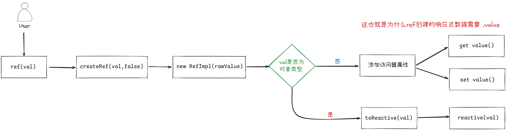

#### <font style="color:#FBDE28;">2.2.2 执行 effect 函数过程</font>

这个过程和 `reactive` 章节中的 `effect` 的过程是一样的，理解了前面的 `effect` 执行过程，这里就不需要解释了。

> 具体内容见 2.2.2 执行 effect 函数过程。

---

#### <font style="color:#FBDE28;">2.2.3 set 执行过程</font>

接下来就是定时器结束进行修改值了，就进入到了 `set` 函数了，首先获取到新值，然后判断新值与原来的值是否发生改变，如果没有发生改变就不再走下面的逻辑了（算是一种性能优化吧），如果发生了改变那么就进入到了 `triggerRefValue` 函数了。

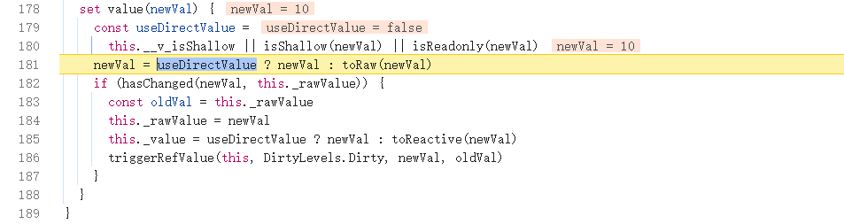

`set` 函数源码：

```typescript
set value(newVal) {
        // * 判断是否需要对新值进一步处理
        const useDirectValue = this.__v_isShallow || isShallow(newVal) || isReadonly(newVal);
        newVal = useDirectValue ? newVal : toRaw(newVal);
        // * 查看新值和旧值没有发生改变，有改变才会触发依赖（性能优化）
        if (hasChanged(newVal, this._rawValue)) {
            // * 原来的值保存到oldVal
            const oldVal = this._rawValue;
            // * _rawValue属性保存新值
            this._rawValue = newVal;
            // * 判断是否需要转化为响应式对象
            this._value = useDirectValue ? newVal : toReactive(newVal);
            // * 触发依赖更新
            triggerRefValue(this, DirtyLevels.Dirty, newVal, oldVal);
        }
    }
```

紧接着就进入到了 `triggerRefValue` 函数内部了，获取到 `ref` 对象关联的以来集合 （Map 类型），然后如果依赖集合存在，那么就触发 `triggerEffects` 函数，后续过程就和 `reactive` 的过程一样了，这里就不再叙述了。

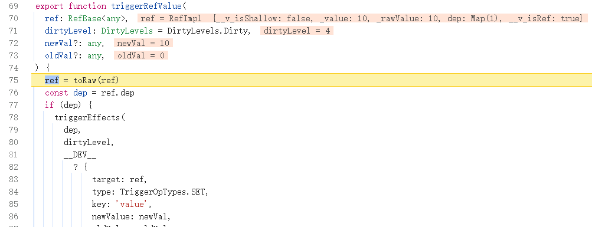

`triggerRefValue` 函数源码：

```typescript
export function triggerRefValue(
    ref: RefBase<any>,
    dirtyLevel: DirtyLevels = DirtyLevels.Dirty,
    newVal?: any,
    oldVal?: any
) {
    // * 将 ref 对象转换为其原始对象（确保后续使用的是原始对象，不是某个包装过的响应式对象），避免代理对象的干扰
    ref = toRaw(ref);
    // * 获取 ref 对象关联的依赖集合
    const dep = ref.dep;
    // * 检查依赖集合是否存在
    if (dep) {
        // * 触发依赖集合中的所有副作用函数
        triggerEffects(
            dep,
            dirtyLevel,
            // * 开发环境下提供额外的调试信息
            __DEV__
                ? {
                      target: ref, // * 触发更新的目标对象
                      type: TriggerOpTypes.SET, // * 操作类型为设置值
                      key: "value", // * 操作的键为 value
                      newValue: newVal, // * 新值
                      oldValue: oldVal, // * 旧值
                  }
                : void 0
        );
    }
}
```

`triggerEffects` 过程见章节 2.2.3 set 执行过程。

整体流程如下图所示：


### 2.3 computed

测试案例：

```javascript
const { ref, effect, computed } = Vue;

const firstName = ref("coder");
const lastName = ref("hui");

debugger;
const fullName = computed(() => {
    return firstName.value + lastName.value;
});

effect(() => {
    document.querySelector("#app").innerHTML = `<h1>${fullName.value}</h1>`;
});

setTimeout(() => {
    lastName.value = "shine";
}, 1000);
```

先说结论，`computed` 就可以看作是 `effect` 函数，都是触发 `getter`，由于计算属性只会执行一次（缓存），是因为 `dirtyLevel` 变量，只有 `dirtyLevel = 4`（标记为脏数据） 时，才会执行 `getter`，执行完之后就会变为 0（即 `dirtyLevel =0`，非脏数据），这个变量也称为脏变量。

理解了 `effect` 的执行过程就差不多理解了 `computed` 的执行过程。

```javascript
// 原：
const fullName = computed(() => {
    return firstName.value + lastName.value;
});

// 等同于
effect(() => {
    return firstName.value + lastName.value; // 但这里可能不太对，都是大概就是这个意思
});
```

#### <font style="color:#FBDE28;">2.3.1 创建 computed 计算属性的过程</font>

使用 `ref` 创建响应式数据的过程这里就不再赘述了，具体过程见 2.2.1 章节。

首先会进入到 `computed` 函数，这个函数还是挺简单的，判断传入的 `getterOrOptions` 是否是一个函数，如果时就是一个只读的计算属性（不能修改，修改值控制台会发出警告，想要修改值，要传入一个对象并且包含 `setter`），此时判断的值为 true，进入 `if` 语句，否则进入 `else` 语句，主要是给 `getter` 和 `setter` 进行赋值，接下来会创建一个 `ComputedRefImpl` 实例，并且待会儿会返回出去。

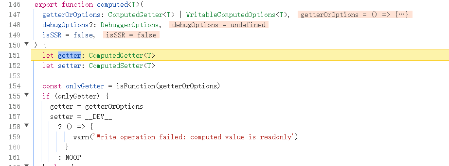

`computed` 函数源码：

```typescript
export function computed<T>(
    getterOrOptions: ComputedGetter<T> | WritableComputedOptions<T>,
    debugOptions?: DebuggerOptions,
    isSSR = false
) {
    let getter: ComputedGetter<T>;
    let setter: ComputedSetter<T>;

    // * 判断传入的getterOrOptions是否是一个函数，如果是就是一个只读的计算属性，接下来会进入if分支
    // * 例如 getterOrOptions 的值为 () => { return firstName.value + lastName.value }
    const onlyGetter = isFunction(getterOrOptions);
    if (onlyGetter) {
        // * 只有 getter 并且是一个函数
        // * 直接getterOrOptions赋值给getter即可
        getter = getterOrOptions;
        // * 这里的setter行为可以理解为空函数，调用时会发出警告
        setter = __DEV__
            ? () => {
                  warn("Write operation failed: computed value is readonly");
              }
            : NOOP;
    } else {
        // * 有 getter 也有 setter
        // * 直接将 getterOrOptions.get 赋值给 getter
        // * 直接将 getterOrOptions.set 赋值给 setter
        getter = getterOrOptions.get;
        setter = getterOrOptions.set;
    }

    // * 创建一个ComputedRefImpl对象，并且待会儿会返回出去
    const cRef = new ComputedRefImpl(
        getter,
        setter,
        onlyGetter || !setter,
        isSSR
    );
    // * dev环境
    if (__DEV__ && debugOptions && !isSSR) {
        cRef.effect.onTrack = debugOptions.onTrack;
        cRef.effect.onTrigger = debugOptions.onTrigger;
    }
    // * 返回computed属性
    return cRef as any;
}
```

接下来进入到`ComputedRefImpl` 类的构造函数内部，在当前实例上添加 `effect `属性，通过 `new ReactiveEffect`，会传入两个匿名函数，然后`this.effect`记录`computed`属性，`this.effect` 记录 `active`，在非 SSR 环境下是 true，是有缓存的，并且记录该属性是不是为只读；这部分就不放源码了。

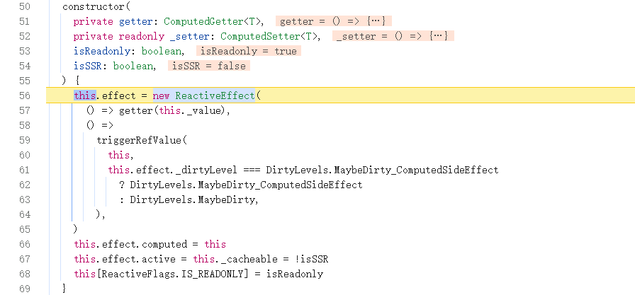

创建计算属性这部分流程已经结束了，这部分还是挺简单的，流程如下图所示：

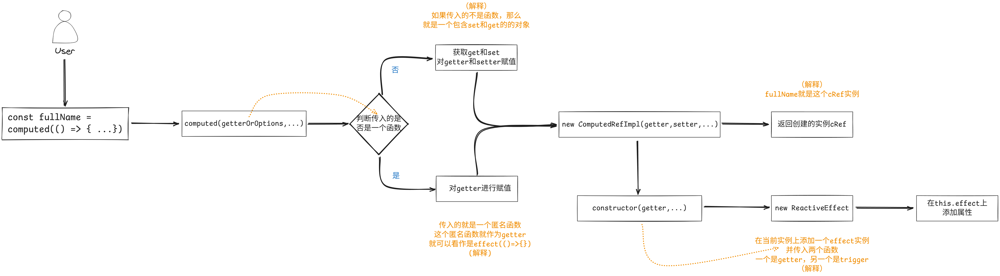

#### <font style="color:#FBDE28;">2.3.2 effect 的执行过程</font>

直接放流程图吧，确实挺复杂的，不仅要收集 `ref` 的依赖，也要收集 `computed` 的依赖。


#### <font style="color:#FBDE28;">2.3.3 set 执行过程</font>

这里的 `set` 执行过程就是 `ref` 的 `set` 的执行过程，但可能就是有两层依赖，`ref` 对应的依赖，`effect` 对应的依赖。

具体的过程见章节 2.2.3 set 执行过程。

**<font style="color:#FBDE28;">总结：</font>**

**收集阶段：**

-   渲染 `effect` 依赖了 `computed`。
-   `computed` 的副作用函数依赖了 `ref`。

**触发阶段：**

-   修改 `ref` → 触发 `computed` 的 `effect` 标记 dirty。
-   渲染 `effect` 被调度执行 → 再访问 `computed` → 触发 `getter` → 间接重新依赖 `ref`。

简单过程如下图所示：

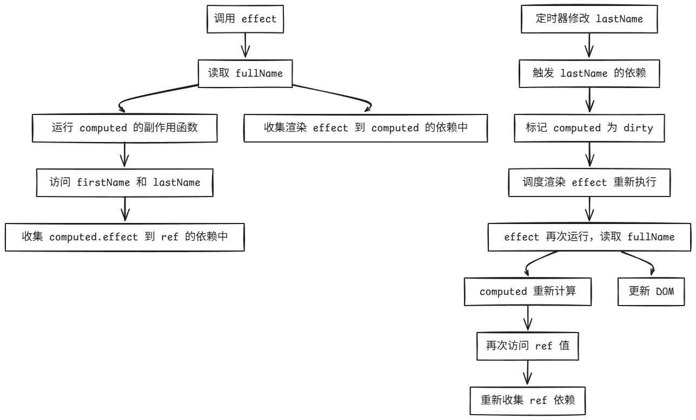

### 2.4 watch

测试案例：

```javascript
const { watch, ref } = Vue;

const name = ref("hui")

// source:
// 类型1 ： 一个函数，返回一个值
// 类型2 ： ref
// 类型3 ： reactive 对象
// 类型4 ： 以上类型组成的的
watch(name, () => {
    console.log(`我的名字是：${name.value}`);
}

setTimeout(() => {
    name.value = "幼儿园国王";
}, 2000);
```

#### <font style="color:#FBDE28;">2.4.1 创建响应式变量</font>

这个过程就不再说明了，用的就是前面的过程。

#### 2.4.2 watch 执行过程

首先会调用 `watch` 函数，但是 `watch` 内部又调用了 `doWatch` 函数，主要逻辑还是在 `doWatch` 内部，这个 doWatch 的源码太长了这里也不放了，可以去`packages\runtime-core\src\apiWatch.ts` 文件查看。

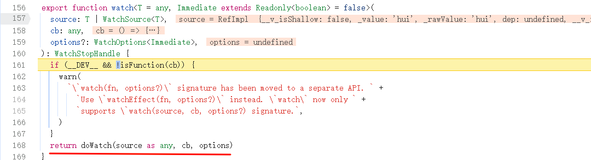

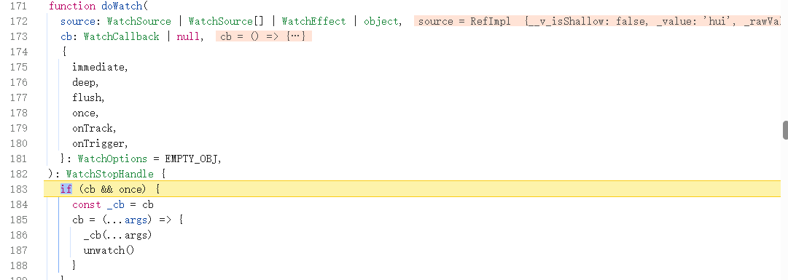

`watch` 执行过程：


图中省略了 `effect.run()` 的过程，这个过程可以看 2.1.2 执行 effect 函数过程。紫色箭头是 `watchEffect` 执行过程。

#### <font style="color:#FBDE28;">2.4.3 监听值的变化</font>

它的工作流程还是在 `job` 函数内部，通过 `effect.run()`获取到新值，这个也不再说了，后面有时间了再来详细说明。

### 2.5 watchEffect

他只传入一个 `source`，而不是 `cb`（`watch(source,cb,options)`），他这个 `source` 是一个函数类型的，他和 `watch` 底层都是调用了 `doWatch`，过程和上面一样，只不过走的 if 语句不同，见上面流程图。

:::info
注：watchEffect 是立即执行的，watch 默认情况下不会默认执行，触发设置 immediate 属性。

:::

**<font style="color:#FBDE28;">总结：</font>**

执行 `effect.run()`就只在执行传入的 fn 函数，比如 `computed(()=>{...})`、`watchEffect(()=>{...})`、`effect(()=>{...})`。
