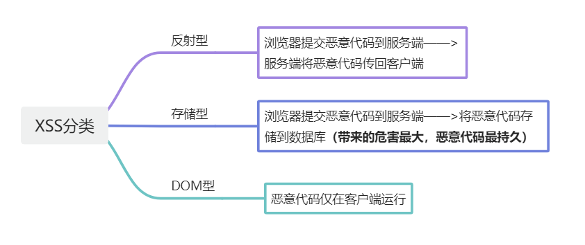
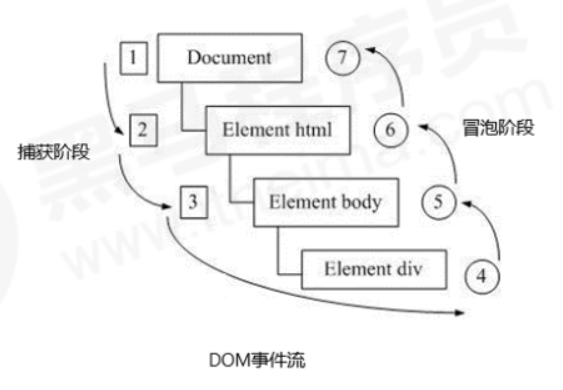
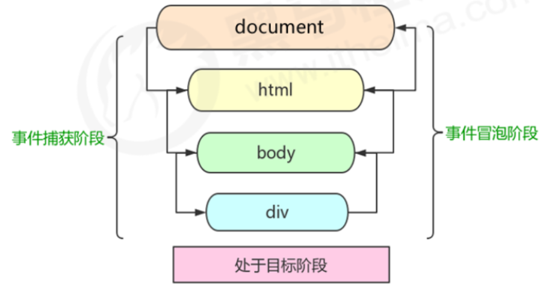
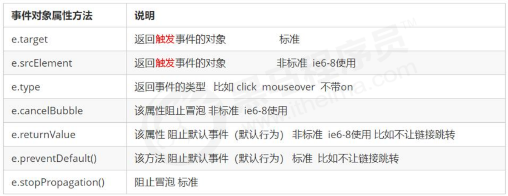

# 浏览器篇

## localStorage 和 sessionStorage 之间的区别

它们都是 Web 存储，用来在浏览器中保存数据，让我们可以在页面刷新后仍然访问这些数据。

1. **存储范围**：
    - `localStorage`是持久化的，它保存的数据没有时间限制，即使关闭浏览器窗口，数据依然存在，直到主动删除。
    - `sessionStorage`是会话级的，数据只在当前会话下有效。也就是说，关闭浏览器窗口或者标签页，数据就会被清除。
2. **存储容量**：
    - 它们都能存储大约 5MB 的数据，不过具体容量可能会因浏览器而异。
3. **适用场景**：
    - 如果想保存一些长期需要的数据，比如用户的设置偏好，那就用`localstorage`
    - 如果数据只是临时需要，比如在一个会话中的用户输入信息，那就用`sessionStorage`
4. **访问限制**：
    - 由于`sessionStorage`是会话级的，所以它在不同的标签页或窗口中是独立的。也就是说，同一个网站在不同的标签页打开，它们的`sessionStorage`是互不干扰的。
    - 而`localstorage`在同一个域名下是共享的，所有标签页和窗口都能访问。
5. **安全性**：
    - 于数据存储在客户端，因此不应在`localstorage`或`sessionstorage`中存储敏感信息，因为它们容易被 XSS 攻击。
6. **与 Cookies 的比较**：
    - 与`Cookies`相比，，`localstorage`和`sessionstorage`提供了更大的存储空间，并且数据只在客户端存储，不会随着请求发送到服务器。

总的来说，选择`localstorage`还是是`sessionStorage`就看你要存的数据是长期还是临时的，以及是否需要跨会话共享了。

## 什么是 XSS 攻击，如何防范？

**XSS 攻击**，全称是跨站脚本攻击（Cross-Site Scripting），它是一种注入攻击，攻击者会在网页中注入恶意脚本，然后其他用户在访问这个网页时，恶意脚本就会在用户的浏览器上执行，可能会盗取用户数据，或者冒充用户进行恶意操作。

主要是通过 url 参数注入 和 输入框注入，一切可以**输入的方式**都是不安全的。

**攻击过程**：先注入，在执行。

:::info
例如，用户输入`<script>alert('XSS');</script>`，如果直接输出到页面，浏览器会弹出一个警告框，这只是一个简单的示例，实际中可能会导致更严重的后果，比如窃取用户的 Cookie、劫持用户会话等。

:::

**XSS 的攻击类型：**

1. **反射型**：

-   浏览器提交恶意代码到服务端——>服务端将恶意代码传回客户端（反射型：服务端返回的代码中包含恶意代码；而 DOM 型：服务器返回的代码是正常的）
-   恶意代码 通过 客户端 ——> 服务端 ——> 客户端

2. **存储型**：

-   浏览器提交恶意代码到服务端——>将恶意代码存储到数据库**（带来的危害最大，恶意代码最持久）**

3. **DOM 型**：

-   恶意代码仅在客户端运行；恶意代码一直存在于客户端



**要防范 XSS 攻击，**主要可以从下面几个方面入手：

1. 数据清洗：对用户输入进行过滤，特别是一些特殊字符，比如`<`、`>`、`&`、`"`、`'`、`/`、`=`等，确保这些字符被正确转义。
2. 内容安全策略（CSP）：设置 HTTP 头部的 Content-Security-Policy，它可以限制网页能加载或执行的资源，从而减少 XSS 攻击的风险。
3. 使用安全的 APl：比如在 JavaScript 中，使用`textContent`而不是`innerHTML`来设置元素内容，因为`textContent` 不会解析 HTML 标签。
4. 编码输出：在输出内容到页面之前，对可能的危险字符进行编码，比如将`<`转换为`<`。
5. 使用 HTTP Only Cookies：这样可以通过设置`cookie`的`httpOnly`属性，使得 JavaScript 脚本无法访问`cookie`，减少了 XSS 攻击的风险。
6. 输入验证：对所有从外部获取的数据进行验证，确保它们符合预期的格式。
7. 定期更新和打补丁：保持 Web 应用的框架和库是最新的，以利用最新的安全修复。

总的来说，XSS 攻击主要是通过恶意脚本在用户浏览器上执行造成的，所以关键是要对用户输入进行严格的过滤和转义，同时采取一些额外的安全措施来预防攻击。

## 什么是 CSRF 攻击，如何防范？

**CSRF**，也就是跨站请求伪造（Cross-SiteRequestForgery），这种攻击的意思是攻击者诱导用户去触发一个他们原本无意去执行的操作。比如，用户在没有意识到的情况下，通过点击链接或者提交表单，对一个网站执行非预期的恶意请求。

攻击者利用的是网站对用户浏览器的信任。因为用户已经登录了目标网站，所以浏览器会有有效的会话 cookie。

**CSRF 攻击场景：**

1. 邮件诱导点击：攻击者发送带有恶意链接的邮件，如 `https://bank.example.com/transfer?to=attacker&amount=1000`。用户点击后，银行网站会误认为是用户本人操作，执行转账。
2. 隐藏表单自动提交：攻击者在网页中嵌入隐藏表单，并用 JavaScript 自动提交，如：

```html
<form action="https://bank.example.com/transfer" method="POST">
    <input type="hidden" name="to" value="attacker" />
    <input type="hidden" name="amount" value="1000" />
</form>
<script>
    document.forms[0].submit();
</script>
```

3. 利用  标签触发请求：攻击者在网页中插入 `` 标签，如：

```html

```

4. 第三方网站或广告注入：攻击者在第三方网站或广告中嵌入恶意脚本

**要防范 CSRF 攻击，**可以这么做：

1. 使用验证码：在敏感操作中加入验证码，确保操作是用户主动执行的。
2. 同源策略：确保只有来自相同源的请求才能被接受。
3. Referer 检查：服务器检查 HTTP 请求的 Referer 头部，以确保请求是从同一个网站发起的。
4. 令牌验证：在表单中加入一个隐藏的令牌字段，这个令牌是用户与服务器之间共享的秘密，每次请求都会变化。
5. 使用安全首部：设置一些 HTTP 首部，比如`SameSite`属性，它可以阻止浏览器在跨站请求中发送 cookie.
6. 内容安全策略：通过设置内容安全策略（CSP），限制可以执行的资源，减少攻击面。
7. 状态检查：对敏感操作增加额外的状态检查，比如二次确认。
8. 使用 POST 而非 GET：因为 GET 请求容易被伪造，敏感操作应该使用 POST 请求。

总的来说，CSRF 攻击就是攻击者利用用户的登录状态，让浏览器替他们发送恶意请求。防范 CSRF 攻击的关键是验证请求的来源，确保操作是用户自愿发起的。

## 什么是回流和重绘

在浏览器中，当我们对 DOM 进行操作时，可能会引起两个过程：回流（Reflow）和重绘（Repaint）。

**概念：**

-   回流是指浏览器为了计算元素的位置和大小而重新构建布局树的过程。
-   重绘是指浏览器更新元素的视觉表现而不改变其位置和大小的过程。

回流：也称为重排，是指页面中的元素位置、尺寸发生变化，浏览器需要重新计算元素的几何属性，然后重新排列元素。回流是一个相对昂贵的操作，因为它需要浏览器做大量的计算。

重绘：则是指当元素外观改变，比如颜色、阴影、边框样式等，但布局没有变化时，浏览器需要重新绘制元素。重绘通常比回流要快，因为它不涉及布局的计算。

简单来说，回流一定会引发重绘，但重绘不一定会引发回流。


**那么，如何减少回流和重绘呢？**

1. 避免频繁操作 DOM：一次性修改多个元素的属性，而不是一个一个地改。
2. 使用 transform 和 opacity 进行动画：这些属性的动画只会触发重绘，不会引发回流。
3. 使用 will-change 属性：告诉浏览器哪些元素需要被优化。
4. 使用文档片段（DocumentFragment）：在操作大量 DOM 元素时，可以先在一个容器内操作，然后一次性添加到文档中。
5. 避免使用 table 布局：因为 table 的一个小小变化就可能引起整个表格的回流。
6. 合理使用 display：none：隐藏元素时，使用`display：none`而不是`visibility：hidden`，因为后者只影响视觉但不会影响布局。

## 什么是浏览器的同源策略

**啥叫同源呢？**

如果两个页面的协议、域名和端口都相同，我们就说它们是同源的。比如，`http://example.com/app1`和`http://example.com/app2` 就是同源的。

同源策略是浏览器的一种安全机制，用于限制不同源之间的交互，以防止恶意文档窃取数据或进行跨站脚本攻击（XSS）。

**为啥要有同源策略**

主要是为了防止恶意文档窃取数据。如果没有这个策略，一个恶意网站就可以读取另一个网站的敏感数据，比如登录状态、个人信息等。

**同源策略限制了啥？**

它主要限制了以下行为：

1. 脚本访问：不同源的脚本不能读取或修改对方文档的 DOM。
2. AJAX 请求：不能向不同源的服务器发送 AJAX 请求。
3. Cookie/Session：不能获取不同源的 Cookie 或 Session 信息。

**同源策略的限制：**

无法读取跨域的 Cookie、LocalStorage 和 IndexedDB，无法获取或操作跨域资源的 DOM，以及无法发送跨域的 AJAX 请求。

**那怎么绕过同源策略呢？**

虽然同源策略限制了很多操作，但我们还是有办法进行不同源之间的通信，比如：

1. cORS：跨源资源共享（`Cross-Origin Resource Sharing`），服务器可以通过设置特定的 HTTP 头部来允许其他源的请求。
2. JSONP：通过`<script>`标签获取不同源的 JSON 数据。
3. WebSockets：WebSockets 连接可以建立在不同源之间。
4. 代理服务器：通过同源的服务器作为中介，实现不同源之间的通信。

## 如何解决跨域问题

跨域问题主要是因为浏览器的同源策略导致的，它阻止一个域的脚本对另一个域的资源进行操作。但是，我们有几个方法可以解决这个问题：

1. CORS：跨源资源共享（Cross-OriginResourceSharing）是最常用的方法。服务器端设置一些特殊的 HTTP 头部，比如`Access-Control-Allow-Origin`，允许来自不同源的请求。
    - **场景**：现代浏览器推荐的解决方案，支持所有类型的 HTTP 请求，但需要服务器配置
2. JSONP：通过动态添加`<script>`标签来绕过同源策略。
    - 服务器响应不是返回 JSON，而是返回一段包含回调函数的脚本。这种方法只支持 GET 请求。
    - **场景**： JSONP 适用于简单场景，但安全性较低
3. 代理服务器：在前端和后端之间加一个代理，前端请求同源的代理服务器，然后由代理服务器去请求实际的后端服务，再将结果返回给前端。
    - **场景**：解决复杂的跨域问题，但可能增加服务器负担，且配置不当可能引入安全风险
4. WebSockets：WebSockets 协议不遵循同源策略，因此可以通过它来实现跨域通信。
    - 基于 TCP 连接的全双工通信协议，可以建立连接后进行不受同源策略限制的通信
    - **场景**：适用于需要实时通信的场景
5. PostMessage：HTML5 引入的`postMessage`方法，允许来自不同源的页面间进行数据传递。
    - **场景**：通过了一种安全的方式来实现不同源之间的消息传递
6. Document.domain：这种方法主要用于有相同主域但不同子域的情况，比如`sub1.example.com`和`sub2.example.com`，可以通过设置`document.domain` 为`example.com`采来实现相互访问。

:::info
实践经验：如果可能，分享一些在实际开发中遇到的跨域问题以及你是如何解决这些问题的。

:::

## 浏览器页面渲染过程

当浏览器开始加载一个网页，它会经历几个主要步骤来渲染页面：

1. 解析 HTML：浏览器首先解析 HTML 文档，构建 DOM 树。这个过程中，它会碰到链接的脚本、样式表和图片，这些可能会被并行加载，以提高性能。
2. 构建 CSSOM 树：浏览器解析 CSS（包括外部样式表和样式元素），构建 CSSOM（CSS 对象模型)树；这个树包含了所有 CSS 规则。
3. 渲染树的构建：DOM 树和 CSSOM 树结合起来，形成渲染树。渲染树包含了页面上每个元素的显示信息。
4. 布局（回流）：浏览器要计算出渲染树上每个元素的几何信息，比如位置和大小。这个过程也称为回流。
5. 绘制（重绘）：最后，浏览器使用渲染树来绘制页面上的内容，这个过程称为重绘。
6. 合成：浏览器把所有页面的部分合成我们最终看到的像素。

性能优化：为了加快渲染速度，可以做一些事情，比如减少重绘和回流、延迟加载图片、使用 CSS 硬件加速等。


## script 中 defer 和 async 的区别？

如果没有 defer 或 async 属性，浏览器会立即加载并执行相应的脚本。它不会等待后续加载的文档元素，读取到就会开始加载和执行，这样就阻塞了后续文档的加载。


当我们在 HTML 文件里用`<script>`标签引入 JavaScript 文件时，这两个属性决定了脚本的加载和执行行为：

1. async：

-   `async`表示异步加载脚本，脚本下载时不会阻塞页面渲染；下载完成后，立即执行脚本，并且可能会阻塞页面渲染。
-   适用于那些不依赖于其他脚本的脚本文件。

2. defer：

-   `defer`表示延迟执行脚本，脚本下载时也不会阻塞页面渲染；页面渲染完成之后执行，按照脚本在文档中出现的顺序执行。
-   适用于脚本之间有依赖关系，或者脚本操作 DOM 的情况。

总结：`async`和`defer`都是用来异步加载 JavaScript 文件的，区别在于脚本的执行时机：

-   `async`是“下载完就执行”。
-   `defer`是“页面渲染完再执行”。

所以，如果脚本不依赖于页面的其他部分，比如一些分析脚本，用`async`比较合适。如果脚本需要在文档完全加载后运行，比如初始化脚本，用`defer`更合适。

## V8 引擎的垃圾回收机制如何工作

V8 引擎使用自动垃圾回收来管理内存，主要是通过两种类型：分代回收和标记-清除。

1. 分代回收：V8 将内存分为新生代和老生代两部分。新生代中存放的是生存时间短的对象，老生代中存放的是生存时间长的对象。V8 引擎会频繁地对新生代进行垃圾回收，而老生代的回收频率则相对较低。
2. 标记-清除：这是 V8 垃圾回收的主要算法。
    - 标记阶段：V8 引擎会从一组根对象开始，标记所有从根对象可达的对象。这些被标记的对象就是正在使用中，不应该被回收的。
    - 清除阶段：接着，V8 引擎会清除那些未被标记的对象，也就是那些不再使用的对象。

V8 还使用了增量标记的策略来减少垃圾回收的停顿时间。它会将标记过程分成多个小步骤，分批次进行，这样就不会造成浏览器卡顿。

另外，V8 还使用了一种叫做“扫雪机”（Scavenger）算法来优化新生代的垃圾回收。这个算法会将存活的对象从新生代复制到老生代，从而清理新生代的内存。

## 线程与进程之间的区别

首先，它们都是操作系统用来执行任务的基本单位，但有一些关键的不同点：

1. 资源开销：

-   进程是独立的运行环境，每个进程都有自己独立的内存空间。创建进程时，操作系统要为它分配资源，所以进程的开销比较大。
-   线程则共享进程的内存空间，创建线程的开销相对较小。

2. 执行独立性：

-   进程之间相互独立，一个进程崩溃不会影响其他进程。
-   线程则属于进程的一部分，同一进程下的线程可以共享数据。一个线程崩溃可能导致整个进程崩溃。

3. 上下文切换：

-   进程的上下文切换比线程要慢，因为涉及到整个内存空间的切换。
-   线程的上下文切换快，因为它们共享相同的内存空间。

4. 通信方式：

-   进程间通信（IPC）比较复杂，需要通过管道、信号、共享内存等方式。
-   线程间通信直接，因为它们共享相同的内存空间。

5. 操作系统调度：

-   进程是操作系统进行资源分配和调度的基本单位。
-   线程则由进程创建和调度。

简单来说，进程像是独立的执行单元，拥有自己的独立空间；线程则像是进程内部的执行单元，共享进程的资源。线程更适合执行多个任务，而进程适合隔离运行的程序。

## Js 是单线程还是多线程

JavaScript 运行在单线程环境中，这是由它的设计决定的。在浏览器或 Node.js 中，JavaScript 代码在一个线程上执行，也就是说，一次只能执行一个操作。

但是，JavaScript 通过异步编程和事件循环机制，可以实现非阻塞的并发操作。虽然代码本身是按顺序执行的，但可以通过回调函数、Promises 或 async/await 来处理异步任务，如网络请求或文件读写。

此外，JavaScript 可以利用 webWorkers 来实现多线程。WebWorkers 允许你在后台线程上运行代码，这样可以执行一些复杂的计算任务而不阻塞主线程。XSS 攻击

所以，虽然 JavaScript 在主线程上是单线程的，但它有机制来处理并发，并且可以通过 WebWorkers 实现多线程。

## 浏览器渲染进程的线程有哪些

浏览器是一个多进程程序，渲染进程是其中之一，它负责页面的渲染工作。渲染进程中有几个关键的线程：

1. 主线程(UI 线程)：

-   负责解析 HTML、CSS，构建 DOM 树和 CSSOM 树，然后合并成渲染树。
-   负责页面的布局（回流）和绘制（重绘）。
-   处理用户输入和页面交互。

2. 工作线程（Worker 线程）：

-   执行 JavaScript 脚本，避免阻塞主线程，提高页面的响应性。
-   可以是浏览器专门为复杂计算创建的线程，比如用于 WebWorkers。

3. 合成线程（Compositor 线程）：

-   负责图层的合成，将不同的页面图层合并成最终的页面供显示。
-   处理页面的滚动、放大等操作。

4. 网络线程：

-   处理页面的网络请求，如 HTTP 请求的发送和接收。

5. 定时器触发线程：

-   负责定时器（如 SetTimeout 或 setInterval）的计时和触发。

6. 文件操作线程：

-   异步处理文件的读写操作。

这些线程协同工作，共同完成页面的加载、渲染和交互处理。主线程是渲染进程中最核心的线程，其他线程都是为了减轻主线程的负担而存在的。

## 事件流的过程

在 Web 开发中，事件流是一个描述 DOM 事件在页面中传播过程的概念。主要有两种事件流模型：冒泡和捕获。

比如给一个 div 注册了点击事件：



<font style="color:rgb(44, 62, 80);background-color:#C1E77E;">事件冒泡和事件捕获：</font>

-   **事件冒泡**：事件开始时由最具体的元素（事件的实际目标）接收，然后逐级向上传播到较为不具体的节点（如文档根节点）。
-   **事件捕获**：与冒泡相反，事件从最不具体的节点（文档根节点）开始捕获，直到达到最具体的节点（事件的目标）。

:::info
打个比方：向水里面扔一块石头，首先它会有一个下降的过程，这个过程就可以理解为从最顶层向事件发生的最具体元素（目标点）的捕获过程；之后会产生泡泡，会在最低点（ 最具体元素）之后漂浮到水面上，这个过程相当于事件冒泡。

:::



<font style="color:rgb(44, 62, 80);background-color:#C1E77E;">事件流分为三个阶段：</font>

1. **捕获阶段**：事件从文档根节点开始，向下传播到目标元素。
2. **当前目标阶段**：事件到达目标元素，触发该元素的事件处理程序。
3. **冒泡阶段**：事件从目标元素回传到文档根节点。

<font style="color:rgb(44, 62, 80);background-color:#C1E77E;">事件处理模型：</font>

-   **DOM0 事件模型**：最早期的事件处理方式，通过直接在 HTML 标签或 JavaScript 中设置事件处理器来实现。
-   **DOM2 事件模型**：现代浏览器采用的标准模型，支持事件的捕获和冒泡，可以通过 `addEventListener` 方法添加事件监听器，并指定事件是在捕获阶段还是冒泡阶段被处理。
-   **IE 事件模型**：IE 浏览器特有的实现，现在已经基本不用。

<font style="color:rgb(44, 62, 80);background-color:#C1E77E;">事件对象的属性和方法：</font>

-   `event.type`：获取事件类型（字符串），例如`“click”`、`“keydown”`。
-   `event.target`：指向触发事件的原始元素（事件最初发生的元素）。
-   `event.currentTarget`：指向当前正在处理事件的元素（即绑定事件监听器的元素）。
-   `event.eventPhase`：表示事件当前所处的阶段，`1` 表示捕获阶段，`2` 表示目标阶段，`3` 表示冒泡阶段。
-   `event.bubbles`：布尔值，表示事件是否支持冒泡（例如 `click` 事件支持冒泡，`focus` 事件不支持）。
-   `event.cancelable`：布尔值，表示事件能否通过 `preventDefault()` 取消默认行为（例如阻止链接跳转）。



<font style="color:rgb(44, 62, 80);background-color:#C1E77E;">现在的浏览器默认行为：</font>

-   大多数现代浏览器的默认行为是先冒泡，再捕获，但可以通过 `addEventListener(type, listener[, useCapture])` 方法的第三个参数来指定。

:::info
注：有些事件是没有冒泡的，比如 blur、focus、mouseenter、mouseleave。

:::

## 什么是事件委托

事件委托是一种在父元素上设置事件监听器，来管理多个子元素或未来添加的元素的事件处理方式。

**事件委托的原理**：不是为每个子元素单独设置事件监听器，而是将事件监听器设置在其父节点上，然后利用冒泡原理影响设置每个子节点。

<font style="color:rgb(44, 62, 80);background-color:#C1E77E;">事件委托的要点：</font>

1. **利用冒泡原理**：
    - 事件会从触发它的元素开始冒泡，通过祖先元素传递到根。
    - 在父元素上设置监听器可以捕获到子元素上触发的事件。
2. **性能优化**：
    - 相比于在每个子元素上分别设置监听器，事件委托可以减少内存消耗和提高性能；可以简化代码。
3. **动态元素管理**：
    - 对于动态添加的元素，即使它们在设置监听器之后被添加到 DOM 中，事件委托依然有效。

## e.target 和 e.currentTarget 的区别

1. 触发事件的元素：`e.target` 指的是触发事件的那个元素。比如：在一个嵌套的元素结构中，如果你点击了一个子元素，那么 `e.target` 就是这个被点击的子元素。
2. 绑定事件的元素：而 `e.currentTarget` 则是指事件处理器绑定的那个元素。也就是说，事件监听器绑定在哪个元素上，那么 `e.currentTarget` 就是哪个元素。即使事件是在一个子元素上触发的，但是事件处理器是绑定在父元素上的，`e.currentTarget` 也还是父元素。

:::info
简单来说：e.target 是事件的实际触发点，而 e.currentTarget 是事件监听被设置的地方。在没有事件冒泡的情况下，这两者是相同的，但如果有冒泡，它们可能就不同了。

:::

## 简单说下 axios，为啥用 axios，axios 和 fetch 的区别

<font style="color:rgb(44, 62, 80);background-color:#C1E77E;">什么是 axios：</font>

axios 是一个基于 promise 的 HTTP 客户端，可以用于浏览器和 Node.js 环境。它允许开发者发送 HTTP 请求并与后端服务交互，支持拦截请求和响应、自动转换 JSON 数据、取消请求等功能。

<font style="color:rgb(44, 62, 80);background-color:#C1E77E;">为啥用 axios：</font>

1. **简洁易用**：API 设计简洁，使用起来非常方便，几行代码即可完成复杂的 HTTP 请求。
2. **支持 Promise**：基于 Promise，可以很方便地进行链式调用和错误处理，符合现代 JavaScript 地编程风格。
3. **拦截器功能**：可以拦截请求和响应，方便进行统一地请求头处理、请求取消、相应错误处理等。
4. **自动转换 JSON**：自动将 JSON 数据转换为 JavaScript 对象，无需手动解析。
5. **取消请求**：通过 CancelToken 或 AbortController 可以方便地取消请求，节省资源。
6. **跨平台支持**：既可以在浏览器中使用，也可以在 Node.js 环境中使用，方便全栈开发。

<font style="color:rgb(44, 62, 80);background-color:#C1E77E;">axios 和 fetch 的区别：</font>

1. **返回值**：axios 返回的是一个 Promise 对象，而 fetch 返回的是一个 Response 对象，需要再次调用`.json()`之类的方法来解析数据。
2. **错误处理**：axios 在请求失败时会抛出一个错误，而 fetch 不会，fetch 只有在网络故障时才会失败，其它如 404 或 500 错误都会解析为成功地响应。
3. **使用方便**：axios 可以直接设置请求头、请求体等，而 fetch 则需要手动设置。
4. **拦截器**：axios 有强大地拦截器功能，可以拦截请求和响应，fetch 则需要手动实现拦截逻辑。

总的来说，axios 就像给 fetch 加了一个“瑞士军刀”，它提供了更多便捷的特性和优雅地错误处理方式，让 HTTP 请求变得更加简单。

> 参考：掘金博主 CUGGZ
