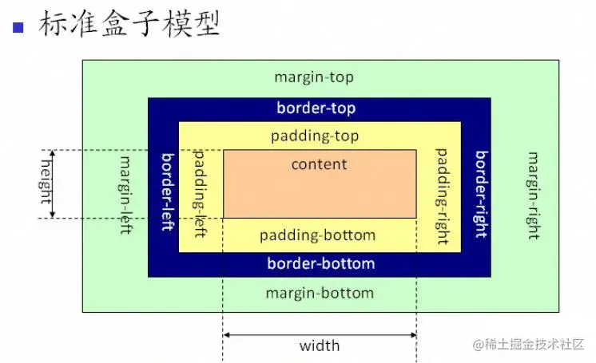
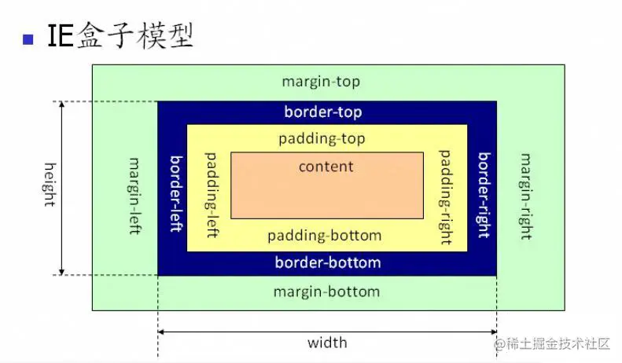
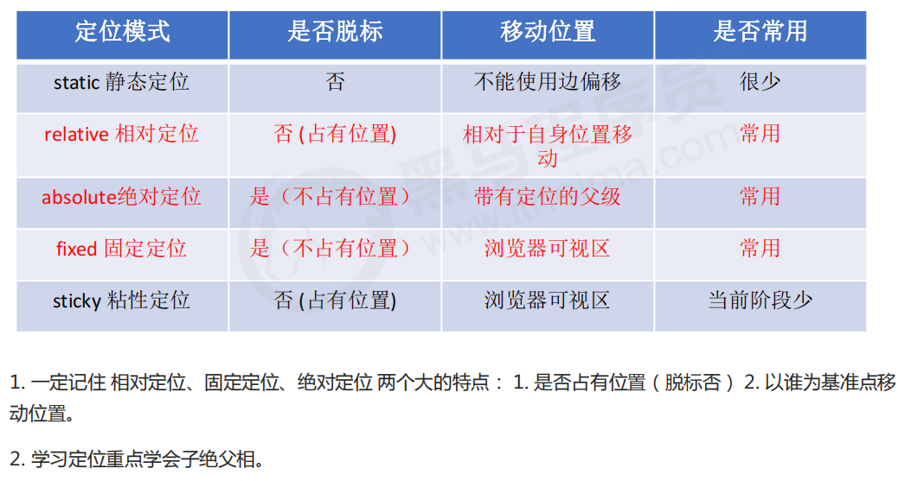
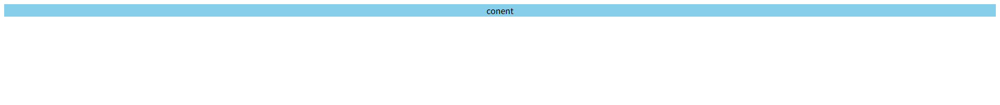
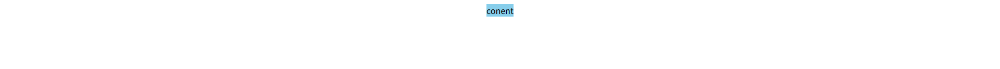
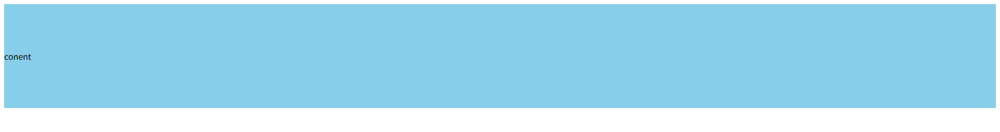
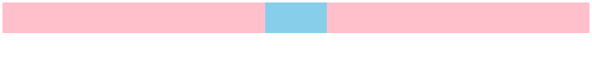
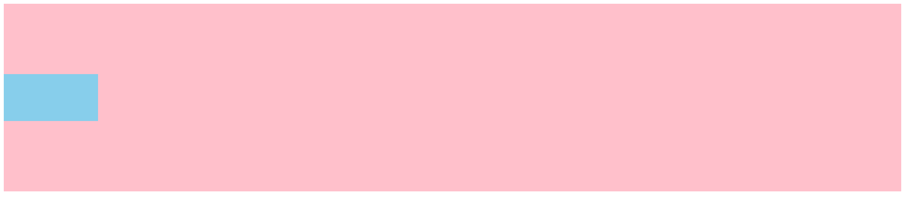
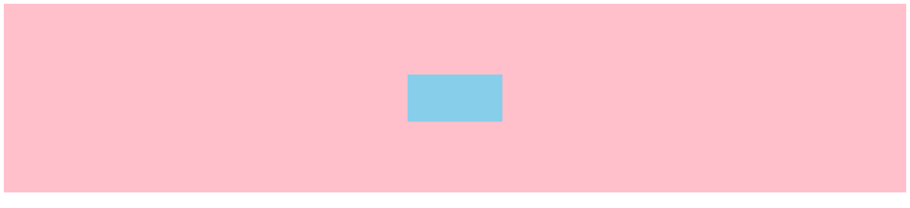
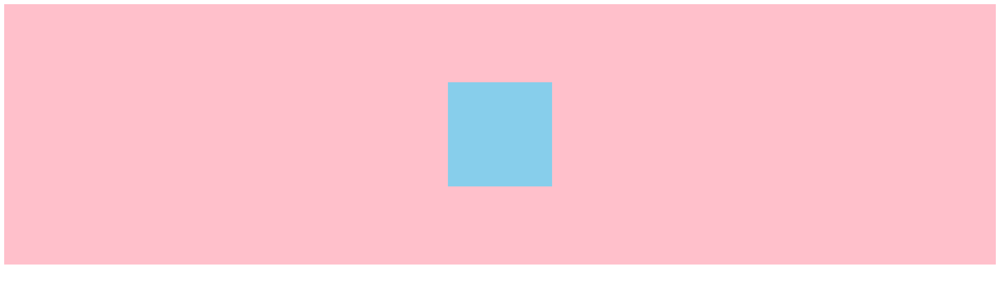

# CSS

## CSS 选择器有哪些

1. **通用选择器**：`*`，选择所有元素。
2. **标签选择器**：比如`div`、`P`、`h1` ，按照元素类型来选择。
3. **类选择器**：用点号开头，比如`.my-class`，通过 class 属性选择元素。
4. **ID 选择器**：用#号开头，比如`#my-id`，通过 id 属性选择页面上唯一的元素。
5. **属性选择器**：比如`[type="text"]，根据元素的属性选择。
6. **伪类选择器**：比如`:hover`、`:focus`、`:nth-child(2)`，为页面上的特定状态选择元素。
7. **伪元素选择器**：比如`::before、`::after`，允许你在元素的内容前后添加特殊的内容。
8. **关系选择器**：
    - **子选择器**：`>`，比如`ul >li`，选择`ul`元素的子`li`元素。
    - **相邻兄弟选择器**：`+`，比如`h1 + P`，选择紧跟在 `h1` 元素后的`P`元素。
    - **通用兄弟选择器**：`~`，比如 `h1 ~ P`，选择 `h1` 元素后所有的`p` 元素。
9. **组合器**：你可以组合使用不同的选择器来达到更精确的选择，比如`div.my-class1`或`input[type="text"]:focus`

注：

-   `div.my-class`是获取 div 标签<font style="color:#117CEE;">且有</font> `my-class` 类的标签
-   `div .my-class`是获取 div 标签的<font style="color:#117CEE;">子代有</font> `my-class` 类的标签

## CSS 的选择器权重

| **选择器**     | **格式**                           | **优先级权重** |
| -------------- | ---------------------------------- | -------------- |
| id 选择器      | #my-id                             | 100            |
| 类选择器       | .my-class                          | 10             |
| 属性选择器     | a[ref="eee"] 注：ref 是 a 标签属性 | 10             |
| 伪类选择器     | li:last-child、:hover、:focus      | 10             |
| 标签选择器     | div、p、h1                         | 1              |
| 伪元素选择器   | li:after、li::before               | 1              |
| 相邻兄弟选择器 | h1+p                               | 0              |
| 通用兄弟选择器 | h1~p                               | 0              |
| 子选择器       | ul>li                              | 0              |
| 后代选择器     | li a                               | 0              |
| 通配符选择器   | \*                                 | 0              |

:::info
补充：内联样式权重最高，直接在元素的 style 属性中写的样式。

:::

## CSS3 新增了哪些特性

1. **选择器**：增加了更多的选择器，比如属性选择器、结构伪类选择器（如 `:nth-child`）、否定伪类（如 `:not`）。
2. **盒子模型**：对框盒模型进行了扩展，包括对 `box-sizing` 属性的支持，可以更容易地控制元素的宽度和高度。
3. **背景和边框**：多背景图片、边框颜色和样式的单独控制、圆角边框（`border-radius`）、阴影（`box-shadow`）。
4. **2D/3D 转换**：可以对元素进行旋转、缩放、移动和倾斜（使用 `transform` 属性）
5. **动画**：`transition` 用于平滑过渡属性值的变化，`animation`允许更发复杂的动画序列。
6. **渐变**：线性渐变（`linear-gradient`）和径向渐变（`radial-gradient`）。
7. **文字效果**：文字阴影（`text-shadow`）、文本换行（`word-warp`）、强制换行（`text-overflow`）。
8. **多媒体查询**：允许根据不同的屏幕尺寸、分辨率和设备方向应用不同的样式。
9. **弹性盒模型（Flexbox）**：提供了更加高效的方式来布局、对齐和分配容器内的空间。
10. **网格布局（CSS Grid）**：引入了二维布局系统，可以创建复杂的网页布局。
11. **新的单位**：`vw`、`vh`、`em`、`rem` 提供了更多灵活的尺寸单位。

## 谈谈你对盒模型的理解

CSS 中的盒模型有以下两种：标准盒子模型、IE 盒子模型





盒模型都是由四个部分组成的：

-   外边距（ margin）
-   边框（border）
-   内边距（padding）
-   内容区域（content）

标准盒模型和 IE 盒模型的区别在于设置 width 和 heigth 时，所对应的范围不同：

-   标准盒模型的 width 和 height 属性的范围只包含了 content
-   IE 盒模型的 width 和 heigth 属性的范围包含了 border、padding 和 content

可以通过修改元素的 `box-sizing` 属性修改元素的盒模型：

-   `box-sizing: content-box` 表示标准盒模型（默认值）
-   `box-sizing: border-box` 表示 IE 盒模型（怪异盒模型）

## position 定位有哪几种

CSS 的 position 属性主要有一下五种值：

1. **static**：
    - 默认值，元素按照正常的文档流进行布局
2. **relative**：
    - 元素的位置相对于它在文档流中的原始位置进行偏移（移动位置的时候参照点是自己原来的位置），但不会影响其他元素的布局。
    - 不脱离文档流，继续保留原来的位置
3. **absolute**：
    - 绝对定位是元素在移动位置的时候，是相对于它的祖先元素来说的。
    - 如果没有祖先元素或者祖先元素没有定位，则以浏览器为准定位（Document 文档）
    - 如果祖先元素有定位（相对、绝对、固定定位），则以最近一级的有定位祖先元素为参考点移动位置。
    - 元素脱机文档流，不占据空间
4. **fixed**：
    - 元素的位置相对于浏览器窗口进行定位，即使页面滚动，元素也会固定在屏幕上。
    - 同样脱离文档流
5. **sticky**：
    - 元素会根据正常文档流进行定位，直到页面滚动到某个位置（超过阈值），之后他的表现就像 fixed 定位一样。
    - 必须添加 top、left、right、bottom 其中一个才有效（设置阈值）。
    - 它在 relative 和 fixed 之间产生一种折中的定位方式。



## display: none 和 visibility: hidden 区别

这两个属性都是让元素隐藏，不可见。两者区别如下：

1. **占用空间**：
    - `display: none`元素完全从文档布局中消失，不占据任何空间。
    - `visibility: hidden`元素仍然占据空间，只是看不见。
2. **渲染**：
    - `display: none`元素不会被渲染，不会被浏览器渲染过程考虑。
    - `visibility: hidden`元素会被渲染，但渲染的结果不可见。
3. **继承性**：
    - `visibility: hidden`可以被继承，如果一个隐藏的元素包含其他元素，那么这些元素也会隐藏的，除非被明确设置。
    - `display: none`不会继承，子元素会随着父元素一起消失。
4. **滚动问题**：
    - 当使用`visibility: hidden`时，如果元素是一个滚动容器，滚动条仍然可见。
    - `display: none`则不会有滚动条。
5. **性能**：
    - `display: none`通常性能更好，因为它减少了页面的渲染负担。
    - `visibility: hidden`可能会影响性能，因为元素仍然参与渲染。

:::info
如果不想显示一个元素，并且希望它不占据空间，就用 `display: none`。如果想让元素不可见，但保留布局占位，就用 `visibility: hidden`。

:::

## 对 flex 布局的理解

Flex 布局（弹性布局）是一种现代的 CSS 布局方式，用于设计一维布局（水平或垂直）。它能够灵活地分配容器内的空间，使子元素（flex items）能够根据容器的大小动态调整自身的宽度或高度，从而实现响应式设计。

:::info
注意：设为 Flex 布局以后，子元素的 float、clear 和 vertical-align 属性将失效。

vertical-align 用于设置一个元素的垂直对齐方式，只针对于行内元素或者行内块元素有效。

:::

Flex 布局主要涉及两个概念：<font style="color:#2F4BDA;">容器（flex container）和子元素（flex items）</font>

-   容器：通过设置 `display: flex `或 `display: inline-flex`，一个元素可以被定义为 Flex 容器。<font style="color:#2F4BDA;">容器默认存在两根轴：水平的主轴（默认）和垂直的交叉抽</font>。
-   子元素：Flex 容器内的直接子元素会自动成为 Flex 项（flex items），并遵循 Flex 布局的规则。

Flex 布局的属性分为两类：容器属性和子元素属性，常用的容器属性包括：

-   `display`：创建 flex 容器
-   `flex-direction`：用于定义<font style="color:#2F4BDA;">主轴的方向</font>
-   `justify-content`：定义<font style="color:#2F4BDA;">主轴</font>上子元素的<font style="color:#2F4BDA;">对齐方式</font>
-   `align-items`：定义<font style="color:#2F4BDA;">侧轴</font>上子元素的<font style="color:#2F4BDA;">对齐方式</font>
-   `flex-wrap`：定义<font style="color:#2F4BDA;">子元素</font>是否可以<font style="color:#2F4BDA;">换行</font>

子元素属性包括：

-   `flex-grow` 定义子元素在容器有剩余空间时的<font style="color:#2F4BDA;">扩展比例</font>。<font style="color:#2F4BDA;">默认值为 0</font>，表示子元素不会扩展。
-   `flex-shrink` 定义子元素在容器空间不足时的<font style="color:#2F4BDA;">收缩比例</font>。<font style="color:#2F4BDA;">默认值为 1</font>，表示子元素会按比例收缩。
-   `flex-basis 定义子元素在分配空间之前的<font style="color:#2F4BDA;">初始大小</font>。<font style="color:#2F4BDA;">默认值为 auto</font>，表示子元素的初始大小为其内容大小。
-   `flex` 是 `flex-grow`、`flex-shrink` 和 `flex-basis` 的简写。默认值为 `0 1 auto`。

在实际开发中，flex 常用在实现水平或垂直居中、等分容器空间、以及响应式布局上。

## 对 BFC 的理解

BFC，全称是块级格式化上下文（Block Formatting Context），是 CSS 布局中一个重要的概念。它是一个独立的渲染区域，决定了元素的布局方式。

关键点：

1. 创建 BFC：BFC 通常由一些特定的 CSS 属性触发，比如：
    - 根元素：`body`
    - 元素设置浮动：`floa` 除 none 以外的值。
    - 元素设置绝对定位：`position`（absolute、fixed）。
    - `display` 值为：`inline-block`、`table-cell`、`table-cable-caption`、`flex`等。
    - `overflow`值为：`hidden`、`auto`、`scroll`。
2. 特性：
    - 垂直方向上，自上而下排列，和文档流的排列方式一致。
    - 在 BFC 中上下相邻的两个容器的 margin 会重叠
    - 计算 BFC 的高度时，需要计算浮动元素的高度
    - BFC 区域不会与浮动的容器发生重叠
    - BFC 是独立的容器，容器内部元素不会影响外部元素
    - 每个元素的左 margin 值和容器的左 border 相接触
    - BFC 内部的元素会尽可能地填充整个容器，这有助于防止 margin 重叠。
3. 作用：
    - **解决 margin 的重叠问题**：由于 BFC 是一个独立的区域，内部的元素和外部的元素互不影响，将两个元素变为两个 BFC，就解决了 margin 重叠的问题。
    - **解决高度塌陷的问题**：在对子元素设置浮动后，父元素会发生高度塌陷，也就是父元素的高度变为 0。解决这个问题，只需要把父元素变成一个 BFC。常用的办法是给父元素设置`overflow: hidden`。
    - **创建自适应两栏布局**：可以用来创建自适应两栏布局：左边的宽度固定，右边的宽度自适应。

使用场景：

-   当想要隔离布局，避免外部元素的干扰时，创建一个 BFC 会很有用。
-   当想要解决 margin 重叠的问题时，BFC 是一个很好的解决方案

简单来说：BFC 就像一个保护罩，让内部元素的布局不受外部的影响，同时内部元素也会尽可能地占满整个容器。

简单示例：

```html
<style>
    .left {
        width: 100px;
        height: 200px;
        background: red;
        float: left; // 创建了BFC容器
    }
    .right {
        height: 300px;
        background: blue;
        overflow: hidden;
    }
</style>
<div class="left"></div>
<div class="right"></div>
```

左侧设置`float: left`，右侧设置`overflow: hidden`。这样右边就触发了 BFC，BFC 的区域不会与浮动元素发生重叠，所以两侧就不会发生重叠，实现了自适应两栏布局。

# Day17

## 移动端响应布局方式

页面头部必须有 meta 生命 view

```html
<meta
    name="viewport"
    content="width=device=width, initial-scale=1, maximum-scale=1, user-scalable=no"
/>
```

属性对应如下：

-   width=device-width：是自适应手机屏幕的尺寸宽度
-   maximum-scale：是缩放比例的最大值
-   inital-scale：是缩放的初始化
-   user-scalable：是用户的可以缩放的操作

**<font style="color:rgb(44, 62, 80);background-color:#C1E77E;">实现响应式布局有如下：</font>**

1. **媒体查询**

-   使用 CSS3 的媒体查询（Media Queries），根据不同的屏幕尺寸、分辨率或设备方向应用不同的 CSS 规则，比如：当视口在 375px-600px，设置字体大小 18px。

```css
@media screen (min-width: 375px) and (max-width: 600px){
  body{
    font-size: 18px
}
```

2. **百分比布局**

-   使用百分比而不是固定像素来设置元素的宽度，这样的布局就可以根据容器的大小灵活伸缩。

3. flex 布局

-   Flexbox 是一种一维布局模型，可以轻松控制子元素在主轴(水平)和交叉轴(垂直)上的分布、对齐和顺序。

```css
.navbar {
    display: flex;
    flex-direction: column; /* 小屏幕垂直排列 */
}

@media (min-width: 768px) {
    .navbar {
        flex-direction: row; /* 大屏幕水平排列 */
        justify-content: space-between;
    }
}
```

4. **网格布局**

-   CSS Grid 是一个二维布局系统，可以同时控制行和列，适合创建复杂的响应式布局。

```css
.container {
    display: grid;
    grid-template-columns: 1fr; /* 移动端单列 */
}

@media (min-width: 768px) {
    .container {
        grid-template-columns: 1fr 3fr; /* 桌面端两列 */
    }
}
```

5. **vw/vh**

-   vw 表示相对于视口窗口的宽度，vh 表示相对于视图窗口高度。使用 vw 单位情况下，1vw 等于视口宽度的 1%。

## 居中的实现方式

1. **水平居中**

-   行内元素：使用 text-align: center; 可以水平居中行内元素或文本
-   块级元素：可以设置左右 margin 为 auto，比如 marigin: 0 auto;

2. **垂直居中**

-   单行文本：使用 line-height 等于高度可以实现（只支持单行文本）。
-   已知高度的元素：将 position 设为 absolute，然后设置 top 为 50%，再将 top 减去自身高度的一半（margin-top）。

3. **绝对定位居中**

-   使用 postion：absolute; 配合 transformer:translate(-50%, -50%); 可以实现任何元素的水平和垂直居中。
-   使用 postion：absolute; 配合 margin: auto; 、left: 0、right: 0、bottm: 0、top: 0（给给 div 添加可用空间），即可实现水平垂直居中。

4. **Flexbox 居中**

-   使用 display: flex; ，然后 justify-content: center; 和 align-items: center; 可以轻松实现水平和垂直居中。

**<font style="color:rgb(44, 62, 80);background-color:#C1E77E;">代码示例：</font>**

-   行内元素 水平居中 方式 1：

```html
<style>
    .parent {
        background-color: skyblue;
        text-align: center;
    }
</style>

<div class="parent">
    <span>conent</span>
</div>
```



-   行内元素 水平居中 方式 2：

```html
<style>
    .parent {
        background-color: skyblue;
        width: fit-content;
        margin: auto;
    }
</style>
<div class="parent">
    <span>conent</span>
</div>
```



-   行内元素 垂直居中：

```html
<style>
    .parent {
        height: 200px;
        line-height: 200px;
        background-color: skyblue;
    }
</style>
<div class="parent">
    <span>conent</span>
</div>
```



块级元素 水平居中 方式 1：

```html
<style>
    .parent {
        background-color: pink;
        height: 100px;
    }
    .child {
        width: 200px;
        height: 100px;
        margin: 0 auto;
        background-color: skyblue;
    }
</style>

<div class="parent">
    <div class="child"></div>
</div>
```



-   块级元素 水平垂直居中 ：定位 + margin-top+margin-left（已知高度和宽度）

```html
<style>
    .parent {
        position: relative;
        background-color: pink;
        height: 400px;
    }
    .child {
        position: absolute;
        /* 方式1 */
        /* top: 50%;
        margin-top: -50px; */
        /* 方式2 */
        top: calc(50% - 50px);
        /* 水平居中再加个left: calc(50% - 50px); */
        width: 200px;
        height: 100px;
        background-color: skyblue;
    }
</style>
<div class="parent">
    <div class="child"></div>
</div>
```



-   块级元素 水平垂直居中 方式 1：定位+transform（高度可以未知）

```html
<style>
    .parent {
        position: relative;
        background-color: pink;
        height: 400px;
    }
    .child {
        position: absolute;
        top: 50%;
        left: 50%;
        transform: translate(-50%, -50%); /* 参考自身的高度的百分之50 */
        width: 200px;
        height: 100px;
        background-color: skyblue;
    }
</style>
<div class="parent">
    <div class="child"></div>
</div>
```


-   块级元素 水平垂直居中 方式 2：定位+margin+top+bottom+left+right（原理：top+bottom+left+right 等于 0 子元素就会填充父元素所有可用空间，水平垂直方向上有了可分配的空间，设置 margin:auto 即可实现水平垂直居中）

```html
<style>
    .parent {
        position: relative;
        background-color: pink;
        height: 400px;
    }
    .child {
        position: absolute;
        top: 0;
        bottom: 0;
        left: 0;
        right: 0;
        margin: auto;
        width: 200px;
        height: 100px;
        background-color: skyblue;
    }
</style>
<div class="parent">
    <div class="child"></div>
</div>
```



-   块级元素 水平垂直居中 方式 3：flex 布局实现水平垂直居中

```html
<style>
    .parent {
        background-color: pink;
        height: 500px;
        display: flex;
        align-items: center; /* 垂直居中 */
        justify-content: center; /* 水平居中 */
    }
    .child {
        width: 200px;
        height: 200px;
        background-color: skyblue;
    }
</style>
<div class="parent">
    <div class="child"></div>
</div>
```



> 参考：掘金博主 CUGGZ
