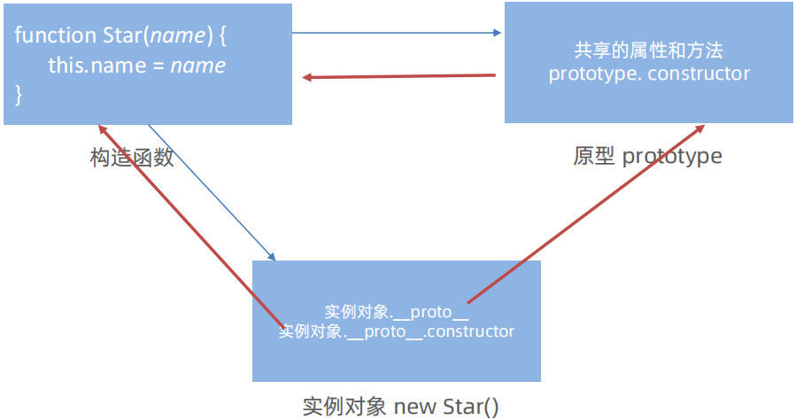
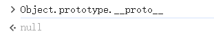
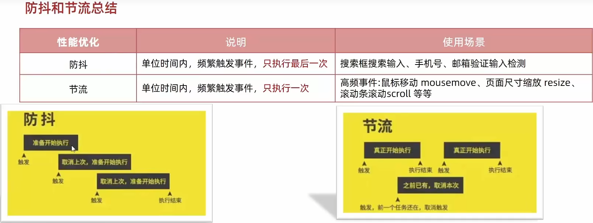
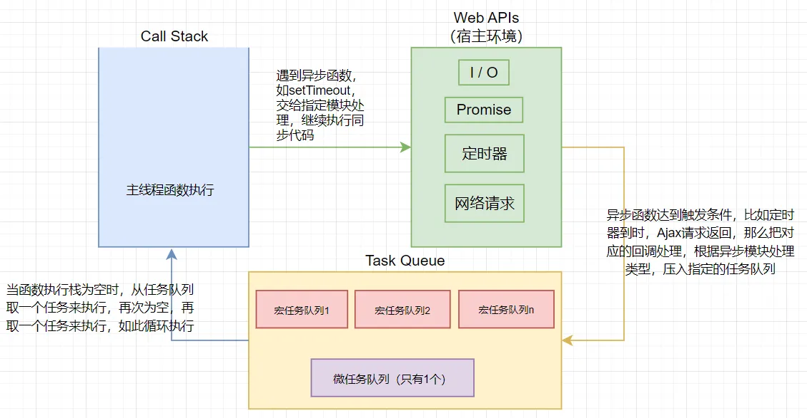
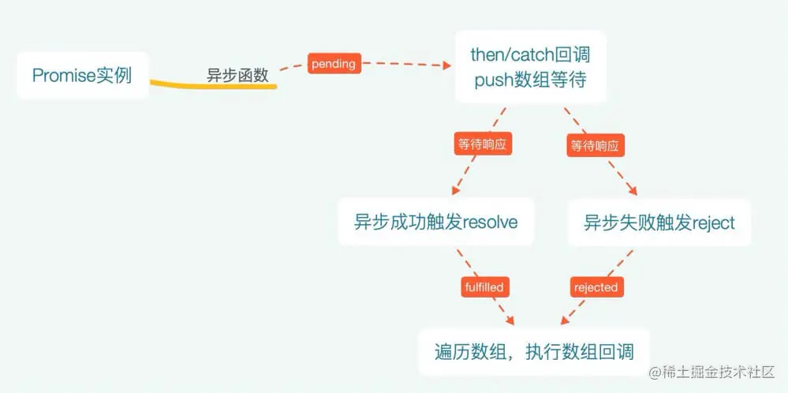

# Javascript

## JS 的数据类型

JavaScript 是一种内类型语言，共有八种数据类型，分别是 ：

1. **Undefined**：表示变量已声明但未初始化，即没有赋予具体的值。
2. **Null**：表示故意赋予变量的空值，常用于表示不存在的对象。
3. **Boolean**：只有两个值，`true` 和 `false`，用于逻辑判断。
4. **Number**：用于表示数字，包括整数和浮点数。
5. **String**：用于表示文本数据，可以是字母、数字、符号等。
6. **Object**：包括数组（Array）、函数（Function）、日期（Date）和其他对象。
7. **Symbol**（ES6 新增）：用于创建唯一的不可变的代号，常用于属性名。
8. **BigInt**（ES2020 新增）：用于表示大于 `2^53-1` 的整数。
9. **Function**：函数定义，用于执行特定任务。
10. **Array**：用于存储多个值，每个值都有一个索引。

其中 Symbol 和 BigInt 是 ES6 中新增的数据类型：

-   Symbol 代表创建后独一无二且不可变的数据类型，它主要是为了解决可能出现的全局变量冲突的问题。
-   BigInt 是一种数字类型的数据，它可以表示任意精度格式的整数，使用 BigInt 可以安全地存储和操作大整数，即使这个数已经超出了 Number 能够表示的安全整数范围。

这些数据可以分为原始数据类型和引用数据类型：

-   栈：原始数据类型（Undefined、Null、Boolean、Number、String）
-   堆：引用数据类型（对象、数组和函数）

两种类型的区别在于**存储位置的不同：**

-   原始数据类型直接存储在栈（stack）中的简单数据段，占据空间小、大小固定，属于被频繁使用数据，所以放入栈中存储；
-   引用数据类型存储在堆（heap）中的对象，占据空间大、大小不固定。如果存储在栈中，将会影响程序运行的性能；引用数据类型在栈中存储了指针，该指针指向堆中该实体的起始地址。当解释器寻找引用值时，会首先检索其在栈中的地址，取得地址后从堆中获得实体。

堆和栈的概念存在于数据结构和操作系统内存中，在数据结构中：

-   在数据结构中，栈中数据的存取方式为先进后出。
-   堆是一个优先队列，是按优先级来进行排序的，优先级可以按照大小来规定。

在操作系统中，内存被分为栈区和堆区：

-   栈区内存由编译器自动分配释放，存放函数的参数值，局部变量的值等。其操作方式类似于数据结构中的栈。
-   堆区内存一般由开发者分配释放，若开发者不释放，程序结束时可能由垃圾回收机制回收。

## 数据类型的检测方法有哪些

1. **typeof 操作符**：

-   用于获取一个变量或者值的类型，比如 `typeof variable`
-   对于函数，`typeof` 会返回`"function"`，对于数组、对象和`null`，`typeof` 会返回`"object"`。

```javascript
console.log(typeof 2); // number
console.log(typeof true); // boolean
console.log(typeof "str"); // string
console.log(typeof []); // object
console.log(typeof function () {}); // function
console.log(typeof {}); // object
console.log(typeof undefined); // undefined
console.log(typeof null); // object
```

2. **instanceof 操作符**：

-   `instanceof`可以正确判断对象的类型，其内部运行机制是判断在其原型链中能否找到该类型的原型。
-   `instanceof`只能正确判断引用数据类型，而不能判断基本数据类型。

```javascript
console.log(2 instanceof Number); // false
console.log(true instanceof Boolean); // false
console.log("str" instanceof String); // false

console.log([] instanceof Array); // true
console.log(function () {} instanceof Function); // true
console.log({} instanceof Object); // true
```

3. **Object.prototype.toString.call()**：

-   更为准确的类型检测方法，可以用来区分 `null` 和 `undefined`，以及获取对象的准确类型。
-   比如` Object.prototype.toString.call(variable)`。

```javascript
console.log(Object.prototype.toString.call(2)); // '[object Number]'
console.log(Object.prototype.toString.call(true)); // '[object Boolean]'
console.log(Object.prototype.toString.call("str")); // '[object String]'
console.log(Object.prototype.toString.call([])); // '[object Array]'
console.log(Object.prototype.toString.call(function () {})); // '[object Function]'
console.log(Object.prototype.toString.call({})); // '[object Object]'
console.log(Object.prototype.toString.call(undefined)); // '[object Undefined]'
console.log(Object.prototype.toString.call(null)); // '[object Null]'
```

4. **constructor 属性**：

-   某些内置类型有 `constructor` 属性，可以用来检测类型，但可以被改写，所以不是最可靠的方法。

```javascript
console.log((2).constructor === Number); // true
console.log(true.constructor === Boolean); // true
console.log("str".constructor === String); // true
console.log([].constructor === Array); // true
console.log(function () {}.constructor === Function); // true
console.log({}.constructor === Object); // true
```

5. **Array.isArray()**：

-   专门用来检测一个对象是否为数组，比如 `typeof` 更准确。

**补充**：同样是检测对象 obj 调用 toString 方法，obj.toString()的结果和 Object.prototype.toString.call(obj)的结果不一样，这是为什么？

这是因为`toString`是`Object`的原型方法，而`Array`、`function`等**类型作为 Object 的实例，都重写了**`toString`**方法**。不同的对象类型调用`toString`方法时，根据原型链的知识，调用的是对应的重写之后的`toString`方法（function 类型返回内容为函数体的字符串，Array 类型返回元素组成的字符串…），而不会去调用 Object 上原型`toString`方法（返回对象的具体类型），所以采用`obj.toString()`不能得到其对象类型，只能将 obj 转换为字符串类型；因此，在想要得到对象的具体类型时，应该调用`Object`原型上的`toString`方法。

## Object.is()、\==、\===区别是什么

1. **双等号\==**：

-   这是所谓的“相等”运算符，它用来检查两个值是否相等。
-   当使用`==`进行比较时，如果比较的两个值类型不同，Javascript 会尝试将它们转换为相同的类型，然后再进行比较，这个过程叫做类型转换或类型提升。

2. **三等号\===**：

-   这是所谓的“严格相等”运算符，它同样用来检查两个值是否相等。
-   使用`===`进行比较时，如果两个值的类型不同，比较直接返回 `false`，不会进行类型转换。比如-0 和+0 是相等的，NaN 和 NaN 不相等。

3. **Object.is()**

-   使用 `Object.is()`来进行相等判断时，一般情况下和三等号的判断相同，他处理了一些特殊的情况，比如-0 和+0 不再相等，两个 NaN 是相等的。

## null 和 undefined 的区别是什么

Javascript 中，`null` 和 `undefined` 都是用来表示没有值，但它们的含义和用途有所不同：

1. **undefined**：

-   表示一个变量声明了但是没有被赋值。
-   调用函数时，应该返回值但是没有返回值，那么返回的就是 `undefined`。
-   `undefined` 是一个表示“缺少值”的原始值。

2. **null**：

-   表示一个变量当前没有指向任何对象，即显式地表示一个空值。
-   null 是一个表示“空值”地对象。

补充：

1. null 像在 java 里一样，被当成一个对象，但是，JavaScript 数据类型被分为原始类型（primitive）和合成类型（complex）两大类，作者觉得表示“无”地值最好不是对象。
2. Javascript 地最初版本没有包括错误处理机制，发生数据类型不匹配时，往往是自动转换类型或者默默地失败，作者觉得，如果 null 自动转为 0，很不容易发现错误。

## 什么是变量提升

在 JavaScript 中，变量提升（Hoisting）是指变量声明和函数声明在代码执行前被提升当前作用域的顶部的过程。

<font style="color:rgb(44, 62, 80);background-color:#C1E77E;">变量提升的要点：</font>

1. **变量声明提升**

-   只有遍历的声明被提升，而不是变量的赋值。
-   这意味着在变量声明之前就可以访问该变量，其值为 `undefined`。

```javascript
// 代码顺序
console.log(a);
var a = 1;

// 执行顺序
var a;
console.log(a); // 输出undefined
a = 1;
```

2. **函数声明提升**

-   函数的声明（包括函数体内的变量和函数）都会被提升。
-   可以在这个函数声明之前的任何地方调用它。

```javascript
// 代码顺序
console.log(f());
function f() {
    return 6;
}

// 执行顺序
// 函数声明
function f() {
    return 6;
}
console.log(f()); // 输出6
```

-   函数表达式与 function 声明的函数不同，<font style="background-color:#D9DFFC;">函数表达式遵循的是变量提升规则</font>。见下方代码：

```javascript
// 代码顺序
console.log(f);
var f = function () {
    return 6;
};
console.log(f());

// 执行顺序
var f;
console.log(f); // 输出undefined
f = function () {
    return 6;
};
console.log(f()); // 输出6
```

-   如果变量名和函数名相同，提升的时候变量声明会被函数声明覆盖

```javascript
// 代码顺序
console.log(fa);
var fa = 1;
console.log(fa);
function fa() {
    return 6;
}
console.log(fa);

// 执行顺序
function fa() {
    return 6;
}
console.log(fa); // 输出fa(){...}
fa = 1;
console.log(fa); // 输出1
console.log(fa); // 输出1
```

3. **let 和 const 提升**

-   `let` 和 `const` 也有提升，但与 `var` 不同，他们不会在提升后直接赋予 `undefined`。
-   它们会进入一个称为“暂时性死区”（Temporal Deed Zone，TDZ）状态，在初始化之前访问会引发错误。

## 简单说下 JS 的作用域和作用域链

<font style="color:rgb(44, 62, 80);background-color:#C1E77E;">作用域：</font>

在 JavaScript 中，作用域决定了变量或函数的可见性和访问性。它限定了变量和函数的生命周期。

1. **全局作用域**：在全局作用域中声明的变量和函数，在整个脚本中都可以访问。
2. **函数作用域**：在函数内部声明的变量，只在该函数内部可以访问。
3. **块级作用域**：ES6 引入了 `let`和 `const`，它们在块级作用域（如 `if` 语句、循环、`{}`代码块）中有效。

<font style="color:rgb(44, 62, 80);background-color:#C1E77E;">作用域链：</font>

作用域链是一种机制，用于确定在哪个作用域中查找变量。当访问一个变量时，JavaScript 引擎会从当前作用域开始查找，然后逐级向上（函数的调用者）查找，直到全局作用域。

1. **查找过程**：

-   从当前作用域开始，查找变量。
-   如果当前作用域找不到，就查找上层作用域。
-   一直找到全局作用域，或者找到变量为止。

2. **闭包**：闭包是作用域链的一个应用，允许函数访问并操作外部函数作用域中的变量。

## 说一说你对执行上下文的理解

<font style="color:rgb(44, 62, 80);background-color:#C1E77E;">执行上下文类型</font>

**（1）全局执行上下文**

任何不在函数内部的都是全局执行上下文，它首先会创建一个全局的 window 对象，并且设置 this 的值等于这个全局对象，一个程序中只有一个全局执行上下文。

**（2）函数执行上下文**

当一个函数被调用时，就会为该函数创建一个新的执行上下文，函数的上下文可以有任意多个。

**（3）**`eval`**函数执行上下文**

执行在 eval 函数中的代码会有属于他自己的执行上下文，不过 eval 函数不常使用，不做介绍。

<font style="color:rgb(44, 62, 80);background-color:#C1E77E;">执行上下文栈</font>

执行栈，也就是在其它编程语言中所说的“调用栈”，是一种拥有 LIFO（后进先出）数据结构的**栈**，被用来存储代码运行时创建的所有执行上下文。

当 JavaScript 引擎第一次遇到你的脚本时，它会创建一个全局的执行上下文并且压入当前执行栈。每当引擎遇到一个函数调用，它会为该函数创建一个新的执行上下文并压入栈的顶部。

引擎会执行那些执行上下文位于栈顶的函数。当该函数执行结束时，执行上下文从栈中弹出，控制流程到达当前栈中的下一个上下文。

```javascript
let a = "Hello World!";

function first() {
    console.log("Inside first function");
    second();
    console.log("Again inside first function");
}

function second() {
    console.log("Inside second function");
}

first();
console.log("Inside Global Execution Context");
```


<font style="color:rgb(44, 62, 80);background-color:#C1E77E;">创建执行上下文</font>

创建执行上下文有两个阶段：**创建阶段**和**执行阶段**

**1）创建阶段**

（1）**this 绑定**

-   在全局执行上下文中，`this`指向全局对象（window 对象）
-   在函数执行上下文中，`this`指向取决于函数如何调用。如果它被一个引用对象调用，那么 `this` 会被设置成那个对象，否则 `this` 的值被设置为全局对象或者 `undefined`

（2）**创建词法环境组件**

-   词法环境是一种有**标识符——变量映射**的数据结构，标识符是指变量/函数名，变量是对实际对象或原始数据的引用。
-   词法环境的内部有两个组件：
    -   环境记录器:用来储存变量个函数声明的实际位置
    -   **外部环境的引用**：可以访问父级作用域

（3）**创建变量环境组件**

-   变量环境也是一个词法环境，其环境记录器持有变量声明语句在执行上下文中创建的绑定关系。

**2）执行阶段** 此阶段会完成对变量的分配，最后执行完代码。

<font style="color:rgb(44, 62, 80);background-color:#C1E77E;">简单来说执行上下文就是指：</font>

在执行一点 JS 代码之前，需要先解析代码。解析的时候会先创建一个全局执行上下文环境，先把代码中即将执行的变量、函数声明都拿出来，变量先赋值为 undefined，函数先声明好可使用。这一步执行完了，才开始正式的执行程序。

在一个函数执行之前，也会创建一个函数执行上下文环境，跟全局执行上下文类似，不过函数执行上下文会多出 this、arguments 和函数的参数。

-   全局上下文：变量定义，函数声明
-   函数上下文：变量定义，函数声明，`this`，`arguments`

面试输出结果相关代码：

```javascript
var n = 100;
function foo() {
    // 作用域 ：[ foo函数作用域，全局作用域 ]
    n = 200;
}

foo();
console.log(n); // 输出200
```

`foo` 函数作用域没有变量 `n`，则在全局作用域寻找变量 `n`。

```javascript
function foo() {
    // 作用域： [foo 函数作用域，全局作用域 ]
    console.log(n); // 输出undefined
    var n = 200;
    console.log(n); // 输出200
}

var n = 100;
foo();
```

`foo` 函数作用域中使用 var 定义了变量`n`，会触发变量提升（声明变量 `n`，而不会赋值），所以第一个输出结果是 `undefined`，第二个输出结果是 200。

```javascript
var n = 100;
function foo1() {
    // 作用域 ：[ foo1函数作用域，全局作用域 ]  作用域和定义位置有关，和调用位置无关
    console.log(n); // 输出100
}
function foo2() {
    // 作用域 ：[ foo2函数作用域，全局作用域 ]  作用域和定义位置有关，和调用位置无关
    var n = 200;
    console.log(n); // 输出200
    foo1();
}
foo2();
console.log(n); // 输出100
```

首先执行 `foo2` 函数，输出结果是 200，然后调用 `foo1` 函数，此时 `foo1` 作用域中没有声明变量 `n`，于是向全局作用域寻找变量 `n`，输出结果为 100，最后一行位于全局作用域，输出结果为 100。

```javascript
var a = 100;
function foo() {
    // 作用域 ：[ foo函数作用域，全局作用域 ]
    console.log(a); // 输出undefined
    // 调用foo函数才会执行return，但执行上下文记录到执行调用栈时，AO（激活对象）就形成了，此时就发现时有变量a
    return;
    var a = 100;
}
foo();
```

调用`foo`函数才会执行 return，但执行上下文记录到执行调用栈时，此时就发现时有变量`a`，所以输出结果是 `undefined`。

```javascript
function foo() {
    // 作用域 ：[ foo函数作用域，全局作用域 ]
    var a = (b = 100);
    // 上述代码等同于
    var a = 100;
    b = 100; // 属于全局变量
}
foo();
console.log(a); // 会报错
console.log(b); // 输出100
```

`var a = b = 100;` 等同于 ` var a = 100;` `b=100;`此时输出 `a` 会报错，输出 `b` 结果是 100。

## 简单说下对闭包的理解

闭包是指有权访问另一个函数作用域中变量的函数，创建闭包最常见的方式就是在一个函数内创建另一个函数，创建的函数可以访问到当前函数的局部变量。

:::info
任何函数具有闭包，甚至是在全局范围内创建的函数。在全局作用域中创建的函数创建闭包，但是由于这些函数是在全局作用域中创建的，所以它们可以访问全局作用域中的所有变量，闭包的概念并不重要。

:::

<font style="color:rgb(44, 62, 80);background-color:#C1E77E;">闭包的作用：</font>

1. **在函数外部能够访问函数内部的变量（访问外部变量）**。通过使用闭包，可以通过在外部调用闭包函数，从而在外部访问到函数内部的变量，可以使用这种方法来创建私有变量。
2. **使已经运行结束的函数上下文中的变量对象继续留在内存中（延长生命周期）**。因为闭包函数保留了这个变量对象的引用，所以这个变量对象不会被回收。
3. **维持状态**。闭包常用于创建带状态的函数，比如计算器或存储配置信息。

比如：函数 A 内部有一个函数 B，函数 B 可以访问到函数 A 中的变量，那么函数 B 就是闭包。

```javascript
function A() {
    let a = 1;
    window.B = function () {
        console.log(a);
    };
}
A();
B(); // 输出1
```

<font style="color:rgb(44, 62, 80);background-color:#C1E77E;">如何形成闭包：</font>

闭包是指能够访问并持有外部函数作用域中变量的函数。它由两部分组成：

1. 一个函数（如函数 B）；
2. 该函数对外部作用域（如函数 A）中变量的引用。

<font style="color:rgb(44, 62, 80);background-color:#C1E77E;">使用场景：</font>

-   模块化：实现私有变量和函数，通过闭包暴露公有接口
-   函数柯里化：预先设置参数，生成新的函数
-   事件处理器：保存事件处理函数的状态

面试题：

```javascript
let arr = new Array();

for (var i = 0; i < 4; i++) {
    arr.push(function () {
        return console.info(j);
    });
}

arr[0](); // 输出4
arr[1](); // 输出4
arr[2](); // 输出4
```

有 2 两种解决方法：

1. 使用闭包：

```javascript
let arr = new Array();

for (var i = 0; i < 4; i++) {
    (function (j) {
        arr.push(function () {
            return console.info(j);
        });
    })(i);
}

arr[0](); // 输出0
arr[1](); // 输出1
arr[2](); // 输出2
```

2. 使用 let，也是最推荐的

```javascript
let arr = new Array();

// let有块级作用域，而var没有块级作用域
for (let i = 0; i < 4; i++) {
    (function (j) {
        arr.push(function () {
            return console.info(j);
        });
    })(i);
}

arr[0](); // 输出0
arr[1](); // 输出1
arr[2](); // 输出2
```

## 讲一讲 Js 的垃圾回收机制

Javascript 使用自动垃圾回收机制来管理内存，主要是通过标记-清楚（Mark-and-Sweep）算法来实现的。

<font style="color:rgb(44, 62, 80);background-color:#C1E77E;">垃圾回收的要点：</font>

1. **引用类型**：JavaScript 中的对象如数组、函数、对象等，都是通过引用来访问的。
2. **标记阶段**：垃圾回收器会从全局对象开始，查找所有从根对象可达的引用。被标记的对象就是正在使用中的对象。
3. **清楚阶段**：完成标记后，垃圾回收器会遍历内存，清除未标记的对象，这些对象就是未被引用的，可以被回收的。

<font style="color:rgb(44, 62, 80);background-color:#C1E77E;">额外的策略：</font>

1. **引用计数**：早期的垃圾回收策略，通过计数对象被引用的次数来判断是否可以回收。但如果两个对象相互引用，即使它们不再被使用，计数器也不会归零，这会导致内存泄漏。
2. **分代回收**：将内存分为新生代和老生代。新生代中的对象生命周期短，垃圾回收频繁；老生代中的对象生命周期长，垃圾回收不那么频繁。
3. **增量回收**：为了避免长时间的垃圾回收导致的卡顿，V8 引擎采用了增量回收策略，将垃圾回收过程分成多个小步骤。

<font style="color:rgb(44, 62, 80);background-color:#C1E77E;">V8 引擎的优化：</font>

-   V8 引擎使用了许多优化技术，比如扫雪机算法（Scavenge Algorithm）来优化新生代的垃圾回收。

## 哪些操作会造成内存泄漏

内存泄漏是指本应该被垃圾回收器回收的内存，因为某些原因未被回收，导致内存持续占用。下面是一些常见的造成内存泄漏的操作：

1. **未解除的引用**：

    - 例如，将一个对象存储在全局变量中，而这个对象不再需要时却没有被清除。

2. **闭包**：
    - 过度使用闭包可能会持续持有引用，导致外部上下文无法被回收，从而导致某些变量一直被留在内存当中。。
3. **未清理的事件监听器**：
    - 给元素添加了事件监听器，但当元素不再使用时，未移除这些监听器。
4. **被遗忘的计时器或回调函数**：
    - 设置了 `setInterval` 但未在适当的时候使用 `clearInterval` 清除；如果循环函数有对外部变量的引用的话，那么这个变量会被一直留在内存中，而无法被回收。
5. **未释放的 DOM 引用**：
    - 获取一个 DOM 元素的引用，而后面这个元素被删除，由于一直保留了对这个元素的引用，所以它也无法被回收。
6. **不必要的全局变量**：
    - 创建了全局变量来长期存储数据，但数据不再需要时没有适当清理。
7. **循环引用**：
    - 两个对象相互引用，导致它们无法被垃圾回收器回收。
8. **遗忘的监听者模式**：
    - 当实现了监听者模式并在组件内挂载相关的事件处理函数，而在组件销毁时不主动将其清除时，其中引用的变量或者函数都被认为是需要的而不会进行回收。
9. <big**未清理的 Console 输出**：
    - 浏览器保存了输出对象的信息数据引用，也正是因此未清理的 `console` 如果输出了对象也会造成内存泄漏。

## 解释一下什么是原型和原型链

在 JavaScript 中，原型是一种面向对象的特征，用于实现继承和共享方法。

**原型（Prototype）**：每个函数在创建时，都有一个 `prototype` 属性，指向一个对象，这个对象包含了可以由该函数构造的所有实例共享的属性和方法。



**构造函数的原型**：通过构造函数创建的对象实例，都包含一个内部链接，指向创建它们的构造函数的原型，这个链接就是原型链的基础。

**原型链（Prototype Chain）**：当尝试访问一个对象的属性和方法时，如果该对象本身没有这个属性和方法，他会沿着原型链向上查找，直到找到属性或方法，或到达原型链的顶端。原型链的尽头一般来说都是 `Object.prototype` 所以这就是新建的对象为什么能够使用 `toString()` 等方法的原因。


-   只要是对象，就有 `__proto__` 对象原型指向原型对象
-   只要是原型对象，就有 `constructor` 只想创造该原型对象的构造函数

<font style="color:rgb(44, 62, 80);background-color:#C1E77E;">原型链的终点是什么？如何打印出原型链的终点？</font>

由于`Object`是构造函数，原型链终点是`Object.prototype.__proto__`，而`Object.prototype.__proto__=== null // true`，所以，原型链的终点是`null。



<font style="color:rgb(44, 62, 80);background-color:#C1E77E;">获得对象非原型链上的属性：</font>

使用 `hasOwnProperty()` 方法来判断属性是否属于原型链的属性：自身属性返回 true，继承或者不存在返回 false。

```javascript
function iterate(obj) {
    var res = [];
    for (var key in obj) {
        if (obj.hasOwnProperty(key)) res.push(key + ": " + obj[key]);
    }
    return res;
}
```

<font style="color:rgb(44, 62, 80);background-color:#C1E77E;">相关函数：</font>

-   `Object.getPrototypeOf(obj)`；作用：获取对象 `obj` 的原型（即 `[[Prototype]]`）。

```javascript
const person = { name: "Alice" };
const prototype = Object.getPrototypeOf(person);

console.log(prototype === Object.prototype); // true
// 不建议使用__proto__
```

-   `Object.setPrototypeOf(obj, prototype)`；作用：设置对象 `obj` 的原型为 `prototype`（修改 `[[Prototype]]`）。

```javascript
const animal = { eats: true };
const dog = { barks: true };

// 设置 dog 的原型为 animal
Object.setPrototypeOf(dog, animal);
// 不建议使用__proto__

console.log(dog.eats); // true（继承自 animal）
console.log(Object.getPrototypeOf(dog) === animal); // true
```

:::info
注：不建议使用 **proto**

:::

## 手写 instanceof

`instanceof` 运算符用于判断构造函数的 `prototype` 属性是否出现在对象的原型链中的任何位置。

实现步骤：

1. 首先获取类型的原型
2. 然后获得对象的原型
3. 然后一直循环判断对象的原型是否等于类型的原型，直到对象原型为 `null>`，因为原型链最终为 `null`

具体实现：

```javascript
/**
 * @param constructor 构造函数
 * @param instance 实例对象
 * @returns Boolean
 */
function myInstanceof(constructor, instance) {
    // 获取实例对象的原型
    let proto = Object.getPrototypeOf(instance);
    // 循环遍历原型链
    while (proto) {
        // 检查构造函数的prototype是否与实例对象的原型相等
        if (proto === constructor.prototype) {
            return true;
        }
        // 继续遍历原型链
        proto = Object.getPrototypeOf(proto);
    }
    // 如果遍历完没有找到，就返回false
    return false;
}
```

## 遍历对象属性的方法有哪些

1. **for...in 循环**：

-   遍历对象自身的所有可枚举属性，以及从原型链继承的可枚举属性。
-   如果要遍历对象自身的属性，需要结合 hasOwnProperty 方法进行检查。

```javascript
const parent = { family: "Smith" };
const child = { name: "Alice" };

// 设置原型链
Object.setPrototypeOf(child, parent);

// 遍历所有可枚举属性（包括继承的）
for (const key in child) {
    console.log(key); // 输出 "name" 和 "family"
}

// 结合 hasOwnProperty 过滤继承属性
for (const key in child) {
    if (child.hasOwnProperty(key)) {
        console.log(key); // 只输出 "name"
    }
}
```

2. **Object.keys()**：

-   仅返回对象自身的可枚举属性的名称数组，不包括原型链中的属性。

```javascript
const obj = { a: 1, b: 2 };
Object.defineProperty(obj, "c", { value: 3, enumerable: false });

console.log(Object.keys(obj)); // ["a", "b"]（忽略不可枚举的 "c"）
```

3. **Object.getOwnPropertyNames()**：

-   返回对象自身的所有属性（包括不可枚举的属性）的名称数组。

```javascript
const obj = { a: 1, b: 2 };
Object.defineProperty(obj, "c", { value: 3, enumerable: false });

console.log(Object.getOwnPropertyNames(obj)); // ["a", "b", "c"]
```

4. **Object.entries()**：

-   返回一个给定对象自身可枚举属性的键值对数组，每个键值对是数组的形式。

```javascript
const obj = { a: 1, b: 2 };
console.log(Object.entries(obj)); // [ ["a", 1], ["b", 2] ]
```

5. **for...of 循环 + Object.values()**：

-   通过 Object.values()获取对象的所有可枚举属性值的数组，然后用 for...of 循环遍历。

```javascript
const obj = { a: 1, b: 2 };
const values = Object.values(obj); // [1, 2]

for (const value of values) {
    console.log(value); // 依次输出 1 和 2
}
```

6. **Reflect.ownKeys()**：

-   返回对象自身的所有键（包括不可枚举的属性和 Symbol 属性）的数组。

```javascript
const obj = { a: 1, [Symbol("id")]: 123 };
Object.defineProperty(obj, "b", { value: 2, enumerable: false });

console.log(Reflect.ownKeys(obj)); // ["a", "b", Symbol(id)]
```

|              方法              | 自身属性 | 继承属性 | 可枚举性 | Symbol 属性 |          返回值形式          |
| :----------------------------: | :------: | :------: | :------: | :---------: | :--------------------------: |
|           `for...in`           |    ✔️    |    ✔️    | 仅可枚举 |     ❌      |      键名（需过滤继承）      |
|        `Object.keys()`         |    ✔️    |    ❌    | 仅可枚举 |     ❌      |           键名数组           |
| `Object.getOwnPropertyNames()` |    ✔️    |    ❌    |   所有   |     ❌      |           键名数组           |
|       `Object.entries()`       |    ✔️    |    ❌    | 仅可枚举 |     ❌      | 键值对数组（`[key, value]`） |
|       `Object.values()`        |    ✔️    |    ❌    | 仅可枚举 |     ❌      |            值数组            |
|      `Reflect.ownKeys()`       |    ✔️    |    ❌    |   所有   |     ✔️      |    键名数组（含 Symbol）     |

## proxy 和 Object.defineProperty 的区别

<font style="color:rgb(44, 62, 80);background-color:#C1E77E;">相同点：</font>

`Object.defineProperty` 和 `new Proxy` 都是用来实现对象的拦截和代理。

<font style="color:rgb(44, 62, 80);background-color:#C1E77E;">不同点：</font>

1. **实现方式**

-   `Object.defineProperty` 是基于对象的属性进行拦截的，一次只能拦截一个属性。
-   `Proxy` 可以直接监听整个对象的操作，不需要对每个属性进行单独的定义。

:::info
注：如果 Object.defineProperty 要对整个对象的属性都进行拦截，那么就需要循环了

:::

2. **后添加的属性**

-   `Object.defineProperty` 对于后添加的属性是无法拦截的。
-   `new Proxy` 对于即使后添加的属性也可以拦截到。

:::info
所以 vue2 就出了一个$set 方法来手动将新属性转换为响应式属性，从而可以实现对新属性的拦截。

:::

3. **性能**

-   `Proxy` 是监听整个对象，可以能会带来更大的性能开销。
-   `Object.defineProperty` 是拦截对象某一个属性，性能上可能更高效。

:::info
不过这是一个使用场景上，选择的，取舍问题

:::

4. **兼容情况**

-   IE11 不支持 Proxy，但是 Object.defineProperty 是支持的。

Object.defineproperty 的作用就是直接在一个对象上定义一个新属性，或者修改一个已经存在的属性：

```javascript
// 语法：
Object.defineproperty(obj, prop, desc)

// 第三个参数里面还有6个配置控住属性
- writable：	是否可重写

- value：  	当前值

- get：    	 读取时内部调用的函数

- set：        写入时内部调用的函数

- enumerable： 	是否可以遍历

- configurable： 	是否可再次修改配置项

// 简单示例：添加属性
let  person = {
  name:"码农",
  age: 18
}
Object.defineProperty(person,'sex',{
  value:"男"
})
console.log(person)
```

## Map 和普通对象、WeakMap 的区别

<font style="color:rgb(44, 62, 80);background-color:#C1E77E;">Map：</font>

-   **定义**：`Map` 是 ES6 引入的一种新的数据结构，用于存储键值对。
-   **键值对**：`Map`的键可以是任意类型的值，包括对象和函数。
-   **有序性**：`Map` 会按照插入的顺序来保存键值对。
-   **方法**：`Map` 提供了丰富的 API，如 `get`、`set`、`has`、`delete`、`clear` 等。
-   **性能**：`Map` 在内部使用哈希表实现，因此具有快速的查找、添加和删除操作。

<font style="color:rgb(44, 62, 80);background-color:#C1E77E;">普通对象：</font>

-   **定义**：普通对象是 JavaScript 中最基本的数据结构，用于存储键值对。
-   **键类型**：普通对象的键通常是字符串或符号（Symbol），但也可以是任何值，因为所有值在内部都会被转换为字符串。
-   **无序性**：普通对象的属性没有特定的顺序。
-   **方法**：普通对象的属性可以通过点符号（`.`）或方括号（`[]`）访问，但没有像 `Map` 那样的专门方法。

<font style="color:rgb(44, 62, 80);background-color:#C1E77E;">WeakMap：</font>

-   **定义**：`WeakMap` 是 ES6 引入的一种新的数据结构，用于存储键值对，其中键必须是对象。
-   **弱引用**：`WeakMap` 的键是弱引用，这意味着当键（对象）不再被其他地方引用时，它们可以被垃圾回收器回收，即使在 `WeakMap` 中仍有对应的值。
-   **不可枚举**：`WeakMap` 的键值对不可以被枚举，因此不能使用 `for...in` 循环或者 `Object.keys()`等方法来遍历。
-   **用途**：用于 `WeakMap` 通常用于存储与某个对象相关联的私有数据。
-   **方法**：`WeakMap` 提供了丰富的 API，如 `get`、`set`、`has`、`delete`，`clear`已被弃用了。

<font style="color:rgb(44, 62, 80);background-color:#C1E77E;">主要区别：</font>

-   **键的类型**：`Map` 和普通对象的键可以使用任意类型，而 `WeakMap` 的键必须是对象。
-   **引用类型**：`WeakMap` 的键是弱引用，而 `Map` 和普通对象的键是强引用。
-   **有序性**：`Map` 是有序的，而普通对象的属性无特定顺序。
-   **API**：`Map` 提供了专门的方法来操作键值对，而普通对象则没有。
-   **枚举性**：`WeakMap` 的键值对不能被枚举，而 `Map` 和普通对象可以。
-   **内存溢出问题**：`WeakMap`的 key 只能是存弱类型，不会发生内存溢出。见如下代码：

```javascript
const map = new Map();
const wMap = new WeakMap()(() => {
    const foo = { foo: 1 };
    const bar = { bar: 2 };

    map.set(foo, 1);
    map.set(2, 1);
    wMap.set(bar, 1);
    // wMap.set(3, 1) // 报错，key必须是弱类型

    /**
     * WeakMap 是弱引用， 一旦表达式执行结束，垃圾回收就会把 bar 从内存中移除，所以无法从 weakMap中取到bar
     *  一旦被垃圾回收机制回收了，就无法获取到对应的 键和值了
     */
})();

console.log(map, map.keys()); // 依旧有办法获取 键和值
console.log(wMap); // 已经无法获取键和值了，因为是弱引用，已经被垃圾回收机制所回收了
```

:::info
在 JavaScript 中，弱引用（Weak Reference） 是一种特殊的引用方式，它不会阻止垃圾回收器（GC）回收被引用的对象。这与普通的强引用不同，强引用会强制对象保持在内存中，而弱引用则允许对象在不再被其他强引用时被自动回收。

字符串，数字这种属于值类型，弱类型简单理解就是、对象、函数。

:::

## new 操作符的实现原理

new 操作符的执行过程：

1. 首先创建一个空对象
2. 设置原型，将对象的原型设置为构造函数的 `prototype` 对象。
3. 让函数的 `this` 指向这个这个对象，执行构造函数的代码（为这个新对象添加属性）
4. 判断函数的返回值类型：
    - 如果是值类型，返回创建的对象；（忽略原有返回的值）
    - 如果是引用类型，就返回这个引用类型的对象。（`new` 操作就无效了）

```javascript
function create(constructor, ...args) {
    if (typeof constructor !== "function") {
        return console.error("type error");
    }
    // 1.创建空对象
    let newObj = {};

    // 2.设置原型：将空对象的原型指向构造函数的prototype对象
    Object.setPrototypeOf(newObj, constructor.prototype);

    // 3.修改this指向，并执行构造函数
    let result = constructor.apply(newObj, args); // apply接受一个数组，并能自动展开

    // 4.判断返回值类型：如果是值类型，返回创建的对象（忽略返回的值），如果是引用类型，就返回这个引用类型。
    return result instanceof Object ? result : newObj;
}

function Person(name, age) {
    this.name = name;
    this.age = age;
}

let stu1 = create(Person, "hui", 18);
console.log("手写new操作符：", stu1);

let stu2 = new Person("shine", 20);
console.log("使用new操作符：", stu2);
```

## bind、call 和 apply 区别

1. **call 方法**：

-   调用时需要逐个传递参数。
-   立即执行该函数。

2. **apply 方法**：

-   调用时传递一个参数数组。
-   立即执行该函数。

3. **bind 方法**：

-   用于创建一个新的函数，其 `this` 被永久绑定到提供的值。
-   不会立即执行，而是返回一个新的函数。

<font style="color:rgb(44, 62, 80);background-color:#C1E77E;">共同点：</font>

`call`、`apply` 和 `bind` 都可以让一个函数在某个特定的对象（即“指定的上下文”）上运行，从而控制函数内部的 this 指向。

<font style="color:rgb(44, 62, 80);background-color:#C1E77E;">不同点：</font>

-   `call` 和 `apply` 都是立即执行的，区别在于**参数的传递方式**。
-   `bind` 是用来创建一个新的函数，可以立即执行（手动调用），也可以稍后执行。

## 实现 call、apply 及 bind 函数

**（1）call 函数的实现步骤**

-   判断调用对象是否为函数，即使是定义在函数的原型上的，但是可能出现使用 `call` 等方式调用的情况。
-   判断传入上下文对象是否存在，如果不存在，则设置为 window 。
-   处理传入的参数，截取第一个参数后的所有参数。
-   将函数作为上下文对象的一个属性。
-   使用上下文对象来调用这个方法，并保存返回结果。
-   删除刚才新增的属性。
-   返回结果

```javascript
Function.prototype.myCall = function (context) {
    // 1.判断调用对象是否是函数
    if (typeof this !== "function") {
        return console.error("type error");
    }

    // 2.判断context是否传入，如果为传入就设置为window
    context = context || window;

    // 3.获取参数
    // 注：这里要使用arguments 而不能使用args，args需要显示声明
    let args = [...arguments].slice(1); // 排除第一个参数this
    let result = null;

    // 4.将调用函数设为对象的方法
    context.fn = this; // 谁调用myApply this就指向谁

    // 5.使用上下文对象来调用这个方法，并保存返回的结果
    result = context.fn(...args);

    // 6.删除刚才新增的属性
    delete context.fn;

    // 7.返回结果
    return result;
};

function sayAge() {
    console.log(this.age);
    console.log(this);
}

const person = { age: 18 };
sayAge(); // 输出undefined 和 window
sayAge.myCall(person); // 输出 18 和 persopn
```

**（2）apply 函数的实现步骤**

-   判断调用对象是否为函数，即使是定义在函数的原型上的，但是可能出现使用 `call` 等方式调用的情况。
-   判断传入上下文对象是否存在，如果不存在，则设置为 window 。
-   将函数作为上下文对象的一个属性。
-   判断参数值是否传入
-   使用上下文对象来调用这个方法，并保存返回结果。
-   删除刚才新增的属性
-   返回结果

```javascript
Function.prototype.myApply = function (context) {
    // 判断调用对象是否是函数
    if (typeof this !== "function") {
        throw new TypeError("Error");
    }

    let result = null;
    // 判断context是否存在，如果未传入则为window
    context = context || window;
    // 将函数设为对象的方法
    context.fn = this; // 谁调用myApply this就指向谁

    // 调用方法
    if (arguments[1]) {
        result = context.fn(...arguments[1]); // 传入的就是一个数组
    } else {
        result = context.fn();
    }

    // 将属性删除
    delete context.fn;
    return result;
};
```

**（3）bind 函数的实现步骤**

-   判断调用对象是否为函数，即使是定义在函数的原型上的，但是可能出现使用 `call` 等方式调用的情况。
-   保存当前函数的引用，获取其余传入参数值。
-   创建一个函数返回
-   函数内部使用 apply 来绑定函数调用，需要判断函数作为构造函数的情况，这个时候需要传入当前函数的 this 给 apply 调用，其余情况都传入指定的上下文对象。

```javascript
Function.prototype.myBind = function (context) {
    // 判断调用对象是否为函数，即使是定义在原型上的，但是可能出现使用call等方式调用的情况
    if (typeof this !== "function") {
        throw new TypeError("Error");
    }

    // 获取参数
    let args = [...arguments].slice(1);
    let fn = this;

    return function Fn() {
        // 根据调用方式，传入不同的绑定值
        /**
         * ​​如果 Fn 被当作构造函数调用（new Fn()）​​，则 this 指向新创建的对象（忽略绑定的 context）。
         * 如果普通调用（如 Fn()）​​，则 this 指向绑定的 context。
         * 将 myBind 时传入的参数（args）和 Fn 调用时传入的参数（arguments）合并
         */
        return fn.apply(
            this instanceof Fn ? this : context,
            args.concat(...arguments)
        );
    };
};
```

## this 的绑定规则

在 JavaScript 中，`this` 的值取决于函数的调用方式，而不是在哪里定义的。

1. **默认绑定**：如果函数是独立调用的（不是对象的属性时），`this` 默认指向全局对象（在浏览器中是 `window`）
2. **隐式绑定**：如果函数作为某个对象的方法被调用，`this` 会绑定到调用它的对象上。
3. **显示绑定**：使用 `call`、`apply` 和 `bind` 方法可以显示地设置 `this` 的指向。
4. **新对象绑定（构造函数）**：如果一个函数作为构造函数（使用 `new` 关键字调用），`this` 会绑定到新创建的对象上。
5. **箭头函数**：箭头函数不会创建自己的 `this`，他会捕获其所在上下文的 `this` 值，作为自己的 `this`。

## 继承有哪些实现方式

1. **原型链继承**

-   让一个构造函数的原型是另一个构造函数的实例。
-   优点：
    -   写法方便简洁，容易理解。
-   缺点：
    -   父类构造函数会被多次调用；
    -   对象实例共享所有继承的属性和方法；
    -   无法向父类构造函数传递参数。

```javascript
function Parent() {
    this.name = "Parent";
    this.hobbies = ["reading"];
}
Parent.prototype.sayName = function () {
    console.log(this.name);
};

function Child() {}
// 让一个构造函数的原型是另一个构造函数的实例
Child.prototype = new Parent(); // 继承

const child1 = new Child();
child1.hobbies.push("coding");
const child2 = new Child();
console.log(child2.hobbies); // ['reading', 'coding']（共享问题）
```

2. **构造函数继承**

-   在子类构造函数的内部调用父类的构造函数，使用 call() 和 apply() 方法将父类的构造函数绑定到子类构造函数上。
-   优点：
    -   解决了原型链实现继承的不能传参的问题和父类的原型共享的问题。
-   缺点：
    -   方法都在构造函数中定义，因此无法实现函数复用。
    -   不能继承原型上的属性和方法。

```javascript
function Parent(name) {
    this.name = name;
    this.hobbies = ["reading"];
}
Parent.prototype.sayName = function () {
    console.log(this.name);
};

function Child(name) {
    // 使用 call() 和 apply() 方法将父类的构造函数绑定到子类构造函数上
    Parent.call(this, name); // 继承属性
}

const child = new Child("Bob");
console.log(child.name); // 'Bob'
// child.sayName(); // 报错（无法继承原型方法）
```

3. **组合继承**

-   结合了原型链和构造函数的方法
-   优点：
    -   可以继承原型上的方法，也可以避免父类构造函数的多次调用。
-   缺点：
    -   父类构造函数会被调用两次，一次是在创建子类原型的时候；另一次是在子类构造函数内部。

```javascript
function Parent(name) {
    this.name = name;
    this.hobbies = ["reading"];
}
Parent.prototype.sayName = function () {
    console.log(this.name);
};

function Child(name) {
    Parent.call(this, name); // 第一次调用
}
Child.prototype = new Parent(); // 第二次调用

const child = new Child("Alice");
child.sayName(); // 'Alice'
```

4. **原型式继承**

-   通过字面量对象或 `Object.create()`创建一个新的对象，使用一个对象来作为另一个对象的原型。
-   缺点：
    -   方法都在构造函数中定义，每次构造函数调用都会创建一遍方法。

```javascript
const parent = {
    name: "Parent",
    hobbies: ["reading"],
};

const child1 = Object.create(parent);
child1.hobbies.push("coding");
const child2 = Object.create(parent);
console.log(child2.hobbies); // ['reading', 'coding']
```

5. **寄生式继承**

-   创建一个用于封装继承过程的函数，通过传入一个对象，然后复制一个对象的副本，然后对象进行扩展，最后返回这个对象。
-   缺点：
    -   方法无法复用（每个实例都会创建新方法）

```javascript
// 寄生函数
function createChild(parent) {
    const child = Object.create(parent);
    child.sayHi = function () {
        // 每个实例都会创建新方法
        console.log("Hi!");
    };
    return child;
}

const parent = { name: "Parent" };
const child = createChild(parent);
child.sayHi(); // 'Hi!'
```

6. **寄生组合式继承**

-   组合继承的优化，只调用一次父类构造函数。
-   在组合继承中，用寄生函数消除父类构造函数的重复调用。

```javascript
function Parent(name) {
    this.name = name;
}
Parent.prototype.sayName = function () {
    console.log(this.name);
};

function Child(name) {
    Parent.call(this, name); // 继承属性
}
Child.prototype = Object.create(Parent.prototype); // 继承方法
Child.prototype.constructor = Child;

const child = new Child("Bob");
child.sayName(); // 'Bob'
```

7. **ES6 继承**

-   使用 `class` 关键字和 `extends `关键字实现继承。（实质：先创造出父类的 `this` 对象，然后用子类的构造函数通过修改 `this`，子类构造函数必须调用 `super`）
-   底层使用了寄生组合式继承
-   优点：
    -   语法简单易懂，操作更方便。
    -   缺点：并不是所有的浏览器都支持 `class` 关键字。

```javascript
class Parent {
    constructor(name) {
        this.name = name;
    }
    sayName() {
        console.log(this.name);
    }
}

class Child extends Parent {
    constructor(name) {
        super(name); // 必须调用 super
    }
}

const child = new Child("Alice");
child.sayName(); // 'Alice'
```

## 深拷贝与浅拷贝的实现方式

在 JavaScript 中，深拷贝和浅拷贝是对象复制的两种方式，它们的主要区别在于是否递归复制对象的嵌套属性。

1. 浅拷贝只复制对象的第一层属性，对于嵌套的对象，复制的是引用，而不是对象本身。

-   扩展运算符（`...`）：扩展运算符会遍历对象的可枚举属性，并将它们复制到新对象中。对于嵌套对象，只是复制了引用，这种方法简洁易用，但是只能实现浅拷贝，不能处理嵌套对象的深拷贝。
-   `Object.assign()`：会将源对象的可枚举属性复制到目标对象中。它也是浅拷贝。可以同时合并多个对象。但是同样是浅拷贝，不能处理嵌套对象的深拷贝。
-   `Array.prototype.slice()`：（针对数组）会创建一个新数组，并将原数组的元素复制到新数组中。它也是浅拷贝。

2．深拷贝会递归复制对象的所有层级，确保新对象与原对象完全独立。

-   通过`JSON.stringify()`将对象序列化为字符串，再通过 `JSON.parse()`将字符串反序列化为新对象。这个过程会递归处理所有层级。这种方法简单易用，能实现深拷贝。**弊端：但是不能处理函数、undefined、NaN、Infinity、循环引用等特殊值，也不能正确处理特殊的对象类型(如 Date、RegExp 等）**。
-   库函数，比如 lodash 的`_.cloneDeep()`方法
-   自定义实现

```javascript
function deepClone(obj, hash = new WeakMap()) {
    if (obj === null) return null; // null是特殊的对象
    if (obj instanceof Date) return new Date(obj);
    if (obj instanceof RegExp) return new RegExp(obj);
    if (typeof obj !== "object") return obj; // 非对象直接返回
    // 处理循环引用
    if (hash.has(obj)) return hash.get(obj);

    let cloneObj = new obj.constructor(); // 创建新对象
    hash.get(obj, cloneObj); // 将原对象和新对象存入哈希表

    for (let key in obj) {
        if (obj.hasOwnProperty(key)) {
            cloneObj[key] = deepClone(obj[key], hash); // 递归拷贝
        }
    }
    return cloneObj;
}

let obj = {
    a: "1",
    b: [1, 2, [3, 4]],
    c: {
        c1: "c1",
        c2: "c2",
        c3: [10, 20],
    },
};
console.log(deepClone(obj));
const obj1 = { a: 1, b: { c: 2 }, d: new Date() };
const obj2 = deepClone(obj1);
console.log(obj2); // { a: 1, b: { c: 2 }, d: Date }
obj2.a = 10;
console.log(obj1.a); // 1
console.log(obj2.a); // 10
obj2.b.c = 20;
console.log(obj1.b.c); // 2
console.log(obj2.b.c); // 20
```

## 防抖和节流的实现

1. **防抖（Debounce）**

防抖是指在事件被触发后等待一定的延迟时间，如果在这段延迟时间内又被重新触发，则重新开始计算延迟时间。只有当指定的时间间隔内没有再次触发事件时，才会执行函数。

**应用场景：**

-   输入框验证（如搜索框输入时，用户停止输入一段时间后才进行搜索）
-   窗口调整大小、滚动等操作，避免在过程中频繁执行某些操作

**核心思想：确保在一段指定时间内，不论触发了多少次事件，只有一次能够执行。（避免事件重复触发）**

```javascript
function debounce(func, wait) {
    let timer = null;
    return function () {
        // 谁调用这个函数this就指向谁
        const context = this;
        const args = arguments; // 可能为事件参数e

        // 如果此时存在定时器的话，则取消之前的定时器重新记时
        if (timer) {
            clearTimeout(timer);
            timer = null;
        }

        // 设置定时器，使事件间隔指定事件后执行
        timer = setTimeout(() => {
            func.apply(context, args);
        }, wait);
    };
}
```

2. **节流（Throttle）**

节流是指在指定的时间间隔内，只允许函数执行一次，即使事件触发多次，也只在固定的时间间隔内执行一次。

**应用场景：**

-   滚动事件监听（如无限滚动加载）
-   浏览器的前进、后退按钮事件监听

**核心思想：确保函数在指定的时间间隔内最多只执行一次，不管事件触发了多少次。**

```javascript
function throttle(func, limit) {
    let curTime = Date.now();

    return function () {
        const context = this;
        const args = arguments;
        const nowTime = Date.now();

        // 如果两次时间间隔超过了指定时间，则执行函数。
        if (nowTime - curTime >= limit) {
            curTime = Date.now();
            return func.apply(context, args);
        }
    };
}
```



## let、const 和 var 有什么区别

1. **块级作用域**：块级作用域由`{}`包括，`let` 和 `const` 具有块级作用域，`var` 不存在块级作用域。块级作用域解决了 ES5 中的两个问题：
    - 内层变量可能覆盖外层变量
    - 用来计数的循环变量泄露为全局变量

```javascript
var name = "全局";
function checkScope() {
    // 使用let声明name可以输出"全局"
    console.log(name); // 预期输出"全局"，实际输出undefined（变量提升导致）
    if (true) {
        var name = "局部"; // var声明的name提升到函数顶部，覆盖外层name
    }
}
checkScope();
```

2. **变量提升**：`let` 声明的变量不会在代码块开始时被初始化，而是在声明时初始化，这意味着在声明之前访问变量会导致错误。`var` 声明的变量会被提升并初始化为 `undefined`。
3. **重复声明限制**：`var` 声明变量时，可以重复声明变量，后声明的同名变量会覆盖之前声明的变量。`const` 和 `let` 不允许重复声明变量。
4. **与全局对象的关系**：`let` 声明的变量不会成为全局对象的属性。`var` 声明的变量会成为全局变量（在浏览器中是 window 对象）的属性。
5. **暂时性死区**：在 `let` 和 `const` 声明变量之前，该变量都是不可用的。这在语法上称为**暂时性死区**。使用 `var` 声明的变量不存在暂时性死区。
6. **初始值设置**：在变量声明时，`var` 和 `let` 可以不用设置初始值。而 `const` 声明变量必须设置初始值。
7. **指针指向**：`let` 和 `const` 都是 ES6 新增的用于创建变量的语法。`let` 创建的变量是可以更改指针指向（可以重新赋值）。但 `const` 声明的变量是不允许改变指针的指向。

| **区别**           | **var** | **let** | **const** |
| ------------------ | ------- | ------- | --------- |
| 是否有块级作用域   | ×       | ✔️      | ✔️        |
| 是否存在变量提升   | ✔️      | ×       | ×         |
| 是否添加全局属性   | ✔️      | ×       | ×         |
| 能否重复声明变量   | ✔️      | ×       | ×         |
| 是否存在暂时性死区 | ×       | ✔️      | ✔️        |
| 是否必须设置初始值 | ×       | ×       | ✔️        |
| 能否改变指针指向   | ✔️      | ✔️      | ×         |

## 什么是暂时性死区

在 ES6 引入 `let` 和 `const` 之前，使用 `var` 声明变量时可能会遇到变量提升的问题，即变量在声明之前就能被访问，只是值为 `undefined`。ES6 为了解决这个问题，引入了暂时性死区的概念。

**暂时性死区**：

-   在代码块的开始到 `let` 或 `const` 声明变量的位置之间的区域，这个区域内访问这些变量会导致一个 `ReferenceError` 错误。
-   这意味着在声明之前，这些变量是不可见的，形成了一个“死区”，在死区内对这些变量的访问尝试都不会成功。

## ES6 中有哪些新特性，你常用的有哪些

1. **let 和 const**：引入了块级作用域的变量声明，取代了 `var`。
    - 考点：let、const 和 var 区别，见上方内容。
2. **箭头函数**：提供了更简洁的函数写法，并且 this 的绑定更加一致。
    - 考点：箭头函数与普通函数的区别：
        - 箭头函数比普通函数更加简洁。
        - 箭头函数没有自己的 `this`。
        - 箭头函数继承来的 `this` 指向永远不会改变。
        - `call`、`apply`、`bind `等方法不能改变箭头函数中的 this 指向。
        - 箭头函数不能作为构造函数使用
        - 箭头函数没有自己的 `arguments`
        - 箭头函数没有 `prototype`
3. **模板字符串**：允许在字符串中嵌入表达式，使得字符串拼接更加方便。
    - 考点：模板字符串的优势：
        - 在模板字符串中，空格、缩进、换行都会被保留。
        - 模板字符串完全支持“运算”式的表达式，可以在`${}`里完成一些计算。
4. **函数参数的默认值**：可以直接在函数参数中设置默认值。
5. **解构赋值**：允许从数组和对象中提取数据并赋值给新的变量。
    - 在解构对象时，是以属性的名称为匹配条件，来提取想要的数据的。
    - 对象解构严格以属性名作为定位依据，可以调换属性名的位置。
6. **模块的导入导出**：使得代码模块化更加方便。

|        语法         |       用途       |                示例                 |
| :-----------------: | :--------------: | :---------------------------------: |
|  `export { a, b }`  |     命名导出     |        `export { PI, add }`         |
| `export default x`  |     默认导出     |        `export default app`         |
|  `import { a, b }`  |   导入命名导出   |    `import { PI } from './math'`    |
| `import x from 'm'` |   导入默认导出   |      `import app from './app'`      |
|   `import * as m`   |     整体导入     |  `import * as math from './math'`   |
|     `import()`      | 动态导入（异步） | `const mod = await import('./mod')` |

7. **Promise**：用于异步计算，是异步编程的一种解决方案。
    - 创建 `Promise` 对象， `Promise`对象代表一个异步操作，有三种状态：`pending`（进行中）、`fulfilled`（已成功）和`rejected`（已失败）。Promise 构造函数接受一个函数作为参数，该函数的两个参数分别是`resolve`和`reject`。
    - Promise 有五个常用的方法：`then()`、`catch()`、`all()`、`race()`、`finally`。
8. **类**：引入了基于类的面向对象编程。

|       特性        |                       ES6 `class`                       |
| :---------------: | :-----------------------------------------------------: |
|    **定义类**     |                 `class Person { ... }`                  |
|     **继承**      | `class Student extends Person`/`super` 调用父类构造函数 |
|   **静态方法**    |                `static method() { ... }`                |
| **Getter/Setter** |       `get name() { ... }`/ ` set name() { ... }`       |

9. **生成器和迭代器**：允许逐个产生值，而不是一次性计算并返回所有值。
10. **新的数组方法**：如 `Array.from()`、`find()`、`filter()`、`map()`、`reduce()`等。
11. **新的数值和数学方法**：如 `Number.isInteger()`、`Math.trunc()`
12. **Symbol**：一种新的原始数据类型，用于创建唯一的属性名。用法 `Symbol()`，不需要 new。
13. **Proxy 和 Reflect**：提供了一种在操作对象时自定义行为的能力。用于拦截并自定义对象的基本操作（如属性访问、赋值、函数调用等）。

```javascript
const user = { name: "Bob" };

const proxy = new Proxy(user, {
    get(target, prop) {
        console.log(`读取属性: ${prop}`);
        return Reflect.get(target, prop); // 替代 target[prop]
    },
    set(target, prop, value) {
        console.log(`设置属性: ${prop} = ${value}`);
        return Reflect.set(target, prop, value); // 替代 target[prop] = value
    },
});

proxy.name = "Alice"; // "设置属性: name = Alice"
console.log(proxy.name); // "读取属性: name" → "Alice"
```

14. \*\*Set 和 Map：讨论新的数据结构 Set 和 Map，以及它们与对象和数组的区别。

|  数据结构  |      存储方式      |        是否有序        |    键类型限制     |         主要用途          |
| :--------: | :----------------: | :--------------------: | :---------------: | :-----------------------: |
|  **Set**   |     唯一值集合     |          无序          |        无         |      去重、成员检查       |
|  **Map**   |  键值对（任意键）  |          有序          |        无         |  复杂键、顺序敏感的存储   |
| **Array**  |      有序列表      |          有序          |   索引（数字）    | 有序数据存储、栈/队列操作 |
| **Object** | 键值对（字符串键） | 无序（ES6 后部分有序） | `string`/`Symbol` |  简单键值存储、JSON 数据  |

我常用的属性：

-   箭头函数：简化函数写法，避免 `this` 指向问题。
-   模板字符串：方便地构建字符串，尤其是多行字符串。
-   解构赋值；从数组或对象中提取数据，使代码更清晰。
-   模块导入导出：编写模块化代码，提高代码的可维护性。
-   新的数组方法：如 `find()`、`filter()`、`map()`，简化数组操作。

## 箭头函数和普通函数的区别是什么

1. **箭头函数比普通函数更加简洁**

-   如果没有参数，就直接写一个空括号即可
-   如果只有一个参数，可以省去参数的括号
-   如果有多个参数，用逗号分割
-   如果函数体的返回值只有一句，可以省略大括号
-   如果函数体不需要返回值，且只有一句话，可以给这个语句前面加一个`void`关键字。最常见的就是调用一个函数：

```javascript
let fn = () => void doesNotReturn();
```

2. **箭头函数没有自己的 this**

箭头函数不会创建自己的`this`， 所以它没有自己的`this`，它只会在自己作用域的上一层继承`this`。所以箭头函数中`this`的指向在它在定义时已经确定了，之后不会改变。

3. **箭头函数继承来的 this 指向永远不会改变**

```javascript
var id = "GLOBAL";
var obj = {
    id: "OBJ",
    a: function () {
        console.log(this.id);
    },
    b: () => {
        console.log(this.id);
    },
};
obj.a(); // 'OBJ'
obj.b(); // 'GLOBAL'
new obj.a(); // undefined
new obj.b(); // Uncaught TypeError: obj.b is not a constructor
```

对象 obj 的方法 b 是使用箭头函数定义的，这个函数中的`this`就永远指向它定义时所处的全局执行环境中的`this`，即便这个函数是作为对象 obj 的方法调用，`this`依旧指向 Window 对象。需要注意，定义对象的大括号`{}`是无法形成一个单独的执行环境的，它依旧是处于全局执行环境中。

4. **call()、apply()、bind()等方法不能改变箭头函数中 this 的指向**

```javascript
var id = "Global";
let fun1 = () => {
    console.log(this.id);
};
fun1(); // 'Global'
fun1.call({ id: "Obj" }); // 'Global'
fun1.apply({ id: "Obj" }); // 'Global'
fun1.bind({ id: "Obj" })(); // 'Global'
```

5. **箭头函数不能作为构造函数使用**

构造函数在 new 的步骤在上面已经说过了，实际上第二步就是将函数中的`this`指向该对象。 但是由于箭头函数时没有自己的`this`的，且`this`指向外层的执行环境，且不能改变指向，所以不能当做构造函数使用。

6. **箭头函数没有自己的 arguments**

箭头函数没有自己的`arguments`对象。在箭头函数中访问`arguments`实际上获得的是它外层函数的`arguments`值。

7. **箭头函数没有 prototype**
8. **箭头函数不能用作 Generator 函数，不能使用 yeild 关键字**

## 什么是同步和异步，JS 异步解决方法

<font style="color:rgb(44, 62, 80);background-color:#C1E77E;">同步和异步：</font>

1. **同步**：
    - 在同步操作中，任务按照顺序一个一个地执行。当前任务执行完后，才会执行下一个任务。
    - 同步操作通常会导致阻塞，即当前任务在执行时，其它任务必须等待。
    - 在 JavaScript 中，同步操作通常指的是在主线程上执行的代码，比如普通的函数调用。
2. **异步**：
    - 异步操作允许程序在等待一个任务完成时继续执行其他任务，不需要阻塞等待。
    - 异步操作通常涉及非阻塞调用，允许程序在等待某些操作（I/O 操作、网络请求等）完成时继续执行。
    - 在 JavaScript 中，异步编程允许开发者编写非阻塞的代码，提高应用的性能和响应性。

<font style="color:rgb(44, 62, 80);background-color:#C1E77E;">异步编程：</font>

1. **回调函数（Callbacks）**：
    - 最早的异步解决方案，将异步操作的后续处理封装在回调函数中。
    - **缺点**：多个回调函数嵌套可能会导致回调地狱，不利于代码的维护。
2. **Promise**：
    - 使用 Promise 的方式可以将嵌套的回调函数作为链式调用，避免的回调地狱。
    - 一个 Promise 对象代表一个尚未完成但预期将会完成的异步操作。
    - **缺点**：有时会造成多个 `then` 的链式调用，可能会造成代码的语义不够明确。
3. **async / await**：
    - 建立在 `Promise` 之上，使得异步代码可以以同步的方式书写，提高了代码的可读性和维护性。
    - `async` 关键字用于声明异步函数，`await` 关键字用于等待一个 Promise 解决。
    - `async` 函数是 `generator` 和 `promise` 实现的一个自动执行的语法糖，它内部自带执行器，当函数内部执行到一个 `await` 语句的时候，如果语句返回一个 `promise` 对象，那么函数将会等待 `promise` 对象的状态变为 `resolve` 后再继续向下执行
4. **Generator**：
    - 通过 `yield` 关键字实现暂停和恢复函数执行的能力，可以与 `Promise` 结合使用，实现异步流程控制。

## 描述下对事件循环的理解

事件循环（Event Loop）是 JavaScript 中处理异步操作的核心机制，它允许 JavaScript 引擎在单线程中执行异步代码。

1. **事件循环的组成部分**：
    - **调用栈（Call Stack）**：存放当前执行的同步代码和异步代码的回调函数。所有的同步任务都在调用栈中执行，它们是阻塞的，必须等待当前任务完成后才能执行下一个任务。
    - **事件队列（Event Queue）/ 消息对列（Message Queue）**：存放异步事件的回调函数，比如 `Promise`、`setTimeout`、`setInterval` 等，等待被调用。
    - **事件循环（Event Loop）**：一个不断运行的循环，检查调用栈是否为空，如果为空，则从事件队列中取出任务并推入调用栈执行。
2. **事件循环的工作流程**：
    - 同步代码直接进入调用栈执行。
    - 异步任务（`setTimeout`）注册回调函数到事件队列。
3. **宏任务与微任务**：
    - 宏任务包括：`setTimeout`、`setInterval`、`I/O`、`UI 渲染`等。
    - 微任务包括：`Promise`、`MutationObserver` 等。
4. **执行顺序**：
    - 同步任务 > 微任务 > 宏任务
    - 宏任务中的回调会在下一个事件循环迭代中执行

注：`MutationObserver`用于**异步监听 DOM 树的变化**（如节点添加、删除、属性修改等）。它是传统`Mutation Events` 的替代方案，具有更高性能和更精细的控制能力



## 宏任务和微任务的区别

在 JavaScript 的异步编程中，任务被分类为两类：宏任务和微任务。

1. **宏任务（Macro Tasks）**：
    - 这些是较重的任务，通常会导致 JavaScript 的运行环境 `yield`（让出）控制权。
    - 例如：`setTimeout`、`setInterval`、`I/O`、`UI` 渲染。
2. **微任务（Micro Tasks）**：
    - 这些是较轻的任务，会在当前执行栈清空之后，下一次事件循环开始之前执行。
    - 例如：`Promise` 回调、`MutationObserver`。

区别：

-   **执行时机**：
    -   宏任务：当一个宏任务执行完毕后，会检查微任务队列，会将所有微任务执行完后，才会去执行下一个宏任务。
    -   微任务：微任务总是在下一个宏任务 执行前执行。
-   **执行顺序**：
    -   微任务的执行顺序是先进先出（FIFO），它们会按照添加的顺序执行。
    -   宏任务的执行顺序也是先进先出，但它们可能会被浏览器重新调度。

## 什么是 promise，promise 的常用方法有哪些

Promise 是 JavaScript 中用于异步编程的一种解决方案，它代表了一个异步操作的最终完成（或失败）及其结果值。它是一个对象，可以获取异步操作的消息，他的出现大大改善了异步编程的困境，避免了地狱回调，它比传统的解决方案回调函数和事件更合理和更强大。

Promise 有三种状态：**pending（进行中）**、**fulfilled（已成功）** 和 **rejected（已失败）**。一旦状态改变，它就会变成不可变的，并且结果不能被改变。



<font style="color:rgb(44, 62, 80);background-color:#C1E77E;">Promise 常用的方法：</font>

1. **Promise.prototype.then()**
    - 用于指定 Promise 被解决（fulfilled）或拒绝（rejected）时的回调函数。它返回一个新的 Promise，允许链式调用。
2. **Promise.prototype.catch()**
    - 用于指定当 Promise 被拒绝时的回调函数。它返回一个新的 Promise。
3. **Promise.prototype.finally()**
    - 用于指定不管 Promise 最终状态如何都会执行的回调函数。它返回一个新的 Promise。
4. **Promise.all(iterable)**
    - 接受一个 Promise 对象的数组，只有当所有 Promise 都成功解决时，返回 Promise 才会是成功状态。如果有一个 Promise 失败，则返回的 Promise 状态就是失败的。
    - **使用场景**：适合并行任务全部完成。
        - 同时加载多个 API 数据，全部获取成功后渲染页面。
        - 上传多张图片，确保所有图片上传完成后再提交表单。
5. **Promise.race(iterable)**
    - 接受一个 Promise 对象的数组，当最先执行完的事件执行完之后，就直接返回该 Promise 对象的值。如果第一个 Promise 对象状态变成`fulfilled`，那自身的状态变成了`fulfilled`；反之第一个 Promise 变成`rejected`，那自身状态就会变成`rejected`。
    - **使用场景**：适合超时控制或竞速场景。
        - 超时控制：例如请求接口时，若超过 3 秒未返回则触发超时错误。
        - 竞速请求：从多个备用服务器发起请求，优先使用最先响应的结果。
6. **Promise.resolve()**
    - 如果传入的参数是一个非 Promise 类型，那么返回一个成功的 Promise 对象，参数也就是成功的回调中的 value 值。
    - 如果传入的参数是一个 Promise 类型，那么返回的结果取决于传入的 Promise 的结果
        - 如果结果为`resolve`，那么返回成功的 Promise，值就是里面调用`resolve`的参数`成功`。
        - 如果结果为`reject`，那么返回失败的 Promise，值就是里面调用`reject`的参数`失败`
7. **Promise.reject()**
    - 返回一个失败的 Promise，常用于快速返回错误。
    - 不管传入的参数是什么，都会返回一个`失败的Promise对象`，传入的参数是什么，结果就是什么（若参数是 Promise 对象，那么`结果值`也是 Promise 对象）。

## async 关键字和 await 关键字的作用

这两个关键字是 ES2017 引入的，它们建立在 Promise 之上，使得异步代码看起来更像同步代码，从而简化异步编程。

`async/await`其实是`Generator` 的语法糖，它能实现的效果都能用 then 链来实现，它是为优化 `then` 链而开发出来的。从字面上来看，`async`是“异步”的简写，`await`则为等待，所以很好理解 `async` 用于申明一个 function 是异步的，而 `await` 用于等待一个异步方法执行完成。

1. **async 关键字**
    - `async` 用于声明一个异步函数，这意味着这个函数总是返回一个 Promise 对象。
    - 如果函数正常执行结束，则 Promise 将被成功解析，变为 `fulfilled` 状态。
    - 如果函数中抛出错误，则 Promise 将被拒绝，变为 `rejected` 状态。
2. **await 关键字**
    - `await` 只能在 `async` 函数内部使用，用于等待一个 Promise 的结果。
    - `await` 会暂停当前 `async` 函数的执行，直到等待的 Promise 被解决或拒绝，然后继续执行 `async` 函数的剩余部分。
    - `await` 后面可以跟一个 Promise 或者一个返回 Promise 的函数调用。如果 Promise 被解决，`await` 表达式的结果是 Promise 的值；如果 Promise 被拒绝，会抛出拒绝的原因。
    - `await` 可以使得异步操作看起来像是同步操作，从而简化异步代码的编写和理解。

## for、forEach、map 的区别 / for...in、for...of 的区别

`for` 循环：

-   **传统循环**：最基本的循环结构，适用于需要手动控制循环变量的情况。
-   **灵活度高**：可以控制循环的开始、结束和步长。
-   **适用场景**：需要复杂的循环控制，如特定的起始值、结束条件或步长。

`forEach` 方法：

-   **数组方法**：专门用于数组，对数组的每个元素执行一次提供的函数；**对数据的操作会改变原数组，该方法没有返回值。**
-   **不关心索引**：通常不需要数组的所引，只关心对每个元素执行的操作。
-   **不可中断**：不能使用 break 或 return 来中断循环。
-   **适用场景**：当需要对数组中的每个元素执行相同的操作，且不需要中断循环时。

`map` 方法：

-   **数组方法**：对数组的每个元素执行一次提供的函数，并返回一个新数组，其结果是该函数的返回值。
-   **转换数组**：常用于数组的转换，比如将数组中的每个元素应用某个函数。
-   **不改变原数组**：不会改变原数组，而是返回一个新的数组。
-   **适用场景**：需要根据原数组生成一个新数组，其中包含原数组每个元素经过某种处理后的结果。

`for...in` 循环：

-   **遍历属性**：用于遍历一个对象的可枚举属性；获取对象的键名。
-   **包括原型链**：会遍历对象自身的属性以及它原型链上的可枚举属性。
-   **适用场景**：当需要获取对象的所有可枚举属性的键和值时。

`for...of` 循环：

-   **遍历迭代器**：用于遍历具有迭代器（iterator）的对象，比如数组、字符串、Map、Set 等；获取对象的键值。
-   **不包括原型链**：只遍历对象自身的值，不包括原型链上的值。
-   **适用场景**：当需要遍历一个集合的值，并且关心性能和简洁性时。

:::info
总结：for 循环最通用但需要手动设置迭代；forEach 用于执行数组元素的函数；map 用于生成新数组；for...in 循环主要是为了遍历对象而生，不适用于遍历数组；for...of 循环可以用来遍历数组、类数组对象，字符串、Set、Map 以及 Generator 对象。

:::

## 说一说对 CommonJS 和 ES6 模块化的理解

在 JavaScript 中，模块化是一种代码组织方式，它允许我们将代码分割成独立、可重用的模块。

**CommonJS 模块**：

-   CommonJS 是 Node.js 使用的模块系统。
-   它基于同步加载，每个模块都是一个单独的作用域。
-   使用 `require` 方法来加载模块，使用 `module.exports` 来导出模块的接口。

**ES6 模块**：

-   ES6 模块是 JavaScript 语言标准的模块系统。
-   它基于静态加载，编译时就确定了模块的依赖关系。
-   使用 `import` 语句来导入需要的模块成员，使用 `export` 语句来导出模块成员。

<font style="color:rgb(44, 62, 80);background-color:#C1E77E;">两者之间的区别：</font>

1. 加载方式：
    - CommonJS 是运行时加载的，可以有条件的加载模块。
    - ES6 模块是编译时加载的，静态分析依赖关系。
2. 运行环境：
    - CommonJS 主要用于 Node.js 服务器环境。
    - ES6 模块既可以用于浏览器环境，也可以用于 Node.js（较新版本）。
3. 语法：
    - CommonJS 使用 `require` 和 `module.exports`。
    - ES6 模块使用 `import` 和 `export`。

|       特性       |                 CommonJS                  |             ES6 模块              |
| :--------------: | :---------------------------------------: | :-------------------------------: |
|   **导出机制**   | 动态运行时导出（可覆盖 `module.exports`） |    静态编译时导出（不可覆盖）     |
|   **导入行为**   |            共享缓存对象的引用             |     只读绑定（类似 `const`）      |
| **能否修改属性** |             ✅ 可修改对象属性             | ✅ 可修改对象属性（但绑定不可变） |
| **能否重新赋值** |      ✅ 可完全替换 `module.exports`       |        ❌ 报错（绑定只读）        |

> 参考：掘金博主 CUGGZ
