# 计算机网络

## TCP/IP 网络模型 、OSI 模型

OSI 模型，是国际标准化组织（ISO）制定的一个用于计算机或通信系统间互联的标准体系，将计算机网络通信划分为七个不同的层级，每个层级都负责特定的功能。每个层级都构建在其下方的层级之上，并为上方的层级提供服务。

七层从下到上分别是物理层、数据链路层、网络层、传输层、会话层、表示层和应用层。虽然 OSI 模型在理论上更全面，但在实际网络通信中，TCP/IP 模型更为实用。TCP/IP 模型分为四个层级，每个层级负责特定的网络功能。

-   **应用层**
    -   该层与 OSI 模型的应用层和表示层以及会话层类似，提供直接与用户应用程序交互的接口。
    -   常见协议有：`SMTP`（电子邮件）、`HTTP`（网页浏览）、`FTP`（文件传输）等
-   **传输层**
    -   该层对应 OSI 模型的传输层。它负责端到端的数据传输，提供可靠的、无连接的数据传输服务。
    -   主要协议有：`TCP`和`UDP`。  
        -`TCP`提供可靠的数据传输，确保数据的正确性和完整性；而`UDP`则是无连接的，适用于不要求可靠性的传输，如实时音频和视频流
-   **网际层**
    -   该层对应 OSI 模型的网络层。它负责数据包的路由和转发，选择最佳路径将数据从源主机传输到目标主机。IP 协议使用 IP 地址来标识主机和网络，并进行逻辑地址寻址。
    -   核心协议有：`IP`
-   **网络接口层**
    -   该层对应 OSI 模型的数据链路层和物理层责底层的数据传输，包括物理寻址和数据帧的传输
    -   及的具体协议取决于所使用的网络硬件（如以太网、Wi-F 等）。

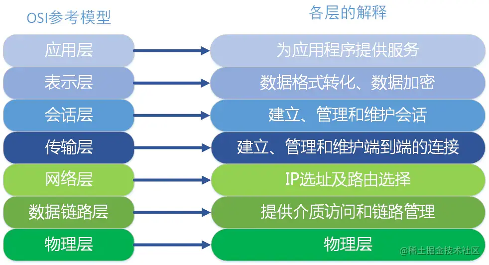

在每一层实现的协议也各不同，即每一层的服务也不同，下图列出了每层主要的传输协议：

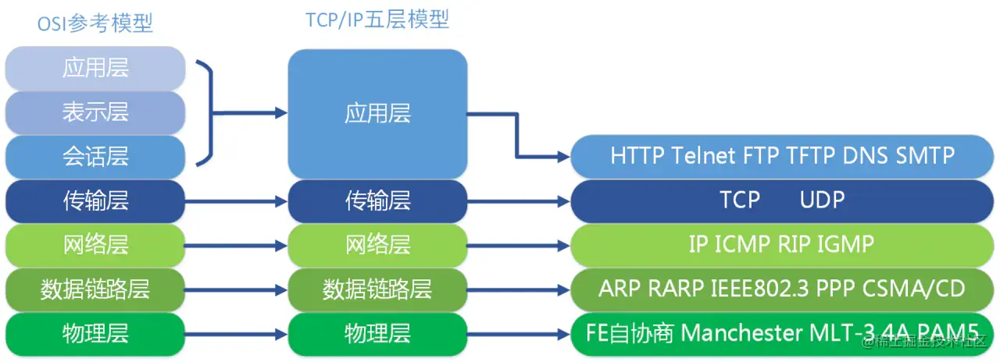

## 浏览器输入 URL 会发生什么？

大致的执行顺序为：

1. URL 解析
2. DNS 解析：缓存判断 + 查询 IP 地址
3. TCP 连接：TCP 三次握手
4. SSL/TLS 四次握手（只有 https 才有这一步）
5. 浏览器发送请求
6. 服务器响应请求并返回数据
7. 浏览器解析渲染页面
8. 断开连接：TCP 四次挥手

### URL 解析

浏览器先会判断输入的字符是不是一个合法的 URL 结构，如果不是，浏览器会使用搜索引擎对这个字符串进行搜索。

**URL 结构组成**

`https://www.example.com:80/path/to/myfile.html?key1=value1&key2=value2#anchor`

-   **协议**：`https://`
    -   互联网支持多种协议，必须指明网址使用哪一种协议，默认是 HTTP 协议。
    -   HTTPS 是 HTTP 的加密版本，出于安全考虑，越来越多的网站使用这个协议。
-   **域名**：`www.example.com`
    -   主机（host）是资源所在的网站名或服务器的名字，又称为域名。上例的主机是`www.example.com`。也可以使用 IP 地址，比如`192.168.2.15`。
-   **端口**：`:80`
    -   跟在域名后面的是端口，域名和端口之间使用`:`作为分隔符。端口不是一个 URL 必须的部分，如果省略端口部分，将采用默认端口（HTTP 协议默认端口是 80，HTTPS 协议默认端口是 443）
-   **路径**：`/path/to/myfile.html`
    -   路径（path）是资源在网站的位置。比如，`/path/index.html`这个路径，指向网站的`/path`子目录下面的网页文件`index.html`
-   **查询参数**：`?key1=value1&key2=value2`
    -   查询参数（parameter）是提供给服务器的额外信息。参数的位置是在路径后面，两者之间使用`?`分隔
    -   多组参数之间使用`&`连接，比如`key1=value1&key2=value2`
-   **锚点**：`#anchor`
    -   从`#`开始到最后，都是锚部分。本例中的锚部分是`anchor`。锚部分也不是一个 URL 必须的部分。

### DNS 解析

**第一步：缓存判断**

判断是正确的 URL 格式之后，DNS 会在我们的缓存中查询是否有当前域名的 IP 地址。

基本步骤：

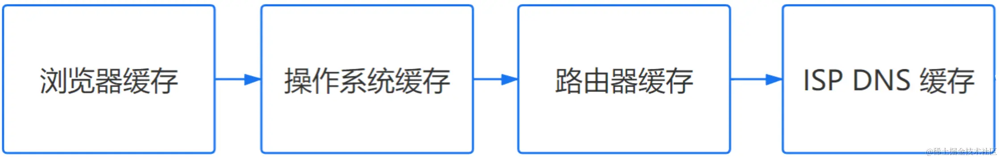

-   浏览器缓存：浏览器检查是否在缓存中
-   操作系统缓存：操作系统 DNS 缓存，去本地的 hosts 文件查找
-   路由器缓存：路由器 DNS 缓存
-   ISP 缓存： ISP DNS 缓存（ISP DNS 就是在客户端电脑上设置的首选 DNS 服务器，又称本地的 DNS 服务器）

第二步：查询 IP 地址

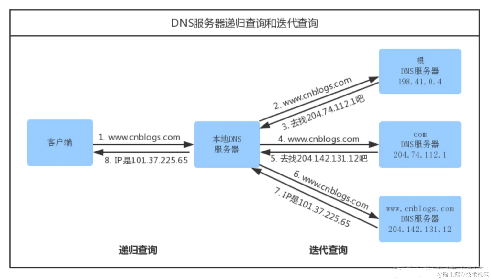

### TCP 连接：三次握手

**三次握手过程：**

**三次握手（Three-way Handshake）**其实就是指建立一个 TCP 连接时，需要客户端和服务器总共发送 3 个包。进行三次握手的主要作用就是\*\*为了确认双方的接收能力和发送能力是否正常、指定自己的初始化序列号为后面的可靠性传送做准备。实质上其实就是连接服务器指定端口，建立 TCP 连接，并同步连接双方的序列号和确认号，交换 TCP 窗口大小信息。

刚开始客户端处于 Closed 的状态，服务端处于 Listen 状态。

-   **第一次握手**：客户端给服务端发一个`SYN`报文，并指明客户端的初始化序列号 ISN，此时客户端处于 `SYN_SEND` 状态。
-   **第二次握手**：服务器收到客户端的`SYN`报文之后，会以自己的 `SYN` 报文作为应答，并且也是指定了自己的初始化序列号 `ISN`。同时会把客户端的 `ISN + 1` 作为`ACK` 的值，表示自己已经收到了客户端的 `SYN`，此时服务器处于 `SYN_REVD` 的状态。
-   **第三次握手**：客户端收到 `SYN` 报文之后，会发送一个 `ACK` 报文，当然，也是一样把服务器的 `ISN + 1` 作为` ACK` 的值，表示已经收到了服务端的 `SYN` 报文，此时客户端处于 `ESTABLISHED` 状态。服务器收到 `ACK` 报文之后，也处于 `ESTABLISHED` 状态，此时，双方已建立起了连接。

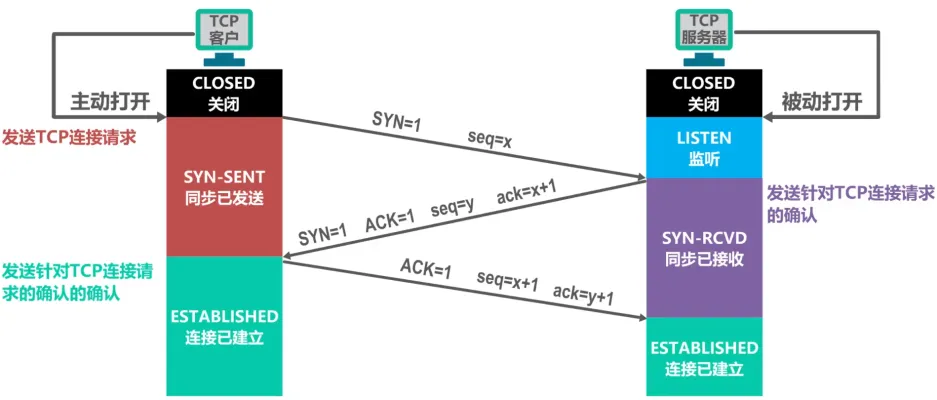
**为什么是三次握手？不是两次、四次？**

-   三次握手才可以阻止重复历史连接的初始化（主要原因）
-   三次握手才可以同步双方的初始序列号
-   三次握手才可以避免资源浪费

### SSL/TLS 四次握手（只有 https 才有这一步）

1. 客户端向服务器发起请求，请求中包含使用的协议版本号、生成的一个随机数、以及客户端支持的加密方法。
2. 服务器端接收到请求后，确认双方使用的加密方法、并给出服务器的证书、以及一个服务器生成的随机数。
3. 客户端确认服务器证书有效后，生成一个新的随机数，并使用数字证书中的公钥，加密这个随机数，然后发给服务器。并且还会提供一个前面所有内容的 hash 的值，用来供服务器检验。
4. 服务器使用自己的私钥，来解密客户端发送过来的随机数。并提供前面所有内容的 hash 值来供客户端检验。

客户端和服务器端根据约定的加密方法使用前面的三个随机数，生成对话秘钥，以后的对话过程都使用这个秘钥来加密信息。

### 浏览器发送请求

连接建立成功之后，浏览器向服务器发送**HTTP 请求报文**，来获取自己想要的数据

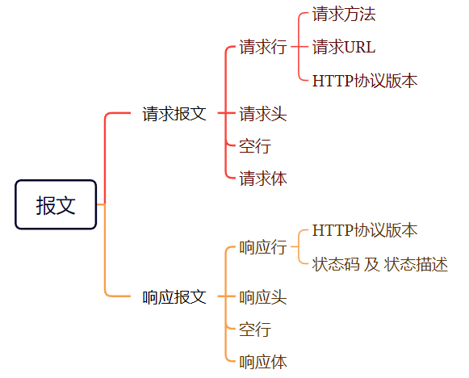

**请求报文由 4 部分组成：**

-   **请求行**：请求方法、请求的 url、http 协议及其版本
-   **请求头**：把浏览器的一些基础信息告诉服务器。比如包含了浏览器所使用的操作系统、浏览器内核等信息，以及当前请求的域名信息、浏览器端的 Cookie 信息等
-   **空行**：最后一个请求头之后是一个空行，发送回车符和换行符，通知服务器以下不再有请求头
-   **请求体**：当使用 POST, PUT 等方法时，通常需要客户端向服务器传递数据。这些数据就储存在请求正文中。

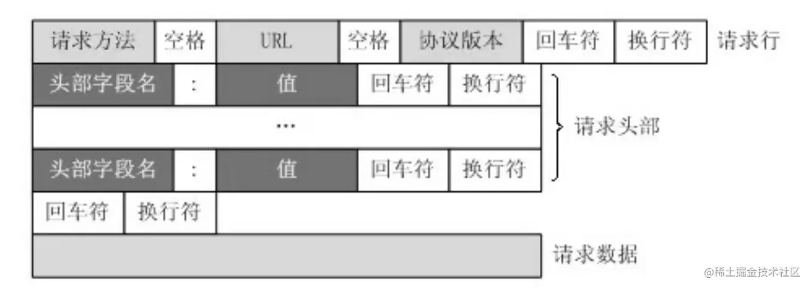

### 服务器响应请求并返回数据

服务器对 http 请求报文进行解析，并给客户端发送**HTTP 响应报文**对其进行响应

**响应报文由 4 部分组成：**

-   **响应行**：由 HTTP 版本协议字段、状态码和状态码的描述文本 3 个部分组成。
-   **响应头**：用于指示客户端如何处理响应体，告诉浏览器响应的类型、字符编码和字节大小等信息。
-   **空行**：最后一个响应头部之后是一个空行，发送回车符和换行符，通知服务器以下不再有响应头部。
-   **响应体**：返回客户端所需数据

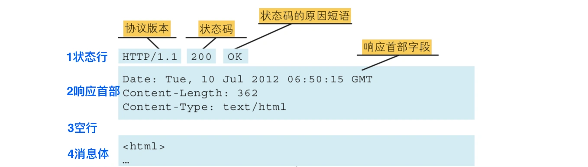

### 浏览器解析渲染页面

**下载 CSS 文件并不会阻塞 HTML 的解析。**

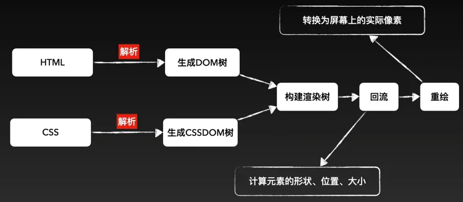

解析一：HTML 解析过程

默认情况下服务器会给浏览器返回 index.html 文件，所以解析 HTML 是所有步骤的开始：解析 HTML，会 构建 DOM Tree

当遇到我们的 script 文件的时候，我们是不能进行去构建 DOM Tree 的。它会停止继续构建，首先下载 JavaScript 代码，并且执行 JavaScript 的脚本，只有等到 JavaScript 脚本执行结束后，才会继续解析 HTML，构建 DOM 树。（普通 js 脚本会影响 HTML 解析）

解析二：生成 CSS 规则

-   在解析的过程中，如果遇到 CSS 的 link 元素，那么会由浏览器负责下载对应的 CSS 文件
    -   注意:下载 CSS 文件是不会影响 DOM 的解析的
-   浏览器下载完 CSS 文件后，就会对 CSS 文件进行解析，解析出对应的规则树
    -   可以称之为 **CSSOM** (CSS Object Model，**CSS 对象模型**)

解析三：构建 Render Tree

当有了 **DOM Tree 和 CSSOM Tree** 后，就可以两个结合来 **构建 Render Tree**

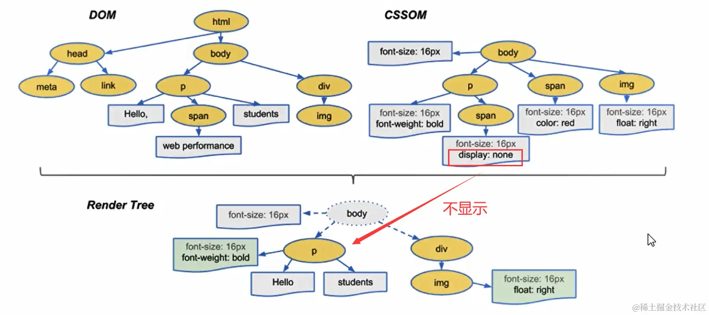

-   注意一：**link 元素不会阻塞 DOM Tree 的构建过程，但是会阻塞 Render Tree 的构建过程。**
    -   因为 Render Tree 在构建时，需要对应的 CSSOM Tree。当我们 DOMTree 解析完成的时候，如果 CSSOM Tree 没解析完成就会阻塞。当然一般情况下浏览器会进行优化处理，不会傻傻的等待
-   注意二：**Render Tree 和 DOMTree 并不是一一对应的关系。**
    -   比如对于 display 为 none 的元素，压根不会出现在 render tree 中

**解析四：布局(layout)和绘制(Paint)**

-   第四步是在渲染树(Render Tree)上运行 **布局(Layout)** 以计算每个节点的几何体。
    -   渲染树会 表示 **要显示哪些节点以及其他样式**，但是 **不表示 每个节点的尺寸、位置** 等信息
    -   **布局的主要目的是为了确定呈现树中所有节点的宽度、高度和位置信息**
-   第五步是将每个节点 **绘制(Paint)** 到屏幕上
    -   在绘制阶段，浏览器将布局阶段计算的 每个 frame 转为屏幕上实际的像素点
    -   包括 将元素的可见部分进行绘制，比如文本、颜色、边框、阴影、替换元素（比如 img）

也就是所谓的回流与重绘。

### TCP 断开连接：四次挥手

**四次挥手过程：**

-   **第一次挥手：** 若客户端认为数据发送完成，则它需要向服务端发送连接释放请求。
-   **第二次挥手**：服务端收到连接释放请求后，会告诉应用层要释放 TCP 链接。然后会发送 `ACK` 包，并进入 `CLOSE_WAIT` 状态，此时表明客户端到服务端的连接已经释放，不再接收客户端发的数据了。但是因为 TCP 连接是双向的，所以服务端仍旧可以发送数据给客户端。
-   **第三次挥手**：服务端如果此时还有没发完的数据会继续发送，完毕后会向客户端发送连接释放请求，然后服务端便进入 `LAST-ACK` 状态。
-   **第四次挥手：** 客户端收到释放请求后，向服务端发送确认应答，此时客户端进入 `TIME-WAIT` 状态。该状态会持续 `2MSL`（最大段生存期，指报文段在网络中生存的时间，超时会被抛弃） 时间，若该时间段内没有服务端的重发请求的话，就进入 `CLOSED` 状态。当服务端收到确认应答后，也便进入 `CLOSED` 状态。

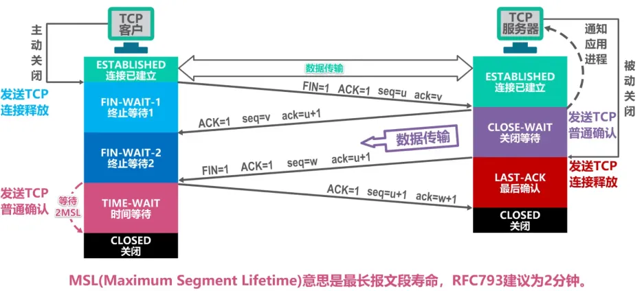

**为什么是四次挥手？**

TCP 使用四次挥手的原因是因为 **TCP 的连接是全双工的**，所以需要双方分别释放到对方的连接，**单独一方的连接释放，只代 表不能再向对方发送数据，连接处于的是半释放的状态。**

-   关闭连接时，客户端向服务端发送`FIN`时，仅仅表示客户端不再发送数据了但是还能接收数据。
-   服务端收到客户端的`FIN`报文时，先回一个`ACK`应答报文，而服务端可能还有数据需要处理和发送，等服务端不再发送数据时，才发送`FIN`报文给客户端来表示同意现在关闭连接。

从上面过程可知，服务端通常需要等待完成数据的发送和处理，所以服务端的`ACK`和`FIN`一般都会分开发送，因此是需要四次挥手。

## HTTP 请求报文和响应报文是什么样的

**请求报文：**

请求报文由 4 部分组成：

-   请求行：请求方法、请求的 url、http 协议及其版本
-   请求头：把浏览器的一些基础信息告诉服务器。比如包含了浏览器所使用的操作系统、浏览器内核等信息，以及当前请求的域名信息、浏览器端的 Cookie 信息等
-   空行：最后一个请求头之后是一个空行，发送回车符和换行符，通知服务器以下不再有请求头
-   请求体：当使用 POST, PUT 等方法时，通常需要客户端向服务器传递数据。这些数据就储存在请求正文中。

**响应报文：**

服务器对 http 请求报文进行解析，并给客户端发送**HTTP 响应报文**对其进行响应。

响应报文由 4 部分组成：

-   响应行：由 HTTP 版本协议字段、状态码和状态码的描述文本 3 个部分组成。
-   响应头：用于指示客户端如何处理响应体，告诉浏览器响应的类型、字符编码和字节大小等信息。
-   空行：最后一个响应头部之后是一个空行，发送回车符和换行符，通知服务器以下不再有响应头部。
-   响应体：返回客户端所需数据

## HTTP 请求方法有哪些

1. **GET**：请求指定的资源（幂等）
2. **POST**：向指定资源提交数据进行处理请求（例如表单提交）
3. **PUT**：更新指定资源（上传文件，更新数据）（幂等）
4. **DELETE**：删除指定资源（幂等）
5. **HEAD**：获取报文首部，和 GET 相比，不返回报文主体部分
6. **OPTIONS**：询问服务器支持的请求方法
7. **PATCH**：对资源进行部分更新
8. **TRACE**：回显服务器收到的请求，主要用于测试或诊断

## GET 请求和 POST 请求的区别

-   **用途**：GET 请求通常用于获取数据，POST 请求用于提交数据
-   **数据传输**：GET 请求将参数附加在 URL 之后，POST 请求将数据放在请求体中
-   **安全性**：GET 请求由于参数暴露在 URL 中，安全性较低；POST 请求参数不会暴露在 URL 中，相对更安全
-   **请求长度**：GET 请求受到 URL 长度限制，数据量有限；POST 请求理论上没有大小限制
-   **幂等性**：GET 请求是幂等的，即多次执行相同的 GET 请求，资源的状态不会改变；POST 请求不是幂等的，因为每次提交都可能改变资源的状态
-   **缓存**：GET 请求可以被缓存，POST 请求默认不会被缓存
-   **参数类型**：POST 的参数传递支持更多的数据类型

## HTTP 请求中常见的状态码

| **类别** | **原因**                                                 | **常见的状态码**   |
| -------- | -------------------------------------------------------- | ------------------ |
| 1xx      | 提示信息，表示目前是协议处理的中间状态，还需要后续的操作 |                    |
| 2xx      | 成功，报文已经收到并正确处理                             | 200、204、206      |
| 3xx      | 重定向，资源位置发生变动，需要客户端重新发送请求         | 301、302、304      |
| 4xx      | 客户端错误，请求报文有误，服务器无法处理                 | 400、403、404      |
| 5xx      | 服务器错误，服务器在处理请求时发生了内部错误             | 500、501、502、503 |

1. `1xx` 类状态码属于\*\*提示信息，是协议处理中的一种中间状态，实际用到的比较少。
2. `2xx` 类状态码表示服务器\*\*成功处理了客户端的请求，也是最愿意看到的状态。
    - `200 OK`表示客户端发来的请求被服务器端正常处理了。
    - `204 No Content` 也是常见的成功状态码，与 200 OK 基本相同，但响应头中没有 body 数据。
    - `206 Partial Content` 是用于 HTTP 分块下载或断点续传，表示响应返回的 body 数据并不是全部资源，而是其中的一部分，也是服务器处理成功的状态。
3. `3xx` 类状态码表示客户端请求的资源发生了变动，需要客户端用新的 URL 重新发送请求获取资源，也就是重定向。
    - `301 Moved Permanently` 表示永久重定向，说明请求的资源已经不在了，需要改用新的 URL 再次访问。
    - `302 Found` 表示临时重定向，说明请求的资源还在，但暂时需要用另一个 URL 来访问。
    - `304 Not Modified` 与浏览器缓存相关。
4. `4xx` 类状态码表示客户端发送的报文有误，服务器无法处理，也就是错误码的含义。
    - `400 Bad Request` 表示客户端请求的报文有错误，但只是个模糊的错误。
    - `403 Firbidden` 表示服务器禁止访问资源，并不是客户端的请求错误。
    - `404 Not Found` 表示请求的资源在服务器上不存在或未找到。
5. `5xx` 类状态码表示客户端请求报文正确，但是服务器处理时内部发生了错误，属于服务器端的错误码。
    - `500 Internal Server Error` 与 400 类似，一个模糊通用的错误状态码，只知道服务器发生了错误。
    - `501 Not Implemented` 表示客户端请求的功能还不支持。
    - `502 Bad Gateway`通常是服务器作为网关或代理时返回的错误码，表示服务器自身工作正常，访问后端服务器发生了错误。
    - `503 Service Unavailable` 表示服务器当前很忙，暂时无法响应客户端。

## 什么是强缓存和协商缓存

强缓存和协商缓存是 HTTP 缓存机制的两种类型，它们用于减少服务器的负担和提高网页加载速度。

1. **强缓存**：客户端在没有向服务器发送请求的情况下，直接从本地缓存中获取资源。
    - **Expires 强缓存**：设置一个强缓存时间，此时间范围内，从内存中读取缓存并返回。但是因为 `Expires`判断强缓存过期的机制是获取本地时间戳，与之前拿到的资源文件中的 `Expires` 字段的时间做比较来判断是否需要对服务器发起请求。这里有一个巨大的漏洞：“如果我本地时间不准咋办？”所以目前已经被废弃了。
    - **Cache-Control 强缓存**：目前使用的强缓存是通过 HTTP 响应头中的 `Cache-Control`字段实现，通过 `max-age` 来告诉浏览器在指定时间内可以直接使用缓存数据，无需再次请求。
2. **协商缓存**：当强缓存失效时，浏览器会发送请求到服务器，通过 `ETag` 或 `Last-Modified` 等 HTTP 响应头与服务器进行验证，以确定资源是否被修改。如果资源未修改，服务器返回 `304 Not Modified` 状态码，告知浏览器使用本地缓存；如果资源已修改，则返回新的资源，浏览器更新本地缓存。这种方式需要与服务器通信，但可以确保用户总是获取最新的内容。
    - 基于**`Last-Modified`的协商缓存**
        - `Last-Modified`是资源的最后修改时间，服务器在响应头部中返回。
        - 当客户端读取到`Last-modified`的时候，会在下次的请求标头中携带一个字段：`If-Modified-Since`，而这个请求头中的`If-Modified-Since`就是服务器第一次修改时候给他的时间。
        - 服务器比较请求中的`If-Modified-Since`值与当前资源的`Last-Modified`值，如果比对的结果是没有变化，表示资源未发生变化，返回状态码马`304 Not Modified`。如果比对的结果说资源已经更新了，就会给浏览器正常返回资源，返回 200 状态。
    - 但是这样的协商缓存有两个**缺点**：
        - 因为是更改文件修改时间来判断的，所以在文件内容本身不修改的情况下，依然有可能更新文件修改时间（比如修改文件名再改回来），这样，就有可能文件内容明明没有修改，但是缓存依然失效了。
        - 当文件在极短时间内完成修改的时候（比如几百毫秒）。因为文件修改时间记录的最小单位是秒，所以，如果文件在几百毫秒内完成修改的话，文件修改时间不会改变，这样，即使文件内容修改了，依然不会返回新的文件。
    - 基于`ETag`的协商缓存：将原先协商缓存的比较时间戳的形式修改成了比较文件指纹（根据文件内容计算出的唯一哈希值）。
        - `ETag`是服务器为资源生成的唯一标识符（文件指纹），可以是根据文件内容计算出的哈希值，服务端将其和资源一起放回给客户端。
        - 客户端在请求头部的`If-None-Match`字段中携带上次响应的`ETag`值。
        - 服务器比较请求中的`If-None-Match`值与当前资源的勺`ETag`值，如果匹配，表示资源未发生变化，返回状态码马`304 Not Modified`。如果两个文件指纹不吻合，则说明文件被更改，那么将新的文件指纹重新存储到响应头的`ETag`中并返回给客户端。

强缓存和协商缓存是 HTTP 缓存机制的两种类型，它们用于减少服务器的负担和提高网页加载速度。

## HTTP1.0 与 HTTP1.1 的区别

1. 持久连接：`HTTP/1.1`默认支持持久连接，允许在一个 TCP 连接上发送多个 HTTP 请求和响应，减少了连接建立和关闭的开销。而`HTTP/1.0` 默认为短连接，每次请求都需要建立一个 TCP 连接，并通过`Connection：keep-alive`头来实现持久连接。
2. 管道化：`HTTP/1.1`支持管道化，允许客户端在第一个请求的响应到达之前发送多个请求，这可以减少等待时间，提高效率。`HTTP/1.0`不支持管道化。
3. 缓存控制：`HTTP1.0` 主要使用`If-Modified-Since / Expires`来做为缓存判断的标准，而`HTTP1.1`则引 l 入了更多的缓存控制策略例如`Etag／ If-None-Match`等更多可供选择的缓存头来控制缓存策略。
4. 错误处理：`HTTP/1.1`增加了一些新的 HTTP 状态码，如`100 Continue`，用于增强错误处理和请求的中间响应。
5. Host 头：`HTTP/1.1`引入了`Host` 头，允许客户端指定请求的主机名，这使得在同一台服务器上托管多个域名成为可能。`HTTP/1.0`没有这个头字段。
6. 带宽优化：`HTTP1.0` 中，存在一些浪费带宽的现象，例如客户端只是需要某个对象的一部分，而服务器却将整个对象送过来了，并且不支持断点续传功能，而`HTTP1.1`则在请求头引入了`range` 头域，它允许只请求资源的某个部分，即返回码是`206 (PartialContent)`。

## HTTP2.0 与 HTTP1.1 的区别

1. 二进制协议：`HTTP/2.0` 采用二进制格式传输数据，而非 `HTTP/1.1` 的文本格式，使得解析更高效，减少了解析时间。
2. 多路复用：`HTTP/2.0` 支持多路复用，允许在单个 TCP 连接上并行交错发送多个请求和响应，解决了 `HTTP/1.1`中的\*\*队头阻塞问题。
3. 头部压缩：`HTTP/2.0` 引入了 `HPACK` 压缩算法，对请求和响应的头部信息进行压缩，减少了冗余头部信息的传输，提高了传输效率。
4. 服务器推送：`HTTP/2.0` 允许服务器主动推送资源给客户端，而不需要客户端明确请求，这可以减少页面加载时间。
5. 优先级和依赖：`HTTP/2.0` 允许客户端为请求设置优先级，并表达请求之间的依赖关系，资源加载更加有序。

## HTTP3.0 有了解过吗

HTTP/3 基于 UDP 协议实现了类似于 TCP 的多路复用数据流、传输可靠性等功能，这套功能被称为 QUIC 协议。

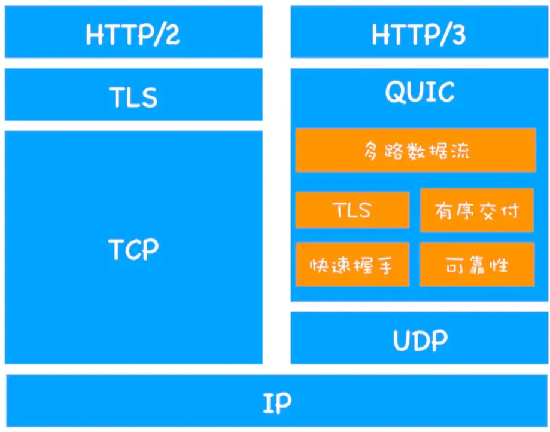

1. 流量控制、传输可靠性功能：QUIC 在 UDP 的基础上增加了一层来保证数据传输可靠性，它提供了数据包重传、拥塞控制、以及其他一些 TCP 中的特性。
2. 集成 TLS 加密功能：目前 QUIC 使用 TLS1.3，减少了握手所花费的 RTT 数。
3. 多路复用：同一物理连接上可以有多个独立的逻辑数据流，实现了数据流的单独传输，解决了 TCP 的队头阻塞问题。
4. 快速握手：由于基于 UDP，可以实现使用 0 ~ 1 个 RTT 来建立连接。

## HTTPS 和 HTTP 有哪些区别

两者的主要区别在于安全性和数据加密：

1. 加密层：`HTTPS`在`HTTP`的基础上增加了`SSL/TLS`协议作为加密层，确保数据传输的安全性。
2. 数据安全：`HTTPS`通过加密，保护数据在传输过程中不被窃听或篡改，而`HTTP`数据传输是明文的，容易受到攻击。
3. 端口：`HTTPS`通常使用端口`443`，而 `HTTP`使用端口`80`。

## HTTPS 工作原理

`HTTPS`主要基于`SSL/TLS`协议，确保了数据传输的安全性和完整性，其建立连接并传输数据的过程如下:

1. 密钥交换：客户端发起 HTTPS 请求后，服务器会发送其公钥证书给客户端。
2. 证书验证：客户端会验证服务器的证书是否由受信任的证书颁发机构（CA）签发，并检查证书的有效性。
3. 加密通信：一旦证书验证通过，客户端会生成一个随机的对称加密密钥，并使用服务器的公钥加密这个密钥，然后发送给服务器。
4. 建立安全连接：服务器使用自己的私钥解密得到对称加密密钥，此时客户端和服务器都有了相同的密钥，可以进行加密和解密操作。
5. 数据传输：使用对称加密密钥对所有传输的数据进行加密，确保数据在传输过程中的安全性。
6. 完整性校验：SSL/TLS 协议还包括消息完整性校验机制，如消息认证码，确保数据在传输过程中未被篡改。
7. 结束连接：数据传输完成后，通信双方会进行会话密钥的销毁，以确保不会留下安全隐患。

## TCP 和 UDP 的区别

1. TCP 是**面向连接**的协议，需要在数据传输前建立连接；UDP 是无连接的，不需要建立连接。
2. TCP 提供**可靠**的数据传输，保证数据包的顺序和完整性；UDP 不保证数据包的顺序或完整性。
3. TCP 具有**拥塞控制机制**，可以根据网络状况调整数据传输速率；UDP 没有拥塞控制，发送速率通常固定。
4. TCP 通过**滑动窗口机制**进行流量控制，避免接收方处理不过来；UDP 没有流量控制。
5. TCP 能够**检测并重传**丢失或损坏的数据包；UDP 不提供错误恢复机制。
6. TCP 有复杂的报文头部，包含序列号、确认号等信息；UDP 的报文头部相对简单。
7. 由于 TCP 的连接建立、数据校验和重传机制，其性能开销通常比 UDP 大；UDP 由于简单，性能开销小。
8. 适用场景：TCP 适用于需要可靠传输的应用，如网页浏览、文件传输等；UDP 适用于对实时性要求高的应用，如语音通话、视频会议等。

## **TCP 如何确保数据传输的可靠性？**

TCP 通过以下核心机制保证数据的可靠传输：

**（1）连接管理：三次握手与四次挥手**

-   **三次握手（建立连接）**：

    1. 客户端发送`SYN=1`和随机初始序列号`seq=x`，进入`SYN_SENT`状态。
    2. 服务端回复`SYN=1, ACK=1`、自己的序列号`seq=y`及确认号`ack=x+1`，进入`SYN_RCVD`状态。
    3. 客户端发送`ACK=1`，确认号`ack=y+1`，双方进入`ESTABLISHED`状态。**关键点**：

    -   同步初始序列号（ISN），防止历史连接干扰。
    -   三次握手确保双方收发能力正常，避免资源浪费。

-   **四次挥手（释放连接）**：

    1. 主动方发送`FIN=1`和序列号`seq=u`，进入`FIN_WAIT_1`状态。
    2. 被动方回复`ACK=1`和确认号`ack=u+1`，进入`CLOSE_WAIT`状态；主动方收到后进入`FIN_WAIT_2`。
    3. 被动方处理完数据后发送`FIN=1`和序列号`seq=v`，进入`LAST_ACK`状态。
    4. 主动方回复`ACK=1`和确认号`ack=v+1`，等待`2MSL`后关闭连接。**关键点**：

    -   全双工通信需分别关闭两个方向的数据流。
    -   `TIME_WAIT`状态确保最后一个 ACK 到达，避免报文混淆。

**（2）差错控制：序列号与确认应答（ACK）**

-   **序列号（Sequence Number）**：为每个字节数据分配唯一编号，解决数据乱序问题。
-   **确认应答（ACK）**：接收方返回`ACK=1`和`ack=下一个期望序列号`（如收到`seq=1-1000`，则返回`ack=1001`）。
-   **累计确认机制**：即使收到乱序数据（如`seq=1500-2000`先到达），仍返回最近连续数据的 ACK（如`ack=1001`），触发发送方重传丢失部分。

**示例**：若发送方发送`seq=1-1000`、`seq=1001-2000`、`seq=2001-3000`，但`1001-2000`丢失，接收方会持续返回`ack=1001`，直到发送方重传该段数据。

**（3）超时重传机制**

-   **超时重传（RTO）**：
    -   动态计算超时时间（基于 RTT 及其方差），若超时未收到 ACK 则重传报文。
    -   使用**Karn 算法**避免重传报文的 RTT 测量干扰。
-   **快速重传**：
    -   当收到 3 次重复 ACK（如连续 3 次`ack=1001`）时，立即重传对应报文（`seq=1001-2000`）。
-   **选择确认（SACK）**：
    -   接收方通过 SACK 选项明确告知已收到的数据块（如`ack=1001, SACK=2001-3000`），减少不必要的重传。

**（4）流量控制（滑动窗口协议）**

-   **接收窗口（rwnd）**：接收方通过 TCP 头部的`Window`字段通告剩余缓冲区大小，发送方据此调整发送速率。
-   **零窗口处理**：
    -   若接收方缓冲区满（`rwnd=0`），发送方暂停发送并周期性发送 1 字节的探测报文，触发接收方更新窗口。
-   **糊涂窗口综合征（SWS）避免**：
    -   接收方：等待缓冲区有足够空间（如 ≥MSS）再通告窗口更新。
    -   发送方：使用 Nagle 算法合并小数据包（积累到 MSS 或收到 ACK 再发送）。

**（5）拥塞控制**

-   **慢启动**：
    -   连接开始时，拥塞窗口（`cwnd`）从`1 MSS`指数增长（每`RTT`翻倍），直到阈值`ssthresh`。
-   **拥塞避免**：
    -   窗口线性增长（每 RTT 增加 1 MSS），避免过快引发拥塞。
-   **快重传与快恢复**：
    -   收到 3 次重复 ACK 时，重传丢失报文并将`ssthresh`设为当前`cwnd/2`，`cwnd`降至`ssthresh + 3`，进入线性增长阶段。
-   **拥塞信号处理**：
    -   **超时重传**：视为严重拥塞，重置`cwnd=1`并重新慢启动。
    -   **重复 ACK**：视为轻微拥塞，触发快重传和快恢复。

**算法变种**：

-   **Reno**：经典算法，快恢复后直接进入拥塞避免。
-   **CUBIC**（Linux 默认）：使用三次函数调整窗口，更适合高带宽时延积网络。

**对网络性能的影响**

-   **流量控制**：
    -   优点：防止接收方缓冲区溢出，匹配两端处理能力。
    -   缺点：窗口过小会限制吞吐量；零窗口探测增加延迟。
-   **拥塞控制**：
    -   优点：避免网络过载，提升全局公平性。
    -   缺点：激进算法（如 BBR）可能抢占其他流带宽。
-   **快速重传**：
    -   优点：减少超时等待，降低延迟。
    -   缺点：依赖冗余 ACK，可能误判乱序为丢包。

**总结：**

TCP 通过分层机制确保可靠性：

1. **连接管理**（三次握手/四次挥手）建立可靠通道。
2. **序列号与 ACK**实现数据有序传输和差错检测。
3. **超时重传**和**快速重传**修复丢包问题。
4. **流量控制**通过滑动窗口匹配收发速率。
5. **拥塞控制**动态调整发送速率，平衡网络负载。这些机制协同工作，在保证可靠性的同时优化吞吐量、延迟和公平性。

## **TCP 拥塞控制**

TCP 的拥塞控制机制主要是以下四种机制：

-   慢启动（慢开始）
-   拥塞避免
-   快速重传
-   快速恢复

1. **慢启动（慢开始）**

-   在开始发送的时候设置`cwnd = 1`（`cwnd`指的是拥塞窗口）
-   思路：开始的时候不要发送大量数据，而是先测试一下网络的拥塞程度，由小到大增加拥塞窗口的大小。
-   为了防止`cwnd`增长过大引起网络拥塞，设置一个慢开始门限(`ssthresh` 状态变量)
    -   当 cnwd < ssthresh，使用慢开始算法
    -   当 cnwd = ssthresh，既可使用慢开始算法，也可以使用拥塞避免算法
    -   当 cnwd > ssthresh，使用拥塞避免算法

2. **拥塞避免**

-   拥塞避免未必能够完全避免拥塞，是说在拥塞避免阶段将拥塞窗口控制为按线性增长，使网络不容易出现阻塞。
-   思路： 让拥塞窗口`cwnd`缓慢的增大，即每经过一个返回时间`RTT`就把发送方的拥塞控制窗口加一
-   无论是在慢开始阶段还是在拥塞避免阶段，只要发送方判断网络出现拥塞，就把慢开始门限设置为出现拥塞时的发送窗口大小的一半。然后把拥塞窗口设置为 1，执行慢开始算法。如图所示:

其中，判断网络出现拥塞的根据就是没有收到确认，虽然没有收到确认可能是其他原因的分组丢失，但是因为无法判定，所以都当做拥塞来处理。

3. **快速重传**

-   快重传要求接收方在收到一个失序的报文段后就立即发出重复确认(为的是使发送方及早知道有报文段没有到达对方)。发送方只要连续收到三个重复确认就立即重传对方尚未收到的报文段，而不必继续等待设置的重传计时器时间到期。
-   由于不需要等待设置的重传计时器到期，能尽早重传未被确认的报文段，能提高整个网络的吞吐量

4. **快速恢复**

-   当发送方连续收到三个重复确认时，就执行“乘法减小”算法，把`ssthresh`门限减半。但是接下去并不执行慢开始算法。
-   考虑到如果网络出现拥塞的话就不会收到好几个重复的确认，所以发送方现在认为网络可能没有出现拥塞。所以此时不执行慢开始算法，而是将`cwnd`设置为`ssthresh`的大小，然后执行拥塞避免算法。

## **TCP 流量控制**

TCP 提供一种机制可以让「发送方」根据「接收方」的实际接收能力控制发送的数据量，这就是所谓的流量控制。

流量控制就是为了让发送方发送数据的速度不要太快，要让接收方来得及接收。TCP 采用大小可变的**滑动窗口**进行流量控制，窗口大小的单位是字节。这里说的窗口大小其实就是每次传输的数据大小。

-   当一个连接建立时，连接的每一端分配一个缓冲区来保存输入的数据，并将缓冲区的大小发送给另一端。
-   当数据到达时，接收方发送确认，其中包含了自己剩余的缓冲区大小。（剩余的缓冲区空间的大小被称为窗口，指出窗口大小的通知称为窗口通告 。接收方在发送的每一确认中都含有一个窗口通告。）
-   如果接收方应用程序读数据的速度能够与数据到达的速度一样快，接收方将在每一确认中发送一个正的窗口通告。
-   如果发送方操作的速度快于接收方，接收到的数据最终将充满接收方的缓冲区，导致接收方通告一个零窗口 。发送方收到一个零窗口通告时，必须停止发送，直到接收方重新通告一个正的窗口。

**TCP 报文相关字段**

与流量控制直接相关的 TCP 首部字段：

1. **窗口大小(Window Size)**：16 位字段，表示接收方当前可用的缓冲区空间
2. **确认号(Acknowledgment Number)**：32 位字段，表示期望收到的下一个字节序号
3. **选项字段(Options)**：
    - 窗口缩放选项(Window Scale)：用于支持更大的窗口大小(通过左移位数扩展)
    - `SACK`选项：选择性确认，提高重传效率
4. **接收窗口(rwnd)**：接收方通告的可用缓冲区大小
5. **发送窗口(cwnd)**：发送方实际使用的窗口大小(取 rwnd 和拥塞窗口的较小值)
6. **窗口滑动**：随着 ACK 到达，窗口向前滑动，允许发送新数据
7. **零窗口僵局**：通过持续计时器和探测报文解决
8. **糊涂窗口综合征**：通过 Nagle 算法或接收方延迟确认避免小窗口问题

流量控制是 TCP 可靠传输的核心机制之一，它与拥塞控制协同工作，共同保证了 TCP 协议在高性能与公平性之间的平衡。

## **基于 UDP 实现可靠传输的核心机制（QUIC 协议为例）**

**为什么需要基于 UDP 实现可靠传输？**

-   **UDP 本身是无连接的、不可靠的**，不保证数据顺序和完整性，但它的优势是**低延迟、无队头阻塞**。
-   **TCP 虽然可靠，但存在以下问题**：
    -   建立连接需要**三次握手**（1.5 RTT），HTTPS + TLS 1.3 还需要额外握手（1 RTT），导致首字节延迟高。
    -   **队头阻塞（Head-of-Line Blocking）**：TCP 是字节流协议，如果某个包丢失，后续数据即使到达也要等待重传，影响整体传输速度。
    -   **连接迁移问题**：TCP 连接基于 IP + 端口，切换网络（如 Wi-Fi → 4G）会导致连接中断。
-   **QUIC（Quick UDP Internet Connections）** 基于 UDP 实现可靠传输，解决 TCP 的痛点。

**QUIC 如何实现可靠传输？**

1. **数据包编号 + 确认机制（类似 TCP）**

-   每个数据包都有唯一编号（Packet Number），即使网络乱序也能正确重组。
-   采用 ACK 确认机制，接收方告知发送方哪些数据已收到，未确认的数据会触发超时重传。

2. **流量控制（类似 TCP）**

-   接收方通过窗口通告（Window Advertisement） 告知发送方可接收的数据量，防止发送过快导致缓冲区溢出。
-   动态调整发送速率，适应网络状况。

3. **拥塞控制（类似 TCP）**

-   采用类似 TCP 的拥塞控制算法（如 Cubic、BBR），动态调整发送速率，避免网络拥塞。
-   改进点：QUIC 的拥塞控制更灵活，可以针对不同流（Stream）独立调整。

4. **多路复用（解决 TCP 队头阻塞）**

-   QUIC 支持多个独立的流（Stream），每个流的数据独立传输，某个流丢包不会阻塞其他流。
-   对比 TCP：TCP 是单流模型，丢包会导致后续数据全部等待。

5. **快速握手（0-RTT/1-RTT）**

-   首次连接：1 RTT 完成密钥协商（TLS 1.3 + QUIC 合并握手）。
-   再次连接：支持 0-RTT，直接发送数据，减少延迟。

6. **连接迁移（Connection Migration）**

-   QUIC 使用 Connection ID 标识连接，而不是 IP + 端口。
-   切换网络（如 Wi-Fi → 5G）时，连接不会中断，仍可继续传输。

7. **前向纠错（FEC，可选）**

-   发送冗余数据包，少量丢包时无需重传，直接恢复数据（类似 RAID 5 的奇偶校验）。
-   适用于实时音视频，减少重传延迟。

## TCP 三次握手

**三次握手过程：**

**三次握手（Three-way Handshake）**其实就是指建立一个 TCP 连接时，需要客户端和服务器总共发送 3 个包。进行三次握手的主要作用就是为了确认双方的接收能力和发送能力是否正常、指定自己的初始化序列号为后面的可靠性传送做准备。实质上其实就是连接服务器指定端口，建立 TCP 连接，并同步连接双方的序列号和确认号，交换 TCP 窗口大小信息。

刚开始客户端处于 Closed 的状态，服务端处于 Listen 状态。

-   **第一次握手**：客户端给服务端发一个`SYN`报文，并指明客户端的初始化序列号 ISN，此时客户端处于 `SYN_SEND` 状态。

:::info
首部的同步位 SYN=1，初始序号 seq=x，SYN=1 的报文段不能携带数据，但要消耗掉一个序号。

:::

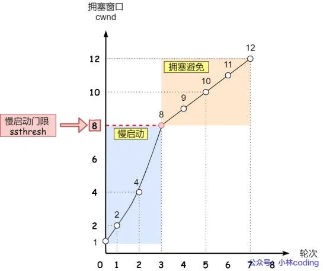

-   **第二次握手**：服务器收到客户端的`SYN`报文之后，会以自己的 `SYN` 报文作为应答，并且也是指定了自己的初始化序列号 `ISN`。同时会把客户端的 `ISN + 1` 作为`ACK` 的值，表示自己已经收到了客户端的 `SYN`，此时服务器处于 `SYN_REVD` 的状态。

:::info
在确认报文段中 SYN=1，ACK=1，确认号 ack=x+1，初始序号 seq=y

:::

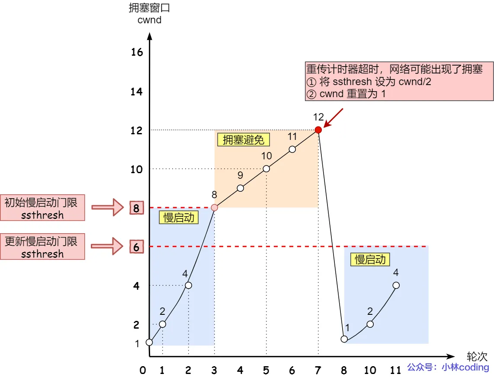

-   **第三次握手**：客户端收到 `SYN` 报文之后，会发送一个 `ACK` 报文，当然，也是一样把服务器的 `ISN + 1` 作为` ACK` 的值，表示已经收到了服务端的 `SYN` 报文，此时客户端处于 `ESTABLISHED` 状态。服务器收到 `ACK` 报文之后，也处于 `ESTABLISHED` 状态，此时，双方已建立起了连接。

:::info
确认报文段 ACK=1，确认号 ack=y+1，序号 seq=x+1（初始为 seq=x，第二个报文段所以要+1），ACK 报文段可以携带数据，不携带数据则不消耗序号。

:::

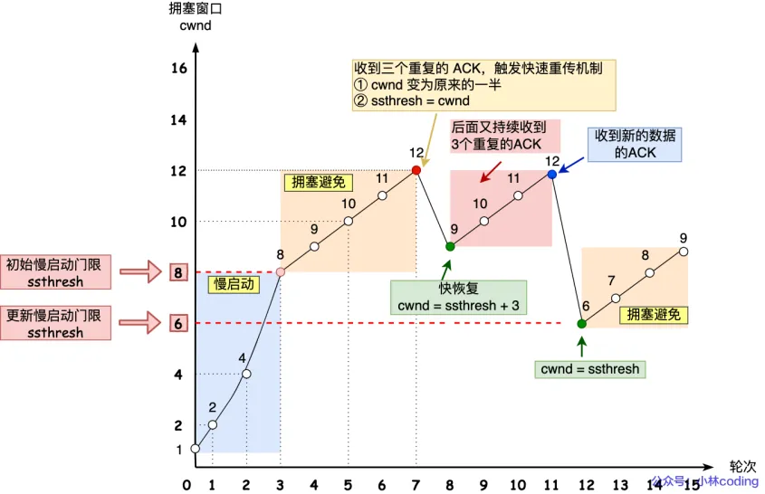

TCP 三次握手连接建立过程：

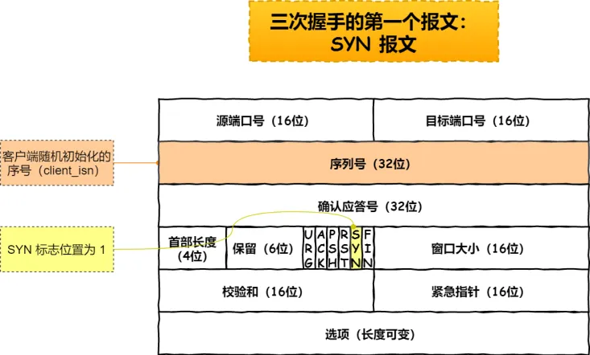

---

**为什么是三次握手？不是两次、四次？**

-   三次握手才可以阻止重复历史连接的初始化（主要原因）
-   三次握手才可以同步双方的初始序列号
-   三次握手才可以避免资源浪费

解释如下：

1. **可以阻止重复历史连接的初始化（主要原因）**

客户端连续发送多次 `SYN`（都是同一个四元组，注意：不是重传报文，重传报文的序列号是一样的）建立连接的报文，在网络拥堵情况下:

-   一个「旧 `SYN` 报文」比「最新的`SYN`」报文早到达了服务端，那么此时服务端就会回一个`SYN+ACK`报文给客户端，此报文中的确认号是`91（90+1）`。
-   客户端收到后，发现自己期望收到的确认号应该是`100+1`，而不是 `90+1`，于是就会回 `RST`报文。
-   服务端收到`RST`报文后，就会释放连接。
-   后续最新的 `SYN` 抵达了服务端后，客户端与服务端就可以正常的完成三次握手了。

上述中的「旧 `SYN` 报文」称为历史连接，TCP 使用三次握手建立连接的最主要原因就是防止「历史连接」初始化了连接。在两次握手的情况下，服务端没有中间状态给客户端来阻止历史连接，导致服务端可能建立一个历史连接，造成资源浪费。

在两次握手的情况下，服务端在收到 `SYN` 报文后，就进入`ESTABLISHED` 状态，意味着这时可以给对方发送数据，但是客户端此时还没有进入`ESTABLISHED` 状态，假设这次是历史连接，客户端判断到此次连接为历史连接，那么就会回`RST`报文来断开连接，而服务端在第一次握手的时候就进入`ESTABLISHED`状态，所以它可以发送数据的，但是它并不知道这个是历史连接，它只有在收到`RST`报文后，才会断开连接。

2. **同步双方的初始序列号**

TCP 协议的通信双方，都必须维护一个「序列号」，序列号是可靠传输的一个关键因素，它的作用：

-   接收方可以去除重复的数据
-   接收方可以根据数据包的序列号按序接收
-   可以标识发送出去的数据包中，哪些是已经被对方收到的（通过 ACK 报文中的序列号知道）

四次握手其实也能够可靠的同步双方的初始化序号，但由于第二步和第三步可以优化成一步，所以就成了「三次握手」。

而两次握手只保证了一方的初始序列号能被对方成功接收，没办法保证双方的初始序列号都能被确认接收。

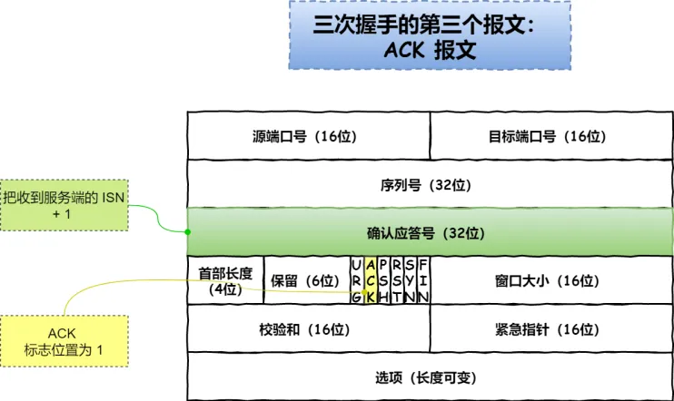

3. **避免资源浪费**

如果只有「两次握手」，当客户端发生的 SYN 报文在网络中阻塞，客户端没有接收到 ACK 报文，就会重新发送 SYN，由于没有第三次握手，服务端不清楚客户端是否收到了自己回复的 ACK 报文，所以服务端每收到一个 SYN 就只能先主动建立一个连接。

如果客户端发送的 SYN 报文在网络中阻塞了，重复发送多次 SYN 报文，那么服务端在收到请求后就会建立多个冗余的无效链接，造成不必要的资源浪费。

**可能存在的安全性问题，如 SYN 洪范攻击，以及如何防范：**

假设攻击者短时间伪造不同 IP 地址的 SYN 报文，服务端每接收到一个 SYN 报文，就进入 SYN_RCVD 状态，但服务端发送出去的 ACK+SYN 报文，无法得到未知 IP 主机的 ACK 应答，久而久之就会占满服务端的半连接队列，使得服务端不能为正常用户服务。

不管是半连接队列还是全连接队列，都有最大长度限制，超过限制时，默认情况都会丢弃报文。

**SYN 攻击方式**最直接的表现就会把 TCP 半连接队列打满，这样当 TCP 半连接队列满了，后续再在收到 SYN 报文就会丢弃，导致客户端无法和服务端建立连接。

**避免 SYN 攻击方式，可以有以下四种方法：**

-   方式 1：调大 netdev_max_backlog;
-   方式 2：增大 TCP 半连接队列;
-   方式 3：开启 tcp_syncookies;
-   方式 4：减少 SYN+ACK 重传次数，当服务端受到 SYN 攻击时，就会有大量处于 SYN_REVC 状态的 TCP 连接，处于这个状态的 TCP 会重传 SYN+ACK，当重传超过次数达到上限后，就会断开连接。

**补充：TCP 半连接队列 和 全连接队列**

-   当服务端接收到客户端的 SYN 报文时，会创建一个半连接的对象，然后将其加入到内核的「SYN 队列；
-   接着发送 SYN+ACK 给客户端，等待客户端回应 ACK 报文;
-   服务端接收到 ACK 报文后，从「SYN 队列」取出一个半连接对象，然后创建一个新的连接对象放入到「Accept 队列」;
-   应用通过调用 accpet() socket 接口，从「Accept 队列」取出连接对象。

不管是半连接队列还是全连接队列，都有最大长度限制，超过限制时，默认情况都会丢弃报文。

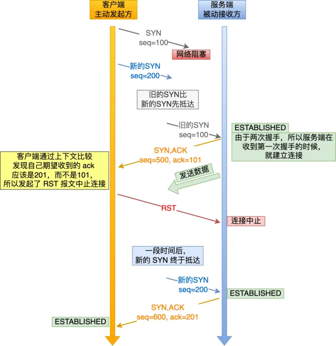

## TCP 四次挥手

**四次挥手过程：**

刚开始双方都处于`ESTABLISHED` 状态，假如是客户端先发起关闭请求。四次挥手的过程如下：

-   **第一次挥手**： 客户端会发送一个 `FIN` 报文，报文中会指定一个序列号。此时客户端处于 `FIN_WAIT1` 状态。

:::info
即发出连接释放报文段（FIN=1，序号 seq=u），并停止再发送数据，主动关闭 TCP 连接，进入 FIN_WAIT1（终止等待 1）状态，等待服务端的确认。

:::

-   **第二次挥手**：服务端收到 `FIN` 之后，会发送 `ACK` 报文，且把客户端的序列号值 +1 作为 `ACK` 报文的序列号值，表明已经收到客户端的报文了，此时服务端处于 `CLOSE_WAIT` 状态。

:::info
即服务端收到连接释放报文段后即发出确认报文段（ACK=1，确认号 ack=u+1，序号 seq=v），服务端进入 CLOSE_WAIT（关闭等待）状态，此时的 TCP 处于半关闭状态，客户端到服务端的连接释放。客户端收到服务端的确认后，进入 FIN_WAIT2（终止等待 2）状态，等待服务端发出的连接释放报文段。

:::

-   **第三次挥手**：如果服务端也想断开连接了，和客户端的第一次挥手一样，发给 `FIN` 报文，且指定一个序列号。此时服务端处于 `LAST_ACK` 的状态。

:::info
即服务端没有要向客户端发出的数据，服务端发出连接释放报文段（FIN=1，ACK=1，序号 seq=w，确认号 ack=u+1），服务端进入 LAST_ACK（最后确认）状态，等待客户端的确认。

:::

-   **第四次挥手**：客户端收到 `FIN` 之后，一样发送一个 `ACK` 报文作为应答，且把服务端的序列号值 +1 作为自己 `ACK` 报文的序列号值，此时客户端处于 `TIME_WAIT` 状态。需要过一阵子以确保服务端收到自己的 `ACK` 报文之后才会进入 `CLOSED` 状态，服务端收到 `ACK` 报文之后，就处于关闭连接了，处于 `CLOSED` 状态。

:::info
即客户端收到服务端的连接释放报文段后，对此发出确认报文段（ACK=1，seq=u+1，ack=w+1），客户端进入 TIME_WAIT（时间等待）状态。此时 TCP 未释放掉，需要经过时间等待计时器设置的时间 2MSL 后，客户端才进入 CLOSED 状态。

:::

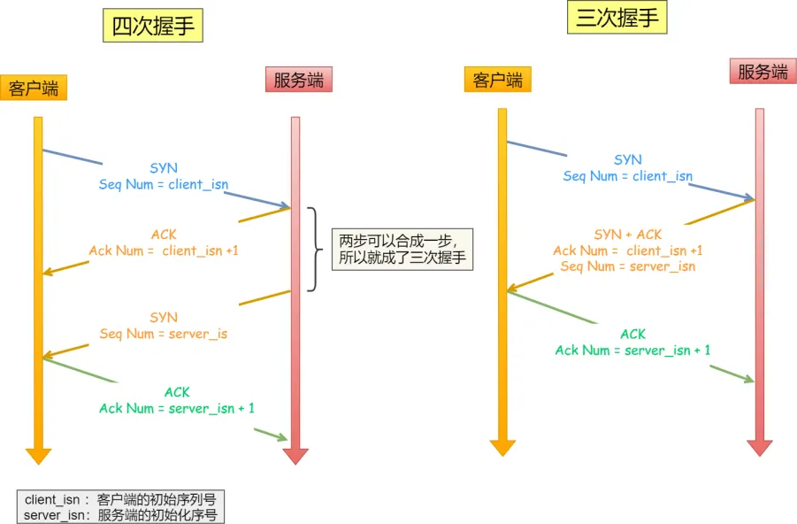

**四次握手过程 可简单记为：**

-   **第一次挥手：** 若客户端认为数据发送完成，则它需要向服务端发送连接释放请求。
-   **第二次挥手**：服务端收到连接释放请求后，会告诉应用层要释放 TCP 链接。然后会发送 `ACK` 包，并进入 `CLOSE_WAIT` 状态，此时表明客户端到服务端的连接已经释放，不再接收客户端发的数据了。但是因为 TCP 连接是双向的，所以服务端仍旧可以发送数据给客户端。
-   **第三次挥手**：服务端如果此时还有没发完的数据会继续发送，完毕后会向客户端发送连接释放请求，然后服务端便进入 `LAST-ACK` 状态。
-   **第四次挥手：** 客户端收到释放请求后，向服务端发送确认应答，此时客户端进入 `TIME-WAIT` 状态。该状态会持续 `2MSL`（最大段生存期，指报文段在网络中生存的时间，超时会被抛弃） 时间，若该时间段内没有服务端的重发请求的话，就进入 `CLOSED` 状态。当服务端收到确认应答后，也便进入 `CLOSED` 状态。

最后一次挥手中，客户端会等待一段时间再关闭的原因，是为了防止发送给服务器的确认报文段丢失或者出错，从而导致服务器 端不能正常关闭。

**为什么是四次挥手？**

TCP 使用四次挥手的原因是因为 **TCP 的连接是全双工的**，所以需要双方分别释放到对方的连接，**单独一方的连接释放，只代 表不能再向对方发送数据，连接处于的是半释放的状态。**

-   关闭连接时，客户端向服务端发送`FIN`时，仅仅表示客户端不再发送数据了但是还能接收数据。
-   服务端收到客户端的`FIN`报文时，先回一个`ACK`应答报文，而服务端可能还有数据需要处理和发送，等服务端不再发送数据时，才发送`FIN`报文给客户端来表示同意现在关闭连接。

从上面过程可知，服务端通常需要等待完成数据的发送和处理，所以服务端的`ACK`和`FIN`一般都会分开发送，因此是需要四次挥手。

**什么情况下会变为三次挥手？**

当被动关闭方（上图的服务端）在 TCP 挥手过程中，「没有数据要发送」并且「开启了 TCP 延迟确认机制」，那么第二和第三次挥手就会合并传输，这样就出现了三次挥手。

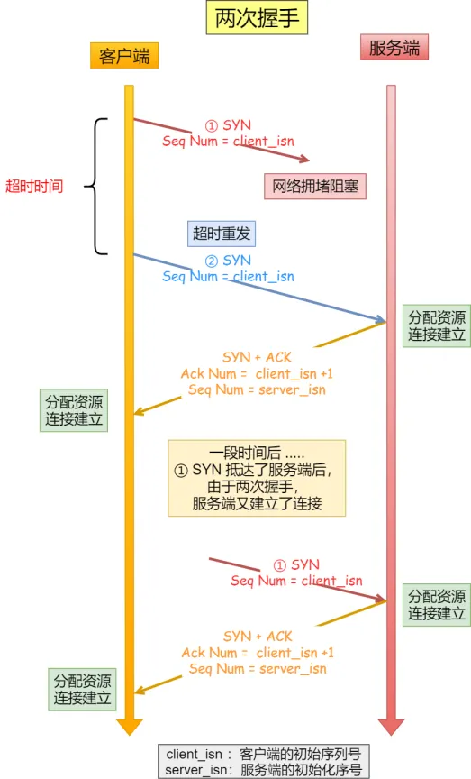

---

**TCP 延迟确认的策略：**

-   当有响应数据要发送时，ACK 会随着响应数据一起立刻发送给对方
-   当没有响应数据要发送时，ACK 将会延迟一段时间，以等待是否有响应数据可以一起发送
-   如果在延迟等待发送 ACK 期间，对方的第二个数据报文又到达了，这时就会立刻发送 ACK

**TIME-WAiT 状态的重要性：**

主动发起关闭连接的一方，才会有 TIME-WAIT 状态。

需要 TIME-WAIT 状态，主要是两个原因：

-   防止历史连接中的数据，被后面相同四元组（源 IP，源端口，目的端口，目的 IP）的连接错误的接收：因此 TCP 设计了 TIME_WAIT 状态，状态会持续 2MSL 时长，这个时间足以让两个方向上的数据包都被丢弃，使得原来连接的数据包在网络中都自然消失，再出现的数据包一定都是新建立连接所产生的。
-   保证「被动关闭连接」的一方，能被正确的关闭：等待足够的时间以确保最后的 ACK 能让被动关闭方接收，从而帮助其正常关闭。

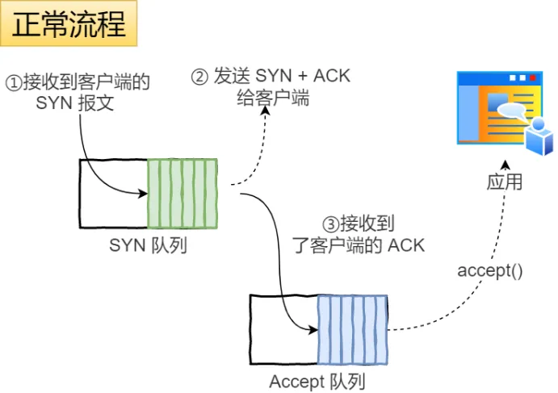

解释：① 服务端收到这个 RST 并将其解释为一个错误（Connection reset by peer），这对于一个可靠的协议来说不是一个优雅的终止方式。

② 为了防止这种情况出现，客户端必须等待足够长的时间，确保服务端能够收到 ACK，如果服务端没有收到 ACK，那么就会触发 TCP 重传机制，服务端会重新发送一个 FIN，这样一去一来刚好两个 MSL 的时间。

客户端在收到服务端重传的 FIN 报文时，TIME_WAIT 状态的等待时间，会重置回 2MSL。

---

**2MSL 等待期的作用：**

MSL 是 Maximum Segment Lifetime，报文最大生存时间，它是任何报文在网络上存在的最长时间，超过这个时间报文将被丢弃。因为 TCP 报文基于是 IP 协议的，而 IP 头中有一个`TTL`字段，是 IP 数据报可以经过的最大路由数，每经过一个处理他的路由器此值就减 1，当此值为 0 则数据报将被丢弃，同时发送 ICMP 报文通知源主机。

MSL 与 TTL 的区别：MSL 的单位是时间，而 TTL 是经过路由跳数。所以 MSL 应该要大于等于 TTL 消耗为 0 的时间，以确保报文已被自然消亡。

TTL 的值一般是 64，Linux 将 MSL 设置为 30 秒，意味着 Linux 认为数据报文经过 64 个路由器的时间不会超过 30 秒，如果超过了，就认为报文已经消失在网络中了。

TIME_WAIT 等待 2 倍的 MSL，比较合理的解释是：网络中可能存在来自发送方的数据包，当这些发送方的数据包被接收方处理后又会向对方发送响应，所以一来一回需要等待 2 倍的时间。

为什么不是 4 或者 8MSL 的时长呢？你可以想象一个丢包率达到百分之一的糟糕网络，连续两次丢包的概率只有万分之一，这个概率实在是太小了，忽略它比解决它更具性价比。

`2MSL`的时间是从客户端接收到 FIN 后发送 ACK 开始计时的。如果在 TIME-WAIT 时间内，因为客户端的 ACK 没有传输到服务端，客户端又接收到了服务端重发的 FIN 报文，那么 2MSL 时间将重新计时。

在 Linux 系统里 2MSL 默认是 60 秒，那么一个 MSL 也就是 30 秒。Linux 系统停留在 TIME_WAIT 的时间为固定的 60 秒。

**TIME_WAIT 过多有什么危害？**

过多的 TIME-WAIT 状态主要的危害有两种：

-   第一是占用系统资源，比如文件描述符、内存资源、CPU 资源、线程资源等;（服务端主动发起关闭）
-   第二是占用端口资源，端口资源也是有限的，一般可以开启的端口为 32768 ～ 61000，也可以通过`net.ipv4.ip_local_port_range` 参数指定范围。（客户 端主动发起关闭）

客户端和服务端 TIME_WAIT 过多，造成的影响是不同的。

## HTTP 的 Keep-Alive 是什么？TCP 的 Keepalive 和 HTTP 的 Keep-Alive 是一个东西吗？

-   HTTP 的 Keep-Alive，是由应用层（用户态）实现的，称为 HTTP 长连接
-   TCP 的 Keepalive，是由 TCP 层（内核态）实现的，称为 TCP 保活机制

故这两个完全是两个不同的东西。

**HTTP 的 Keep-Alive 概念及目的：**

HTTP1.0 中默认是在每次请求/应答，客户端和服务器都要新建一个连接，完成之后立即断开连接，这就是**短连接**。当使用`Keep-Alive`模式时，`Keep-Alive`功能使客户端到服务器端的连接持续有效，当出现对服务器的后继请求时，`Keep-Alive`功能避免了建立或者重新建立连接，这就是**长连接**。其使用方法如下：

-   `HTTP1.0`版本是默认没有`Keep-alive`的（也就是默认会发送`keep-alive`），所以要想连接得到保持，必须手动配置发送`Connection: keep-alive`字段。若想断开`keep-alive`连接，需发送`Connection:close`字段；
-   `HTTP1.1`规定了默认保持长连接，数据传输完成了保持 TCP 连接不断开，等待在同域名下继续用这个通道传输数据。如果需要关闭，需要客户端发送`Connection：close`首部字段。

Keep-Alive 的**建立过程**：

-   客户端向服务器在发送请求报文同时在首部添加发送`Connection`字段
-   服务器收到请求并处理 `Connection`字段
-   服务器回送`Connection:Keep-Alive`字段给客户端
-   客户端接收到`Connection`字段
-   `Keep-Alive`连接建立成功

**服务端自动断开过程（也就是没有 keep-alive）**：

-   客户端向服务器只是发送内容报文（不包含`Connection`字段）
-   服务器收到请求并处理
-   服务器返回客户端请求的资源并关闭连接
-   客户端接收资源，发现没有`Connection`字段，断开连接

**客户端请求断开连接过程**：

-   客户端向服务器发送`Connection:close`字段
-   服务器收到请求并处理`connection`字段
-   服务器回送响应资源并断开连接
-   客户端接收资源并断开连接

开启 Keep-Alive 的**优点：**

-   较少的 CPU 和内存的使⽤（由于同时打开的连接的减少了）；
-   允许请求和应答的 HTTP 管线化，客户端可以先一次性发送多个请求，而在发送过程中不需先等待服务器的回应，可以减少整体的响应时间。
-   降低拥塞控制 （TCP 连接减少了）；
-   减少了后续请求的延迟（⽆需再进⾏握⼿）；
-   报告错误⽆需关闭 TCP 连接；

开启 Keep-Alive 的**缺点**：

-   长时间的 Tcp 连接容易导致系统资源无效占用，浪费系统资源。

**解决资源浪费：**

为了避免资源浪费的情况，web 服务软件一般都会提供 keepalive_timeout 参数，用来指定 HTTP 长连接的超时时间。

比如设置了 HTTP 长连接的超时时间是 60 秒，Web 服务软件就会启动一个定时器，如果客户端在完成后一个 HTTP 请求后，在 60 秒内都没有再发起新的请求，定时器的时间一到，就会触发回调函数来释放该连接。

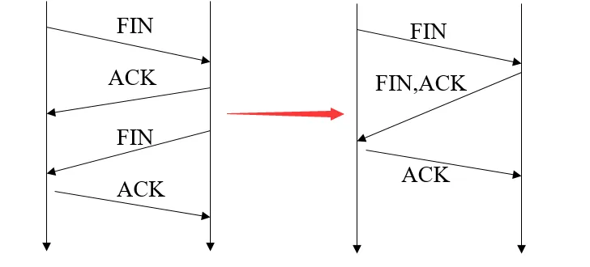

**TCP 的 Keepalive 概念及目的：**

TCP 的 Keepalive 这东西其实就是 TCP 的保活机制

如果两端的 TCP 连接一直没有数据交互，达到了触发 TCP 保活机制的条件，那么内核里的 TCP 协议栈就会发送探测报文。

-   如果对端程序是正常工作的。当 TCP 保活的探测报文发送给对端，对端会正常响应，这样 TCP 保活时间会被重置，等待下一个 TCP 保活时间的到来。
-   如果对端主机启机（_注意不是进程崩溃，进程崩溃后操作系统在回收进程资源的时候，会发送 FIN 报文，而主机宕机则是无法感知的，所以需要 TCP 保活机制来探测对方是不是发生了主机宕机_），或对端由于其他原因导致报文不可达。当 TCP 保活的探测报文发送给对端后，石沉大海，没有响应，连续几次，达到保活探测次数后，TCP 会报告该 TCP 连接已经死亡。

所以，TCP 保活机制可以在双方没有数据交互的情况，通过探测报文，来确定对方的 TCP 连接是否存活，这个工作是在内核完成的。

:::info
注：应用程序若想使用 TCP 保活机制需要通过 socket 接口设置 SO_KEEPALIVE 选项才能够生效，如果没有设置，那么就无法使用 TCP 保活机制。

:::

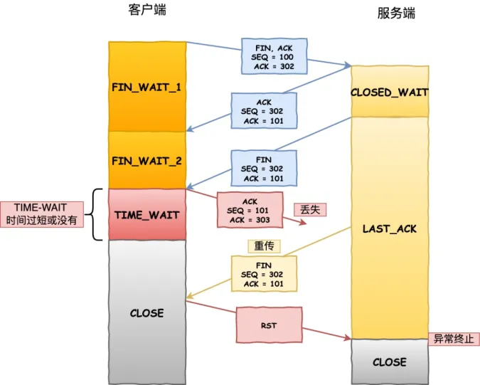

**总结：**

HTTP 的 Keep-Alive 也叫 HTTP 长连接，该功能是由「应用程序」实现的，可以使得用同一个 TCP 连接来发送和接收多个 HTTP 请求/应答，减少了 HTTP 短连接带来的多次 TCP 连接建立和释放的开销。

TCP 的 Keepalive 也叫 TCP 保活机制，该功能是由「内核」实现的，当客户端和服务端长达一定时间没有进行数据交互时，内核为了确保该连接是否还有效，就会发送探测报文，来检测对方是否还在线，然后来决定是否要关闭该连接。

## DNS 概念、作用及查询过程

**DNS 概念和作用：**

**概念**： DNS 是域名系统 (Domain Name System) 的缩写，提供的是一种主机名到 IP 地址的转换服务，就是我们常说的域名系统。它是一个由分层的 DNS 服务器组成的分布式数据库，是定义了主机如何查询这个分布式数据库的方式的应用层协议。能够使人更方便的访问互联网，而不用去记住能够被机器直接读取的 IP 数串。

**作用**： 将域名解析为 IP 地址，客户端向 DNS 服务器（DNS 服务器有自己的 IP 地址）发送域名查询请求，DNS 服务器告知客户机 Web 服务器的 IP 地址。

**DNS 查询过程：**

`DNS`用来将主机名和域名转换为 IP 地址，其查询过程一般通过以下步骤：

1. 本地 DNS 缓存检查：首先查询本地 DNS 缓存，如果缓存中有对应的 IP 地址，则直接返回结果。
2. 如果本地缓存中没有，则会向本地的 DNS 服务器（通常由你的互联网服务提供商（ISP）提供，比如中国移动）发送一个 DNS 查询请求。
3. 如果本地 DNS 解析器有该域名的 ip 地址，就会直接返回，如果没有缓存该域名的解析记录，它会向根 DNS 服务器发出查询请求。根 DNS 服务器并不负责解析域名，但它能告诉本地 DNS 解析器应该向哪个顶级域（.com/.net/.org）的 DNS 服务器继续查询。
4. 本地 DNS 解析器接着向指定的顶级域名 DNS 服务器发出查询请求。顶级域 DNS 服务器也不负责具体的域名解析，但它能告诉本地 DNS 解析器应该前往哪个权威 DNS 服务器查询下一步的信息。
5. 本地 DNS 解析器最后向权威 DNS 服务器发送查询请求。权威 DNS 服务器是负责存储特定域名和 IP 地址映射的服务器。当权威 DNS 服务器收到查询请求时，它会查找"example.com"域名对应的 IP 地址，并将结果返回给本地 DNS 解析器。
6. 本地 DNS 解析器将收到的 IP 地址返回给浏览器，并且还会将域名解析结果缓存在本地，以便下次访问时更快地响应。
7. 浏览器发起连接：本地 DNS 解析器已经将 IP 地址返回给您的计算机，浏览器可以使用该 IP 地址与目标服务器建立连接，开始获取网页内容。

**补充：DNS 同时使用 TCP 和 UDP 协议**

DNS 占用 53 号端口，同时使用 TCP 和 UDP 协议。

（1）在区域传输的时候使用 TCP 协议

-   辅域名服务器会定时（一般 3 小时）向主域名服务器进行查询以便了解数据是否有变动。如有变动，会执行一次区域传送，进行数据同步。区域传送使用 TCP 而不是 UDP，因为数据同步传送的数据量比一个请求应答的数据量要多得多。
-   TCP 是一种可靠连接，保证了数据的准确性。

（2）在域名解析的时候使用 UDP 协议

-   客户端向 DNS 服务器查询域名，一般返回的内容都不超过 512 字节，用 UDP 传输即可。不用经过三次握手，这样 DNS 服务器负载更低，响应更快。理论上说，客户端也可以指定向 DNS 服务器查询时用 TCP，但事实上，很多 DNS 服务器进行配置的时候，仅支持 UDP 查询包。

## CDN 是什么

CDN 是一种分布式网络服务，通过将内容存储在分布式的服务器上，使用户可以从距离较近的服务器获取所需的内容，从而加速互联网上的内容传输。

-   就近访问：CDN 在全球范围内部署了多个服务器节点，用户的请求会被路由到距离最近的 CDN 节点，提供快速的内容访问。
-   内容缓存：CDN 节点会缓存静态资源，如图片、样式表、脚本等。当用户请求访问这些资源时，CDN 会首先检查是否已经缓存了该资源。如果有缓存，CDN 节点会直接返回缓存的资源，如果没有缓存所需资源，它会从源服务器（原始服务器）回源获取资源，并将资源缓存到节点中，以便以后的请求。通过缓存内容，减少了对原始服务器的请求，减轻了源站的负载。
-   可用性：即使某些节点出现问题，用户请求可以被重定向到其他健康的节点。

## Cookie 和 Session 是什么？有什么区别？

**Cookie 和 Session 是什么**

`Cookie`和`Session`都用于管理用户的状态和身份，，`Cookie`通过在客户端记录信息确定用户身份，`Session`通过在服务器端记录信息确定用户身份。

1. Cookie

-   服务器会将一个或多个`Cookie`发送到用户浏览器，然后浏览器将这些 Cookie 存储在本地，`Cookie` 用于识别用户状态和保存用户的会话信息。
-   服务器在接收到来自客户端浏览器的请求之后，就能够通过分析存放于请求头的 Cookie 得到客户端特有的信息，从而动态生成与该客户端相对应的内容。

2. Session

-   客户端浏览器访问服务器的时候，服务器把客户端信息以某种形式记录在服务器上，这就是`Session`。
-   `Session`主要用于维护用户登录状态、存储用户的临时数据和上下文信息等。服务器为每个用户分配一个唯—的`Session ID`通常存储在`Cookie`中，可与跨多个页面使用。

**Cookie 和 Session 的区别是什么**

1. 存储位置：`Cookie`数据存储在用户的浏览器中；而`Session`数据存储在服务器上。
2. 数据容量：`Cookie`存储容量较小，一般为几 KB（通常不超过 4KB）；`Session`存储容量较大，通常没有固定限制，取决于服务器的配置和资源。
3. 安全性：由于`Cookie`存储在用户浏览器中，因此可以被用户读取和篡改；相比之下，`Session`数据存储在服务器上，更难被用户访问和修改。
4. 生命周期：`Cookie`可以设置过期时间；`Session`依赖于会话的持续时间或用户活动。
5. 传输方式及性能：`Cookie`在每次 HTTP 请求中都会被自动发送到服务器，可能增加带宽消耗，但可以减少服务器的存储压力；而`Session ID`通常通过`Cookie`或 URL 参数传递，不需要在每次请求中携带信息，但会增加服务器的存储压力。
6. 使用场景：`Cookie` 适合存储不太敏感的信息，如用户偏好设置；`Session` 适合存储敏感信息或需要频繁访问的数据，如用户认证信息。
7. 控制方式：`Cookie` 可以设置 `HttpOnly`属性，减少 `XSS` 攻击的风险；Session 可以通过设置过期时间、验证等方式控制会话的生命周期。

**补充：**

如果面试官询问如何保护`Cookie`，你可以讨论设置`HttpOnly`和`Secure`属性，以及使用 Cookie 签名和加密技术。如果询问 Session 管理，可以讨论 Session 固定和 Session 劫持的防护措施。

> 参考：1、小林 coding 图解网络 2、湖南科技大学计算机网络 3、掘金博主 CUGGZ
