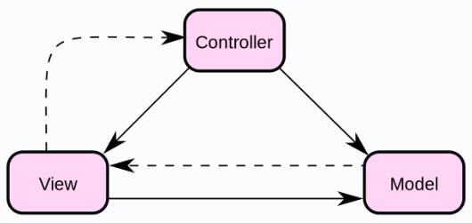
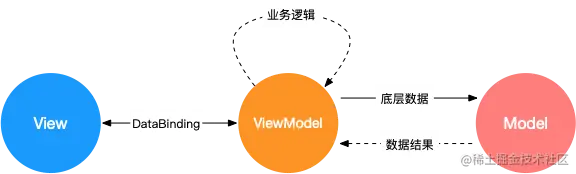

# Vue

## MVVM 模式和 MVC 模式有什么区别

**MVC 模式：**

MVC 通过分离 Model、View 和 Controller 的方式来组织代码结构。

-   Model（模型）：负责业务逻辑和数据存取。
-   View（视图）：负责显示数据，不包含逻辑。
-   Controller（控制器）：是 View 层和 Model 层的纽带，它主要负责用户与应用的响应操作，当用户与页面产生交互的时候，Controller 中的事件触发器就开始工作了，通过调用 Model 层，来完成对 Model 的修改，然后 Model 层再去通知 View 层更新。

:::info
View 和 Model 应用了观察者模式，当 Model 层发生改变的时候它会通知有关 View 层更新页面。

:::

**MVVM 模型：**

MVVM 分为 Model、View、ViewModel。

-   Model 代表数据模型，数据和业务逻辑都在 Model 层中定义。
-   View 代表 UI 视图，负责数据的展示。
-   ViewModel 负责监听 Model 中数据的改变并且控制视图的更新，处理用户交互操作。

Model 和 View 并无直接关联，而是通过 ViewModel 来进行联系的，Model 和 ViewModel 之间有着双向数据绑定的联系。因此当 Model 中的数据改变时会触发 View 层的刷新，View 中由于用户交互操作而改变的数据也会在 Model 中同步。

**区别：**

1. **中间层**：MVC 有 Controller，MVVM 有 ViewModel。
2. **数据绑定**：MVVM 支持数据双向绑定，MVC 通常是单向的。
3. **关注点分离**：MVVM 通过 ViewModel 让 UI 逻辑和业务逻辑更清晰地分离。

## Vue2 和 Vue3 的区别有哪些？

1. **响应式系统**：
    - Vue2：基于 Object.defineProperty 实现响应式。
    - Vue3：基于 Proxy 实现响应式，性能更优，功能更强大。
2. **Composition API**：
    - Vue2：没有内置的 Composition API。
    - Vue3：引入 Composition API，提供更灵活的逻辑复用和组织方式。
3. **虚拟 DOM**：
    - Vue2：使用传统的虚拟 DOM 实现。
    - Vue3：对虚拟 DOM 进行优化，提升了渲染性能。
4. **性能方面**：
    - Vue2：性能较好，但在大型应用中可能有瓶颈。
    - Vue3：性能大幅提升，特别是在处理大量数据和复杂组件时。对虚拟 DOM 进行了重写、静态树提升和基于 Proxy 的响应式系统，这些都让 Vue3 比 Vue2 快乐 1.2 到 2 倍。
5. **包体积**：
    - Vue2：包体积相对较大。
    - Vue3：通过 Tree Shaking 等优化，包体积更小。
6. **生命周期钩子**：
    - Vue2：提供了完整的生命周期钩子，如 created、mounted 等。
    - Vue3：改进了生命周期钩子，比如 `onBeforeMount` 替代了 `beforeMount`，让代码更清晰。
7. **自定义指令**：
    - Vue2：支持自定义指令。
    - Vue3：支持自定义指令，但 API 有所调整。
8. **浏览器兼容性**：
    - Vue2：兼容较旧的浏览器，如 IE11。
    - Vue3：主要针对现代浏览器，放弃对 IE11 的支持。
9. **TypeScript 支持**：
    - Vue2：对 Typescript 的支持相对较弱。
    - Vue3：内置对 Typescript 的强力支持，类型定义更准确。

## Vue 和 React 的区别

1. **设计哲学**：
    - Vue：推崇易用性和简洁性，提供了更多开箱即用的功能，比如模板字符串、数据绑定等。
    - React：更注重灵活性和可扩展性，推崇“一切皆组件”的理念，开发者可以自由组合。
2. **模板与 JSX**：
    - Vue：使用基于 HTML 的模板语法，易于理解和上手。
    - React：使用 JSX 语法，它是一种看起来像 HTML 的 Javascript 语法扩展。
3. **响应式系统**：
    - Vue：使用依赖收集的机制，通过 `Object.defineProperty` 实现数据响应。
    - React：使用 `useState` 和 `useEffect` 钩子来处理状态和副作用，依赖于一个高效的虚拟 DOM 算法。
4. **组件通信**：
    - Vue：有 `props` 和 `events` 来实现父子通信，以及 `provide` 和 `inject` 来实现跨组件通信。
    - React：有 `props` 和 `context` 来实现通信，也支持自定义上下文。
5. **构建工具**：
    - Vue：通常与 Vue CLI 配合使用，提供一键式项目脚手架。
    - React：通常与 Create React App 配合使用，通用提供快速的项目启动。
6. **生态系统**：
    - Vue：有 Vuex、Pinia 用于状态管理，Vue Router 用于路由。
    - React：有 Redux 用于状态管理，React Router 用于路由。

## ref 和 reactive 区别

`ref` 和 `reactive` 它们都用于创建响应式数据，但适用于不同类型的数据。

| **特性**     | **ref**                                    | **reactive**                      |
| ------------ | ------------------------------------------ | --------------------------------- |
| **数据类型** | 用于基本数据类型（如字符串、数字、布尔值） | 用于对象（普通对象、数组）        |
| **使用方式** | 创建一个包含基本数据类型的响应式引用       | 创建一个包含对象的响应式代理对象  |
| **访问数据** | 需要通过`.value`属性访问数据               | 直接访问对象的属性                |
| **性能**     | 对于基本数据类型，ref 的性能较好           | 对于复杂对象，reactive 的性能较好 |
| **适用场景** | 当需要将基本数据类型转为响应式数据时       | 当需要将对象转换为响应式数据时    |

简单来说：`ref` 适用于基本数据类型，而 `reactive` 适用于对象和数组。在模板中使用时，Vue 会自动解包 `ref`，所以不需要担心`.value` 的问题。

## watch 和 watchEffect 的区别

1. **watch**
    - `watch` 用于观察特定的响应式引用或响应式对象，并在它们变化时执行回调函数。
    - 它可以精确指定要观察的源，并且可以接收变化的值和旧值。
    - `watch` 是惰性的，只有当指定的响应式数据变化时，回调函数才会执行。
2. **watchEffect**
    - `watchEffect` 自定收集依赖并在依赖变化时重新执行回调函数。
    - 它不指定具体观察的响应式数据，而是自动追踪在回调函数中访问的任何响应式状态。
    - `watchEffect` 是积极的，一旦设置，任何它所依赖的响应式数据变化都会触发回调函数重新执行。

简单来说：`watch` 更精细，适合用在需要响应特定数据变化的场景；而 `watchEffect` 更通用，适合用在需要执行副作用或依赖多个数据源的场景。

| **特性**     | **watch**                                                            | **watchEffect**                              |
| ------------ | -------------------------------------------------------------------- | -------------------------------------------- |
| **触发条件** | 需要显示地指定要监听的属性或表达式                                   | 自动收集依赖，在依赖的任何属性发送变化时触发 |
| **依赖管理** | 手动指定依赖的属性或表达式                                           | 自动收集依赖，无需手动指定                   |
| **初始执行** | 默认不会在组件初始化时立即执行，除非配置了 `immediate: true`         | 在组件初始化时会立即执行一次                 |
| **清理函数** | 可以在回调函数中返回一个清理函数，用于在下次监听前清理上一次的副作用 | 同样可以在回调函数中返回一个清理函数         |
| **适用场景** | 当需要监听特定属性的变化时                                           | 当需要在依赖的任何属性变化时执行某些操作时   |

## Vue2 和 Vue3 的生命周期

**Vue2 生命周期**

1. **初始化阶段**
    - `beforeCreate`：组件实例刚刚创建，此时数据和 DOM 还未初始化。
    - `created`：组件实例创建完成，数据已初始化，但 DOM 还未挂载。
2. **挂载阶段**
    - `beforeMount`：组件即将挂载，真实的 DOM 已经准备好了，但还未渲染。
    - `mounted`：组件挂载完成，真实的 DOM 已经渲染完成，可以操作 DOM。
3. **更新阶段**
    - `beforeUpdate`：组件数据更新时，即将重新渲染。
    - `updated`：组件数据更新完成，DOM 已经更新。
4. **销毁阶段**
    - `beforeDestroy`：组件即将销毁。
    - `destroyed`：组件已经销毁，清理工作完成。

**Vue3 生命周期**

1. **初始化阶段**
    - `setup`：在 `befroeCreate` 之前调用，是 Composition API 的核心方法，用于替代 `beforeCreate` 和 `created`。
2. **挂载阶段**
    - `onBeforeMount`：组件即将挂载。
    - `onMounted`：组件挂载完成。
3. **更新阶段**
    - `onBeforeUpdate`：组件数据更新时，即将重新渲染。
    - `onUpdated`：组件数据更新完成。
4. **销毁阶段**
    - `onBeforeUnmount`：组件即将销毁。
    - `onUnmounted`：组件已经销毁。
5. **其它阶段**
    - `onErrorCaptured`：组件即将销毁。
    - `onRenderTracked` 和 `onRenderTriggered`：用于调试渲染性能。

Vue3 引入了组合式 API，`setup` 函数是新的生命周期入口，它在 `beforeCreate` 和 `created` 之前执行。其他的生命周期钩子在 Vue3 中都进行了一定程度的调整，比如加上了 `on` 前缀，使得命名更加清晰。

**主要区别：**

-   Vue3 的 `setup` 函数是新加入的，它允许使用组合式 API 来组织组件逻辑。
-   Vue3 的生命周期钩子函数名称更准确，比如 `onMounted` 替代了 `mounted`，`onUnmounted` 替代了 `destroy`。

## 父子组件生命周期执行顺序

当创建和挂载组件时：

1. 父组件的 `beforeCreate` 钩子首先被调用。
2. 然后是父组件到的 `created`。
3. 接着父组件的的 `beforeMount`。
4. 父组件开始挂载，调用子组件的 `beforeCreate`。
5. 子组件的 `created`。
6. 子组件的 `beforeMount`。
7. 子组件的 `mounted`。
8. 最后是父组件的 `mounted`。

当更新组件时：

1. 父组件的 `beforeUpdate`。
2. 子组件的 `beforeUpdate`。
3. 子组件的 `updated`。
4. 父组件的 `updated`。

当销毁组件时：

1. 父组件的 `beforeDestroy`。
2. 子组件的 `beforeDestroy`。
3. 子组件的 `destroyed`。
4. 父组件的 `destroyed`。

## Vue3 的 Composition API 相比于 Vue2 的 Options API，有什么优势

1. **更好的逻辑复用**
    - **Options API 限制**：在 Vue2 中，Options API 通过选项（如 `data`、`methods`、`computed` 等）来组织组件的逻辑。当组件逻辑变得复杂或需要在多个组件之间复用时，Options API 的复用性较差，通常需要借助 mixins，但 mixins 存在命名冲突、作用域不明确等问题。
    - **Composition API 的优势**：Vue3 的 Composition API 通过 `setup` 函数和响应式 API（如 `ref`、`reactive`）允许开发者以函数的形式封装和复用逻辑。可以将相关的逻辑提取到可复用到的函数中，这些函数可以独立于组件定义，并在多个组件中导入和使用，避免了 mixins 的问题。
2. **更灵活的代码组织**
    - **Options API 的固定结构**：Options API 要求将组件的逻辑按照固定选项进行分类，这在简单组件中是合理的，但在复杂组件中可能导致逻辑分散和难以维护。
    - **Composition API 到的灵活性**：Composition API 允许开发者以更灵活的方式组织代码。可以将相关的逻辑按照功能模块进行分组，使得代码更具有可读性和可维护性。
3. **更好的类型推导**
    - **TypeScript 支持**：Vue3 内置了对 TypeScript 的强力支持，Composition API 与 TypeScript 结合时，能够提供更好的类型推导和类型检查。在 Options API 中，由于选项的分离，TypeScript 的支持相对有限。
4. **更高效的性能**
    - **减少代理对象**：Compostion API 直接操作响应式数据，减少了 Vue2 中因选项合并和代理对象创建带来的性能开销。
    - **更少的渲染开销**：Composition API 允许更细粒度的响应式控制，减少了不必要的渲染。

## Vue 的双向数据绑定是如何实现的

在 Vue 中，双向数据绑定是通过 `v-model` 指令实现的。它允许数据在视图和模型之间自动同步，这意味着当用户在表单元素（如输入框、复选框等）中输入数据时，数据会自动更新到 Vue 实例的数据模型中，反之亦然。

**Vue2 中的实现原理：**

在 Vue2 中，双向数据绑定是通过以下机制实现的：

1. **数据响应式系统**：Vue 使用 `Object.defineProperty` 方法对数据对象的所有属性进行劫持，使其变成响应式的。当数据发生变化时，Vue 能够检测到这些变化，并自动更新视图。
2. `v-model`** 指令**：在模板中使用 `v-model` 指令将表单元素的值与 Vue 实例中的数据进行绑定。`v-model `本质上是 `value` 属性和 `input` 事件的语法糖。
    - 当用户在表单元素输入内容时，会触发 `input` 事件，Vue 会更新绑定的数据。
    - 当数据更新时，Vue 会通过响应式系统更新表单元素的 `value` 属性。

**Vue3 中的实现原理：**

在 Vue3 中，响应式系统的实现发生了改变：

1. `Proxy`** 对象**：Vue3 使用 `Proxy` 对象来实现数据的响应式。`Proxy` 可以更全面地劫持对象的操作，包括添加属性、删除属性等。
2. `v-model`** 指令**：在 Vue3 中，`v-model` 的实现原理与 Vue2 类似，但内部机制更加高效和灵活。

**总之：**

1. **数据响应**：Vue 使用 `Object.ddefineProperty`（Vue2.x）或 `Proxy`（Vue3.x）来劫持属性的 getter 和 setter，从而追踪数据的变化。
2. **视图更新**：当数据变化时，Vue 会自动更新视图。Vue 通过依赖收集机制，将试图的部分与数据建立联系，一旦数据变化，依赖的视图部分就会自动更新。
3. **事件监听**：在用户与视图交互式，比如输入、点击等，Vue 会监听这些事件，并在事件处理函数中修改数据。
4. **数据变更**：当用户操作导致数据变化时，Vue 通过 setter 进行拦截，触发视图更新。
5. **双向绑定**：Vue 提供了 `v-model` 指令，它内部会根据输入类型不同，自动使用不同的属性进行双向绑定，比如 `input` 元素的 `value` 属性，`checkbox` 的 `checked` 属性等。
